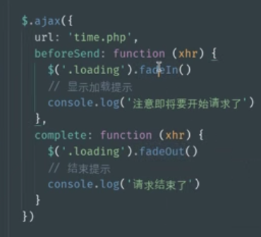

AJAX就是浏览器提供的一套api；

可以无需重新加载整个网页的情况下，能够更新部分网页的技术。

### ajax发送请求

ajax 是一套api核心提供的类型 ：XMLHttpRequest

1，安装浏览器

var xhr = new XMLHttpRequest()

2，打开浏览器

xhr.open('GET',"http://dat-11.io/time.php")

3敲回车，开始请求

xhr.send()

4，等待响应

5，看结果


ps：涉及到 AJAX 操作的页面“不能”使用文件协议访问（文件的方式访问）


### 获取响应内容

xhr=onreadystatechange 事件

```js
var xhr = new XMLHttpRequest()
	// 如果需要补货第一个状态的变化，需要注意代码执行顺序的问题（不要出现来不及的情况）
    // xhr.onreadystatechange = function () {
    //   // 这个事件并不是只在响应时触发，状态改变就触发
    //   // console.log(1)
    //   console.log(this.readyState)
    // }

    xhr.open('GET', './time.php')

    xhr.send()

    // 因为客户端永远不知道服务端何时才能返回我们需要的响应

    // 所以 AJAX API 采用事件的机制（通知的感觉）

    xhr.onreadystatechange = function () {

      // 这个事件并不是只在响应时触发，XHR 状态改变就触发

      // console.log(1)

      if (this.readyState !== 4) return

      // 获取响应的内容（响应体）

      console.log(this.responseText)

    }

    // 因为响应需要时间，所以无法通过返回值的方式返回响应

    // var response = xhr.send()

    // console.log(response)

```


response  responseText


### readystate状态变化


readyState 属性返回当前文档的状态：


```js

    var xhr = new XMLHttpRequest()
    console.log(xhr.readyState)
    // => 0
    // 初始化 请求代理对象

    xhr.open('GET', 'time.php')
    console.log(xhr.readyState)
    // => 1
    // open 方法已经调用，建立一个与服务端特定端口的连接

    xhr.send()

    xhr.addEventListener('readystatechange', function () {
      switch (this.readyState) {
        case 2:
          // => 2
          // 已经接受到了响应报文的响应头

          // 可以拿到头
          // console.log(this.getAllResponseHeaders()) 拿到响应头
            
          console.log(this.getResponseHeader('server'))
          // 但是还没有拿到体
          console.log(this.responseText)
          break

        case 3:
          // => 3
          // 正在下载响应报文的响应体，有可能响应体为空，也有可能不完整
          // 在这里处理响应体不保险（不可靠）
          console.log(this.responseText)
          break

        case 4:
          // => 4
          // 一切 OK （整个响应报文已经完整下载下来了）
          console.log(this.responseText)
          break
      }
    })
```


### onload （注意兼容）

```js
  var xhr = new XMLHttpRequest()

    xhr.open('GET', 'time.php')

    xhr.send(null)

    // onload 是 HTML5 中提供的 XMLHttpRequest v2.0 定义的
    xhr.onload = function () {
      console.log(this.readyState)
      console.log(this.responseText)
    }

```


### AJAX遵循HTTP协议

请求行，请求头，请求体

```js

    var xhr = new XMLHttpRequest()

    xhr.open('POST', '/add.php') // 设置请求行

    xhr.setRequestHeader('Foo', 'Bar') // 设置一个请求头
    // 一旦你的请求体是 urlencoded 格式的内容，一定要设置请求头中 Content-Type 'application/x-www-form-urlencoded'
    xhr.setRequestHeader('Content-Type', 'application/x-www-form-urlencoded')

    xhr.send('key1=value1&key2=value2') // 以 urlencoded 格式设置请求体
```

form Data

request Payload


**请求报文的请求头content-type  应该跟着请求体的格式的变化而变化**

application/x-www-form-urlencoded 


### 数据接口概念：

#### 

### 发送get请求并传递参数：


```js

    var listElement = document.getElementById('list')

    // 发送请求获取列表数据呈现在页面
    // =======================================

    var xhr = new XMLHttpRequest()

    xhr.open('GET', 'users.php')

    xhr.send()

    xhr.onreadystatechange = function () {
      if (this.readyState !== 4) return
      var data = JSON.parse(this.responseText)=========
      // data => 数据

      for (var i = 0; i < data.length; i++) {
        var liElement = document.createElement('li')
        liElement.innerHTML = data[i].name
        liElement.id = data[i].id

        listElement.appendChild(liElement)

        liElement.addEventListener('click', function () {
          // TODO: 通过AJAX操作获取服务端对应数据的信息
          // 如何获取当前被点击元素对应的数据的ID
          // console.log(this.id)
          var xhr1 = new XMLHttpRequest()
          xhr1.open('GET', 'users.php?id=' + this.id)
          xhr1.send()
          xhr1.onreadystatechange = function () {
            if (this.readyState !== 4) return
            var obj = JSON.parse(this.responseText)
            alert(obj.age)
          }
        })
      }
    }

    // 给每一个 li 注册点击事件
    // 因为 li 后来动态创建，所以不能这样注册事件
    // for (var i = 0; i < listElement.children.length; i++) {
    //   listElement.children[i].addEventListener('click', function () {
    //     console.log(111)
    //   })
    // }


    // var xhr = new XMLHttpRequest()
    // // 这里任然是使用URL中的问号参数传递数据
    // xhr.open('GET', 'users.php?id=2')
    // xhr.send(null)

    // xhr.onreadystatechange = function () {
    //   if (this.readyState !== 4) return
    //   console.log(this.responseText)
    // }

```


### 


### 发送post请求并传递参数

```js

```


### 全局事件及配合NProgress显示加载进度

<https://www.jquery123.com/category/ajax/global-ajax-event-handlers/>


==》




```js
  <style>
    .loading {
      display: none;
      position: fixed;
    }
  </style>
</head>
<body>
  <div class="loading">正在玩命加载中...</div>
  <button id="btn">请求</button>
  <script src="jquery.js"></script>
  <script>

$(document)
      .ajaxStart(function () {
        // 只要有 ajax 请求发生 就会执行
        $('.loading').fadeIn()
        // 显示加载提示
        console.log('注意即将要开始请求了')
      })
      .ajaxStop(function () {
        // 只要有 ajax 请求结束 就会执行
        $('.loading').fadeOut()
        // 结束提示
        console.log('请求结束了')
      })

    $('#btn').on('click', function () {
      // $.ajax({
      //   url: 'time.php'
      // })

      $.get('time.php')
    })
```


```js
<!DOCTYPE html>
<html lang="en">
<head>
  <meta charset="UTF-8">
  <title>主页面</title>
  <link rel="stylesheet" href="bootstrap.css">
  <link rel="stylesheet" href="../nprogress.css">
  <style>
    .loading {
      display: none;
      position: fixed;
      top: 0;
      left: 0;
      bottom: 0;
      right: 0;
      background-color: rgba(0, 0, 0, .6);
      font-size: 30px;
    }
  </style>
  <script src="../nprogress.js"></script>
</head>
<body>
  <div class="container pt-4">
    <h1>会员中心</h1>
    <hr>
    <div class="row">
      <aside class="col-md-3">
        <div class="list-group">
          <a class="list-group-item list-group-item-action" href="index.html">我的资料</a>
          <a class="list-group-item list-group-item-action" href="cart.html">我的购物车</a>
          <a class="list-group-item list-group-item-action" href="orders.html">我的订单</a>
        </div>
      </aside>
      <main id="main" class="col-md-9">
        <h2>我的个人资料</h2>
        <hr>
      </main>
    </div>
  </div>
  <div class="loading">正在玩命加载中...</div>
  <script src="../jquery.js"></script>
  <script>
    $(function ($) {
      // $(document)
      //   .ajaxStart(function () {
      //     // 只要有 ajax 请求发生 就会执行
      //     $('.loading').fadeIn()
      //     // 显示加载提示
      //     console.log('注意即将要开始请求了')
      //   })
      //   .ajaxStop(function () {
      //     // 只要有 ajax 请求结束 就会执行
      //     $('.loading').fadeOut()
      //     // 结束提示
      //     console.log('请求结束了')
      //   })

      $(document)
        .ajaxStart(function () {
          NProgress.start()  //进度条
        })
        .ajaxStop(function () {
          NProgress.done()
        })

      // 有一个独立的作用域，顺便确保页面加载完成执行
      $('.list-group-item').on('click', function () {
        var url = $(this).attr('href')
        $('#main').load(url + ' #main > *')
        return false
      })
    })
  </script>
</body>
</html>

```

NProgress.js 进度条


## 跨域：


相关概念：

5.1. 相关概念 

同源策略是什么？浏览器的一种安全策略

同源策略产生了什么影响？

同源政策的目的：为了保证用户信息的安全，防止恶意的网站窃取数据

同源策略是浏览器的行为，是为了保护本地数据不被JavaScript代码获取回来的数据污染，因此拦截的是客户端发出的请求回来的数据接收，即请求发送了，服务器响应了，但是无法被浏览器接收。

同源策略是浏览器的一种安全策略，所谓同源是指**域名**，**协议**，**端口**完全相同，只有同源的地址才可以相互通过 AJAX 的方式请求。
同源或者不同源说的是两个地址之间的关系，不同源地址之间请求我们称之为跨域请求
什么是同源？例如：http://www.example.com/detail.html 与一下地址对比

| 对比地址                                 | 是否同源 | 原因           |
| ---------------------------------------- | -------- | -------------- |
| http://api.example.com/detail.html       | 不同源   | 域名不同       |
| https://www.example.com/detail.html      | 不同源   | 协议不同       |
| http://www.example.com:8080/detail.html  | 不同源   | 端口不同       |
| http://api.example.com:8080/detail.html  | 不同源   | 域名、端口不同 |
| https://api.example.com/detail.html      | 不同源   | 协议、域名不同 |
| https://www.example.com:8080/detail.html | 不同源   | 端口、协议不同 |
| http://www.example.com/other.html        | 同源     | 只是目录不同   |

```js
//尝试对一个不同源地址发起一个AJAX请求（失败了）
    // 当前页面访问地址：http://day-12.io/11-cross-domain.html
    // 希望被AJAX的地址：http://locally.uieee.com/categories
    // 这两个地址之间 协议相同 端口相同 域名不同 所以是两个不同源的地址
    // 同源策略指的就是：不同源地址之间，默认不能相互发送AJAX请求

    // 不同源地址之间如果需要相互请求，必须服务端和客户端配合才能完成

    $.get('http://locally.uieee.com/categories', function (res) {
      console.log(res)
    })

```


5.2. 解决方案 
现代化的 Web 应用中肯定会有不同源的现象，所以必然要解决这个问题，从而实现跨域请求。
参考：http://rickgray.me/solutions-to-cross-domain-in-browser

尝试找到一种可以发送不同源请求的方式:

img link script iframe


**跨域请求：请求一个不同源的地址**==================


```js

<title>尝试找到一种可以发送不同源请求的方式</title>
  <!-- link 真正的定义：链入一个文档，通过 rel 属性申明链入的文档与当前文档之间的关系 -->
  <!-- <link rel="stylesheet" href="nprogress.css"> -->
</head>
<body>
  <!--  -->
  <script>

    // 请求一个不同源的地址实际上就是我们所说的跨域请求

    // 当前页面访问地址：http://day-12.io/12-cross-origin.html
    // 希望被请求的地址：http://locally.uieee.com/categories
    //
      
    // 校验目标：1 能发出去，2 能收回来

    // img link script iframe
    //
    // ## 1. img
    // 可以发送不同源地址之间的请求
    // 无法拿到响应结果
     var img = new Image()
     img.src = 'http://locally.uieee.com/categories'

    // ## 2. link
    // 可以发送不同源地址之间的请求
    // 无法拿到响应结果
    var link = document.createElement('link')
    link.rel = 'stylesheet'
    link.href = 'http://locally.uieee.com/categories'
    document.body.appendChild(link)

    // ## 3. script
    // 可以发送不同源地址之间的请求
    // 无法拿到响应结果
    // 借助于能够作为 JS 执行
    var script = document.createElement('script')
    script.src = 'http://localhost/time2.php'
    document.body.appendChild(script) // 开始发起请求

    // 相当于请求的回调
    function foo (res) {
      console.log(res)
    }

    // console.log(a)

  </script>
```


 

5.2.1. JSONP 
JSON with Padding，是一种借助于 script 标签发送跨域请求的技巧。
其原理就是在客户端借助 script 标签请求服务端的一个动态网页（php 文件），服务端的这个动态网页返回一 段带有函数调用的 JavaScript 全局函数调用的脚本，将原本需要返回给客户端的数据传递进去。
以后绝大多数情况都是采用 JSONP 的手段完成不同源地址之间的跨域请求
客户端 http://www.zce.me/users-list.html


```js
<script src="http://api.zce.me/users.php?callback=foo"></script>
```


服务端 http://api.zce.me/users.php?callback=foo 返回的结果

```js
foo(['我', '是', '你', '原', '本', '需', '要', '的', '数', '据'])
```


总结一下：由于 XMLHttpRequest 无法发送不同源地址之间的跨域请求，所以我们必须要另寻他法，script 这种方 案就是我们终选择的方式，我们把这种方式称之为 JSONP，如果你不了解原理，先记住怎么用，多用一段时间再 来看原理。


