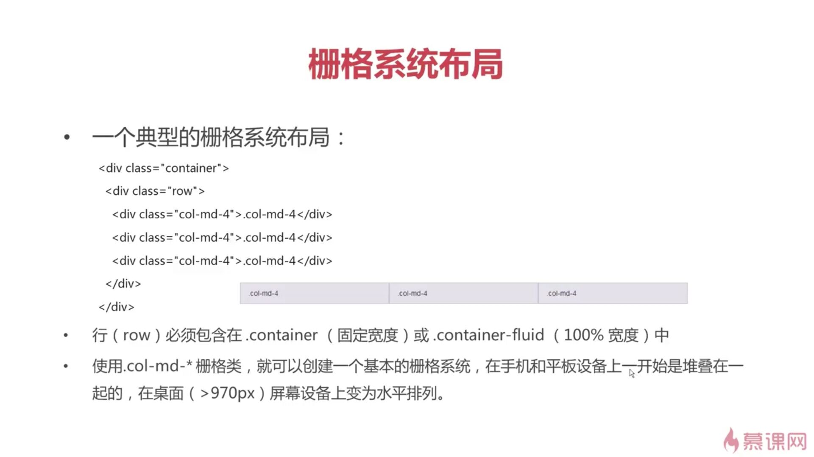

# Bootstrap 网格系统

本章节我们将讲解 Bootstrap 的网格系统（Grid System）。

Bootstrap 提供了一套响应式、移动设备优先的流式网格系统，随着屏幕或视口（viewport）尺寸的增加，系统会自动分为最多12列。


## 什么是网格（Grid）？

摘自维基百科：

> 在平面设计中，网格是一种由一系列用于组织内容的相交的直线（垂直的、水平的）组成的结构（通常是二维的）。它广泛应用于打印设计中的设计布局和内容结构。在网页设计中，它是一种用于快速创建一致的布局和有效地使用 HTML 和 CSS 的方法。

简单地说，网页设计中的网格用于组织内容，让网站易于浏览，并降低用户端的负载。


## 什么是 Bootstrap 网格系统（Grid System）？

Bootstrap 官方文档中有关网格系统的描述：

> Bootstrap 包含了一个响应式的、移动设备优先的、不固定的网格系统，可以随着设备或视口大小的增加而适当地扩展到 12 列。它包含了用于简单的布局选项的预定义类，也包含了用于生成更多语义布局的功能强大的混合类。

让我们来理解一下上面的语句。Bootstrap 3 是移动设备优先的，在这个意义上，Bootstrap 代码从小屏幕设备（比如移动设备、平板电脑）开始，然后扩展到大屏幕设备（比如笔记本电脑、台式电脑）上的组件和网格。


## Bootstrap 网格系统（Grid System）的工作原理

网格系统通过一系列包含内容的行和列来创建页面布局。下面列出了 Bootstrap 网格系统是如何工作的：

- 行必须放置在 **.container** class 内，以便获得适当的对齐（alignment）和内边距（padding）。
- 使用行来创建列的水平组。
- 内容应该放置在列内，且唯有列可以是行的直接子元素。
- 预定义的网格类，比如 **.row** 和 **.col-xs-4**，可用于快速创建网格布局。LESS 混合类可用于更多语义布局。
- 列通过内边距（padding）来创建列内容之间的间隙。该内边距是通过 **.rows** 上的外边距（margin）取负，表示第一列和最后一列的行偏移。
- 网格系统是通过指定您想要横跨的十二个可用的列来创建的。例如，要创建三个相等的列，则使用三个 **.col-xs-4**。


## 媒体查询

媒体查询是非常别致的"有条件的 CSS 规则"。它只适用于一些基于某些规定条件的 CSS。如果满足那些条件，则应用相应的样式。

Bootstrap 中的媒体查询允许您基于视口大小移动、显示并隐藏内容。下面的媒体查询在 LESS 文件中使用，用来创建 Bootstrap 网格系统中的关键的分界点阈值。

```
/* 超小设备（手机，小于 768px） */
/* Bootstrap 中默认情况下没有媒体查询 */

/* 小型设备（平板电脑，768px 起） */
@media (min-width: @screen-sm-min) { ... }

/* 中型设备（台式电脑，992px 起） */
@media (min-width: @screen-md-min) { ... }

/* 大型设备（大台式电脑，1200px 起） */
@media (min-width: @screen-lg-min) { ... }
```

我们有时候也会在媒体查询代码中包含 **max-width**，从而将 CSS 的影响限制在更小范围的屏幕大小之内。

```
@media (max-width: @screen-xs-max) { ... }
@media (min-width: @screen-sm-min) and (max-width: @screen-sm-max) { ... }
@media (min-width: @screen-md-min) and (max-width: @screen-md-max) { ... }
@media (min-width: @screen-lg-min) { ... }
```

媒体查询有两个部分，先是一个设备规范，然后是一个大小规则。在上面的案例中，设置了下列的规则：

让我们来看下面这行代码：

```
@media (min-width: @screen-sm-min) and (max-width: @screen-sm-max) { ... }
```

对于所有带有 *min-width: @screen-sm-min* 的设备，如果屏幕的宽度小于 *@screen-sm-max*，则会进行一些处理。