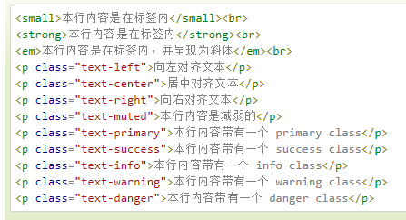

# Bootstrap 排版

Bootstrap 使用 Helvetica Neue、 Helvetica、 Arial 和 sans-serif 作为其默认的字体栈。

使用 Bootstrap 的排版特性，您可以创建标题、段落、列表及其他内联元素。

### 内联子标题small

如果需要向任何标题添加一个内联子标题，只需要简单地在元素两旁添加 <small>，或者添加 **.small** class，这样子您就能得到一个字号更小的颜色更浅的文本，如下面实例所示：

## 引导主体副本  lead

为了给段落添加强调文本，则可以添加 class="lead"，这将得到更大更粗、行高更高的文本，如下面实例所示：

## 强调

HTML 的默认强调标签 <small>（设置文本为父文本大小的 85%）、<strong>（设置文本为更粗的文本）、<em>（设置文本为斜体）。

Bootstrap 提供了一些用于强调文本的类，如下面实例所示：

<small>本行内容是在标签内</small> 
<strong>本行内容是在标签内</strong> 
<em>本行内容是在标签内，并呈现为斜体</em> 

## 缩写 

HTML 元素提供了用于缩写的标记，比如 WWW 或 HTTP。Bootstrap 定义 <abbr> 元素的样式为显示在文本底部的一条虚线边框，当鼠标悬停在上面时会显示完整的文本（只要您为 <abbr> title 属性添加了文本）。为了得到一个更小字体的文本，请添加 .initialism 到 <abbr>。

## 地址（Address）

使用 **<address>** 标签，您可以在网页上显示联系信息。由于 **<address>** 默认为 **display:block;**，您需要使用 ** ** 标签来为封闭的地址文本添加换行。

## 引用（Blockquote）

您可以在任意的 HTML 文本旁使用默认的 <blockquote>。其他选项包括，添加一个 <small> 标签来标识引用的来源，使用 class *.pull-right* 向右对齐引用。下面的实例演示了这些特性：

## 列表

Bootstrap 支持有序列表、无序列表和定义列表。

- **有序列表**：有序列表是指以数字或其他有序字符开头的列表。
- **无序列表**：无序列表是指没有特定顺序的列表，是以传统风格的着重号开头的列表。如果您不想显示这些着重号，您可以使用 class *.list-unstyled* 来移除样式。您也可以通过使用 class *.list-inline* 把所有的列表项放在同一行中。
- **定义列表**：在这种类型的列表中，每个列表项可以包含 <dt> 和 <dd> 元素。<dt> 代表 *定义术语*，就像字典。接着，<dd> 是 <dt> 的描述。`.dl-horizontal` 可以让 `<dl>` 内的短语及其描述排在一行。开始是像 `<dl>` 的默认样式堆叠在一起，随着导航条逐渐展开而排列在一行。

下面的实例演示了这些类型的列表：

## 更多排版类

下表提供了 Bootstrap 更多排版类的实例：

| 类                  | 描述                                                         | 实例                                                         |
| :------------------ | :----------------------------------------------------------- | :----------------------------------------------------------- |
| .lead               | 使段落突出显示                                               | [尝试一下](http://www.runoob.com/try/try2.php?filename=trybs_ref_txt_lead) |
| .small              | 设定小文本 (设置为父文本的 85% 大小)                         | [尝试一下](http://www.runoob.com/try/try2.php?filename=trybs_ref_txt_small) |
| .text-left          | 设定文本左对齐                                               | [尝试一下](http://www.runoob.com/try/try2.php?filename=trybs_ref_text-left) |
| .text-center        | 设定文本居中对齐                                             | [尝试一下](http://www.runoob.com/try/try2.php?filename=trybs_ref_text-left) |
| .text-right         | 设定文本右对齐                                               | [尝试一下](http://www.runoob.com/try/try2.php?filename=trybs_ref_text-left) |
| .text-justify       | 设定文本对齐,段落中超出屏幕部分文字自动换行                  | [尝试一下](http://www.runoob.com/try/try2.php?filename=trybs_ref_text-left) |
| .text-nowrap        | 段落中超出屏幕部分不换行                                     | [尝试一下](http://www.runoob.com/try/try2.php?filename=trybs_ref_text-left) |
| .text-lowercase     | 设定文本小写                                                 | [尝试一下](http://www.runoob.com/try/try2.php?filename=trybs_ref_text-lowercase) |
| .text-uppercase     | 设定文本大写                                                 | [尝试一下](http://www.runoob.com/try/try2.php?filename=trybs_ref_text-lowercase) |
| .text-capitalize    | 设定单词首字母大写                                           | [尝试一下](http://www.runoob.com/try/try2.php?filename=trybs_ref_text-lowercase) |
| .initialism         | 显示在 <abbr> 元素中的文本以小号字体展示，且可以将小写字母转换为大写字母 | [尝试一下](http://www.runoob.com/try/try2.php?filename=trybs_ref_txt_abbr2) |
| .blockquote-reverse | 设定引用右对齐                                               | [尝试一下](http://www.runoob.com/try/try2.php?filename=trybs_ref_txt_blockquote2) |
| .list-unstyled      | 移除默认的列表样式，列表项中左对齐 ( <ul> 和 <ol> 中)。 这个类仅适用于直接子列表项 (如果需要移除嵌套的列表项，你需要在嵌套的列表中使用该样式) | [尝试一下](http://www.runoob.com/try/try2.php?filename=trybs_ref_txt_list-unstyled) |
| .list-inline        | 将所有列表项放置同一行                                       | [尝试一下](http://www.runoob.com/try/try2.php?filename=trybs_ref_txt_list-inline) |
| .dl-horizontal      | 该类设置了浮动和偏移，应用于 <dl> 元素和 <dt> 元素中，具体实现可以查看实例 | [尝试一下](http://www.runoob.com/try/try2.php?filename=trybs_ref_txt_dl-horizontal) |
| .pre-scrollable     | 使 <pre> 元素可滚动，代码块区域最大高度为340px,一旦超出这个高度,就会在Y轴出现滚动条 | [尝试一下](http://www.runoob.com/try/try2.php?filename=trybs_ref_txt_pre2) |

- 
- text-muted：提示，使用浅**灰色（#999）**
- .text-primary：主要，使用**蓝色（#428bca）**
- .text-success：成功，使用**浅绿色(#3c763d)**
- .text-info：通知信息，使用**浅蓝色（#31708f）**
- .text-warning：警告，使用**黄色（#8a6d3b）**
- .text-danger：危险，使用**褐色（#a94442）**