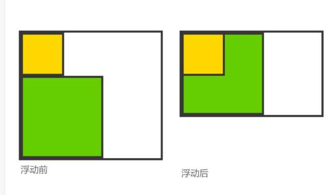
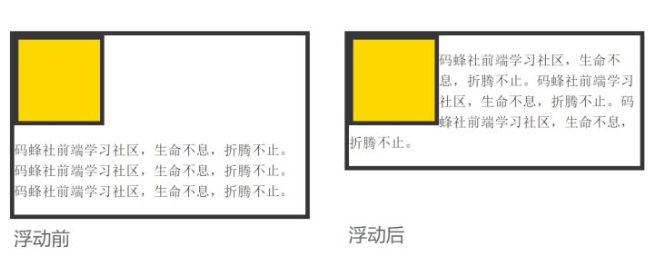
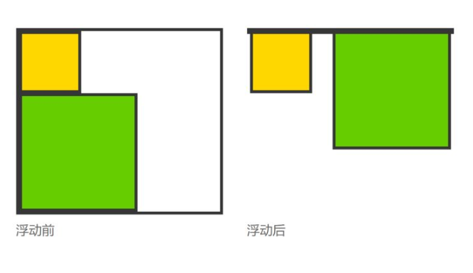

### 清除浮动（高度塌陷）：

方案一：BFC：设置元素浮动，设置元素绝对定位，设置元素类型为inline-block，设置overflow为非默认值

方案二：父元素最后添加空白div，然后对div清除浮动

方案三：after伪类

原因：浮动导致的问题：**父级标签高度塌陷---其实就是没有高度**

浮动带来的副作用 浮动会让元素脱离文档流，不再影响不浮动的元素（这里不影响是指在文档流里头不占位置，后边的元素忽视浮动元素的存在）。实则不然，浮动不再占据文档流的位置，也使浮动元素周围的元素表现的如同浮动元素不存在一样，给布局带来了一些副作用。

1块状元素，会钻进浮动元素的下面，被浮动元素所覆盖

2行内元素，例如文字， 则会环绕在浮动元素的周围，为浮动元素留出空间，**像这样：**

3浮动元素的父元素坍缩**, 像这样：

方式：

1父级div手动定义height，就解决了父级div无法自动获取到高度的问题

2结尾处加空div标签 clear:both,添加一个空div，利用css提高的clear:both清除浮动，让父级div能自动获取到高度

.clearflow {clear:both}

3,父级div定义 伪类:after.IE8以上和非IE浏览器才支持:after，原理和方法2有点类似，zoom(IE专有属性)可解决ie6,ie7浮动问题 （其他浏览器不用）

.clearfloat{zoom:1}   .clearfloat:after {display:block;clear;content:"";    *visibility*: hidden;

​    *height*: 0;}

4,父级div定义 overflow:hidden..必须定义width或zoom:1，同时不能定义height，使用overflow:hidden时，浏览器会自动检查浮动区域的高度

5父级div定义 overflow:auto:与方法4相同
这个不能用滚动条，所以不推荐使用哦！

6、父级div 也一起浮动： 缺点：会产生新的浮动问题。

7、父级div定义 display:table

8、结尾处加 br标签 clear:both

相关概念:BFC

### BFC：

块格式化上下文（Block Formatting Context，BFC） 是Web页面的可视化CSS渲染的一部分，是块盒子的布局过程发生的区域，也是浮动元素与其他元素交互的区域。

**具有 BFC 特性的元素可以看作是隔离了的独立容器，容器里面的元素不会在布局上影响到外面的元素，并且 BFC 具有普通容器所没有的一些特性。**

下列方式会创建块格式化上下文：

根元素或包含根元素的元素
浮动元素（元素的 float 不是 none）
绝对定位元素（元素的 position 为 absolute 或 fixed）
行内块元素（元素的 display 为 inline-block）
表格单元格（元素的 display为 table-cell，HTML表格单元格默认为该值）
表格标题（元素的 display 为 table-caption，HTML表格标题默认为该值）
匿名表格单元格元素（元素的 display为 table、table-row、 table-row-group、table-header-group、table-footer-group（分别是HTML table、row、tbody、thead、tfoot的默认属性）或 inline-table）
overflow 值不为 visible 的块元素
display 值为 flow-root 的元素
contain 值为 layout、content或 strict 的元素
弹性元素（display为 flex 或 inline-flex元素的直接子元素）
网格元素（display为 grid 或 inline-grid 元素的直接子元素）
多列容器（元素的 column-count 或 column-width 不为 auto，包括 column-count 为 1）
column-span 为 all 的元素始终会创建一个新的BFC，即使该元素没有包裹在一个多列容器中（标准变更，Chrome bug）。
块格式化上下文包含创建它的元素内部的所有内容.

块格式化上下文对浮动定位（参见 float）与清除浮动（参见 clear）都很重要。浮动定位和清除浮动时只会应用于同一个BFC内的元素。浮动不会影响其它BFC中元素的布局，而清除浮动只能清除同一BFC中在它前面的元素的浮动。外边距折叠（Margin collapsing）也只会发生在属于同一BFC的块级元素之间。

### 行高：

### white-space

### text-overflow

### overflow :

什么时候使用：

伪元素，伪类

### z-index;

子绝父项；top20px 和top20%

