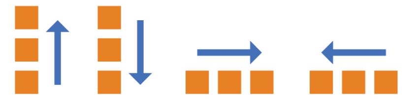
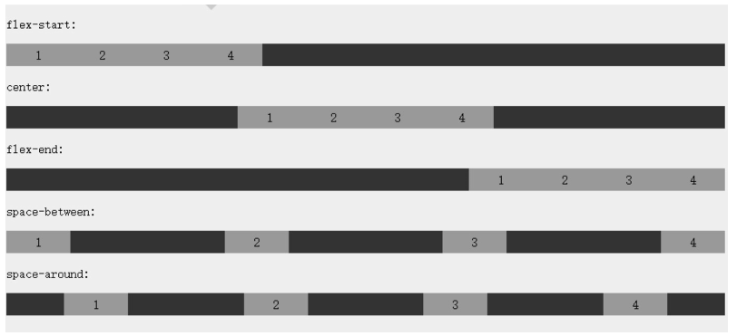
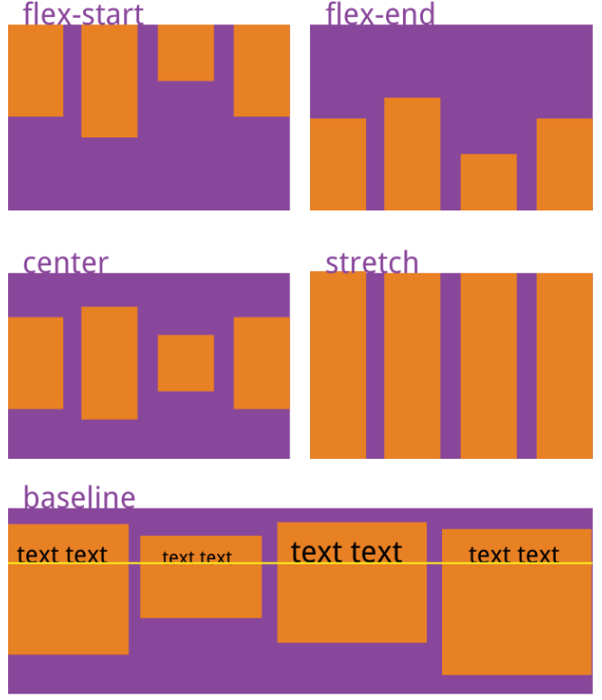
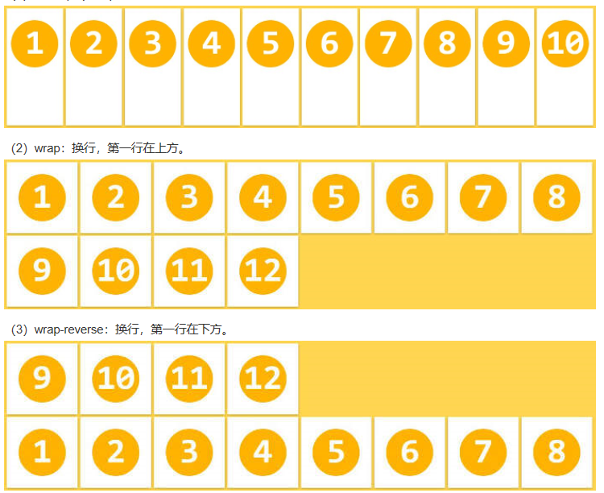
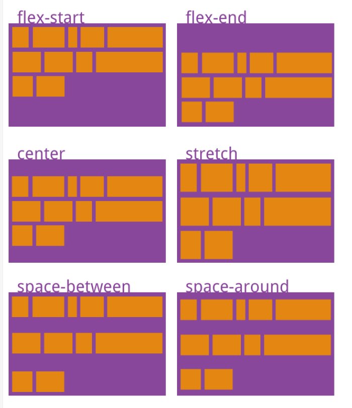
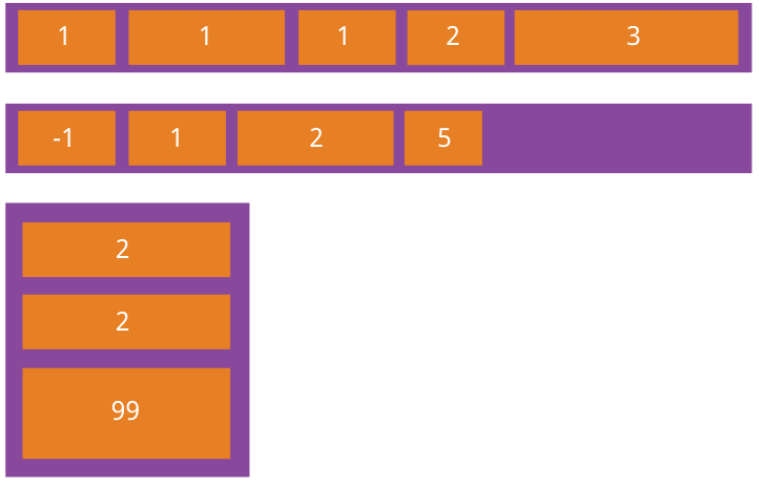
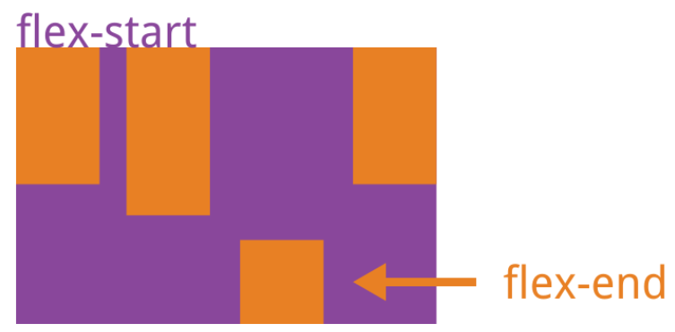

### 一、html标签

\<pre>...\</pre>文字格式化
\<div>......\</div>列块容器

字体大小变化 <font size=?>想输入的字</font> 
字体颜色 \<font color="...">想输入的字</font> 
字体变粗 \<b>想输入的字</b> 
字体变斜 \<i>想输入的字</i> 
字体加下划线 \<u>想输入的字</u> 
对正中央ㄉ语法 \<p align="center">内容</p> 
对正左边ㄉ语法 \<p align="left">内容</p> 
对正右边ㄉ语法 \<p align="right">内容 </p> 
字体删除线 \<s>想输入的字</s> 
字体设置 \<font face="字体名称">想输入的字</font> 
打字机字体 \<tt>想输入的字</tt> 
上标字 \<sup>想输入的字</sup> 
下标字 \<sub>想输入的字</sub> 
水平线 \<hr color="..."> 
换行输入 想输入的字\<br>

想输入的字 
超链接 \<a href="想链接网址">链接地的名称\</a> 
\<a href="mailto:填入email">要显示的字打这里\</a>网络邮寄标签
贴图 \ 
跑马灯(循环) \<marquee behavior=scroll>想输入的字</marquee>
外部文件导入格式标签
CSS外部导入格式：
\<link rel="stylesheet" type="text/css" href="/css.css" />
直接引用：

\<style type="text/css">
\<!--
id{...}
-->
\</style>

javascript - 加载外部.js独立文件：

\<script type="text/javascript" src="/script.js">\</script> 

### 二、CSS文字属性：

color : #999999; /*文字颜色*/
font-family : 宋体,sans-serif; /*文字字体*/ 
font-size : 9pt; /*文字大小*/ 
font-style:itelic; /*文字斜体*/ 
font-variant:small-caps; /*小字体*/ 
letter-spacing : 1pt; /*字间距离*/ 
line-height : 200%; /*设置行高*/ 
font-weight:bold; /*文字粗体*/ 
vertical-align:sub; /*下标字*/ 
vertical-align:super; /*上标字*/ 
text-decoration:line-through; /*加删除线*/ 
text-decoration:overline; /*加顶线*/ 
text-decoration:underline; /*加下划线*/ 
text-decoration:none; /*删除链接下划线*/ 
text-transform : capitalize; /*首字大写*/ 
text-transform : uppercase; /*英文大写*/ 
text-transform : lowercase; /*英文小写*/ 
text-align:right; /*文字右对齐*/ 
text-align:left; /*文字左对齐*/ 
text-align:center; /*文字居中对齐*/ 
text-align:justify; /*文字分散对齐*/ 
vertical-align属性
vertical-align:top; /*垂直向上对齐*/ 
vertical-align:bottom; /*垂直向下对齐*/ 
vertical-align:middle; /*垂直居中对齐*/ 
vertical-align:text-top; /*文字垂直向上对齐*/ 
vertical-align:text-bottom; /*文字垂直向下对齐*/ 

### 三、CSS符号属性：

list-style-type:none; /*不编号*/ 
list-style-type:decimal; /*阿拉伯数字*/ 
list-style-type:lower-roman; /*小写罗马数字*/ 
list-style-type:upper-roman; /*大写罗马数字*/ 
list-style-type:lower-alpha; /*小写英文字母*/ 
list-style-type:upper-alpha; /*大写英文字母*/ 
list-style-type:disc; /*实心圆形符号*/ 
list-style-type:circle; /*空心圆形符号*/ 
list-style-type:square; /*实心方形符号*/ 
list-style-image:url(/dot.gif); /*图片式符号*/ 
list-style-position:outside; /*凸排*/ 
list-style-position:inside; /*缩进*/ 

### 四、CSS背景样式：

background-color:#F5E2EC; /*背景颜色*/ 
background:transparent; /*透视背景*/ 
background-image : url(/image/bg.gif); /*背景图片*/ 
background-attachment : fixed; /*浮水印固定背景*/ 
background-repeat : repeat; /*重复排列-网页默认*/ 
background-repeat : no-repeat; /*不重复排列*/ 
background-repeat : repeat-x; /*在x轴重复排列*/ 
background-repeat : repeat-y; /*在y轴重复排列*/ 

### 指定背景位置

background-position : 90% 90%; /*背景图片x与y轴的位置*/ 
background-position : top; /*向上对齐*/ 
background-position : buttom; /*向下对齐*/ 
background-position : left; /*向左对齐*/ 
background-position : right; /*向右对齐*/ 
background-position : center; /*居中对齐*/ 

### 五、CSS连接属性：

a /*所有超链接*/ 
a:link /*超链接文字格式*/ 
a:visited /*浏览过的链接文字格式*/ 
a:active /*按下链接的格式*/ 
a:hover /*鼠标转到链接*/ 

#### 鼠标光标样式：

链接手指 CURSOR: hand 
十字体 cursor:crosshair 
箭头朝下 cursor:s-resize 
十字箭头 cursor:move 
箭头朝右 cursor:move 
加一问号 cursor:help 
箭头朝左 cursor:w-resize 
箭头朝上 cursor:n-resize 
箭头朝右上 cursor:ne-resize 
箭头朝左上 cursor:nw-resize 
文字I型 cursor:text 
箭头斜右下 cursor:se-resize 
箭头斜左下 cursor:sw-resize 
漏斗 cursor:wait 
光标图案(IE6) p {cursor:url("光标文件名.cur"),text;} 

### 六、CSS框线一览表：

border-top : 1px solid #6699cc; /*上框线*/ 
border-bottom : 1px solid #6699cc; /*下框线*/ 
border-left : 1px solid #6699cc; /*左框线*/ 
border-right : 1px solid #6699cc; /*右框线*/ 
以上是建议书写方式,但也可以使用常规的方式 如下:
border-top-color : #369 /*设置上框线top颜色*/ 
border-top-width :1px /*设置上框线top宽度*/ 
border-top-style : solid/*设置上框线top样式*/ 
其他框线样式
solid /*实线框*/ 
dotted /*虚线框*/ 
double /*双线框*/ 
groove /*立体内凸框*/ 
ridge /*立体浮雕框*/ 
inset /*凹框*/ 
outset /*凸框*/ 

### 七、CSS表单运用：

文字方块 <input type="text" name="T1" size="15"> 
按钮 <input type="submit" value="submit" name="B1"> 
复选框 <input type="checkbox" name="C1"> 
选择钮 <input type="radio" value="V1" checked name="R1"> 
多行文字方块 <textarea rows="1" name="S1" cols="15"></textarea> 
下拉式菜单 <select size="1" name="D1"><option>选项1</option>
<option>选项2</option></select> 

### 八、CSS边界样式：

margin-top:10px; /*上边界*/ 
margin-right:10px; /*右边界值*/ 
margin-bottom:10px; /*下边界值*/ 
margin-left:10px; /*左边界值*/ 

### 九、CSS边框空白

padding-top:10px; /*上边框留空白*/ 
padding-right:10px; /*右边框留空白*/ 
padding-bottom:10px; /*下边框留空白*/ 
padding-left:10px; /*左边框留空白*/ 

### 基本语法 

　规则 
选择符 
任何HTML元素都可以是一个CSS1的选择符。选择符仅仅是指向特别样式的元素。例如， P { text-indent: 3em } 
当中的选择符是P。 

##### 类选择符 

单一个选择符能有不同的CLASS(类)，因而允许同一元素有不同样式。例如，一个网页制作者也许希望视其语言而定，用不同的颜色显示代码 : 
code.html { color: #191970 } 
code.css { color: #4b0082 } 
　以上的例子建立了两个类，css和html，供HTML的CODE元素使用。CLASS属性是用于在HTML中以指明元素的类，例如， 

\< p例如，code.html.proprietary是无效的。\</p> 

类的声明也可以无须相关的元素: 
.note { font-size: small } 
在这个例子，名为note的类可以被用于任何元素。 
一个良好的习惯是在命名类的时候，根据它们的功能而不是根据它们的外观。上述例子中的note类也可以命名为small，但如果网页制作者决定改变这个类的样式，使得它不再是小字体的话，那么这个名字就变得毫无意义了。 

##### ID 选择符 

ID 选择符个别地定义每个元素的成分。这种选择符应该尽量少用，因为他具有一定的局限。一个ID选择符的指定要有指示符"#"在名字前面。例如，ID选择符可以指定如下: svp94O { text-indent: 3em } 

　\<p ID=svp94O>文本缩进3em 

##### 关联选择符 

关联选择符只不过是一个用空格隔开的两个或更多的单一选择符组成的字符串。这些选择符可以指定一般属性，而且因为层叠顺序的规则，它们的优先权比单一的选择符大。例如， 以下的上下文选择符 
P EM { background: yellow } 
是P EM。这个值表示段落中的强调文本会是黄色背景；而标题的强调文本则不受影响。 
　声明 
属性 
一个属性被指定到选择符是为了使用它的样式。属性的例子包括颜色、边界和字体。 
值 
声明的值是一个属性接受的指定。例如，属性颜色能接受值red。 
组合 
为了减少样式表的重复声明，组合的选择符声明是允许的。例如，文档中所有的标题可以通过组合给出相同的声明: 
H1, H2, H3, H4, H5, H6 { 
color: red; 
font-family: sans-serif } 
　继承 
实际上，所有在选择符中嵌套的选择符都会继承外层选择符指定的属性值，除非另外更改。例如，一个BODY定义了的颜色值也会应用到段落的文本中。 
有些情况是内部选择符不继承周围的选择符的值，但理论上这些都是特殊的。例如，上边界属性是不会继承的；直觉上，一个段落不会有同文档BODY一样的上边界值。 
　　注解 
样式表里面的注解使用C语言编程中一样的约定方法去指定。CSS1注解的例子如以下格式: 
/* COMMENTS CANNOT BE NESTED */ 

##### 伪类和伪元素 

伪类和伪元素是特殊的类和元素，能自动地被支持CSS的浏览器所识别。伪类区别开不同种类的元素(例如，visited links(已访问的连接)和active links(可激活连接)描述了两个定位锚(anchors)的类型)。伪元素指元素的一部分，例如段落的第一个字母。 
伪类或伪元素规则的形式如 
选择符:伪类 { 属性: 值 } 
或 
选择符:伪元素 { 属性: 值 } 
伪类和伪元素不应用HTML的CLASS属性来指定。一般的类可以与伪类和伪元素一起使用，如下: 
选择符.类: 伪类 { 属性: 值 } 
或 
选择符.类: 伪元素 { 属性: 值 } 

##### 定位锚伪类 

　伪类可以指定A元素以不同的方式显示连接(links)、已访问连接(visited links)和可激活连接(active links)。定位锚元素可给出伪类link、visited或active。一个已访问连接可以定义为不同颜色的显示，甚至不同字体大小和风格。 
一个有趣的效果是使当前(或“可激活”)连接以不同颜色、更大的字体显示。然后，当网页的已访问连接被重选时，又以不同颜色、更小字体显示。这个样式表的示例如下: 
A:link { color: red } 
A:active { color: blue; font-size: 125% } 
A:visited { color: green; font-size: 85% } 

##### 首行伪元素 

通常在报纸上的文章，例如Wall Street Journal中的，文本的首行都会以粗印体而且全部大写地展示。CSS1包括了这个功能，将其作为一个伪元素。首行伪元素可以用于任何块级元素(例如P、H1等等)。以下是一个首行伪元素的例子: 
　P:first-line { 
　font-variant: small-caps; 
　font-weight: bold } 

##### 首个字母伪元素 

首个字母伪元素用于加大(drop caps)和其他效果。含有已指定值选择符的文本的首个字母会按照指定的值展示。一个首个字母伪元素可以用于任何块级元素。例如: 
　P:first-letter { font-size: 300%; float: left } 
会比普通字体加大三倍。


### Text

color 设置text的颜色
text-align 设置text的对齐
text-decoration 设置text的下划线
text-transformation 设置字母的大小写和单词的首字母大写
line-height 设置行高
letter-spacing 设置字符间的距离

Font
font-family 设置字体
font-size 设置字体的大小
font-style 设置字体为斜体还是正常显示
font-weight 加粗字体
Background
background-color 设置背景的颜色
background-image 设置背景图片
background-repeat 设置背景图片的重复方式
background-position 设置背景图片的位置 默认为top left

### Lists

list-style-type 设置list的类型，有circle等值

### box-model

margin 设置盒子的外边距 外边距是透明的。
padding 设置盒子的内边距 内边距也是透明的。
border 设置盒子的边框，边框为不透明的。note：边框必须要设置类型，否则将无效。
float 设置盒子的浮动，浮动是绝对定位的一种，其占位空间将消失。
clear 清除盒子的浮动，清除封装的那个盒子的浮动。
position and :after / :before
:after 和 :before 通常都是和position一起使用的。position分为绝对定位和相对定位，相对定位的空间还在，绝对定位的空间就不在了。那两个伪类+ position的绝对定位，由非常强大的威力，很多地方都可以用。

### CSS3

border-radius css3支持设置圆角
-webkit-border-radius 支持webkit的浏览器
-moz-border-radius: 支持moz的浏览器
Syntax:提供一个半径即可。
box-shadow css3支持设置阴影
-webkit-box-shadow
-moz-box-shadow
Syntax-shadow: none|h-shadow v-shadow blur spread color |inset|initial|inherit;
text-shadow css3 支持设置text阴影
Syntax-shadow: h-shadow v-shadow blur-radius color|none|initial|inherit;
Multiple Backgrounds css3的背景图支持多张背景图
** background-size** css3支持背景的尺寸
text-overflow css3 支持对超出边界的文字的处理

### Syntax:

text-overflow: clip|ellipsis|string|initial|inherit;
Flexible Box Model
transform 分为2d和3d 主要包括缩放、平移和旋转。 


# text-transform：文本的大小写

text-transform 属性控制文本的大小写。

属性值：

none  默认。定义带有小写字母和大写字母的标准的文本。
capitalize 文本中的每个单词以大写字母开头。
uppercase 定义仅有大写字母。
lowercase 定义无大写字母，仅有小写字母。
inherit  规定应该从父元素继承 text-transform 属性的值。


# css3弹性盒子

弹性盒子是 CSS3 的一种新的布局模式。

CSS3 弹性盒（ Flexible Box 或 flexbox），是一种当页面需要适应不同的屏幕大小以及设备类型时确保元素拥有恰当的行为的布局方式

引入弹性盒布局模型的目的是提供一种更加有效的方式来对一个容器中的子元素进行排列、对齐和分配空白空间。

CSS3 弹性盒子内容
弹性盒子由弹性容器(Flex container)和弹性子元素(Flex item)组成。
弹性容器通过设置 **display** 属性的值为 **flex** 或 **inline-flex**将其定义为弹性容器。
弹性容器内包含了一个或多个弹性子元素。
注意： 弹性容器外及弹性子元素内是正常渲染的。弹性盒子只定义了弹性子元素如何在弹性容器内布局。
弹性子元素通常在弹性盒子内一行显示。默认情况每个容器只有一行。

## CSS3 弹性盒子属性

下表列出了在弹性盒子中常用到的属性:

display：flex；

 *align-items*:center;align-items 属性定义flex子项在flex容器的当前行的侧轴（纵轴）方向上的对齐方式。

​    *justify-content*: center;justify-content 用于设置或检索弹性盒子元素在主轴（横轴）方向上的对齐方式。

| 属性                                                         | 描述                                                         |
| :----------------------------------------------------------- | :----------------------------------------------------------- |
| [display](http://www.runoob.com/cssref/pr-class-display.html) | 指定 HTML  元素盒子类型。                                    |
| [flex-direction](http://www.runoob.com/cssref/css3-pr-flex-direction.html) | 指定了弹性容器中子元素的排列方式                             |
| [justify-content](http://www.runoob.com/cssref/css3-pr-justify-content.html) | 设置弹性盒子元素在主轴（横轴）方向上的对齐方式。             |
| [align-items](http://www.runoob.com/cssref/css3-pr-align-items.html) | 设置弹性盒子元素在侧轴（纵轴）方向上的对齐方式。             |
| [flex-wrap](http://www.runoob.com/cssref/css3-pr-flex-wrap.html) | 设置弹性盒子的子元素超出父容器时是否换行。                   |
| [align-content](http://www.runoob.com/cssref/css3-pr-align-content.html) | 修改 flex-wrap 属性的行为，类似 	align-items, 但不是设置子元素对齐，而是设置行对齐 |
| [flex-flow](http://www.runoob.com/cssref/css3-pr-flex-flow.html) | flex-direction 和 flex-wrap 的简写                           |
| [order](http://www.runoob.com/cssref/css3-pr-order.html)     | 设置弹性盒子的子元素排列顺序。                               |
| [align-self](http://www.runoob.com/cssref/css3-pr-align-self.html) | 在弹性子元素上使用。覆盖容器的 align-items 属性。            |
| [flex](http://www.runoob.com/cssref/css3-pr-flex.html)       | 设置弹性盒子的子元素如何分配空间。                           |


## flex-direction

flex-direction 属性指定了弹性子元素在父容器中的位置。

语法：flex-direction: row | row-reverse | column | column-reverse

row：横向从左到右排列（左对齐），默认的排列方式。
row-reverse：反转横向排列（右对齐，从后往前排，最后一项排在最前面。
column：纵向排列。
column-reverse：反转纵向排列，从后往前排，最后一项排在最上面。



## justify-content 属性

内容对齐（justify-content）属性应用在弹性容器上，把弹性项沿着弹性容器的主轴线（main axis）对齐。
语法：justify-content: flex-start | flex-end | center | space-between | space-around

flex-start：
弹性项目向行头紧挨着填充。这个是默认值。第一个弹性项的main-start外边距边线被放置在该行的main-start边线，而后续弹性项依次平齐摆放。
flex-end：
弹性项目向行尾紧挨着填充。第一个弹性项的main-end外边距边线被放置在该行的main-end边线，而后续弹性项依次平齐摆放。
center：
弹性项目居中紧挨着填充。（如果剩余的自由空间是负的，则弹性项目将在两个方向上同时溢出）。
space-between：
弹性项目平均分布在该行上。如果剩余空间为负或者只有一个弹性项，则该值等同于flex-start。否则，第1个弹性项的外边距和行的main-start边线对齐，而最后1个弹性项的外边距和行的main-end边线对齐，然后剩余的弹性项分布在该行上，相邻项目的间隔相等。
space-around：
弹性项目平均分布在该行上，两边留有一半的间隔空间。如果剩余空间为负或者只有一个弹性项，则该值等同于center。否则，弹性项目沿该行分布，且彼此间隔相等（比如是20px），同时首尾两边和弹性容器之间留有一半的间隔（1/2*20px=10px）。




## align-items 属性

align-items 设置或检索弹性盒子元素在侧轴（纵轴）方向上的对齐方式。
语法
align-items: flex-start | flex-end | center | baseline | stretch

flex-start：弹性盒子元素的侧轴（纵轴）起始位置的边界紧靠住该行的侧轴起始边界。
flex-end：弹性盒子元素的侧轴（纵轴）起始位置的边界紧靠住该行的侧轴结束边界。
center：弹性盒子元素在该行的侧轴（纵轴）上居中放置。（如果该行的尺寸小于弹性盒子元素的尺寸，则会向两个方向溢出相同的长度）。
baseline：如弹性盒子元素的行内轴与侧轴为同一条，则该值与'flex-start'等效。其它情况下，该值将参与基线对齐。
stretch：如果指定侧轴大小的属性值为'auto'，则其值会使项目的边距盒的尺寸尽可能接近所在行的尺寸，但同时会遵照'min/max-width/height'属性的限制。



## flex-wrap 属性

flex-wrap 属性用于指定弹性盒子的子元素换行方式。
语法
flex-wrap: nowrap|wrap|wrap-reverse|initial|inherit;

nowrap - 默认， 弹性容器为单行。该情况下弹性子项可能会溢出容器。
wrap - 弹性容器为多行。该情况下弹性子项溢出的部分会被放置到新行，子项内部会发生断行
wrap-reverse -反转 wrap 排列。




align-content 属性

align-content 属性用于修改 flex-wrap 属性的行为。类似于 align-items, 但它不是设置弹性子元素的对齐，而是设置各个行的对齐。
语法
align-content: flex-start | flex-end | center | space-between | space-around | stretch

stretch - 默认。各行将会伸展以占用剩余的空间。
flex-start - 各行向弹性盒容器的起始位置堆叠。
flex-end - 各行向弹性盒容器的结束位置堆叠。
center -各行向弹性盒容器的中间位置堆叠。
space-between -各行在弹性盒容器中平均分布。
space-around - 各行在弹性盒容器中平均分布，两端保留子元素与子元素之间间距大小的一半。



## **弹性子元素属性**


以下6个属性设置在项目上。

order：order属性定义项目的排列顺序。数值越小，排列越靠前，默认为0。

**flex-grow**：flex-grow属性定义项目的放大比例，默认为0，即如果存在剩余空间，也不放大。

如果所有项目的flex-grow属性都为1，则它们将等分剩余空间（如果有的话）。如果一个项目的flex-grow属性为2，其他项目都为1，则前者占据的剩余空间将比其他项多一倍。

**flex-shrink**：flex-shrink属性定义了项目的缩小比例，默认为1，即如果空间不足，该项目将缩小。

如果所有项目的flex-shrink属性都为1，当空间不足时，都将等比例缩小。如果一个项目的flex-shrink属性为0，其他项目都为1，则空间不足时，前者不缩小。负值对该属性无效。

**flex-basis**：flex-basis属性定义了在分配多余空间之前，项目占据的主轴空间（main size）。浏览器根据这个属性，计算主轴是否有多余空间。它的默认值为auto，即项目的本来大小。

它可以设为跟width或height属性一样的值（比如350px），则项目将占据固定空间。

**flex**：flex属性是flex-grow, flex-shrink 和 flex-basis的简写，默认值为0 1 auto。后两个属性可选。

该属性有两个快捷值：auto (1 1 auto) 和 none (0 0 auto)。

建议优先使用这个属性，而不是单独写三个分离的属性，因为浏览器会推算相关值。

**align-self**：align-self属性允许单个项目有与其他项目不一样的对齐方式，可覆盖align-items属性。默认值为auto，表示继承父元素的align-items属性，如果没有父元素，则等同于stretch。




对齐：置"margin"值为"auto"值，自动获取弹性容器中剩余的空间。所以设置垂直方向margin值为"auto"，可以使弹性子元素在弹性容器的两上轴方向都完全居中。

**完美的居中**：使用弹性盒子，居中变的很简单，只想要设置  `margin: auto;` 可以使得弹性子元素在两上轴方向上完全居中:

### align-self

align-self 属性用于设置弹性元素自身在侧轴（纵轴）方向上的对齐方式。
语法
align-self: auto | flex-start | flex-end | center | baseline | stretch

auto：如果'align-self'的值为'auto'，则其计算值为元素的父元素的'align-items'值，如果其没有父元素，则计算值为'stretch'。
flex-start：弹性盒子元素的侧轴（纵轴）起始位置的边界紧靠住该行的侧轴起始边界。
flex-end：弹性盒子元素的侧轴（纵轴）起始位置的边界紧靠住该行的侧轴结束边界。
center：弹性盒子元素在该行的侧轴（纵轴）上居中放置。（如果该行的尺寸小于弹性盒子元素的尺寸，则会向两个方向溢出相同的长度）。
baseline：如弹性盒子元素的行内轴与侧轴为同一条，则该值与'flex-start'等效。其它情况下，该值将参与基线对齐。
stretch：如果指定侧轴大小的属性值为'auto'，则其值会使项目的边距盒的尺寸尽可能接近所在行的尺寸，但同时会遵照'min/max-width/height'属性的限制。


### flex

flex 属性用于指定弹性子元素如何分配空间。
语法
flex: auto | initial | none | inherit |  [ flex-grow ] || [ flex-shrink ] || [ flex-basis ]

auto: 计算值为 1 1 auto 
initial: 计算值为 0 1 auto 
none：计算值为 0 0 auto
inherit：从父元素继承
[ flex-grow ]：定义弹性盒子元素的扩展比率。
[ flex-shrink ]：定义弹性盒子元素的收缩比率。
[ flex-basis ]：定义弹性盒子元素的默认基准值。


# transition:

属性定义及使用说明 

transition属性是一个速记属性有四个属性：

transition-property, transition-duration, transition-timing-function, and transition-delay。

**注意：** 始终指定transition-duration属性，否则持续时间为0，transition不会有任何效果。

## transition-property

指定CSS属性的name，transition效果

transition-property属性指定CSS属性的nametransition效果（transition效果时将会启动指定的CSS属性的变化）。

​     **提示:****一个转场效果**，通常会出现在当用户将鼠标悬停在一个元素上时

​     **注意：**始终指定transition-duration属性，否则持续时间为0，transition不会有任何效果。

**none**
没有属性会获得过渡效果。
**all**
所有属性都将获得过渡效果。
**property** 
定义应用过渡效果的 CSS 属性名称列表，列表以逗号分隔。


## **transition-duration:time**   

   规定完成过渡效果需要花费的时间（以秒或毫秒计）。

默认值是 0，意味着不会有效果。

## transition-timing-function:

属性指定切换效果的速度。指定transition效果的转速曲线

| linear                        | 规定以相同速度开始至结束的过渡效果（等于 cubic-bezier(0,0,1,1)）。 |
| ----------------------------- | ------------------------------------------------------------ |
| ease                          | 规定慢速开始，然后变快，然后慢速结束的过渡效果（cubic-bezier(0.25,0.1,0.25,1)）。 |
| ease-in                       | 规定以慢速开始的过渡效果（等于 cubic-bezier(0.42,0,1,1)）。  |
| ease-out                      | 规定以慢速结束的过渡效果（等于 cubic-bezier(0,0,0.58,1)）。  |
| ease-in-out                   | 规定以慢速开始和结束的过渡效果（等于 cubic-bezier(0.42,0,0.58,1)）。 |
| cubic-bezier(*n*,*n*,*n*,*n*) | 在 cubic-bezier 函数中定义自己的值。可能的值是 0 至 1 之间的数值。 |

## transition-delay

定义transition效果开始的时候

transition-delay 属性指定何时将开始切换效果。

transition-delay值是指以秒为单位（S）或毫秒（ms）。


# 响应式设计

## viewport：

什么是 Viewport?
viewport 是用户网页的可视区域。
viewport 翻译为中文可以叫做"视区"。
手机浏览器是把页面放在一个虚拟的"窗口"（viewport）中，通常这个虚拟的"窗口"（viewport）比屏幕宽，这样就不用把每个网页挤到很小的窗口中（这样会破坏没有针对手机浏览器优化的网页的布局），用户可以通过平移和缩放来看网页的不同部分。

设置 Viewport
一个常用的针对移动网页优化过的页面的 viewport meta 标签大致如下：

\<meta name="viewport" content="width=device-width, initial-scale=1.0">
width：控制 viewport 的大小，可以指定的一个值，如 600，或者特殊的值，如 device-width 为设备的宽度（单位为缩放为 100% 时的 CSS 的像素）。
height：和 width 相对应，指定高度。
initial-scale：初始缩放比例，也即是当页面第一次 load 的时候缩放比例。
maximum-scale：允许用户缩放到的最大比例。
minimum-scale：允许用户缩放到的最小比例。
user-scalable：用户是否可以手动缩放。

## 网格视图：

响应式网格视图通常是 12 列，宽度为100%，在浏览器窗口大小调整时会自动伸缩。

创建响应式网格视图
接下来我们来创建一个响应式网格视图。
首先确保所有的 HTML 元素都有 box-sizing 属性且设置为 border-box。 
确保边距和边框包含在元素的宽度和高度间。
添加如下代码：*{box-sizing: border-box;}

简单的响应式网页

```javascript
* {
    box-sizing: border-box;
}
.header {}
.menu {
    width: 25%;
    float: left;
}
.main {
    width: 75%;
    float: left;  
}
```

以上实例包含两列。
12 列的网格系统可以更好的控制响应式网页。
首先我们可以计算每列的百分比: 100% / 12 列 = 8.33%。
在每列中指定 class， class="col-" 用于定义每列有几个 span ：

```javascript
* {
    box-sizing: border-box;
}
.header {}
.row:after {
    content: "";
    clear: both;
    display: block;}
[class*="col-"] {
    float: left;}
.col-1 {width: 8.33%;}
.col-2 {width: 16.66%;}
.col-3 {width: 25%;}
.col-4 {width: 33.33%;}
.col-5 {width: 41.66%;}
.col-6 {width: 50%;}
.col-7 {width: 58.33%;}
.col-8 {width: 66.66%;}
.col-9 {width: 75%;}
.col-10 {width: 83.33%;}
.col-11 {width: 91.66%;}
.col-12 {width: 100%;}
<div class="col-3">
<div class="col-9">
```


## 媒体查询：

添加断点：

@media only screen and (max-width: 768px) {
    /* For mobile phones: */
    [class*="col-"] {
        width: 100%;
    }
}

在屏幕为 600px 时添加媒体查询，并设置新的样式（屏幕大于600px但小于768px）：

@media only screen and (min-width: 600px) {
    /* For tablets: */
    .col-m-1 {width: 8.33%;}*

。。。。
}
@media only screen and (min-width: 768px) {
    /* For desktop: */
    .col-1 {width: 8.33%;}
    。。。
}

方向：横屏；竖屏

语法：

```
orientation：portrait | landscape
```

-  **portrait：**指定输出设备中的页面可见区域高度大于或等于宽度
-  **landscape：** 除portrait值情况外，都是landscape


## @media:

使用 @media 查询，你可以针对不同的媒体类型定义不同的样式。

@media 可以针对不同的屏幕尺寸设置不同的样式，特别是如果你需要设置设计响应式的页面，@media 是非常有用的。

当你重置浏览器大小的过程中，页面也会根据浏览器的宽度和高度重新渲染页面。

语法：

@media *mediatype* and|not|only *(media feature)* {    
*CSS-Code;*}

你也可以针对不同的媒体使用不同 *stylesheets* :\<link rel="stylesheet" media="*mediatype* and|not|only (*media  	feature*)"  	href="*mystylesheet.css*">

### 媒体类型

| 值         | 描述                                                         |
| :--------- | :----------------------------------------------------------- |
| all        | 用于所有设备                                                 |
| aural      | 已废弃。用于语音和声音合成器                                 |
| braille    | 已废弃。 应用于盲文触摸式反馈设备                            |
| embossed   | 已废弃。 用于打印的盲人印刷设备                              |
| handheld   | 已废弃。 用于掌上设备或更小的装置，如PDA和小型电话           |
| print      | 用于打印机和打印预览                                         |
| projection | 已废弃。 用于投影设备                                        |
| screen     | 用于电脑屏幕，平板电脑，智能手机等。                         |
| speech     | 应用于屏幕阅读器等发声设备                                   |
| tty        | 已废弃。 用于固定的字符网格，如电报、终端设备和对字符有限制的便携设备 |
| tv         | 已废弃。 用于电视和网络电视                                  |

### 媒体功能

  

| 值                      | 描述                                                         |
| :---------------------- | :----------------------------------------------------------- |
| aspect-ratio            | 定义输出设备中的页面可见区域宽度与高度的比率                 |
| color                   | 定义输出设备每一组彩色原件的个数。如果不是彩色设备，则值等于0 |
| color-index             | 定义在输出设备的彩色查询表中的条目数。如果没有使用彩色查询表，则值等于0 |
| device-aspect-ratio     | 定义输出设备的屏幕可见宽度与高度的比率。                     |
| device-height           | 定义输出设备的屏幕可见高度。                                 |
| device-width            | 定义输出设备的屏幕可见宽度。                                 |
| grid                    | 用来查询输出设备是否使用栅格或点阵。                         |
| height                  | 定义输出设备中的页面可见区域高度。                           |
| max-aspect-ratio        | 定义输出设备的屏幕可见宽度与高度的最大比率。                 |
| max-color               | 定义输出设备每一组彩色原件的最大个数。                       |
| max-color-index         | 定义在输出设备的彩色查询表中的最大条目数。                   |
| max-device-aspect-ratio | 定义输出设备的屏幕可见宽度与高度的最大比率。                 |
| max-device-height       | 定义输出设备的屏幕可见的最大高度。                           |
| max-device-width        | 定义输出设备的屏幕最大可见宽度。                             |
| max-height              | 定义输出设备中的页面最大可见区域高度。                       |
| max-monochrome          | 定义在一个单色框架缓冲区中每像素包含的最大单色原件个数。     |
| max-resolution          | 定义设备的最大分辨率。                                       |
| max-width               | 定义输出设备中的页面最大可见区域宽度。                       |
| min-aspect-ratio        | 定义输出设备中的页面可见区域宽度与高度的最小比率。           |
| min-color               | 定义输出设备每一组彩色原件的最小个数。                       |
| min-color-index         | 定义在输出设备的彩色查询表中的最小条目数。                   |
| min-device-aspect-ratio | 定义输出设备的屏幕可见宽度与高度的最小比率。                 |
| min-device-width        | 定义输出设备的屏幕最小可见宽度。                             |
| min-device-height       | 定义输出设备的屏幕的最小可见高度。                           |
| min-height              | 定义输出设备中的页面最小可见区域高度。                       |
| min-monochrome          | 定义在一个单色框架缓冲区中每像素包含的最小单色原件个数       |
| min-resolution          | 定义设备的最小分辨率。                                       |
| min-width               | 定义输出设备中的页面最小可见区域宽度。                       |
| monochrome              | 定义在一个单色框架缓冲区中每像素包含的单色原件个数。如果不是单色设备，则值等于0 |
| orientation             | 定义输出设备中的页面可见区域高度是否大于或等于宽度。         |
| resolution              | 定义设备的分辨率。如：96dpi, 300dpi, 118dpcm                 |
| scan                    | 定义电视类设备的扫描工序。                                   |
| width                   | 定义输出设备中的页面可见区域宽度。                           |

## 图片：

使用width：100%；

img {
    width: 100%;
    height: auto;
}

使用max-width：100%

如果 max-width 属性设置为 100%, 图片永远不会大于其原始大小：

### 背景图片

响应的三个方法： 

1background-size 属性设置为 "contain", 背景图片将按比例自适应内容区域。图片保持其比例不变：

2如果 background-size 属性设置为 "100% 100%" ，背景图片将延展覆盖整个区域：background-size: 100% 100%;

3如果 background-size 属性设置为 "cover"，则会把背景图像扩展至足够大，以使背景图像完全覆盖背景区域。注意该属性保持了图片的比例因此
背景图像的某些部分无法显示在背景定位区域中。

### 不同设备显示不同图片：

大尺寸图片可以显示在大屏幕上，但在小屏幕上确不能很好显示。我们没有必要在小屏幕上去加载大图片，这样很影响加载速度。所以我们可以使用媒体查询，根据不同的设备显示不同的图片。

以下大图片和小图片将显示在不同设备上：

```javascript
/* For width smaller than 400px: */
body {
    background-image: url('img_smallflower.jpg'); 
}

/* For width 400px and larger: */
@media only screen and (min-width: 400px) {
    body { 
        background-image: url('img_flowers.jpg'); 
    }
}
```

你可以使用媒体查询的 min-device-width 替代 min-width 属性，它将检测的是设备宽度而不是浏览器宽度。浏览器大小重置时，图片大小不会改变。

```javascript
/* 设备小于 400px: */
body {
    background-image: url('img_smallflower.jpg'); 
}

/* 设备大于 400px (也等于): */
@media only screen and (min-device-width: 400px) {
    body { 
        background-image: url('img_flowers.jpg'); 
    }
}
```

### **HTML5 \<picture> 元素**

```javascript
<picture>
  <source srcset="img_smallflower.jpg" media="(max-width: 400px)">
  <source srcset="img_flowers.jpg">
  
</picture>
```

srcset 属性的必须的，定义了图片资源。
media 属性是可选的，可以在媒体查询的 CSS @media 规则 查看详情。
对于不支持 \<picture> 元素的浏览器你也可以定义 \ 元素来替代。

## 视频：

width：100%；max-width:100%;height:auto;

# 用户界面：

## 新的用户界面特性

| 属性                                                         | 说明                                                   | CSS  |
| :----------------------------------------------------------- | :----------------------------------------------------- | :--- |
| [appearance](http://www.runoob.com/cssref/css3-pr-appearance.html) | 允许您使一个元素的外观像一个标准的用户界面元素         | 3    |
| [box-sizing](http://www.runoob.com/cssref/css3-pr-box-sizing.html) | 允许你以适应区域而用某种方式定义某些元素  方框大小调整 | 3    |
| [icon](http://www.runoob.com/cssref/css3-pr-icon.html)       | 为创作者提供了将元素设置为图标等价物的能力。           | 3    |
| [nav-down](http://www.runoob.com/cssref/css3-pr-nav-down.html) | 指定在何处使用箭头向下导航键时进行导航                 | 3    |
| [nav-index](http://www.runoob.com/cssref/css3-pr-nav-index.html) | 指定一个元素的Tab的顺序                                | 3    |
| [nav-left](http://www.runoob.com/cssref/css3-pr-nav-left.html) | 指定在何处使用左侧的箭头导航键进行导航                 | 3    |
| [nav-right](http://www.runoob.com/cssref/css3-pr-nav-right.html) | 指定在何处使用右侧的箭头导航键进行导航                 | 3    |
| [nav-up](http://www.runoob.com/cssref/css3-pr-nav-up.html)   | 指定在何处使用箭头向上导航键时进行导航                 | 3    |
| [outline-offset](http://www.runoob.com/cssref/css3-pr-outline-offset.html) | 外轮廓修饰并绘制超出边框的边缘     外形修饰            | 3    |
| [resize](http://www.runoob.com/cssref/css3-pr-resize.html)   | 指定一个元素是否是由用户调整大小  调整尺寸             | 3    |

在 CSS3 中, 增加了一些新的用户界面特性来调整元素尺寸，框尺寸和外边框

- resize
- box-sizing
- outline-offset


## resize：

resize属性指定一个元素是否是由用户调整大小的。
注意：resize属性适用于计算其他元素的溢出值是不是"visible"。

语法：resize: none|both|horizontal|vertical:

| 值         | 描述                         |
| :--------- | :--------------------------- |
| none       | 用户无法调整元素的尺寸。     |
| both       | 用户可调整元素的高度和宽度。 |
| horizontal | 用户可调整元素的宽度。       |
| vertical   | 用户可调整元素的高度。       |

## box-sizing:

box-sizing 属性允许你以某种方式定义某些元素，以适应指定区域。

例如，假如您需要并排放置两个带边框的框，可通过将 box-sizing 设置为 "border-box"。这可令浏览器呈现出带有指定宽度和高度的框，并把边框和内边距放入框中。

语法

 box-sizing: content-box|border-box|inherit:

| 值          | 说明                                                         |
| :---------- | :----------------------------------------------------------- |
| content-box | 这是CSS2.1指定的宽度和高度的行为。指定元素的宽度和高度（最小/最大属性）适用于box的宽度和高度。元素的填充和边框布局和绘制指定宽度和高度除外 |
| border-box  | 指定宽度和高度（最小/最大属性）确定元素边框box。也就是说，对元素指定宽度和高度包括padding和border的指定。内容的宽度和高度减去各自双方该边框和填充的宽度从指定的"宽度"和"高度"属性计算 |
| inherit     | 指定box-sizing属性的值，应该从父元素继承                     |


outline-offset:

属性定义及使用说明
outline-offset属性设置轮廓框架在 border 边缘外的偏移
Outlines在两个方面不同于边框：
Outlines 不占用空间
Outlines 可能非矩形

语法;outline-offset: *length*|inherit:

| 值       | 描述                                         |
| :------- | :------------------------------------------- |
| *length* | 轮廓与边框边缘的距离。                       |
| inherit  | 规定应从父元素继承 outline-offset 属性的值。 |


# css3动画属性

下面的表格列出了 @keyframes 规则和所有动画属性：

 

| 属性                                                         | 描述                                                         | CSS  |
| :----------------------------------------------------------- | :----------------------------------------------------------- | :--- |
| [@keyframes](http://www.runoob.com/cssref/css3-pr-animation-keyframes.html) | 规定动画。                                                   | 3    |
| [animation](http://www.runoob.com/cssref/css3-pr-animation.html) | 所有动画属性的简写属性，除了 animation-play-state 属性。     | 3    |
| [animation-name](http://www.runoob.com/cssref/css3-pr-animation-name.html) | 规定 @keyframes 动画的名称。                                 | 3    |
| [animation-duration](http://www.runoob.com/cssref/css3-pr-animation-duration.html) | 规定动画完成一个周期所花费的秒或毫秒。默认是 0。             | 3    |
| [animation-timing-function](http://www.runoob.com/cssref/css3-pr-animation-timing-function.html) | 规定动画的速度曲线。默认是 "ease"。                          | 3    |
| [animation-fill-mode](http://www.runoob.com/cssref/css3-pr-animation-fill-mode.html) | 规定当动画不播放时（当动画完成时，或当动画有一个延迟未开始播放时），要应用到元素的样式。 | 3    |
| [animation-delay](http://www.runoob.com/cssref/css3-pr-animation-delay.html) | 规定动画何时开始。默认是 0。                                 | 3    |
| [animation-iteration-count](http://www.runoob.com/cssref/css3-pr-animation-iteration-count.html) | 规定动画被播放的次数。默认是 1。                             | 3    |
| [animation-direction](http://www.runoob.com/cssref/css3-pr-animation-direction.html) | 规定动画是否在下一周期逆向地播放。默认是 "normal"。          | 3    |
| [animation-play-state](http://www.runoob.com/cssref/css3-pr-animation-play-state.html) | 规定动画是否正在运行或暂停。默认是 "running"。               | 3    |


## @keyframes：规定动画

要创建CSS3动画，你将不得不了解@keyframes规则。

@keyframes规则是创建动画。 @keyframes规则内指定一个CSS样式和动画将逐步从目前的样式更改为新的样式。

当在 **@keyframes** 创建动画，把它绑定到一个选择器，否则动画不会有任何效果。

指定至少这两个CSS3的动画属性绑定向一个选择器：

- 规定动画的名称
- 规定动画的时长


CSS3动画是什么？
动画是使元素从一种样式逐渐变化为另一种样式的效果。
您可以改变任意多的样式任意多的次数。
请用百分比来规定变化发生的时间，或用关键词 "from" 和 "to"，等同于 0% 和 100%。
0% 是动画的开始，100% 是动画的完成。
为了得到最佳的浏览器支持，您应该始终定义 0% 和 100% 选择器。


## animation:

| 值                                                           | 说明                                                         |
| :----------------------------------------------------------- | :----------------------------------------------------------- |
| *animation-name*                                             | 指定要绑定到选择器的关键帧的名称  keyframename/none          |
| *animation-duration*                                         | 动画指定需要多少秒或毫秒完成                                 |
| *animation-timing-function*                                  | 设置动画将如何完成一个周期                                   |
| *animation-delay*                                            | 设置动画在启动前的延迟间隔。                                 |
| *animation-iteration-count*                                  | 定义动画的播放次数。n/infinite(无限)                         |
| *animation-direction*                                        | 指定是否应该轮流反向播放动画。                               |
| [animation-fill-mode](http://www.runoob.com/cssref/css3-pr-animation-fill-mode.html) | 规定当动画不播放时（当动画完成时，或当动画有一个延迟未开始播放时），要应用到元素的样式。 |
| *animation-play-state*                                       | 指定动画是否正在运行或已暂停。paused/runing                  |
| initial                                                      | 设置属性为其默认值。 [阅读关于 *initial*的介绍。](http://www.runoob.com/cssref/css-initial.html) |
| inherit                                                      | 从父元素继承属性。  [阅读关于 *initinherital*的介绍。](http://www.runoob.com/cssref/css-inherit.html) |

语法：animation: name duration timing-function delay iteration-count direction fill-mode play-state;


**animation-timing-function**使用的数学函数，称为三次贝塞尔曲线，速度曲线。使用此函数，您可以使用您自己的值，或使用预先定义的值之一：

| 值                            | 描述                                                         | 测试                                                         |
| :---------------------------- | :----------------------------------------------------------- | :----------------------------------------------------------- |
| linear                        | 动画从头到尾的速度是相同的。                                 | [测试](http://www.runoob.com/try/playit.php?f=animation-timing-function&preval=linear) |
| ease                          | 默认。动画以低速开始，然后加快，在结束前变慢。               | [测试](http://www.runoob.com/try/playit.php?f=animation-timing-function&preval=ease) |
| ease-in                       | 动画以低速开始。                                             | [测试](http://www.runoob.com/try/playit.php?f=animation-timing-function&preval=ease-in) |
| ease-out                      | 动画以低速结束。                                             | [测试](http://www.runoob.com/try/playit.php?f=animation-timing-function&preval=ease-out) |
| ease-in-out                   | 动画以低速开始和结束。                                       | [测试](http://www.runoob.com/try/playit.php?f=animation-timing-function&preval=ease-in-out) |
| cubic-bezier(*n*,*n*,*n*,*n*) | 在 cubic-bezier 函数中自己的值。可能的值是从 0 到 1 的数值。 |                                                              |


**animation-direction** 属性定义是否循环交替反向播放动画。

属性值

| 值                | 描述                                                         | 测试                                                         |
| :---------------- | :----------------------------------------------------------- | :----------------------------------------------------------- |
| normal            | 默认值。动画按正常播放。                                     | [测试 »](http://www.runoob.com/try/playit.php?f=playcss_animation-direction&preval=normal) |
| reverse           | 动画反向播放。                                               | [测试 »](http://www.runoob.com/try/playit.php?f=playcss_animation-direction&preval=reverse) |
| alternate         | 动画在奇数次（1、3、5...）正向播放，在偶数次（2、4、6...）反向播放。 | [测试 »](http://www.runoob.com/try/playit.php?f=playcss_animation-direction&preval=alternate) |
| alternate-reverse | 动画在奇数次（1、3、5...）反向播放，在偶数次（2、4、6...）正向播放。 | [测试 »](http://www.runoob.com/try/playit.php?f=playcss_animation-direction&preval=alternate-reverse) |
| initial           | 设置该属性为它的默认值。请参阅 [*initial*](http://www.runoob.com/cssref/css-initial.html)。 |                                                              |
| inherit           | 从父元素继承该属性。请参阅 [*inherit*](http://www.runoob.com/cssref/css-inherit.html)。 |                                                              |


**animation-fill-mode** 属性规定当动画不播放时（当动画完成时，或当动画有一个延迟未开始播放时），要应用到元素的样式。
默认情况下，CSS 动画在第一个关键帧播放完之前不会影响元素，在最后一个关键帧完成后停止影响元素。animation-fill-mode 属性可重写该行为。

| 值        | 描述                                                         |
| :-------- | :----------------------------------------------------------- |
| none      | 默认值。动画在动画执行之前和之后不会应用任何样式到目标元素。 |
| forwards  | 在动画结束后（由 animation-iteration-count 决定），动画将应用该属性值。 |
| backwards | 动画将应用在 animation-delay 定义期间启动动画的第一次迭代的关键帧中定义的属性值。这些都是 from 关键帧中的值（当 animation-direction 为 "normal" 或 "alternate" 时）或 to 关键帧中的值（当 animation-direction 为 "reverse" 或 "alternate-reverse" 时）。 |
| both      | 动画遵循 forwards 和 backwards 的规则。也就是说，动画会在两个方向上扩展动画属性。 |
| initial   | 设置该属性为它的默认值。请参阅 [*initial*](http://www.runoob.com/cssref/css-initial.html)。 |
| inherit   | 从父元素继承该属性。请参阅 [*inherit*](http://www.runoob.com/cssref/css-inherit.html)。 |


**animation--play-state**属性指定动画是否正在运行或已暂停。

**注意：**在JavaScript中使用此属性在一个周期中暂停动画。

div#myDIV {
animation-play-state:**paused**;
}


# transform:

Transform属性应用于元素的2D或3D转换。这个属性允许你将元素旋转，缩放，移动，倾斜等。

语法：transform: none|*transform-functions*;

| none                                                         | 定义不进行转换。                        |
| ------------------------------------------------------------ | --------------------------------------- |
| matrix(*n*,*n*,*n*,*n*,*n*,*n*)                              | 定义 2D 转换，使用六个值的矩阵。        |
| matrix3d(*n*,*n*,*n*,*n*,*n*,*n*,*n*,*n*,*n*,*n*,*n*,*n*,*n*,*n*,*n*,*n*) | 定义 3D 转换，使用 16 个值的 4x4 矩阵。 |
| translate(*x*,*y*)                                           | 定义 2D 转换。                          |
| translate3d(*x*,*y*,*z*)                                     | 定义 3D 转换。                          |
| translateX(*x*)                                              | 定义转换，只是用 X 轴的值。             |
| translateY(*y*)                                              | 定义转换，只是用 Y 轴的值。             |
| translateZ(*z*)                                              | 定义 3D 转换，只是用 Z 轴的值。         |
| scale(*x*[,*y*]?)                                            | 定义 2D 缩放转换。                      |
| scale3d(*x*,*y*,*z*)                                         | 定义 3D 缩放转换。                      |
| scaleX(*x*)                                                  | 通过设置 X 轴的值来定义缩放转换。       |
| scaleY(*y*)                                                  | 通过设置 Y 轴的值来定义缩放转换。       |
| scaleZ(*z*)                                                  | 通过设置 Z 轴的值来定义 3D 缩放转换。   |
| rotate(*angle*)                                              | 定义 2D 旋转，在参数中规定角度。        |
| rotate3d(*x*,*y*,*z*,*angle*)                                | 定义 3D 旋转。                          |
| rotateX(*angle*)                                             | 定义沿着 X 轴的 3D 旋转。               |
| rotateY(*angle*)                                             | 定义沿着 Y 轴的 3D 旋转。               |
| rotateZ(*angle*)                                             | 定义沿着 Z 轴的 3D 旋转。               |
| skew(*x-angle*,*y-angle*)                                    | 定义沿着 X 和 Y 轴的 2D 倾斜转换。      |
| skewX(*angle*)                                               | 定义沿着 X 轴的 2D 倾斜转换。           |
| skewY(*angle*)                                               | 定义沿着 Y 轴的 2D 倾斜转换。           |
| perspective(*n*)                                             | 为 3D 转换元素定义透视视图。            |


# transform-origin:

语法：transform-origin: *x-axis y-axis z-axis*;

 *transform-origin*: bottom center;  动画以底部开始

| x-axis | 定义视图被置于 X 轴的何处。可能的值： 	 	left 	center 	right 	*length* 	*%* |
| ------ | ------------------------------------------------------------ |
| y-axis | 定义视图被置于 Y 轴的何处。可能的值： 	 	top 	center 	bottom 	*length* 	*%* |
| z-axis | 定义视图被置于 Z 轴的何处。可能的值： 	 	*length*      |


# transform--style：

transform--style属性指定嵌套元素是怎样在三维空间中呈现。

语法：transform-style: flat|preserve-3d;

| flat        | 表示所有子元素在2D平面呈现。   |
| ----------- | ------------------------------ |
| preserve-3d | 表示所有子元素在3D空间中呈现。 |


# 脱离文档流：

什么是文档流？将窗体自上而下分成一行一行，并在每行中按从左至右依次排放元素，称为文档流，也称为普通流。

这个应该不难理解，HTML中全部元素都是盒模型，盒模型占用一定的空间，依次排放在HTML中，形成了文档流。


什么是脱离文档流？元素脱离文档流之后，将不再在文档流中占据空间，而是处于浮动状态（可以理解为漂浮在文档流的上方）。脱离文档流的元素的定位基于正常的文档流，当一个元素脱离文档流后，依然在文档流中的其他元素将忽略该元素并填补其原先的空间。


怎么脱离文档流？

1 **float**:注意：使用float脱离文档流时，其他盒子会无视这个元素，但其他盒子内的文本依然会为这个元素让出位置，环绕在该元素的周围。

2 **absolute**:绝对定位，使用absolute脱离文档流后的元素，是相对于该元素的父类（及以上，如果直系父类元素不满足条件则继续向上查询）元素进行定位的，并且这个父类元素的position必须是非static定位的（static是默认定位方式）。

注意：绝对定位的窗口一般都要设置相对距离，当你同时设置top和bottom的时候，只有top会生效，同理，同时设置left和right的时候，只有left会生效。

3 **fixed**：完全脱离文档流，相对于浏览器窗口进行定位。（相对于浏览器窗口就是相对于html）。

4 半脱离文档流的方法，就是position：relative。


# css浮动产生的负面影响：

1、**背景不能显示**
由于浮动产生，如果对父级设置了（CSS background背景）CSS背景颜色或CSS背景图片，而父级不能被撑开，所以导致CSS背景不能显示。

2、**边框不能撑开**
如上图中，如果父级设置了CSS边框属性（css border），由于子级里使用了float属性，产生浮动，父级不能被撑开，导致边框不能随内容而被撑开。

3、**margin** **padding****设置值不能正确显示**

由于浮动导致父级子级之间设置了css padding、css margin属性的值不能正确表达。特别是上下边的padding和margin不能正确显示。

4.未浮动的盒子内文本会围绕浮动盒子显示
浮动的盒子会无视浮动的盒子，假使现有两个盒子，一个浮动一个不浮动，则浮动的盒子会覆盖不浮动的盒子，但是盒子元素里面的文字并不会无视浮动元素，蓝色背景色盒子（未浮动元素）里的文本注意到了这个浮动元素于是在盒子里右推的形式围绕在浮动盒子的周围

此外，一旦一个元素浮动了，那么他就可以设置宽高，可以并排，无论原来他是块级元素还是行内元素。当浮动元素里面有文字时，浮动元素不会覆盖文字，文字会围绕浮动元素显示。


# 清除浮动：

**1、对父级设置适合CSS高度**

**2、**[clear:both](http://www.divcss5.com/rumen/r424.shtml)**清除浮动**

**3、父级div定义 overflow:hidden**


# position:

属性定义及使用说明:

position属性指定一个元素（静态的，相对的，绝对或固定）的定位方法的类型。

| 值                                                           | 描述                                                         |
| :----------------------------------------------------------- | :----------------------------------------------------------- |
| [absolute](http://www.runoob.com/css/css-positioning.html#position-absolute) | 生成绝对定位的元素，相对于 static 定位以外的第一个父元素进行定位。 元素的位置通过 "left", "top", "right" 以及 "bottom" 属性进行规定。 |
| [fixed](http://www.runoob.com/css/css-positioning.html#position-fixed) | 生成固定定位的元素，相对于浏览器窗口进行定位。 元素的位置通过 "left", "top", "right" 以及 "bottom" 属性进行规定。 |
| [relative](http://www.runoob.com/css/css-positioning.html#position-relative) | 生成相对定位的元素，相对于其正常位置进行定位。 "left:20" 会向元素的 LEFT 位置添加 20 像素。 移动相对定位元素，原本所占的空间不变。 |
| [static](http://www.runoob.com/css/css-positioning.html#position-static) | 默认值。没有定位，元素出现在正常的流中（忽略 top, bottom, left, right 或者 z-index 声明）。 |
| [sticky](http://www.runoob.com/css/css-positioning.html#position-sticky) | 粘性定位，该定位基于用户滚动的位置。它的行为就像 position:relative; 而当页面滚动超出目标区域时，它的表现就像 position:fixed;，它会固定在目标位置。**注意:** Internet Explorer, Edge 15 及更早 IE 版本不支持 sticky 定位。 Safari 需要使用 -webkit-  prefix (查看以下实例)。 |
| inherit                                                      | 规定应该从父元素继承 position 属性的值。                     |
| initial                                                      | 设置该属性为默认值，详情查看 [CSS initial 关键字](http://www.runoob.com/cssref/css-initial.html)。 |

# z-index:

具有更高堆叠顺序的元素总是在较低的堆叠顺序元素的前面。

**注意：** 如果两个定位元素重叠，没有指定z - index，最后定位在HTML代码中的元素将被显示在最前面。


# float：

**注意：** 绝对定位的元素忽略float属性！

| 值      | 描述                                                 |
| :------ | :--------------------------------------------------- |
| left    | 元素向左浮动。                                       |
| right   | 元素向右浮动。                                       |
| none    | 默认值。元素不浮动，并会显示在其在文本中出现的位置。 |
| inherit | 规定应该从父元素继承 float 属性的值。                |


# 伪类：

**单冒号(:)用于CSS3伪类，双冒号(::)用于CSS3伪元素。**

**类和伪类的区别**

类不需要用户或者浏览器做什么动作以及状态就可以显示的效果。而伪类是需要用户做出某种动作之后才显示的效果。 

语法：伪类的语法：
selector:pseudo-class {property:value;}
CSS类也可以使用伪类：
selector.class:pseudo-class {property:value;}

伪类和为元素

伪类选择元素基于的是当前元素处于的状态，或者说元素当前所具有的特性，而不是元素的id、class、属性等静态的标志。由于状态是动态变化的，所以一个元素达到一个特定状态时，它可能得到一个伪类的样式；当状态改变时，它又会失去这个样式。由此可以看出，它的功能和class有些类似，但它是基于文档之外的抽象，所以叫伪类。
与伪类针对特殊状态的元素不同的是，伪元素是对元素中的特定内容进行操作，它所操作的层次比伪类更深了一层，也因此它的动态性比伪类要低得多。实际上，设计伪元素的目的就是去选取诸如元素内容第一个字（母）、第一行，选取某些内容前面或后面这种普通的选择器无法完成的工作。它控制的内容实际上和元素是相同的，但是它本身只是基于元素的抽象，并不存在于文档中，所以叫伪元素。

## **anchor伪类**

```javascript
a:link {color:#FF0000;} /* 未访问的链接 */
a:visited {color:#00FF00;} /* 已访问的链接 */
a:hover {color:#FF00FF;} /* 鼠标划过链接 */
a:active {color:#0000FF;} /* 已选中的链接 */
```

注意： 在CSS定义中，a:hover 必须被置于 a:link 和 a:visited 之后，才是有效的。
注意： 在 CSS 定义中，a:active 必须被置于 a:hover 之后，才是有效的。
注意：伪类的名称不区分大小写。

## 所有CSS伪类/元素

  

| 选择器                                                       | 示例                  | 示例说明                                        |
| :----------------------------------------------------------- | :-------------------- | :---------------------------------------------- |
| [:checked](http://www.runoob.com/cssref/sel-checked.html)    | input:checked         | 选择所有选中的表单元素                          |
| [:disabled](http://www.runoob.com/css/cssref/sel-disabled.html) | input:disabled        | 选择所有禁用的表单元素                          |
| [:empty](http://www.runoob.com/cssref/sel-empty.html)        | p:empty               | 选择所有没有子元素的p元素                       |
| [:enabled](http://www.runoob.com/cssref/sel-enable.html)     | input:enabled         | 选择所有启用的表单元素                          |
| [:first-of-type](http://www.runoob.com/cssref/sel-first-of-type.html) | p:first-of-type       | 选择的每个 p 元素是其父元素的第一个 p 元素      |
| [:in-range](http://www.runoob.com/cssref/sel-in-range.html)  | input:in-range        | 选择元素指定范围内的值                          |
| [:invalid](http://www.runoob.com/cssref/sel-invalid.html)    | input:invalid         | 选择所有无效的元素                              |
| [:last-child](http://www.runoob.com/cssref/sel-last-child.html) | p:last-child          | 选择所有p元素的最后一个子元素                   |
| [:last-of-type](http://www.runoob.com/cssref/sel-last-of-type.html) | p:last-of-type        | 选择每个p元素是其母元素的最后一个p元素          |
| [:not(selector)](http://www.runoob.com/cssref/sel-not.html)  | :not(p)               | 选择所有p以外的元素                             |
| [:nth-child(n)](http://www.runoob.com/cssref/sel-nth-child.html) | p:nth-child(2)        | 选择所有 p 元素的父元素的第二个子元素           |
| [:nth-last-child(n)](http://www.runoob.com/cssref/sel-nth-last-child.html) | p:nth-last-child(2)   | 选择所有p元素倒数的第二个子元素                 |
| [:nth-last-of-type(n)](http://www.runoob.com/cssref/sel-nth-last-of-type.html) | p:nth-last-of-type(2) | 选择所有p元素倒数的第二个为p的子元素            |
| [:nth-of-type(n)](http://www.runoob.com/cssref/sel-nth-of-type.html) | p:nth-of-type(2)      | 选择所有p元素第二个为p的子元素                  |
| [:only-of-type](http://www.runoob.com/cssref/sel-only-of-type.html) | p:only-of-type        | 选择所有仅有一个子元素为p的元素                 |
| [:only-child](http://www.runoob.com/cssref/sel-only-child.html) | p:only-child          | 选择所有仅有一个子元素的p元素                   |
| [:optional](http://www.runoob.com/cssref/sel-optional.html)  | input:optional        | 选择没有"required"的元素属性                    |
| [:out-of-range](http://www.runoob.com/cssref/sel-out-of-range.html) | input:out-of-range    | 选择指定范围以外的值的元素属性                  |
| [:read-only](http://www.runoob.com/cssref/sel-read-only.html) | input:read-only       | 选择只读属性的元素属性                          |
| [:read-write](http://www.runoob.com/cssref/sel-read-write.html) | input:read-write      | 选择没有只读属性的元素属性                      |
| [:required](http://www.runoob.com/cssref/sel-required.html)  | input:required        | 选择有"required"属性指定的元素属性              |
| [:root](http://www.runoob.com/cssref/sel-root.html)          | root                  | 选择文档的根元素                                |
| [:target](http://www.runoob.com/cssref/sel-target.html)      | #news:target          | 选择当前活动#news元素(点击URL包含锚的名字)      |
| [:valid](http://www.runoob.com/cssref/sel-valid.html)        | input:valid           | 选择所有有效值的属性                            |
| [:link](http://www.runoob.com/cssref/sel-link.html)          | a:link                | 选择所有未访问链接                              |
| [:visited](http://www.runoob.com/cssref/sel-visited.html)    | a:visited             | 选择所有访问过的链接                            |
| [:active](http://www.runoob.com/cssref/sel-active.html)      | a:active              | 选择正在活动链接                                |
| [:hover](http://www.runoob.com/cssref/sel-hover.html)        | a:hover               | 把鼠标放在链接上的状态                          |
| [:focus](http://www.runoob.com/cssref/sel-focus.html)        | input:focus           | 选择元素输入后具有焦点                          |
| [:first-letter](http://www.runoob.com/cssref/sel-firstletter.html) | p:first-letter        | 选择每个<p> 元素的第一个字母                    |
| [:first-line](http://www.runoob.com/cssref/sel-firstline.html) | p:first-line          | 选择每个<p> 元素的第一行                        |
| [:first-child](http://www.runoob.com/cssref/sel-firstchild.html) | p:first-child         | 选择器匹配属于任意元素的第一个子元素的 <p> 元素 |
| [:before](http://www.runoob.com/cssref/sel-before.html)      | p:before              | 在每个<p>元素之前插入内容                       |
| [:after](http://www.runoob.com/cssref/sel-after.html)        | p:after               | 在每个<p>元素之后插入内容                       |
| [:lang(*language*)](http://www.runoob.com/cssref/sel-lang.html) | p:lang(it)            | 为<p>元素的lang属性选择一个开始值               |

注意：before 选择器向选定的元素前插入内容。
使用content 属性来指定要插入的内容。

**::first-line**
选择当前元素的第一行。
需要注意的是，其只作用于块级元素（此处块级元素指display的值为block, inline-block, table-cell, table-caption或 list-item中的一个的）
对::first-line只能使用下面的样式
Font: font, font-style, font-variant, font-weight, font-size, line-height和font-family.
Background: background, background-color, background-image, background-position, background-repeat, background-size和background-attachment
text-decoration, text-transform, letter-spacing和word-spacing

因此，对::first-line使用margin和padding是无效的。
--------------------- 
作者：qq_25292481 
来源：CSDN 
原文：https://blog.csdn.net/qq_25292481/article/details/52577320 
版权声明：本文为博主原创文章，转载请附上博文链接！

### ::after和::before使用的经验

以下例子多数是在特定平台上使用过的，未做兼容处理，建议在chrome下浏览

#### 1.间隔符用法

如文章最开始的例子，使用::after伪元素做间隔符，并使用伪类:not排除掉最后一个元素。

[例子](http://htmlpreview.github.io/?https://github.com/laden666666/css-before-and-after-test/blob/master/example1.html)

#### 2.做border三角图标

很多开发者都用过border做的三角图标，本身三角符号就不属于文档，使用伪元素做三角符最合适了。

[例子](http://htmlpreview.github.io/?https://github.com/laden666666/css-before-and-after-test/blob/master/example2.html)

#### 3.字符图标

最近笔者在开发微信小程序，因为微信小程序不支持svg和背景图，于是笔者大量使用字符图标，感觉字符图标非常方便，就是受设备系统字体库限制。

[例子](http://htmlpreview.github.io/?https://github.com/laden666666/css-before-and-after-test/blob/master/example3.html)

#### 4.webfont的图标

现在webfont图标的最佳实践就是使用i标签和::after或者::before，实现这种图标最佳实践的工具非常多，比如<http://fontello.com/>，从这个网站我们可以下载svg的图标库。这种例子太多了，这里就不再列举。

#### 5.做单位、标签、表单必填标准

笔者一直认为表单输入框的必填标记（往往是红色的“*”字符），不应该放到文档当中，使用::before可以很优雅地解决这个问题（其实就是字符图标的进一步应用）。

对于单位和前（后）置标签，也可以这样做。但是多数情况下不推荐这种做法，因为单位和标签应该是文档的一部分。

[例子](http://htmlpreview.github.io/?https://github.com/laden666666/css-before-and-after-test/blob/master/example5.html)

#### 6.做一些效果

可以参考[《理解伪元素 :before 和 :after》](http://blog.jobbole.com/49173/)这篇文章的效果，笔者曾经在实际项目中使用过“迷人的阴影”效果，也曾在微场景开发中实现过一些类似的动画。

[例子](http://htmlpreview.github.io/?https://github.com/laden666666/css-before-and-after-test/blob/master/example6.html)

#### 7.实现一些标签对placeholder的支持

只有几个标签支持placeholder，而且如<input type='date' />虽然是input但是也不支持。使用::before可以让一部分标签也实现对placeholder属性的支持。

[例子](http://htmlpreview.github.io/?https://github.com/laden666666/css-before-and-after-test/blob/master/example7.html)

#### 8.实现文字图片居中对齐

优雅地实现[张鑫旭老师的inline-box居中方法](http://www.zhangxinxu.com/wordpress/2009/08/%E5%A4%A7%E5%B0%8F%E4%B8%8D%E5%9B%BA%E5%AE%9A%E7%9A%84%E5%9B%BE%E7%89%87%E3%80%81%E5%A4%9A%E8%A1%8C%E6%96%87%E5%AD%97%E7%9A%84%E6%B0%B4%E5%B9%B3%E5%9E%82%E7%9B%B4%E5%B1%85%E4%B8%AD/)，使用一个高度为100%的::before将自身的对齐线移动到自己的中线，这样里面的所有内联元素都居中对齐了。

[例子](http://htmlpreview.github.io/?https://github.com/laden666666/css-before-and-after-test/blob/master/example8.html)

#### 9.清除浮动

这个很常用，bootstrap的`clearfix类就是使用这个方法。`

[`例子`](http://htmlpreview.github.io/?https://github.com/laden666666/css-before-and-after-test/blob/master/example9.html)

#### 10.使用pointer-events消除伪元素事件

之前提到过，伪元素::after和::before会替所在元素捕获用户事件，有时候这并非我们想要的，因为这样会影响被::after和::before覆盖的子节点或者兄弟节点捕获用户事件，使用pointer-events可以消除这种问题。

[例子](http://htmlpreview.github.io/?https://github.com/laden666666/css-before-and-after-test/blob/master/example10.html)

所有例子的源码在<https://github.com/laden666666/css-before-and-after-test>

简单就分享这么多，总之使用伪元素的核心是更利于语义化，这是我们活用::after和::before的前提，否则就是胡乱使用了。总体可以分为四种用法：

1.用css创建装饰性元素

2.用css创建用于布局的元素，实现特殊布局的特殊需要

3.做显示图标的实现手段

4.配合attr显示属性值

 参考：

<http://www.webhek.com/pseudo-element/>

<http://www.cnblogs.com/ys-ys/p/5092760.html>

<https://developer.mozilla.org/en-US/docs/Web/CSS/::after>