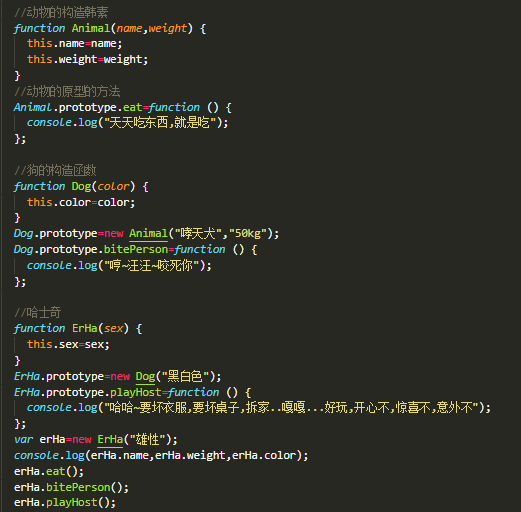
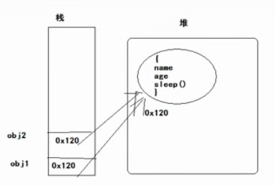

## 实例对象和原型对象属性重名问题；

   //实例对象访问这个属性,应该先从实例对象中找,找到了就直接用，找不到就去指向的原型对象中找,找到了就使用,找不到呢?=====

​    //通过实例对象能否改变原型对象中的属性值?不能

​    //就想改变原型对象中属性的值,怎么办?直接通过原型对象.属性=值;可以改变


//因为JS是一门动态类型的语言,对象没有什么,只要点了,那么这个对象就有了这个东西,没有这个属性,只要对象.属性名字,对象就有这个属性了,但是,该属性没有赋值,所以,结果是:undefined

要和变量区别，变量会报错；console.log(abc)

## 一个很神奇的原型链：

//原型链:实例对象和原型对象之间的关系,通过__proto__来联系；

//divObj.\__proto\__---->

HTMLDivElement.prototype的\__proto\__--->

HTMLElement.prototype的\__proto\__---->

Element.prototype的\__proto\__---->

Node.prototype的\__proto\__---->

EventTarget.prototype的\__proto\__---->

Object.prototype没有\__proto__\,所以,Object.prototype中的_\_proto__是null


## 通过原型链实现继承：

​	面向对象编程思想:根据需求,分析对象,找到对象有什么特征和行为,通过代码的方式来实现需求,要想实现这个需求,就要创建对象,要想创建对象,就应该显示有构造函数,然后通过构造函数来创建对象.,通过对象调用属性和方法来实现相应的功能及需求,即可

​	首先JS不是一门面向对象的语言,JS是一门基于对象的语言,那么为什么学习js还要学习面向对象,因为面向对象的思想适合于人的想法,编程起来会更加的方便,及后期的维护....

​	面向对象的编程语言中有类(class)的概念(也是一种特殊的数据类型),但是JS不是面向对象的语言,所以,JS中没有类(class),但是JS可以模拟面向对象的思想编程,JS中会通过构造函数来模拟类的概念(class)

​    

  小明,小红，小丽，小白，小花 都是人

​    共同的特征和行为

​     特征--->属性

​     行为---方法

​    

###      **面向对象的特性:封装,继承,多态**

​    原型作用之一:数据共享,节省内存空间

​    原型作用之二:为了实现继承


 1 封装:就是包装

​    \* 一个值存储在一个变量中--封装

​    \* 一坨重复代码放在一个函数中--封装

​    \* 一系列的属性放在一个对象中--封装

​    \* 一些功能类似的函数(方法)放在一个对象中--封装

​    \* 好多相类似的对象放在一个js文件中---封装


2 继承: 首先继承是一种关系,类(class)与类之间的关系,JS中没有类,但是可以通过构造函数模拟类,然后通过原型来实现继承

继承也是为了数据共享,js中的继承也是为了实现数据共享

继承是一种关系:父类级别与类级别的关系

3 多态:一个对象有不同的行为,或者是同一个行为针对不同的对象,产生不同的结果,要想有多态,就要先有继承,js中可以模拟多态,但是不会去使用,也不会模拟,


## 继承案例：

​    //动物有名字,有体重,有吃东西的行为

​    //小狗有名字,有体重,有毛色, 有吃东西的行为,还有咬人的行为

​    //哈士奇名字,有体重,有毛色,性别, 有吃东西的行为,还有咬人的行为,逗主人开心的行为





## 原型链：


## 借用构造函数继承：call方法

为了数据共享,改变原型指向,做到了继承---通过改变原型指向实现的继承

​	缺陷:因为改变原型指向的同时实现继承,直接初始化了属性，继承过来的属性的值都是一样的了,所以,这就是问题

​	只能重新调用对象的属性进行重新赋值,


解决方案:继承的时候,不用改变原型的指向,直接调用父级的构造函数的方式来为属性赋值就可以了------借用构造函数:把要继承的父级的构造函数拿过来,使用一下就可以了

 **借用构造函数:构造函数名字.call(当前对象,属性,属性,属性....);**

解决了属性继承,并且值不重复的问题

**缺陷:父级类别中的方法不能继承**

```js
   function Person(name, age, sex, weight) {
      this.name = name;
      this.age = age;
      this.sex = sex;
      this.weight = weight;
    }
    Person.prototype.sayHi = function () {
      console.log("您好");
    };
    function Student(name,age,sex,weight,score) {
      //借用Preson的构造函数
      Person.call(this,name,age,sex,weight);==============
          
      this.score = score;
    }
    var stu1 = new Student("小明",10,"男","10kg","100");
    console.log(stu1.name, stu1.age, stu1.sex, stu1.weight, stu1.score);

    var stu2 = new Student("小红",20,"女","20kg","120");
    console.log(stu2.name, stu2.age, stu2.sex, stu2.weight, stu2.score);

    var stu3 = new Student("小丽",30,"妖","30kg","130");
    console.log(stu3.name, stu3.age, stu3.sex, stu3.weight, stu3.score);

```


## 组合继承：

 //原型实现继承

​    //借用构造函数实现继承

​    //组合继承:原型继承+借用构造函数继承


```js
	function Person(name,age,sex) {
      this.name=name;
      this.age=age;
      this.sex=sex;
    }

	Person.prototype.sayHi=function () {
      console.log("阿涅哈斯诶呦");
    };
	function Student(name,age,sex,score) {
      //借用构造函数:属性值重复的问题
      Person.call(this,name,age,sex);
      this.score=score;
    }
    //改变原型指向----继承
    Student.prototype=new Person();//不传值
    Student.prototype.eat=function () {
      console.log("吃东西");
    };

    var stu=new Student("小黑",20,"男","100分");
    console.log(stu.name,stu.age,stu.sex,stu.score);
    stu.sayHi();
    stu.eat();
    var stu2=new Student("小黑黑",200,"男人","1010分");
    console.log(stu2.name,stu2.age,stu2.sex,stu2.score);
    stu2.sayHi();
    stu2.eat();

    //属性和方法都被继承了
```


 

## 拷贝继承：

拷贝继承；把一个对象中的属性或者方法直接复制到另一个对象中

1

```js
   var obj1={
     name:"小糊涂",
     age:20,
     sleep:function () {
      console.log("睡觉了");
     }
   };

   //改变了地址的指向
   var obj2=obj1;
   console.log(obj2.name,obj2.age);
   obj2.sleep();

```



 

2

```js
   var obj1={
     name:"小糊涂",
     age:20,
     sleep:function () {
       console.log("睡觉了");
     }
   };


   var obj2={};
   for(var key in obj1){
     obj2[key]=obj1[key];
   }
   console.log(obj2.name);

```

3

```js
 function Person() {
    }
    Person.prototype.age=10;
    Person.prototype.sex="男";
    Person.prototype.height=100;
    Person.prototype.play=function () {
      console.log("玩的好开心");
    };
    var obj2={};
    //Person的构造中有原型prototype,prototype就是一个对象,那么里面,age,sex,height,play都是该对象中的属性或者方法

    for(var key in Person.prototype){
      obj2[key]=Person.prototype[key];
    }
    console.dir(obj2);
    obj2.play();
```


## 总结继承

  //面向对象特性:封装,继承,多态

​    //继承,类与类之间的关系,面向对象的语言的继承是为了多态服务的,

​    //js不是面向对象的语言,但是可以模拟面向对象.模拟继承.为了节省内存空间

​    //继承: 

​    \* 原型作用: 数据共享 ，目的是:为了节省内存空间,

​    \* 原型作用: 继承  目的是:为了节省内存空间

​    *

​    \* **原型继承**:改变原型的指向

​    \* **借用构造函数继承**:主要解决属性的问题

​    \* **组合继承**:原型继承+借用构造函数继承

​    \* 既能解决属性问题,又能解决方法问题

**拷贝继承**就是把对象中需要共享的属性或者犯法,直接遍历的方式复制到另一个对象中


## 逆推继承看原型：

看代码有没有继承，如果有继承看有没有原型，原型指向到哪

```js
  function F1(age) {
      this.age = age;
    }
    function F2(age) {
      this.age = age;
    }
    F2.prototype = new F1(10);
    function F3(age) {
      this.age = age;
    }
    F3.prototype = new F2(20);

    var f3 = new F3(30);
    console.log(f3.age);//
```

30


## 函数的角色，及函数声明和函数表达式的区别：


   //函数的角色:

​    //函数的声明

​    *function* f1() {

​      *console*.log("我是函数");

​    }

​    f1();  调用

​    //函数表达式

​    *var* ff=*function* () {

​      *console*.log("我也是一个函数");

​    };

​    ff();  调用


​    //函数声明

```js
//

//    if(true){

//      function f1() {

//        console.log("哈哈,我又变帅了");

//      }

//    }else{

//      function f1() {

//        console.log("小苏好猥琐");

//      }

//    }

//    f1();

```


​    //函数表达式

   ```js
var ff;

    if(true){

      ff=function () {

        console.log("哈哈,我又变帅了");

      };

    }else{

      ff=function () {

        console.log("小苏好猥琐");

      };

    }

    ff();

   ```


​    //函数声明如果放在if-else的语句中,**在IE8的浏览器中会出现问题**

​    //以后宁愿用函数表达式,都不用函数声明


## 函数中的this和严格模式


###  函数中的this的指向

​     \* 普通函数中的this是谁?-----window

 //BOM:中顶级对象是window,浏览器中所有的东西都是window的

​     \* 对象.方法中的this是谁?----当前的实例对象

​     \* 定时器方法中的this是谁?----window

​     \* 构造函数中的this是谁?-----实例对象

​     \* 原型对象方法中的this是谁?---实例对象

```js
    普通函数
       function f1() {
         console.log(this);
       }
      f1();

    定时器中的this
       setInterval(function () {
         console.log(this);
       },1000);

    构造函数
       function Person() {
         console.log(this);
    对象的方法
         this.sayHi=function () {
           console.log(this);
         };
       }
    原型中的方法
       Person.prototype.eat=function () {
         console.log(this);
       };
       var per=new Person();
       console.log(per);
       per.sayHi();
       per.eat();

```

###     严格模式:

//    "use strict";//严格模式

//    function f1() {

//      console.log(this);//window

//    }

//    f1();

## 函数的不同调用方式：

普通函数   直接调用

构造函数  new的方式调用

对象方法：对象.方法


```js
  //普通函数
    function f1() {
      console.log("文能提笔控萝莉");
    }
    f1();

    //构造函数---通过new 来调用,创建对象
    function F1() {
      console.log("我是构造函数,我骄傲");
    }
    var f=new F1();

    //对象的方法
    function Person() {
      this.play=function () {
        console.log("玩代码");
      };
    }
    var per=new Person();
    per.play();
```


## 函数也是对象；

函数是对象,对象不一定是函数

//对象中有__proto__原型,是对象

 //函数中有prototype原型,是对象

```js
   function F1() {
   }

   console.dir(F1);

   console.dir(Math);//中有__proto__,但是没有prorotype

   //对象中有__proto__,函数中应该有prototype

   如果一个东西里面有prototype，又有__proto__,说明是函数,也是对象
```


```js

   function F1(name) {
     this.name=name;
   }

   console.dir(F1);

    所有的函数实际上都是Function的构造函数创建出来的实例对象
   var f1=new Function("num1","num2","return num1+num2");
   console.log(f1(10,20));
   console.log(f1.__proto__==Function.prototype);

    所以,函数实际上也是对象

   console.dir(f1);
```


## 数组中的函数调用；


数组可以存储任何类型的数据，函数也是数据类型

```js

    var arr=[
        function () {
          console.log("十一假期快乐");
        },
        function () {
          console.log("十一假期开心");
        }
        ,
        function () {
          console.log("十一假期健康");
        }
        ,
        function () {
          console.log("十一假期安全");
        },
        function () {
          console.log("十一假期如意");
        }
    ];
    //回调函数:函数作为参数使用
    arr.forEach(function (ele) {
      ele();
    });

```

# ===============================

## 复习：


## 课程介绍：


   \* apply和call方法的使用

​    \* bind方法的使用---------这三个方法是重点

​    \* 函数中的几个成员的介绍----了解

​    \* 高阶函数(函数作为参数,函数作为返回值)

​    \* 函数作为参数使用的例子

​    \* 函数作为返回值使用的例子

​    \* 作用域,作用域链,预解析

​    \* 闭包--------重点,作用,优点,缺点

​    \* 闭包的案例---重点

​    \* 沙箱---概念,作用,以后该怎么办

​    \* 递归---重点,难,难在应用,为了遍历

## 


## apply和call方法的使用：

f1.apply(this);this调用这个f1函数，或方法

作用:可以改变this的指向

```js
   function f1(x,y) {
     console.log("结果是:"+(x+y)+this);
     return "10000";
   }
   f1(10,20);//函数的调用


    console.log("========");
    此时的f1实际上是当成对象来使用的,对象可以调用方法
    apply和call方法也是函数的调用的方式
       f1.apply();
    f1.call();
    console.log("==========");
    f1.apply(null);
    f1.call(null);

    apply和call方法中如果没有传入参数,或者是传入的是null,那么调用该方法的函数对象中的this就是默认的window

    f1.apply(null,[100,200]);
    f1.call(null,100,200);

    apply和call都可以让函数或者方法来调用,传入参数和函数自己调用的写法不一样,但是效果是一样的

   var result1=f1.apply(null,[10,20]);
   var result2=f1.call(null,10,20);
   console.log(result1);
   console.log(result2);


    
```


```js
   function f1(x,y) {
     console.log("这个函数是window对象的一个方法:"+(x+y)+this.sex);
   }
   window.f1(10,20);
   //obj是一个对象
   var obj={
     age:10,
     sex:"男"
   };

   window.f1.apply(obj,[10,20]);
   window.f1.call(obj,10,20);
   console.dir(obj);


    apply和call可以改变this的指向
```


```js
 function Person(age,sex) {
      this.age=age;
      this.sex=sex;
    }
    //通过原型添加方法
    Person.prototype.sayHi=function (x,y) {
      console.log("您好啊:"+this.sex);
      return 1000;
    };
    var per=new Person(10,"男");
    per.sayHi();

    console.log("==============");
 
    function Student(name,sex) {
      this.name=name;
      this.sex=sex;
    }
    var stu=new Student("小明","人妖");
    var r1=per.sayHi.apply(stu,[10,20]);
    var r2=per.sayHi.call(stu,10,20);

    console.log(r1);
    console.log(r2);
```


```js
apply和call都可以改变this的指向
    函数的调用,改变this的指向
       function f1(x,y) {
         console.log((x+y)+":===>"+this);
         return "这是函数的返回值";
       }
       //apply和call调用
       var r1=f1.apply(null,[1,2]);//此时f1中的this是window
       console.log(r1);
       var r2=f1.call(null,1,2);//此时f1中的this是window
       console.log(r2);
       console.log("=============>");
       //改变this的指向
       var obj={
         sex:"男"
       };
       //本来f1函数是window对象的,但是传入obj之后,f1函数此时就是obj对象的
       var r3=f1.apply(obj,[1,2]);//此时f1中的this是obj
       console.log(r3);
       var r4=f1.call(obj,1,2);//此时f1中的this是obj
       console.log(r4);

```


```js

    //方法改变this的指向

   function Person(age) {
     this.age = age;
   }
   Person.prototype.sayHi = function (x, y) {
     console.log((x + y) + ":====>" + this.age);//是实例对象
   };

   function Student(age) {
     this.age = age;
   }
   var per = new Person(10);//实例对象
   var stu = new Student(100);//实例对象
   //sayHi方法是per实例对象的
   per.sayHi.apply(stu, [10, 20]);  
   per.sayHi.call(stu, 10, 20);

  //apply和call的使用方法
    /*
    * apply的使用语法
    * 函数名字.apply(对象,[参数1,参数2,...]);
    * 方法名字.apply(对象,[参数1,参数2,...]);
    * call的使用语法
    * 函数名字.call(对象,参数1,参数2,...);
    * 方法名字.call(对象,参数1,参数2,...);
    *
    * 作用:改变this的指向
    * 不同的地方:参数传递的方式是不一样的
    *
    * 只要是想使用别的对象的方法,并且希望这个方法是当前对象的,那么就可以使用apply或者是call的方法改变this的指向
    *
    * */
```


## apply和call的方法是谁的


```js
function f1() {
      console.log(this+":====>调用了");
    }
    //f1是函数,f1也是对象
    console.dir(f1);
    //对象调用方法,说明,该对象中有这个方法
    f1.apply();
    f1.call();
    console.log(f1.__proto__==Function.prototype);

    //所有的函数都是Function的实例对象

	console.log(Function.prototype);//ƒ () { [native code] }
    console.dir(Function);
    //apply和call方法实际上并不在函数这个实例对象中,而是在Function的prototype中
```

```js
   function Person() {
      this.sayHi=function () {
        console.log("您好");
      };
    }
    Person.prototype.eat=function () {
      console.log("吃");
    };

    var per=new Person();
    per.sayHi();
    per.eat();
    console.dir(per);
    //实例对象调用方法,方法要么在实例对象中存在,要么在原型对象中存在
```


## bind方法

```js
function f1(x, y) {
      console.log((x + y) + ":=====>" + this.age);
    }


    //复制了一份的时候,把参数传入到了f1函数中,x===>10,y===>20,null就是this,默认就是window
    //bind方法是复制的意思,参数可以在复制的时候传进去,也可以在复制之后调用的时候传入进去
    //apply和call是调用的时候改变this指向
    //bind方法,是赋值一份的时候,改变了this的指向
```

```js
       //var ff=f1.bind(null);
       //ff(10,20);


   function Person() {
     this.age = 1000;
   }
   Person.prototype.eat = function () {
     console.log("这个是吃");
   };
   var per = new Person();

   var ff = f1.bind(per, 10, 20);
   ff();
```


```js
   function Person(age) {
      this.age=age;
    }
    Person.prototype.play=function () {
      console.log(this+"====>"+this.age);
    };

    function Student(age) {
      this.age=age;
    }
    var per=new Person(10);
    var stu=new Student(20);
    //复制了一份
    var ff=per.play.bind(stu);
    ff();
    //bind是用来复制一份
    //使用的语法:
    /*
    * 函数名字.bind(对象,参数1,参数2,...);---->返回值是复制之后的这个函数
    * 方法名字.bind(对象,参数1,参数2,...);---->返回值是复制之后的这个方法
    *
    * */
```


## bind的使用：

```js
  //通过对象,调用方法,产生随机数

    function ShowRandom() {
      //1-10的随机数
      this.number=parseInt(Math.random()*10+1);
    }
    //添加原型方法
    ShowRandom.prototype.show1=function () {
      //改变了定时器中的this的指向了,本来应该是window,现在是实例对象了
      window.setInterval(this.show2.bind(this),1000);
    };
    //添加原型方法
    ShowRandom.prototype.show2=function () {
      //显示随机数--
      console.log(this.number);
    };
    //实例对象
    var sr=new ShowRandom();
    //调用方法,输出随机数字
    //调用这个方法一次,可以不停的产生随机数字
    sr.show1();
```


## 函数的几个成员介绍：


```js
   //函数中有一个name属性----->函数的名字,name属性是只读的,不能修改
    //函数中有一个arguments属性--->实参的个数
    //函数中有一个length属性---->函数定义的时候形参的个数
    //函数中有一个caller属性---->调用(f1函数在f2函数中调用的,所以,此时调用者就是f2)
    function f1(x,y) {
      console.log(f1.name);
      console.log(f1.arguments.length);
      console.log(f1.length);
      console.log(f1.caller);//调用者
    }
//    f1.name="f5";
//    f1(10,20,30,40);
//    console.dir(f1);


    function f2() {
      console.log("f2函数的代码");
      f1(1,2);
    }
    f2();
```

## 函数作为参数：f1(f2)

```js

   function f1(fn) {
     console.log("f1的函数");
     fn();//此时fn当成是一个函数来使用的
   }
   //fn是参数,最后作为函数使用了,函数是可以作为参数使用
   //传入匿名函数
   f1(function () {
     console.log("我是匿名函数");
   });
   //命名函数
   function f2() {
     console.log("f2的函数");
   }
   f1(f2);
   //函数作为参数的时候,如果是命名函数,那么只传入命名函数的名字,没有括号

```


## 定时器传入参数

```js
 function f1(fn) {
     setInterval(function () {
       console.log("定时器开始");
       fn();
       console.log("定时器结束");
     },1000);
   }

   f1(function () {
     console.log("好困啊,好累啊,就是想睡觉");
   });
```


## 函数作为返回值使用

```js
    function f1() {
         console.log("f1函数开始");
         return function () {
           console.log("我是函数,但是此时是作为返回值使用的");
         }
    
       }
    
       var ff=f1();
       ff();

```

### 获取某个对象的类型


```js
     var num=10;
       console.log(typeof num);//获取num这个变量的数据类型
       var obj={};//对象
       //判断这个对象是不是某个类型的
       console.log(obj instanceof Object);
       //获取某个对象的数据类型的样子
       //Object.prototype.toString.call(对象);//此时得到的就是这个对象的类型的样子
       //此时输出的是Object的数据类型   [object Object]
       console.log(Object.prototype.toString());
       //输出的数组的数据类型      [object Array]
       console.log(Object.prototype.toString.call([]));
    
       var arr=[10,20,30];
       console.log(Object.prototype.toString.call(arr));
    
```


```js
    //获取某个对象的类型是不是你传入的类型
    //[10,20,30] 是不是"[object Array]"
    //type---是变量----是参数----"[object Array]"
    //obj---是变量-----是参数----[10,20,30];

    //判断这个对象和传入的类型是不是同一个类型
    function getFunc(type) {
      return function (obj) {
        return Object.prototype.toString.call(obj) === type;
      }
    }

    var ff = getFunc("[object Array]");
    var result = ff([10, 20, 30]);
    console.log(result);

    var ff1 = getFunc("[object Object]");
    var dt = new Date();
    var result1 = ff1(dt);
    console.log(result1);

```

## 函数做为参数的使用的练习；

```js
 //    var arr = [1, 100, 20, 200, 40, 50, 120, 10];
    //    //排序
    //    arr.sort();
    //    console.log(arr);

    var arr = [1, 100, 20, 200, 40, 50, 120, 10];
    //排序---函数作为参数使用,匿名函数作为sort方法的参数使用,那么此时的匿名函数中有两个参数,
    arr.sort(function (obj1,obj2) {
      if(obj1>obj2){
        return -1;
      }else if(obj1==obj2){
        return 0;
      }else{
        return 1;
      }
    });
    console.log(arr);

    var arr1=["acdef","abcd","bcedf","bced"];
    arr1.sort(function (a,b) {
      if(a>b){
        return 1;
      }else if(a==b){
        return 0;
      }else{
        return -1;
      }
    });
    console.log(arr1);
```

## ***函数作为返回值的练习：


```js
//排序,每个文件都有名字，大小,时间,都可以按照某个属性的值进行排序

    //三部电影,电影有名字,大小,上映时间
    function File(name, size, time) {
      this.name = name;//电影名字
      this.size = size;//电影大小
      this.time = time;//电影的上映时间
    }
    var f1 = new File("jack.avi", "400M", "1997-12-12");
    var f2 = new File("tom.avi", "200M", "2017-12-12");
    var f3 = new File("xiaosu.avi", "800M", "2010-12-12");
    var arr = [f1, f2, f3];

    function fn(attr) {
      //函数作为返回值
      return function getSort(obj1, obj2) {
        if (obj1[attr] > obj2[attr]) {
          return 1;
        } else if (obj1[attr] == obj2[attr]) {
          return 0;
        } else {
          return -1;
        }
      }
    }

    var ff = fn("name");

    //函数作为参数
    arr.sort(ff);
    for (var i = 0; i < arr.length; i++) {
      console.log(arr[i].name + "====>" + arr[i].size + "===>" + arr[i].time);
    }

```


## 作用域和作用域链和预解析：

//变量---->局部变量和全局变量,

​    //作用域:就是变量的使用范围

​    //局部作用域和全局作用域

​    //js中没有块级作用域---一对括号中定义的变量,这个变量可以在大括号外面使用

​    //函数中定义的变量是局部变量

```js
   while(true){
     var num=10;
     break;
   }
   console.log(num);

   {
     var num2=100;
   }
   console.log(num2);

   if(true){
     var num3=1000;
   }
   console.log(num3);

   function f1() {
     //局部变量
     var num=10;
   }
   console.log(num);

```


```js
    作用域链:变量的使用,从里向外,层层的搜索,搜索到了就可以直接使用了
    层层搜索,搜索到0级作用域的时候,如果还是没有找到这个变量,结果就是报错
   var num=10; //作用域链 级别:0
   var num2=20;
   var str = "abc"
   function f1() {
     var num2=20;
     function f2() {
       var num3=30;
       console.log(num);
     }
     f2();
   }
   f1();
```


```js
 //预解析:就是在浏览器解析代码之前,把变量的声明和函数的声明提前(提升)到该作用域的最上面

    //变量的提升
    console.log(num);
    var num=100;

    //函数的声明被提前了
    f1();
    function f1() {
      console.log("这个函数,执行了");
    }

    var f2;
    f2=function () {
      console.log("小杨好帅哦");
    };
    f2();
正常

 	f2（）;
    var f2=function () {
      console.log("小杨好帅哦");
    };
报错
 
```


## 闭包：

  //闭包

​    \* 闭包的概念:函数A中,有一个函数B,函数B中可以访问函数A中定义的变量或者是数据,此时形成了闭包(这句话暂时不严谨)

​    \* 闭包的模式:函数模式的闭包,对象模式的闭包

​    \* 闭包的作用:缓存数据,延长作用域链

​    \* 闭包的优点和缺点:缓存数据

​    \* 闭包的应用

```js

    //函数模式的闭包:在一个函数中有一个函数
   function f1() {
     var num=10;
     //函数的声明
     function f2() {
       console.log(num);
     }
     //函数调用
     f2();
   }
   f1();
```


```js
   //对象模式的闭包:函数中有一个对象

   function f3() {
     var num=10;
     var obj={
       age:num
     };
     console.log(obj.age);//10
   }
   f3();

```


```js
   function f1() {
     var num=10;
     return function () {
       console.log(num);
       return num;
     }
   }

  var ff= f1();
  var result= ff();
   console.log(result);


   function f2() {
     var num=100;
     return {
       age:num
     }
   }

  var obj= f2();
   console.log(obj.age);

```


闭包小案例：

```js
    //普通的函数
    function f1() {
      var num = 10;
      num++;
      return num;
    }
    console.log(f1());11
    console.log(f1());11
    console.log(f1());11

    //函数模式的闭包
    function f2() {
      var num = 10;
      return function () {
        num++;
        return num;
      }
    }
    var ff = f2();
    console.log(ff());//11
    console.log(ff());//12
    console.log(ff());//13
```


## 闭包案例：产生相同的随机数

```js
   function showRandom() {
      var num=parseInt(Math.random()*10+1);
      console.log(num);
    }

    showRandom();
    showRandom();
    showRandom();

    //闭包的方式,产生三个随机数,但是都是相同的

    function f1() {
      var num=parseInt(Math.random()*10+1);
      return function () {
        console.log(num);
      }
    }

    var ff=f1();

    ff();
    ff();
    ff();

    //总结:如果想要缓存数据,就把这个数据放在外层的函数和里层的函数的中间位置

    //闭包的作用:缓存数据.优点也是缺陷,没有及时的释放

    //局部变量是在函数中,函数使用结束后,局部变量就会被自动的释放
    //闭包后,里面的局部变量的使用作用域链就会被延长

```

## 闭包案例：实现点赞

```js
<body>
<ul>
  <li><br/><input type="button" value="赞(1)"></li>
  <li><br/><input type="button" value="赞(1)"></li>
  <li><br/><input type="button" value="赞(1)"></li>
  <li><br/><input type="button" value="赞(1)"></li>
</ul>
<script>

  //获取所有的按钮
  //根据标签名字获取元素
  function my$(tagName) {
    return document.getElementsByTagName(tagName);
  }
  //闭包缓存数据
  function getValue() {
    var value=2;
    return function () {
      //每一次点击的时候,都应该改变当前点击按钮的value值
      this.value="赞("+(value++)+")";
    }
  }
  //获取所有的按钮
  var btnObjs=my$("input");
  //循环遍历每个按钮,注册点击事件
  for(var i=0;i<btnObjs.length;i++){
    //注册事件
    btnObjs[i].onclick=getValue();
  }


//  var btnObjs=my$("input");
//  var value=1;
//  //循环遍历每个按钮
//  for(var i=0;i<btnObjs.length;i++){
//
//    //为每个按钮注册点击事件
//    btnObjs[i].onclick=function () {
//      console.log("哈哈");
//      this.value="赞("+(value++)+")";
//    };
//  }
```


## 沙箱：

沙箱:环境,黑盒,在一个虚拟的环境中模拟真实世界,做实验,实验结果和真实世界的结果是一样,但是不会影响真实世界

```js
   var num=10;
   console.log(num+10);

   //沙箱---小环境
   (function () {
     var num=10;
     console.log(num);
   })();

   //沙箱---小环境
   (function () {
     var num=20;
     console.log(num+10);
   }());

   var num=100;
   (function () {
     var num=10;
     console.log(num);//10
   }());


   console.log(num);//100
```

小案例：

```js
    (function () {
      var str="小白喜欢小黑";
      str=str.substr(2);
      console.log(str);
    }());


    //沙箱
    (function () {
      var str="小明喜欢小红";
      str=str.substr(2);
      console.log(str);
    }());


  </script>
</head>
<body>
<input type="button" value="按钮" id="btn"/>
<script>
  //点击按钮,弹出对话框
  (function () {
    document.getElementById("btn").onclick=function () {
      console.log("按钮被点击了");
    };
  }());
```

```js
 var getTag = 10;
  var dvObjs = 20;
  var pObjs = 30;
  (function () {
    //根据标签名字获取元素
    function getTag(tagName) {
      return document.getElementsByTagName(tagName)
    }
    //获取所有的div
    var dvObjs = getTag("div");
    for (var i = 0; i < dvObjs.length; i++) {
      dvObjs[i].style.border = "2px solid pink";
    }
    //获取所有的p
    var pObjs = getTag("p");
    for (var i = 0; i < pObjs.length; i++) {
      pObjs[i].style.border = "2px solid pink";
    }
  }());
  console.log(getTag);
  console.log(dvObjs);
  console.log(pObjs);
```

避免重名；


## 递归：

```js
 //递归:函数中调用函数自己,此时就是递归,递归一定要有结束的条件
    //

    var i = 0;
    function f1() {
      i++;
      if (i < 5) {
        f1();
      }
      console.log("从前有个山,山里有个庙,庙里有个和尚给小和尚讲故事:");

    }

    f1();
```

递归案例求n个数字的和：

```js
  //求n个数字的和,5 计算1+2+3+4+5
   var sum=0;
   for(var i=1;i<=5;i++){
     sum+=i;
   }
   console.log(sum);

```

```js

    //递归实现:求n个数字的和   n=5--->  5+4+3+2+1

    //函数的声明
   function getSum(x) {
     if(x==1){
       return 1;
     }
     return x+getSum(x-1);
   }
   //函数的调用
   console.log(getSum(5));
```


递归案例代码的分析：

```js
 /*
    *
    * 执行过程:
    * 代码执行getSum(5)--->进入函数,此时的x是5,执行的是5+getSum(4),此时代码等待
    * 此时5+getSum(4),代码先不进行计算,先执行getSum(4),进入函数,执行的是4+getSum(3),等待, 先执行的是getSum(3),进入函数,执行3+getSum(2),等待,先执行getSum(2),进入函数,执行 2+getSum(1);等待, 先执行getSum(1),执行的是x==1的判断,return 1,所以,
    * 此时getSum(1)的结果是1,开始向外走出去
    * 2+getSum(1) 此时的结果是:2+1
    * 执行:
    * getSum(2)---->2+1
    * 3+getSum(2) 此时的结果是3+2+1
    * 4+getSum(3) 此时的结果是4+3+2+1
    * 5+getSum(4) 此时的结果是5+4+3+2+1
    *
    * 结果:15
    *
    *
    *
    * */
```

### 案例：求斐波那契数列

```js
  //递归案例:求一个数字各个位数上的数字的和:  123   --->6 ---1+2+3
    //523
    function getEverySum(x) {
      if(x<10){
        return x;
      }
      //获取的是这个数字的个位数
      return x%10+getEverySum(parseInt(x/10));
    }
   console.log(getEverySum(1364));//5


    //递归案例:求斐波那契数列

    function getFib(x) {
      if(x==1||x==2){
        return 1
      }
      return getFib(x-1)+getFib(x-2);
    }
    console.log(getFib(12));
```

