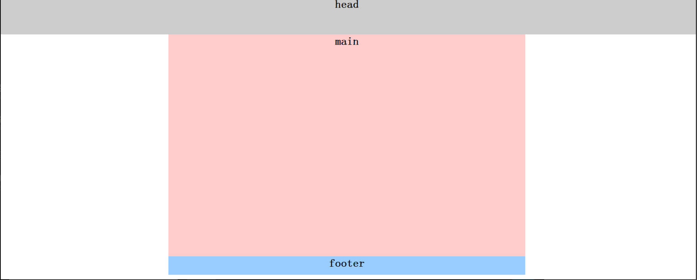
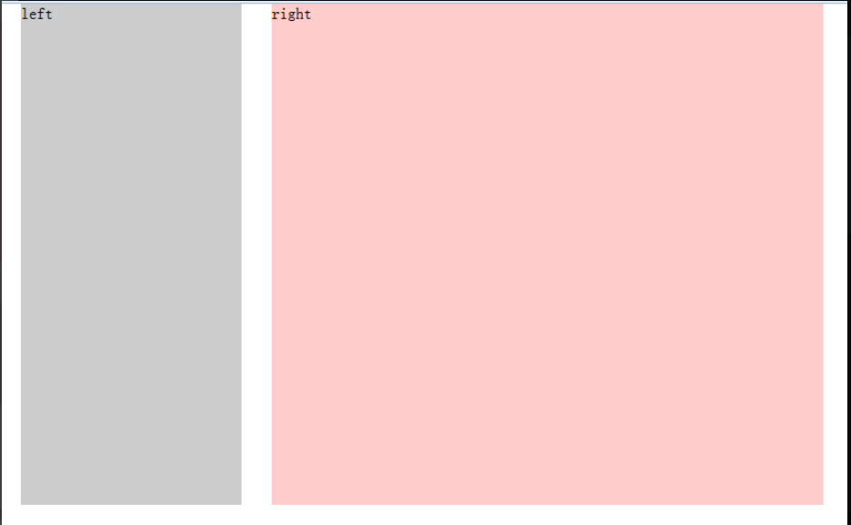
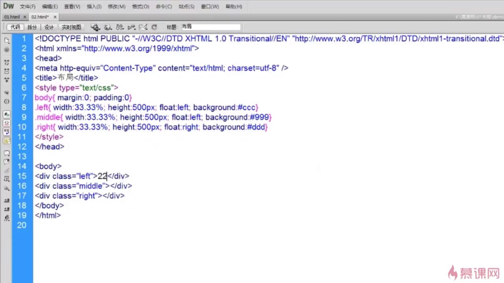
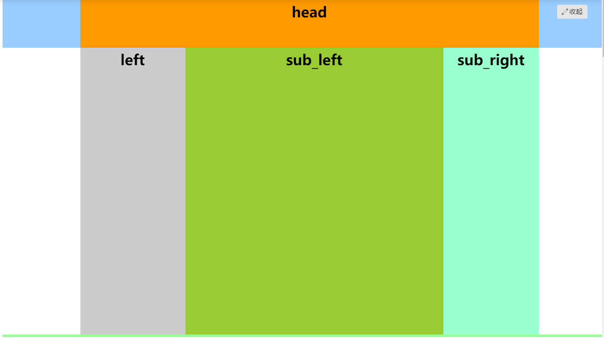

#### 简介：

什么是布局：


#### 一列布局：

百度



```javascript
<style type="text/css">
body{ margin:0; padding:0; font-size:30px}
div{ text-align:center; font-weight:bold}
.main,.footer{ width:960px; }
.head{ width:100%; height:100px; background:#ccc}
.main{ height:600px; background:#FCC;margin:0 auto;}
.footer{ height:50px; background:#9CF;margin:0 auto;}
</style>
</head>

<body>
<div class="head">head</div>
<div class="main">main</div>
<div class="footer">footer</div>
</body>
```


#### 固定宽度的两列布局：



```javascript
<style type="text/css">
body{ margin:0; padding:0; font-size:30px; font-weight:bold}
div{ text-align:center; line-height:50px}
.main{ width:960px; height:600px; margin:0 auto}
.left{ width:300px; height:600px; background:#ccc; float:left;}/*左浮动样式*/
.right{ width:660px; height:600px; background:#fcc;float:right; }/*右浮动样式*/
</style>
</head>

<body>
<div class="main">
    <div class="left">left</div>
    <div class="right">right</div>
```


#### 三列布局

例1：



例2：

```javascript
body{ margin:0; padding:0; font-size:30px; font-weight:bold}
div{ line-height:50px}
.left{ width:200px; height:600px; background:#ccc; position:absolute; left:0; top:0}
.main{ height:600px;  background:#9CF;margin-left:210px;margin-right:310px;}
.right{ height:600px; width:300px; position:absolute; right:0;top:0; position:absolute; background:#FCC;}
</style>
</head>

<body>
    
    <div class="left">left</div>
    <div class="main">设计首页的第一步是设计版面布局。就象传统的报刊杂志编辑一样，我们将网页看作一张报纸，一本杂志来进行排版布局。 虽然动态网页技术的发展使得我们开始趋向于学习场景编剧，但是固定的网页版面设计基础依然是必须学习和掌握的。它们的基本原理是共通的，你可以领会要点，举一反三。</div>
    <div class="right">right</div>
```


混合布局：




```javascript
<style>
body{ margin:0; padding:0; font-size:30px; font-weight:bold}
div{ text-align:center; line-height:50px}
.top{ height:100px;background:#9CF}
.head,.main{ width:960px;}
.head{ height:100px; background:#F90;margin:0 auto;}
.main{margin:0 auto;}
.left{ width:220px; height:600px; background:#ccc; float:left;}
.right{ width:740px; height:600px;background:#FCC; float:right}
.r_sub_left{ width:540px; height:600px; background:#9C3; float:left}
.r_sub_right{ width:200px; height:600px; background:#9FC; float:right;}
.footer{ height:50px; background:#9F9;clear:both;}
</style>
</head>

<body>
<div class="top">
    <div class="head">head</div>
</div>
<div class="main">
    <div class="left">left</div>
    <div class="right">
    	<div class="r_sub_left">sub_left
        </div>
        <div class=" r_sub_right">sub_right
        </div>
    </div>
</div>
<div class="footer">footer</div>
```


