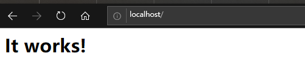
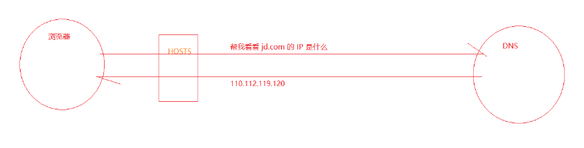
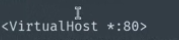

# 服务端开发基础：

## 1建立你的第一个网站

## 2如何建立一个blog网站

GUI：图形用户界面（Graphical User Interface，简称 *GUI*，又称图形用户接口）是指采用图形方式显示的计算机操作用户界面

## 3搭建web服务器

### 3.1web服务器软件

### 3.2安装web服务器软件

cmd  cd到指定文件bin httpd -k install -n 'apache'   

ps:-n,用于更改默认名字，cmd要用管理员权限

问题：

#### 打开conf/httpd.conf文件

C:\webServer\Apache24\conf

作用：配置安装apache的安装路径

更改==》

cmd：httpd -t

问题：

解决：

#### 配置主机地址

解决0.0

httpd -k start 启动apache服务

浏览器输入 :http://localhost/

### 3.3提供web服务

## 4网络基础概念

### 4.1ip地址

  

防火墙==高级==入站规则默认打开apache

### 4.2域名

### 4.3DNS

 

C:\Windows\System32\drivers\etc\hosts

hosts只能影响本机

​     

查ip  http://ip.chinaz.com/

先找浏览器缓存=》操作系统缓存=》host文件=》dns服务器

###### ps:

阿里云：添加解析

cmd：ping www.zce.date

浏览器：www.zce.date

### 4.4端口 

netstat -an

apache把80占了

https：443端口

### 4.5URL

主机/请求路径？请求的参数#锚点值

## 5请求响应流程：

## 6.配置apache

httpd.conf===listen 80  可更改8080，然后重启apache服务

##### 默认根目录：

C:\webServer\Apache24\htdocs\index.html

DocumentRoot

问题：

 

都改成=》d：/www

ps:重启：1服务

2：

##### ps：默认浏览关闭 

把Indexes 删去

多网站配置：

##### 1 C:\webServer\Apache24\conf\httpd.conf

  去掉#

##### 2 C:\webServer\Apache24\conf\extra\httpd-vhosts.conf

站长邮箱：

网站目录：

访问域名：

别名：

错误日志

普通日志

##### 3   C:\Windows\System32\drivers\etc\hosts

加127.0.0.1 wll.wll

http://wll.wll  http://www1.wll  http://www2.wll

ps:chrome dns缓存<chrome://chrome-urls/>

- [chrome://net-internals](chrome://net-internals/)  ==》dns

问题：

forbidden

如果要改 

则apache的监听也要改

## 7 静态网站和动态网站

### 7.1配置php支持

 C:\webServer\Apache24\conf\httpd.conf

加载php模块

ps：如果有空格需要双引号

重启 

问题：

添加mime type

httpd -t

其他问题;

这个主要是针对web server 而言，在windows环境下，如果你使用的web server 是apchae 或者 iis 7以下版本，则应该选择线程安全的安装文件，而如果你使用Fast-cgi模式时，可以选择非线程安全，因为 web sever 本身能保证线程安全。

当然还有二进制文件编译时所使用的编译器：vc9 (vs系列) vc6(gcc)

**windos服务器：**

 

1、如果你是**PHP+IIS**；请选择：PHP非线程安全（None Thread Safe(NTS)）；

 

2、如果你是**PHP+apache**；请选择：PHP线程安全（Thread Safe（TS））

报错：

### 7.2

判断这文件的扩展名，能否有人处理，否则==》

## 8.作业

