## 简介：

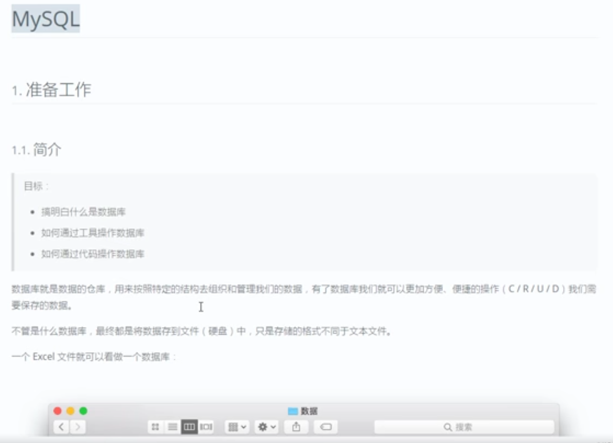

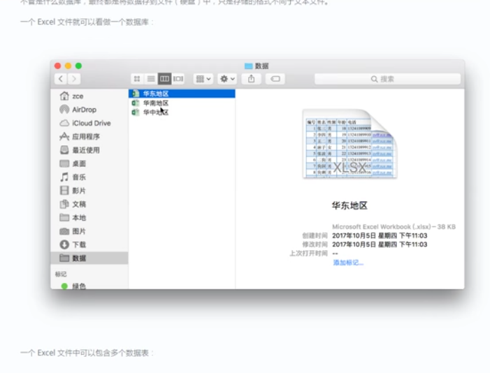


管理员cmd，

1初始化数据库    mysqld --initialize --user=mysql --console   回车


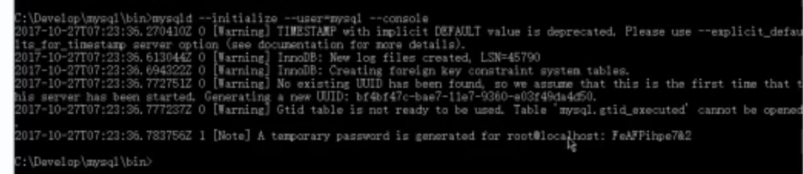

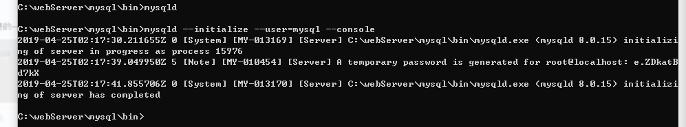


复制密码：e.ZDkatBd7kX    e.ZDkatBd7kX

2：安装SQL 服务mysqld --install MYSQL

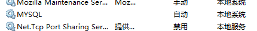

建议手动：

3，启动服务：net start MYSQL

普通cmd: cd C:\webServer\mysql\bin

4，输入密码：mysql -u root -p 回车

密码：

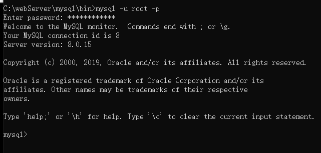


5，show databases；

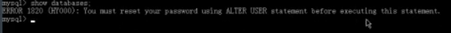


6,设置密码：

set password for root@localhost = password('123');

alter user 'root'@'localhost' identified by '123';

###### **注意加分号**


7，退出 exit；


8，卸载:

先停止服务

管理员cmd：sc delete MYSQL

删去data


报错：

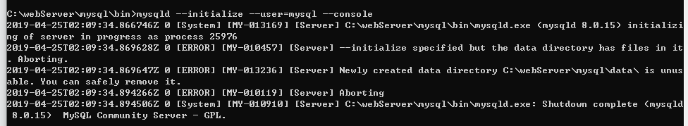

删去data


常见操作指令：

```mysql
mysql> show databases;  ‐‐ 显示全部数据库 mysql> create database <db‐name>;  ‐‐ 创建一个指定名称的数据库 

mysql> use <db‐name>;  ‐‐ 使用一个数据库，相当于进入指定的数据库 mysql> show tables;  ‐‐ 显示当前数据库中有哪些表 

mysql> create table <table-name> (id int, name varchar(20), age int);  ‐‐ 创建一个指定名称的数据 表，并添加 3 个列 

mysql> desc <table‐name>;  ‐‐ 查看指定表结构 mysql> source ./path/to/sql‐file.sql  ‐‐ 执行本地 SQL 文件中的 SQL 语句 
mysql> drop table <table‐name>;  ‐‐ 删除一个指定名称的数据表 mysql> drop database <db‐name>;  ‐‐ 删除一个指定名称的数据库 mysql> exit|quit;  ‐‐ 退出数据库终端

```


可视化工具：Navicat Premium

每个表要有id，设为主键，自动递增

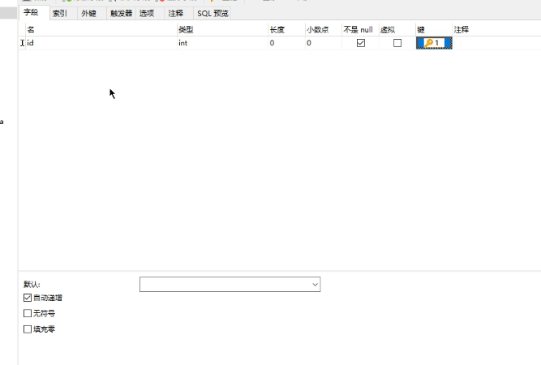

char和varchar区别：

一个是varchar可变长度，char是固定长度，自动补空格

字符集，utf8，规则：utf8_general_ci


mysql默认字符集

添加文件：my.ini

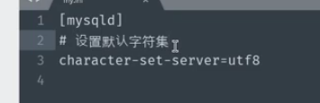


php连接数据库：


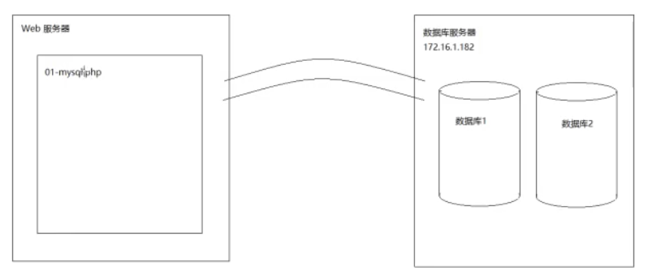


