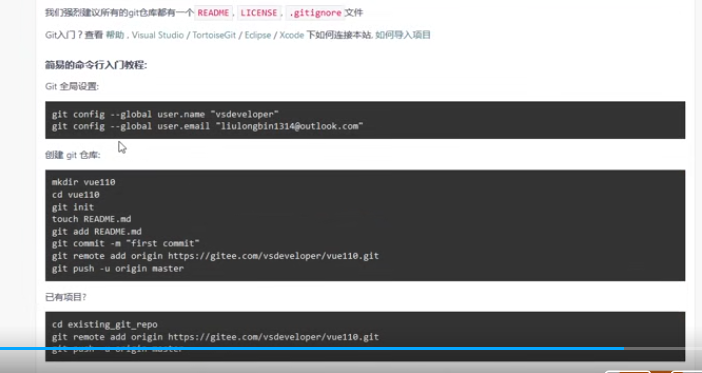

创建文件

.gitignore ，README.md  LICENSE

没有必要上传：

.idea

.vscode

.git

======git init   git status  git add .   git commit -m "init my project"   git status

码云  公钥 c/用户/***/.ssh/.pub

加号==新建项目， 下一行不要选， 不要勾，创建

复制 git全局配置  cmd 粘贴

没有项目/有项目（第三块）  项目根目录

问题：文件件名过大，

解决方法。gitignore 文件加上：node_modules/****

git常用指令：http://www.ruanyifeng.com/blog/2015/12/git-cheat-sheet.html

问题

remote: Incorrect username or password ( access token )

解决方法

在使用Git进行项目代码提交的最后一步操作的时候，出现了一个问题，这个问题的意思大概是：用户名或密码不正确（访问令牌）

git出错截图： 

我造成这种错误的原因是，由于之前重置了Git账户的密码，忘记修改计算机的凭据导致这个问题的出现。

我的解决方案是：

打开电脑的控制面板–>用户账户–>管理Windows凭据
--------------------- 
作者：明明有话说 
来源：CSDN 
原文：https://blog.csdn.net/mmyhs/article/details/81589419 
版权声明：本文为博主原创文章，转载请附上博文链接！