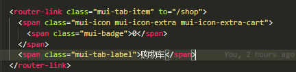
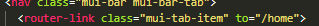

1，小图标设置

找到文件，购物车，复制样式

并导入相应的包

import '../src/lib/mui/css/icons-extra.css'

2，路由的链接和路由高亮

//导入vue-router包

import VueRouter from 'vue-router'

//手动安装router包

Vue.use(VueRouter)

//导入自己的router模块

import router from './router.js'

//挂载路由

*var* vm =new Vue({

​    el:'#app',

​    render:*c**=>*c(app),

​    **router**

})

****

var* router = new VueRouter({

​    routes: [

​    ],

​    linkActiveClass:'mui-active'

})

3，组件切换