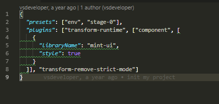
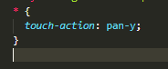
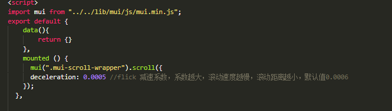

\### 制作顶部滑动条的坑们：

 \1. 需要借助于 MUI 中的 tab-top-webview-main.html 

 \2. 需要把 slider 区域的 mui-fullscreen 类去掉

 \3. 滑动条无法正常触发滑动，通过检查官方文档，发现这是JS组件，需要被初始化一下：

  \+ 导入 mui.js 

  \+ 调用官方提供的 方式 去初始化：

  \```

  mui('.mui-scroll-wrapper').scroll({

​    deceleration: 0.0005 //flick 减速系数，系数越大，滚动速度越慢，滚动距离越小，默认值0.0006

  });

  \```

 \4. 我们在初始化 滑动条 的时候，导入的 mui.js ，但是，控制台报错： `Uncaught TypeError: 'caller', 'callee', and 'arguments' properties may not be accessed on strict mode`

  \+ 经过我们合理的推测，觉得，可能是 mui.js 中用到了 'caller', 'callee', and 'arguments' 东西，但是， webpack 打包好的 bundle.js 中，默认是启用严格模式的，所以，这两者冲突了；

  \+ 解决方案： 1. 把 mui.js 中的 非严格 模式的代码改掉；但是不现实； 2. 把 webpack 打包时候的严格模式禁用掉；

  \+ 最终，我们选择了 plan B  移除严格模式： 使用这个插件 babel-plugin-transform-remove-strict-mode

 \5. 刚进入 图片分享页面的时候， 滑动条无法正常工作， 经过我们认真的分析，发现， 如果要初始化 滑动条，必须要等 DOM 元素加载完毕，所以，我们把 初始化 滑动条 的代码，搬到了 mounted 生命周期函数中；

 \6. 当 滑动条 调试OK后，发现， tabbar 无法正常工作了，这时候，我们需要把 每个 tabbar 按钮的 样式中  `mui-tab-item` 重新改一下名字；

 \7. 获取所有分类，并渲染 分类列表；


npm i babel-plugin-transform-remove-strict-mode










