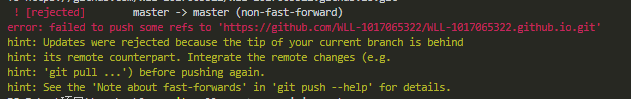
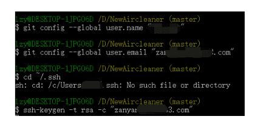
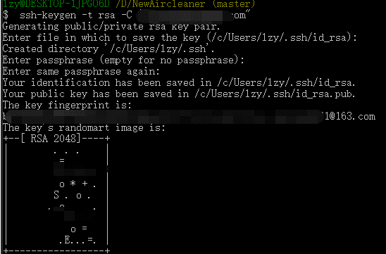
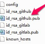
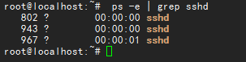
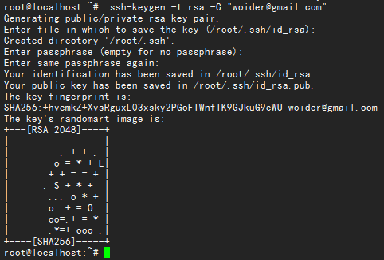
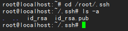
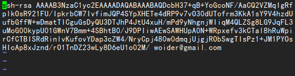
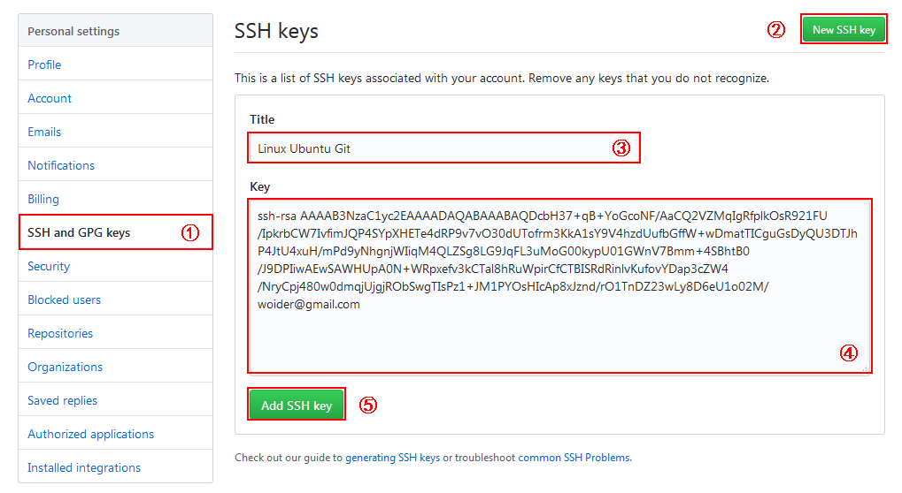

如何配置多个git，使可以同时使用不同的github库，或者类似马云的库

<https://feitianbenyue.iteye.com/blog/2376791>

基本知识：

# git config配置文件

2012年02月20日 15:48:29 [shuhuai007](https://me.csdn.net/shuhuai007) 阅读数：109090

*一.Git*已经在你的系统中了，你会做一些事情来客户化你的*Git*环境。你只需要做这些设置一次；即使你升级了，他们也会绑定到你的环境中。你也可以在任何时刻通过运行命令来重新更改这些设置。

 *Git*有一个工具被称为*git config*，它允许你获得和设置配置变量；这些变量可以控制*Git*的外观和操作的各个方面。这些变量可以被存储在三个不同的位置：

　　*1./etc/gitconfig* 文件：包含了适用于系统所有用户和所有库的值。如果你传递参数选项*’--system’* 给 *git config*，它将明确的读和写这个文件。

　　*2.~/.gitconfig* 文件 ：具体到你的用户。你可以通过传递*--global* 选项使*Git* 读或写这个特定的文件。

　　3.位于*git*目录的*config*文件 *(也就是 .git/config) ：无论你当前在用的库是什么，特定指向该单一的库。每个级别重写前一个级别的值。因此，在.git/config*中的值覆盖了在*/etc/gitconfig*中的同一个值。

　　在*Windows*系统中，*Git*在*$HOME*目录中查找*.gitconfig*文件（对大多数人来说，位于*C:\Documents and Settings$USER*下）。它也会查找*/etc/gitconfig*，尽管它是相对于*Msys* 根目录的。这可能是你在*Windows*中运行安装程序时决定安装*Git*的任何地方。

二.你的标识*(Your Identity)*

2.1　当你安装*Git*后首先要做的事情是设置你的用户名称和*e-mail*地址。这是非常重要的，因为每次*Git*提交都会使用该信息。它被永远的嵌入到了你的提交中：

　　*$ git config --global user.name "John Doe"*

　　*$ git config --global user.email johndoe@example.com*

　　重申一遍，你只需要做一次这个设置。如果你传递了 *--global* 选项，因为*Git*将总是会使用该信息来处理你在系统中所做的一切操作。如果你希望在一个特定的项目中使用不同的名称或*e-mail*地址，你可以在该项目中运行该命令而不要*--global*选项。

2.2 你的编辑器*(Your Editor)*

　　现在，你的标识已经设置，你可以配置你的缺省文本编辑器，*Git*在需要你输入一些消息时会使用该文本编辑器。缺省情况下，*Git*使用你的系统的缺省编辑器，这通常可能是*vi* 或者 *vim*。如果你想使用一个不同的文本编辑器，例如*Emacs*，你可以做如下操作：

　　*$ git config --global core.editor emacs*

2.3 你的比较工具*(Your Diff Tool)*

　　另外一个你可能需要配置的有用的选项是缺省的比较工具它用来解决合并时的冲突。例如，你想使用*vimdiff:*

　　*$ git config --global merge.tool vimdiff*

　　*Git*可以接受*kdiff3, tkdiff, meld, xxdiff, emerge, vimdiff, gvimdiff, ecmerge,* 和 *opendiff*作为有效的合并工具。你也可以设置一个客户化的工具；查看第*7*章获得更多关于此的信息。

2.4 检查你的设置*(Checking Your Settings)*

　　如果你想检查你的设置，你可以使用 *git config --list* 命令来列出*Git*可以在该处找到的所有的设置*:*

　　*$ git config --list*

　　*user.name=Scott Chacon*

　　*user.email=schacon@gmail.com*

　　*color.status=auto*

　　*color.branch=auto*

　　*color.interactive=auto*

　　*color.diff=auto*

　　*...*

　　你可能会看到一个关键字出现多次，这是因为*Git*从不同的文件中*(*例如：*/etc/gitconfig*以及*~/.gitconfig)*读取相同的关键字。 在这种情况下，对每个唯一的关键字，*Git*使用最后的那个值。

　　你也可以查看*Git*认为的一个特定的关键字目前的值，使用如下命令 *git config {key}:*

　　*$ git config user.name*

　　*Scott Chacon*

2.5 获取帮助(Getting help)

　　如果当你在使用*Git*时需要帮助，有三种方法可以获得任何git命令的手册页*(manpage)*帮助信息*:*

　　*$ git help*

　　*$ git --help*

　　*$ man git-*

　　例如，你可以运行如下命令获取对*config*命令的手册页帮助*:*

　　*$ git help config*

　　这些命令非常友好，因为你可以在任何地方存取他们，即使非在线状态。如果手册页和本书仍然不足而你需要个人的帮助，你可以试着使用*Freenode IRCServer*上的*#git*或*#github* 频道*(irc.freenode.net)*。这些频道会定期由数百个对*Git*非常熟悉的专业人士所维护，他们会非常乐意帮助你。

2.6 总结(Summary)

　　你应该对*Git*是什么以及*Git*与你可能使用的其它*CVCS*之间的不同有了一个基本的了解。你也应当在你的系统中有了一个具有你个人标识的可以工作的*Git*版本。是时候来学习一些*Git*的基本知识了。

我假设你开始在一个目录中工作，并没有在那里使用git。以下应该与git bash一起使用：

```
cd "path to your repo"
git init
git add . # if you want to commit everything. Otherwise use .gitconfig files
git commit -m "initial commit" # If you change anything, you can add and commit again...
```

要添加遥控器，只需这样做

```
git remote add origin https://...
git remote show origin # if everything is ok, you will see your remote
git push -u origin master # assuming your are on the master branch.
```

该 `-u` 设置上游引用，git知道从哪里去 `fetch`/`pull` 以及在哪里 `push` 在将来。

# 常见错误：

## fatal: No such remote 'origin'

[](https://github.com/WLL-1017065322/Daily-notes-/blob/master/%E5%85%B6%E4%BB%96/1556203446246.png)

如果输入

$ git remote add origin [git@github.com](mailto:git@github.com):djqiang（github帐号名）/gitdemo（项目名）.git 提示出错信息：fatal: remote origin already exists. 解决办法如下： 1、先输入$ git remote rm origin

```
2、再输入$ git remote add origin
```

[git@github.com](mailto:git@github.com):djqiang/gitdemo.git 就不会报错了！ 3、如果输入$ git remote rm origin 还是报错的话，error: Could not remove config section 'remote.origin'. 我们需要修改gitconfig文件的内容 4、找到你的github的安装路径，我的是C:\Users\ASUS\AppData\Local\GitHub\PortableGit_ca477551eeb4aea0e4ae9fcd3358bd96720bb5c8\etc 5、找到一个名为gitconfig的文件，打开它把里面的[remote "origin"]那一行删掉就好了！

```
如果输入$ ssh -T
```

[git@github.com](mailto:git@github.com) 出现错误提示：Permission denied (publickey).因为新生成的key不能加入ssh就会导致连接不上github。 解决办法如下： 1、先输入$ ssh-agent，再输入$ ssh-add ~/.ssh/id_key，这样就可以了。 2、如果还是不行的话，输入ssh-add ~/.ssh/id_key 命令后出现报错Could not open a connection to your authentication agent.解决方法是key用Git Gui的ssh工具生成，这样生成的时候key就直接保存在ssh中了，不需要再ssh-add命令加入了，其它的user，token等配置都用命令行来做。 3、最好检查一下在你复制id_rsa.pub文件的内容时有没有产生多余的空格或空行，有些编辑器会帮你添加这些的。

```
如果输入$ git push origin master
提示出错信息：error:failed to push som refs to .......
解决办法如下：
1、先输入$ git pull origin master //先把远程服务器github上面的文件拉下来
2、再输入$ git push origin master
3、如果出现报错 fatal: Couldn't find remote ref master或者fatal: 'origin' does not appear to be a git repository以及fatal:
```

Could not read from remote repository. 4、则需要重新输入$ git remote add origin [git@github.com](mailto:git@github.com):djqiang/gitdemo.git

```
使用git在本地创建一个项目的过程
$ makdir ~/hello-world    //创建一个项目hello-world
$ cd ~/hello-world       //打开这个项目
$ git init             //初始化 
$ touch README
$ git add README        //更新README文件
$ git commit -m 'first commit'     //提交更新，并注释信息“first commit” 
$ git remote add origin 
```

[git@github.com](mailto:git@github.com):defnngj/hello-world.git //连接远程github项目
$ git push -u origin master //将本地项目更新到github项目上去

```
gitconfig配置文件
     Git有一个工具被称为git config，它允许你获得和设置配置变量；这些变量可以控制Git的外观和操作的各个方面。这些变量可以被存储在三个不同的位置：

     1./etc/gitconfig 文件：包含了适用于系统所有用户和所有库的值。如果你传递参数选项’--system’ 给 git config，它将明确的读和写这个文件。

     2.~/.gitconfig 文件 ：具体到你的用户。你可以通过传递--global 选项使Git 读或写这个特定的文件。
     3.位于git目录的config文件 (也就是 .git/config) ：无论你当前在用的库是什么，特定指向该单一的库。每个级别重写前一个级别的值。因此，在.git/config中的值覆盖了在/etc/gitconfig中的同一个值。
    在Windows系统中，Git在$HOME目录中查找.gitconfig文件（对大多数人来说，位于C:\Documents and Settings\$USER下）。它也会查找/etc/gitconfig，尽管它是相对于Msys 根目录的。这可能是你在Windows中运行安装程序时决定安装Git的任何地方。
 
    配置相关信息：
    2.1　当你安装Git后首先要做的事情是设置你的用户名称和e-mail地址。这是非常重要的，因为每次Git提交都会使用该信息。它被永远的嵌入到了你的提交中：
```

　　$ git config --global user.name "John Doe"

　　$ git config --global user.email

[johndoe@example.com](mailto:johndoe@example.com)

```
   2.2    你的编辑器(Your Editor)
```

　　现在，你的标识已经设置，你可以配置你的缺省文本编辑器，Git在需要你输入一些消息时会使用该文本编辑器。缺省情况下，Git使用你的系统的缺省编辑器，这通常可能是vi 或者 vim。如果你想使用一个不同的文本编辑器，例如Emacs，你可以做如下操作：

　　$ git config --global core.editor emacs

```
  2.3 检查你的设置(Checking Your Settings)
```

　　如果你想检查你的设置，你可以使用 git config --list 命令来列出Git可以在该处找到的所有的设置:

　　$ git config --list

```
  你也可以查看Git认为的一个特定的关键字目前的值，使用如下命令 git config {key}:
```

　　$ git config user.name

```
  2.4 获取帮助(Getting help)
```

　　如果当你在使用Git时需要帮助，有三种方法可以获得任何git命令的手册页(manpage)帮助信息:

　　$ git help

　　$ git --help

　　$ man git-

　　例如，你可以运行如下命令获取对config命令的手册页帮助:

　　$ git help config

作者：dengjianqiang2011 来源：CSDN 原文：<https://blog.csdn.net/dengjianqiang2011/article/details/9260435> 版权声明：本文为博主原创文章，转载请附上博文链接！


# 常用 Git 命令清单

[分享按钮](http://www.bshare.cn/share)

作者： [阮一峰](http://www.ruanyifeng.com/)

日期： [2015年12月 9日](http://www.ruanyifeng.com/blog/2015/12/)

感谢 腾讯课堂NEXT学院 赞助本站，腾讯官方的前端培训 正在招生中。


我每天使用 Git ，但是很多命令记不住。

一般来说，日常使用只要记住下图6个命令，就可以了。但是熟练使用，恐怕要记住60～100个命令。


下面是我整理的常用 Git 命令清单。几个专用名词的译名如下。

> - Workspace：工作区
> - Index / Stage：暂存区
> - Repository：仓库区（或本地仓库）
> - Remote：远程仓库

#### 一、新建代码库

> ```bash
> # 在当前目录新建一个Git代码库
> $ git init
> 
> # 新建一个目录，将其初始化为Git代码库
> $ git init [project-name]
> 
> # 下载一个项目和它的整个代码历史
> $ git clone [url]
> ```

#### 二、配置

Git的设置文件为`.gitconfig`，它可以在用户主目录下（全局配置），也可以在项目目录下（项目配置）。

> ```bash
> # 显示当前的Git配置
> $ git config --list
> 
> # 编辑Git配置文件
> $ git config -e [--global]
> 
> # 设置提交代码时的用户信息
> $ git config [--global] user.name "[name]"
> $ git config [--global] user.email "[email address]"
> ```

三、增加/删除文件

> ```bash
> # 添加指定文件到暂存区
> $ git add [file1] [file2] ...
> 
> # 添加指定目录到暂存区，包括子目录
> $ git add [dir]
> 
> # 添加当前目录的所有文件到暂存区
> $ git add .
> 
> # 添加每个变化前，都会要求确认
> # 对于同一个文件的多处变化，可以实现分次提交
> $ git add -p
> 
> # 删除工作区文件，并且将这次删除放入暂存区
> $ git rm [file1] [file2] ...
> 
> # 停止追踪指定文件，但该文件会保留在工作区
> $ git rm --cached [file]
> 
> # 改名文件，并且将这个改名放入暂存区
> $ git mv [file-original] [file-renamed]
> ```

#### 四、代码提交

> ```bash
> # 提交暂存区到仓库区
> $ git commit -m [message]
> 
> # 提交暂存区的指定文件到仓库区
> $ git commit [file1] [file2] ... -m [message]
> 
> # 提交工作区自上次commit之后的变化，直接到仓库区
> $ git commit -a
> 
> # 提交时显示所有diff信息
> $ git commit -v
> 
> # 使用一次新的commit，替代上一次提交
> # 如果代码没有任何新变化，则用来改写上一次commit的提交信息
> $ git commit --amend -m [message]
> 
> # 重做上一次commit，并包括指定文件的新变化
> $ git commit --amend [file1] [file2] ...
> ```

#### 五、分支

> ```bash
> # 列出所有本地分支
> $ git branch
> 
> # 列出所有远程分支
> $ git branch -r
> 
> # 列出所有本地分支和远程分支
> $ git branch -a
> 
> # 新建一个分支，但依然停留在当前分支
> $ git branch [branch-name]
> 
> # 新建一个分支，并切换到该分支
> $ git checkout -b [branch]
> 
> # 新建一个分支，指向指定commit
> $ git branch [branch] [commit]
> 
> # 新建一个分支，与指定的远程分支建立追踪关系
> $ git branch --track [branch] [remote-branch]
> 
> # 切换到指定分支，并更新工作区
> $ git checkout [branch-name]
> 
> # 切换到上一个分支
> $ git checkout -
> 
> # 建立追踪关系，在现有分支与指定的远程分支之间
> $ git branch --set-upstream [branch] [remote-branch]
> 
> # 合并指定分支到当前分支
> $ git merge [branch]
> 
> # 选择一个commit，合并进当前分支
> $ git cherry-pick [commit]
> 
> # 删除分支
> $ git branch -d [branch-name]
> 
> # 删除远程分支
> $ git push origin --delete [branch-name]
> $ git branch -dr [remote/branch]
> ```

#### 六、标签

> ```bash
> # 列出所有tag
> $ git tag
> 
> # 新建一个tag在当前commit
> $ git tag [tag]
> 
> # 新建一个tag在指定commit
> $ git tag [tag] [commit]
> 
> # 删除本地tag
> $ git tag -d [tag]
> 
> # 删除远程tag
> $ git push origin :refs/tags/[tagName]
> 
> # 查看tag信息
> $ git show [tag]
> 
> # 提交指定tag
> $ git push [remote] [tag]
> 
> # 提交所有tag
> $ git push [remote] --tags
> 
> # 新建一个分支，指向某个tag
> $ git checkout -b [branch] [tag]
> ```

七、查看信息

> ```bash
> # 显示有变更的文件
> $ git status
> 
> # 显示当前分支的版本历史
> $ git log
> 
> # 显示commit历史，以及每次commit发生变更的文件
> $ git log --stat
> 
> # 搜索提交历史，根据关键词
> $ git log -S [keyword]
> 
> # 显示某个commit之后的所有变动，每个commit占据一行
> $ git log [tag] HEAD --pretty=format:%s
> 
> # 显示某个commit之后的所有变动，其"提交说明"必须符合搜索条件
> $ git log [tag] HEAD --grep feature
> 
> # 显示某个文件的版本历史，包括文件改名
> $ git log --follow [file]
> $ git whatchanged [file]
> 
> # 显示指定文件相关的每一次diff
> $ git log -p [file]
> 
> # 显示过去5次提交
> $ git log -5 --pretty --oneline
> 
> # 显示所有提交过的用户，按提交次数排序
> $ git shortlog -sn
> 
> # 显示指定文件是什么人在什么时间修改过
> $ git blame [file]
> 
> # 显示暂存区和工作区的差异
> $ git diff
> 
> # 显示暂存区和上一个commit的差异
> $ git diff --cached [file]
> 
> # 显示工作区与当前分支最新commit之间的差异
> $ git diff HEAD
> 
> # 显示两次提交之间的差异
> $ git diff [first-branch]...[second-branch]
> 
> # 显示今天你写了多少行代码
> $ git diff --shortstat "@{0 day ago}"
> 
> # 显示某次提交的元数据和内容变化
> $ git show [commit]
> 
> # 显示某次提交发生变化的文件
> $ git show --name-only [commit]
> 
> # 显示某次提交时，某个文件的内容
> $ git show [commit]:[filename]
> 
> # 显示当前分支的最近几次提交
> $ git reflog
> ```

#### 八、远程同步

> ```bash
> # 下载远程仓库的所有变动
> $ git fetch [remote]
> 
> # 显示所有远程仓库
> $ git remote -v
> 
> # 显示某个远程仓库的信息
> $ git remote show [remote]
> 
> # 增加一个新的远程仓库，并命名
> $ git remote add [shortname] [url]
> 
> # 取回远程仓库的变化，并与本地分支合并
> $ git pull [remote] [branch]
> 
> # 上传本地指定分支到远程仓库
> $ git push [remote] [branch]
> 
> # 强行推送当前分支到远程仓库，即使有冲突
> $ git push [remote] --force
> 
> # 推送所有分支到远程仓库
> $ git push [remote] --all
> ```

#### 九、撤销

> ```bash
> # 恢复暂存区的指定文件到工作区
> $ git checkout [file]
> 
> # 恢复某个commit的指定文件到暂存区和工作区
> $ git checkout [commit] [file]
> 
> # 恢复暂存区的所有文件到工作区
> $ git checkout .
> 
> # 重置暂存区的指定文件，与上一次commit保持一致，但工作区不变
> $ git reset [file]
> 
> # 重置暂存区与工作区，与上一次commit保持一致
> $ git reset --hard
> 
> # 重置当前分支的指针为指定commit，同时重置暂存区，但工作区不变
> $ git reset [commit]
> 
> # 重置当前分支的HEAD为指定commit，同时重置暂存区和工作区，与指定commit一致
> $ git reset --hard [commit]
> 
> # 重置当前HEAD为指定commit，但保持暂存区和工作区不变
> $ git reset --keep [commit]
> 
> # 新建一个commit，用来撤销指定commit
> # 后者的所有变化都将被前者抵消，并且应用到当前分支
> $ git revert [commit]
> 
> # 暂时将未提交的变化移除，稍后再移入
> $ git stash
> $ git stash pop
> ```

#### 十、其他

> ```bash
> # 生成一个可供发布的压缩包
> $ git archive
> ```


# 问题

## git 解决fatal: Not a git repository

2016年09月18日 09:26:32

 

楠来风

 

阅读数：149254

更多

个人分类： [git](https://blog.csdn.net/u012306714/article/category/6470343)


我用git add file添加文件时出现这样错误：

fatal: Not a git repository (or any of the parent directories): .git

提示说没有.git这样一个目录，解决办法如下：

git init就可以了！

当一个人找不到出路的时候，最好的办法就是将当前能做好的事情做到极致，做到无人能及。


## 在github上传项目遇到的问题(error: failed to push some refs to 			

在命令行中输入:

echo  "# text" >>README.md

git init 

git add README.md

git commit -m "first commit"

git remote add origin https://github.com/CrazyDony/text.git

git push -u origin master


会出现以下错误

**error: failed to push some refs to 'https://github.com/CrazyDony/text.git'**

hint: Updates were rejected because the remote contains work that you do
 hint: not have locally. This is usually caused by another repository pushing
 hint: to the same ref. You may want to first integrate the remote changes
 hint: (e.g., 'git pull ...') before pushing again.

hint: See the 'Note about fast-forwards' in 'git push --help' for details.


出现错误的主要原因是github中的README.md文件不在本地代码目录中,

命令行中输入:

git pull--rebase origin master

git push -u origin master

然后又会出现

 error: failed to push some refs to 'https://github.com/CrazyDony/text.git' hint: Updates were rejected because a pushed branch tip is behind its remote hint: counterpart. Check out this branch and integrate the remote changes hint: (e.g. 'git pull ...') before pushing again. hint: See the 'Note about fast-forwards' in 'git push --help' for details.

命令输入:

git push origin master

出现

failed to push some refs to 'https://github.com/CrazyDony/text.git' hint: Updates were rejected because the tip of your current branch is behind hint: its remote counterpart. Integrate the remote changes (e.g. hint: 'git pull ...') before pushing again. hint: See the 'Note about fast-forwards' in 'git push --help' for details.

原因:自己分支版本低于主版本

git push -u origin master-f

Counting objects: 35, done. Delta compression using up to 4 threads. Compressing objects: 100% (29/29), done. Writing objects: 100% (35/35), 10.15 KiB | 0 bytes/s, done. Total 35 (delta 5), reused 0 (delta 0) To https://github.com/CrazyDony/text.git  + aa70966...f64b22a master -> master (forced update) Branch master set up to track remote branch master from origin. 完成.


 ! [rejected]        master -> master (non-fast-forward)

### error: failed to push some refs to

 'https://github.com/WLL-1017065322/WLL-1017065322.github.io.git'





出现错误的主要原因是github中的README.md文件不在本地代码目录中

git pull --rebase origin master


## fatal: unable to auto-detect email address (got 'root@iZwz90akesky22ceoc76egZ.(none)')

git config --global user.email "你的邮箱就是git的邮箱"

git config --global user.name "你的用户名"

git config -l


# **Git SSH Key 生成及多个Git SSH Key 生成管理**


### **单个.ssh文件rsa  rsa.pub生成：**


**一 、**

设置Git的user name和email：

$ git config --global user.name "zanyang"

$ git config --global user.email "zanyang@gmail.com"





**二、生成SSH密钥过程：**

1.查看是否已经有了ssh密钥：cd ~/.ssh

如果没有密钥则不会有此文件夹，有则备份删除

2.生存密钥：

$ ssh-keygen -t rsa -C “******.com”

按3个回车，密码为空。

Your identification has been saved in /home/tekkub/.ssh/id_rsa.

Your public key has been saved in /home/tekkub/.ssh/id_rsa.pub.

The key fingerprint is:

………………

最后得到了两个文件：id_rsa和id_rsa.pub





3.添加密钥到ssh：ssh-add 文件名

$ ssh-add ~/.ssh/id_rsa

需要之前输入密码。

4.在github上添加ssh密钥，这要添加的是“id_rsa.pub”里面的公钥。

打开[https://github.com/](https://link.jianshu.com?t=https://github.com/settings/ssh)，登陆，然后添加ssh。

5.[测试](https://link.jianshu.com?t=http://lib.csdn.net/base/softwaretest)：ssh git@github.com

The authenticity of host ‘github.com (207.97.227.239)’ can’t be established.

RSA key fingerprint is 16:27:ac:a5:76:28:2d:36:63:1b:56:4d:eb:df:a6:48.

Are you sure you want to continue connecting (yes/no)? yes

Warning: Permanently added ‘github.com,207.97.227.239′ (RSA) to the list of known hosts.

ERROR: Hi tekkub! You’ve successfully authenticated, but GitHub does not provide shell access

Connection to github.com closed.

**三、 开始使用github**

1.获取源码：

$ git clone git@github.com:billyanyteen/github-services.git

2.这样你的机器上就有一个repo了。

3.git于svn所不同的是git是分布式的，没有服务器概念。所有的人的机器上都有一个repo，每次提交都是给自己机器的repo

仓库初始化：

git init

生成快照并存入项目索引：

git add

文件,还有git rm,git mv等等…

项目索引提交：

git commit

4.协作编程：

将本地repo于远程的origin的repo合并，

推送本地更新到远程：

git push origin master

更新远程更新到本地：

git pull origin master

补充：

添加远端repo：

$ git remote add upstream  你的git地址


##  **多个ssh key管理：**  


**当有多个git账号的时候，比如一个github，用于自己进行一些开发活动，再来一个gitlab，一般是公司内部的git。这两者你的邮箱如果不同的话，就会涉及到一个问题，生成第二个git的key的时候会覆盖第一个的key，导致必然有一个用不了。**

**我们可以在~/.ssh目录下新建一个config文件配置一下，就可以解决问题**

**具体步骤**

生成第一个ssh key(这里我用于github，用的gmail邮箱)

ssh-keygen -t rsa -C"yourmail@gmail.com"

**这里不要一路回传，让你选择在哪里选择存放key的时候写个名字，比如id_rsa_github，之后的两个可以回车。**

完成之后我们可以看到~/.ssh目录下多了两个文件





生成第二个ssh key（这里我用于gitlab，用的是公司邮箱）

ssh-keygen -t rsa -C"yourmail@gmail.com"

还是一样不要一路回车，在第一个对话的时候继续写个名字，比如*id_rsa_gitlab*,之后的两个可以回车。

完成之后我们可以看到如2中图所标记，一样出现两个文件。（一个公钥一个私钥）

打开ssh-agent

这里如果你用的github官方的bash，ssh-agent -s,如果是其他的，比如msysgit,eval $(ssh-agent -s)

**添加私钥**

ssh-add ~/.ssh/id_rsa_github 

ssh-add ~/.ssh/id_rsa_gitlab

**创建并修改config文件**

**在windows下新建一个txt文本，然后将名字后缀一起改成config即可**

在bash下的话直接touch config即可。

添加一下内容

\# gitlab

Host git.iboxpay.com

​       HostName git.iboxpay.com//这里填你们公司的git网址即可

​       PreferredAuthentications publickey 

​       IdentityFile ~/.ssh/id_rsa_gitlab 

​       User zanyang

\# github

​        Host github.comHostName github.com

​        PreferredAuthentications publickey

​        IdentityFile ~/.ssh/id_rsa_github

​        User L

在github和gitlab上添加公钥即可，这里不再多说。


**测试：**

**$ ssh -T git@github.com**

**PS:如果到这里你没有成功的话，别急，教你解决问题的终极办法--debug**

比如测试github，ssh -vT git@github.com

-v 是输出编译信息，然后根据编译信息自己去解决问题吧。就我自己来说一般是config里的host那块写错了

补充一下

如果之前有设置全局用户名和邮箱的话，需要unset一下

git config --global--unsetuser.name

git config --global--unsetuser.email

然后在不同的仓库下设置局部的用户名和邮箱

比如在公司的repository下

git config user.name "yourname"  

git config user.email "youremail"

在自己的github的仓库在执行刚刚的命令一遍即可。

**这样就可以在不同的仓库，已不同的账号登录。**

作者：Mr_不靠谱_先森

链接：https://www.jianshu.com/p/12182e857bea

来源：简书

简书著作权归作者所有，任何形式的转载都请联系作者获得授权并注明出处。


# git linux

yum默认安装目录：/usr/share/git-core 

### 一、安装 Git

　　* 如果你已经安装好了 Git，可以忽略这一步

　　Ubuntu 安装 Git：  apt-get install git  

　　CentOS 安装 Git：  yum install git  

　　查看 Git 版本信息：  git version  

```
查看系统config
git config --system --list
查看当前用户（global）配置
git config --global  --list
查看当前仓库配置信息
git config --local  --list
查看当前生效的配置
git config -l，这个时候会显示最终三个配置文件计算后的配置信息
```


　　配置 Git 用户信息：

```
 git config --global user.name "woider"
 git config --global user.email "woider@gmail.com"
```

### 二、开启 SSH 服务

　　* 如果你使用的是 CentOS，则默认开启了 SSH，可以忽略这一步

　　Ubuntu 安装 SSH：  apt-get install ssh  

　　查看 SSH 服务状态：  ps -e | grep sshd  



↑ sshd 表示 ssh-server 已启动


### 三、生成 SSH KEY

　　* 使用 ls -al ~/.ssh 命令查看 ssh key 是否存在，若存在则忽略这一步

　　生成 SSH KEY：  ssh-keygen -t rsa -C "woider@gmail.com" 



↑ 生成 ssh key 过程中，会让你填写 passphrase，连按三次回车跳过即可


### 一、查看 SSH KEY

　　进入 /root/.ssh 目录，查看 id_rsa 和 id_rsa.pub 文件：

```
 root@localhost:~# cd /root/.ssh
 root@localhost:~/.ssh# ls -a
```



↑ id_rsa 为私钥，id_rsa.pub 为公钥

### 二、复制 SSH KEY

　　打开 id_rsa.pub 文件，将内容复制到剪贴板：  vim id_rsa.pub  



↑ SSH KEY 公钥，用于 GitHub 身份验证

### 三、添加 SSH KEY

　　登录 GitHub，打开 Personal settings 页面，选择 SSH and GPG keys 选项：



↑ Title 可以随意填写，Key 中填写刚从 id_rsa.pub 中拷贝的内容

添加 SSH key 之后，Linux 就可以通过 SSH 建立本地 Git 与 GitHub 的连接了。

