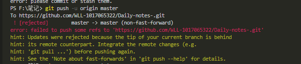
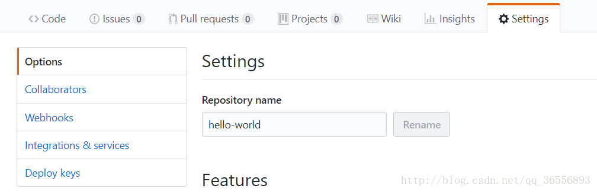
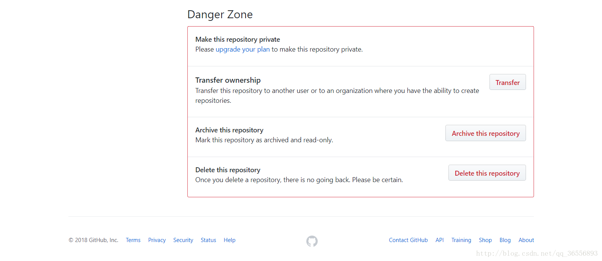
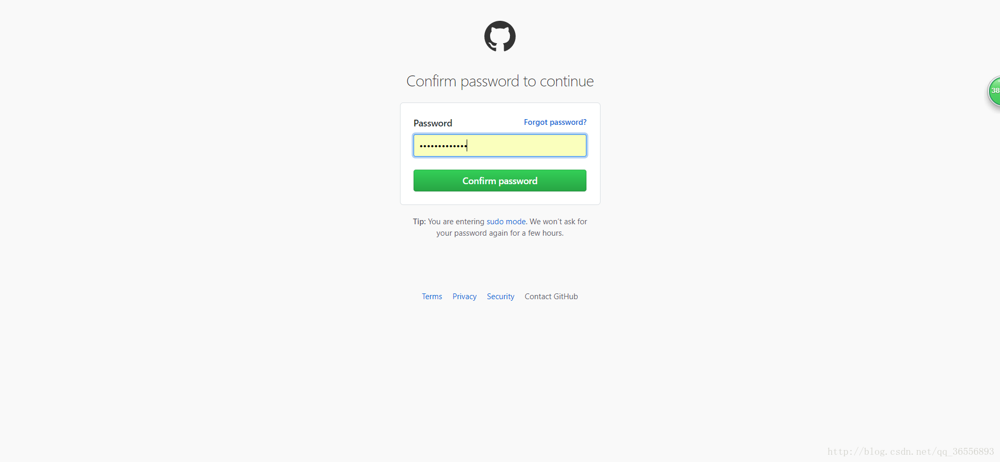
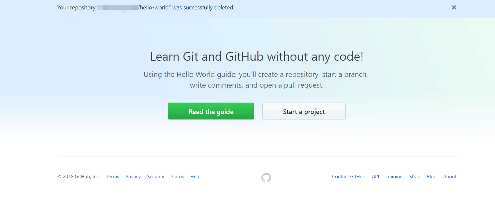
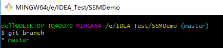
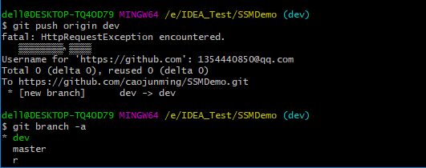
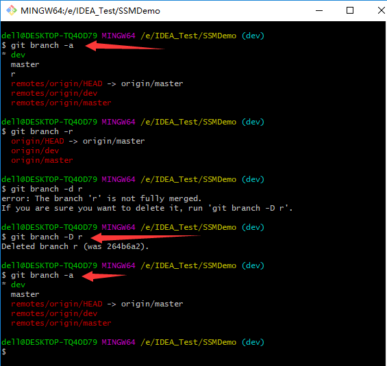

echo "# vue-demo" >> README.md
git init
git add README.md
git commit -m "first commit"
git remote add origin https://github.com/WLL-1017065322/vue-demo.git
git push -u origin master


git add .

`git commit -m "提交文件"`

git push -u origin master

git remote add origin https://github.com/WLL-1017065322/Daily-notes.git

文件返回：https://github.com/WLL-1017065322/Daily-notes-.git

git log

复制 hard

git reset --hard 8d9e4e2330c421d9a333ce12 1158bfa11dd2782c


怎么传文件：

自从使用github以来，一直都是在[github网站](https://link.jianshu.com?t=https://github.com/)在线上传文件到仓库中，但是有时因为网络或者电脑的原因上传失败。最重要的原因是我习惯本地编辑，完成以后再一起上传github。看过了几个教程，总结出最适合自己的比较简单的方法。


两种方法上传本地文件到github

#### 1. github在线上传文件夹

在线上传也可以上传完整的文件夹结构，直接拖拽到上传文件页面的框中即可。

##### 1.1点击上传文件


点击上传

##### 1.2 直接拖拽

直接拖拽即可上传文件夹及文件夹里面的文件。如果点击* choose your files *就只能上传单个文件。


直接拖拽


#### 2. 通过git工具上传本地文件夹（本地项目）

##### 2.1 下载[git工具](https://link.jianshu.com?t=https://git-scm.com/downloads) 


选择对应版本下载

##### 2.2 下载完成后安装完成，注意在安装过程中可以选择创建桌面快捷方式


桌面快捷方式

##### 2.3 绑定用户

打开git-bash.exe（直接在桌面上点击右键，或者点击开始按钮找到Git Bash）


运行gitBash.gif

在打开的GIt Bash中输入以下命令（用户和邮箱为你github注册的账号和邮箱）

```
$ git config --global user.name "hanyuntao"
$ git config --global user.email "hanyuntaocn@163.com"
```


Paste_Image.png

##### 2.4 设置SSH key（[git中sshkey有何作用？](https://link.jianshu.com?t=https://segmentfault.com/q/1010000000118744)）

###### 2.4.1 生成ssh key

首先检查是否已生成密钥`cd ~/.ssh`，如果返回的`ls`有3个文件,则密钥已经生成。


密钥生成

如果没有密钥，则通过

```
$ ssh-keygen -t rsa -C "hanyuntaocn@163.com"
```

生成，生成过程中一路按3次回车键就好了。（默认路径，默认没有密码登录）
 生成成功后，去对应目录C:\Users\hyt.ssh里（hyt为电脑用户名，每个人不同）用记事本打开id_rsa.pub，得到ssh key公钥。


ssh key公钥

###### 2.4.2 为github账号配置ssh key

切换到github，展开个人头像的小三角，点击settings，然后打开SSH keys菜单， 点击Add SSH key新增密钥，填上标题（最好跟本地仓库保持一致）。


设置sshkey.gif

接着将id_rsa.pub文件中key粘贴到此，最后Add key生成密钥吧。\

#### 2.5 上传本地项目到github

##### 2.5.1 创建一个本地项目

这是我自己创建的几个文件夹及文件。


本地项目

##### 2.5.2 建立本地仓库

1.首先进入text文件夹

```
cd d:text
```


首先进入text文件夹

2.执行指令：`git init`


执行git init

初始化成功后你会发现项目里多了一个隐藏文件夹.git


隐藏的文件夹

3.执行指令：`git add .`
 将所有文件添加到仓库


执行git add .

4.执行指令：`git commit -m "提交文件"`
 双引号内是提交注释。


提交文件

##### 2.5.3 关联github仓库

1.到github text仓库复制仓库地址


复制仓库地址

 2.执行指令：

```
git remote add origin https://github.com/hanyuntao/text.git
```


执行指令

##### 2.5.4 上传本地代码

执行指令：`git push -u origin master`


执行指令

##### 2.5.5完成了

可以看到我们的本地项目已经上传到了github上了。


完成了

** 注意：git是不能管理空的文件夹的，文件夹里必须有文件才能上传。 **

参考资料：[git中sshkey有何作用？](https://link.jianshu.com?t=https://segmentfault.com/q/1010000000118744)

作者：hanyuntao

链接：https://www.jianshu.com/p/c70ca3a02087

来源：简书

简书著作权归作者所有，任何形式的转载都请联系作者获得授权并注明出处。


##### 问题：




解决方案:

缺少readme.md

**命令行中输入:**

**git pull --rebase origin master**


原因：
出现这个错误提示原因很简单，也就是一个先后顺序关系。

解决办法：
1、在你本地重新创建一个分支：git branch test （基于你要提交的分支）
2、在将你要git push的分支git  checkout 到情景中提到的节点1
3、git pull 将你同事的提交全部拉到本地
4、再使用git cherry-pick从test分支将你的修改逐条的提交拉回来

5、然后在使用git push origin HEAD将你的分支push到服务器


有如下几种解决方法：  

1.使用强制push的方法：

**$ git push -u origin master -f** 

这样会使远程修改丢失，一般是不可取的，尤其是多人协作开发的时候。  

2.push前先将远程repository修改pull下来 

$ git pull origin master   

$ git push -u origin master  

3.若不想merge远程和本地修改，可以先创建新的分支：

$ git branch [name]

然后push

$ git push -u origin [name]

https://blog.csdn.net/crazydony/article/details/51983343


## 删库


1.点击下面的Settings，注意不是头像下拉菜单的settings



2.用滚轮或者拖动右侧滑动条往下滑到页面最底下，点击“Delete this repository”



3.它会提示你“真的要删除吗？”之后，输入库名字hello-world，点击下方的I understand the consequences, delete this repository，会让你输入密码



4.之后新界面显示删除成功




## 新建分支

### git

一：查看

1.查看本地分支

　　git branch

　　

2.查看远程分支

　　git branch -r

　　

3.查看所有的分支

　　git branch -a

　　

二：创建分支

1.创建本地分支  git branch   111

　　

2.切换到新创建的分支 git checkout  111

　　

3.将新分支push到github git push origin 111

　　 

三：删除分支

1.删除本地分支 git branch -D r

git branch -d Chapater8 

　　

2，删除远程分支

git push origin --delete index-swiper

四 git pull

取回远程主机某个分支的更新，再与本地的指定分支合并，它的完整格式稍稍有点复杂。

$ git pull <远程主机名> <远程分支名>:<本地分支名>

比如，要取回`origin`主机的`next`分支，与本地的`master`分支合并，需要写成下面这样 -

```shell
$ git pull origin next:master


Shell
```

如果远程分支(`next`)要与当前分支合并，则冒号后面的部分可以省略。上面命令可以简写为：

```shell
$ git pull origin next


Shell
```

上面命令表示，取回`origin/next`分支，再与当前分支合并。实质上，这等同于先做`git fetch`，再执行`git merge`。

```shell
$ git fetch origin
$ git merge origin/next
```


### github：		 		

如何在 GitHub 的项目中创建一个分支呢？ 其实很简单啦，直接点击 Branch，然后在弹出的文本框中添加自己的 Branch Name 然后点击蓝色的Create branch就可以了，这样一来，你这个项目就有2个分支了（master 和 reademe-edits）。

[](http://photo.blog.sina.com.cn/showpic.html#blogid=1487b6f6d0102wgtc&url=http://album.sina.com.cn/pic/0060XF5Hgy72AcrEccP3b)

注：由上面的分支合并的流程图可以发现，1 个库可以有多个分支并行的进行开发，但是最后只有 1 个会被 merge 进来，因此当某一个分支被合并到进 master 分支后，其他的并行分支的提交都会被是作为冲突 conflict，解决这个冲突的唯一办法就是，每次做修改之前，记得更新版本库，使自己的分支与 master 分支保持一致。