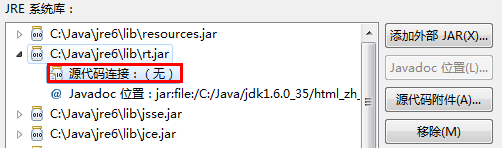

# 重装系统:

1，官网下载u盘启动；

2，插入U盘，设置u盘启动；

3，安装；

4，激活:BBMJ3-28F27-6F3BC-KKMXR-TWQGR；


# 软件部分：


安装：chrome，firefox，360，火绒，vscode，qq，好压，有道

ps


# 环境配置：

## npm

### 安装： nodejs

1官网下载 安装包，安装

2安装成功，npm -v 查看npm版本 node -v 查看node版本

3更新npm npm install npm@latest -g


npm常用命名

使用npm卸载插件：npm uninstall < name > [-g] [--save-dev] PS：不要直接删除本地插件包

使用npm更新插件：npm update < name > [-g] [--save-dev] 

更新全部插件：npm update [--save-dev] 

查看npm帮助：npm help 

查看当前目录已安装插件：npm list 

还有一些npm的简单命令就不多说了


### CNPM介绍：

官方网址：[http://npm.taobao.org](http://npm.taobao.org/)

安装：命令提示符执行npm install cnpm -g --registry=https://registry.npm.taobao.org

注意：安装完后最好查看其版本号cnpm -v或关闭命令提示符重新打开，安装完直接使用有可能会出现错误 

PS：cnpm跟npm用法完全一致，只是在执行命令时将npm改为cnpm。


### 常用包：


VMware安装：

下载 Workstation player 或者Workstation Pro

安装


## java：

### 下载

1，下载jdk，地址：：<http://www.oracle.com/technetwork/java/javase/downloads/index.html>


选择X64位

自定义安装目录


### 配置变量：

控制面板==》系统==》高级系统设计==》环境变量

系统变量的path加入安装路径

cmd java --version


ps：不需要配置 **JAVA_HOME** **CLASSPATH**


### vscode配置java环境：

安装插件：

1. Language support for Java ™ for Visual Studio Code

2. Java Extension Pack

3. Debugger for Java

4. Java Test Runner

   

### eclipese

下载：<http://www.eclipse.org/downloads/packages/>

安装：


#### 汉化

Babel Language Pack Metadata Repository - file:/C:/web/eclipse/jee-2019-03/eclipse/language/oxygen/

eclipse界面语言的切换方法

1.该方法只支持安装过中文包的eclipse（其实中文包中几乎包含了全世界所有的语言，只是调用了其中的中文简体而已）
2.在桌面的快捷方式中目标的地址后面加上参数-nl "区域语言代码"即可实现界面语言切换
如图，是使用英文界面的参数截图：


繁体中文是 -nl "zh_TW"  
简体中文是 -nl "zh_CN"。  
（其它语言以此类推）


#### [Eclipse中文语言包安装和设置中文Doc](https://www.cnblogs.com/IPrograming/archive/2012/12/17/Eclipse_Config.html)


　　对于英语水平不好或者初学者来说使用中文开发环境可以有效提高学习效率，便于快速的学习和上手，不过对于当前的技术环境学习英语还是非常有必要的，当对Eclipse掌握到一定程度还是应该多使用英语环境来开发，以便更进一步的深入学习和了解。下面让我们来学习如何为Eclipse安装语言包和设置中文的文档。

 

#### 准备

 　　在开始所有的工作前请提前安装好Eclipse，下载地址：<http://www.eclipse.org/downloads/>。

　　 语言包(和自己使用的Eclipse版本对应)下载地址：<http://www.eclipse.org/babel/downloads.php>

　　 中文Doc下载地址：<http://dlc.sun.com.edgesuite.net/jdk/jdk-api-localizations/jdk-api-zh-cn/publish/1.6.0/html_zh_CN.zip>

 

#### 1.安装中文语言包

 　　Eclipse所有的扩展功能都是以插件的形式添加上去的，安装插件时有多种形式，下面是比较常用的两种：

> - 直接将插件中的文件复制到Eclipse对于的目录中。优点是安装时很方便，缺点是插件增多，卸载和更新的时候会比较麻烦。
> - 一种使用使用Link的方式。优点是对插件的管理会比较方便，缺点是操作起来比第一种方式要麻烦。
> - 使用dropins的插件安装方式。这种方式是最简单也最实用的一种(**直接将插件放到eclipse所在根目录下的dropins文件夹即可**)

 

1.1 将插件文件直接复制到对应Eclipse扩展目录

　　这里使用的是Link方式来安装插件，首先打开Eclipse程序目录，我们可以看到有两个文件夹：**features**和**plugins**，如图：


将中文语言包解压后，可以看到有两个和前面目录名称相同的目录，将这两个目录中的文件复制到Eclipse对应的目录即可。


重新运行Eclipse就可以了：


 

1.2 使用links目录统一管理插件

　　**1.2.1 首先在Eclipse主目录下创建存放插件的文件夹，文件名任意不和目录中文件夹名称冲突即可，着这里我创建了一个：Extensions文件夹：**


**1.2.2 将插件解压缩后直接复制到"Extensions"目录中：**


 

**1.2.3 在Eclipse主目录中添加Links文件夹**

　　在Eclipse主目录中创建一个名为：Links的文件夹，这是一个Eclipse的标准目录，启动Eclipse时它会预先读取里面的内容，我们通过在里面添加插件的链接，使得Eclipse可以读取并加载链接对应的插件。


**1.2.4 在Links文件夹中添加插件的链接文件**

在Links文件夹中添加一个后缀名为：.link的文本文件，名字直接命名为插件目录的名字即可(可任意)，使用记事本打开创建的link文件，然后输入文本:

```
path=Extensions\\BabelLanguagePack-eclipse-zh_4.2.0.v20121120043402 \\这是插件相对路径的位置(可以使用绝对路径)
```


**1.2.5 重新启动Eclipse**


 

#### 1.3 切换回英文环境Eclipse

 　　当我们通过使用中文的开发环境以及对Eclipse有了一个大概的了解，想要切换回英文开发环境该怎么呢？其实不需要把中文包删除，我们可以使用命令行进入Eclipse主目录后输入：

```
eclipse –nl en
```


 

#### 2.设置中文Doc和在Eclipse中查看源码

　　除了设置中文的API文档外，和.NET 不同我们还可以在Eclipse中直接查看Java类库的源码。下载好中文JavaDoc文档后，存在任意路径，打开Eclipse，选择"首选项"——>>"已安装的JRE"，选择一个JRE版本——>>"编辑"，如下：

**注意：**

> 　　查看源码和设置中文Doc不能同时设置，如果设置了查看源码，那么javaDoc会自动引用源码其中的注释，设置中文Doc会无效。


 

#### 2.1 添加Java类库链接

　　**选择"rt.jar"包——>>"源代码链接"——>>"源代码附件"**


 

**选择JDK安装根目录下的src.zip即可：**


 

完成上面的步骤后，如果想看一个函数的实现，是需要按住"Ctrl"键，鼠标点击即可：


#### 2.2 添加中文JavaDoc链接

　　**选择"rt.jar"包——>>"javadoc位置"——>>"javadoc位置"**


 

**选择归档中的javadoc，这样就不用解压缩了，在归档路径中选择下面的中文JavaDoc路径，归档中的路径中一直选择到"api"这个层级：**


 

Eclipse已经开始使用中文Doc：


**提示：如果想要使用中文Doc需要吧，需要把查看源码的路径移除掉，如下：**




## php：


## python：

解释器：官网下载

IDE:

pycharm社区版：

<http://www.jetbrains.com/pycharm/download/#section=windows>

