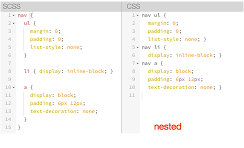
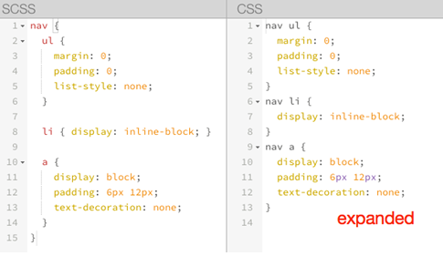

# SASS用法指南-阮一峰

学过[CSS](http://zh.wikipedia.org/wiki/%E5%B1%82%E5%8F%A0%E6%A0%B7%E5%BC%8F%E8%A1%A8)的人都知道，它不是一种编程语言。

你可以用它开发网页样式，但是没法用它编程。也就是说，CSS基本上是设计师的工具，不是程序员的工具。在程序员眼里，CSS是一件很麻烦的东西。它没有变量，也没有条件语句，只是一行行单纯的描述，写起来相当费事。

很自然地，有人就开始为CSS加入编程元素，这被叫做["CSS预处理器"](http://www.catswhocode.com/blog/8-css-preprocessors-to-speed-up-development-time)（css preprocessor）。它的基本思想是，用一种专门的编程语言，进行网页样式设计，然后再编译成正常的CSS文件。

各种"CSS预处理器"之中，我自己最喜欢[SASS](http://sass-lang.com/)，觉得它有很多优点，打算以后都用它来写CSS。下面是我整理的用法总结，供自己开发时参考，相信对其他人也有用。

============================================

## **SASS用法指南**

作者：阮一峰

## **一、什么是SASS**

[SASS](http://sass-lang.com/)是一种CSS的开发工具，提供了许多便利的写法，大大节省了设计者的时间，使得CSS的开发，变得简单和可维护。

本文总结了SASS的主要用法。我的目标是，有了这篇文章，日常的一般使用就不需要去看[官方文档](http://sass-lang.com/docs/yardoc/file.SASS_REFERENCE.html)了。

## **二、安装和使用**

**2.1 安装**

SASS是Ruby语言写的，但是两者的语法没有关系。不懂Ruby，照样使用。只是必须先[安装Ruby](http://www.ruby-lang.org/zh_cn/downloads/)，然后再安装SASS。

假定你已经安装好了Ruby，接着在命令行输入下面的命令：

> 　　gem install sass

然后，就可以使用了。

**2.2 使用**

SASS文件就是普通的文本文件，里面可以直接使用CSS语法。文件后缀名是.scss，意思为Sassy CSS。

下面的命令，可以在屏幕上显示.scss文件转化的css代码。（假设文件名为test。）

> 　　sass test.scss

如果要将显示结果保存成文件，后面再跟一个.css文件名。

> 　　sass test.scss test.css

SASS提供四个[编译风格](http://sass-lang.com/docs/yardoc/file.SASS_REFERENCE.html#output_style)的选项：

> 　　* nested：嵌套缩进的css代码，它是默认值。
>
> 　　* expanded：没有缩进的、扩展的css代码。
>
> 　　* compact：简洁格式的css代码。
>
> 　　* compressed：压缩后的css代码。

生产环境当中，一般使用最后一个选项。

> 　　sass --style compressed test.sass test.css

你也可以让SASS监听某个文件或目录，一旦源文件有变动，就自动生成编译后的版本。

> 　　// watch a file
>
> 　　sass --watch input.scss:output.css
>
> 　　// watch a directory
>
> 　　sass --watch app/sass:public/stylesheets

SASS的官方网站，提供了一个[在线转换器](http://sass-lang.com/try.html)。你可以在那里，试运行下面的各种例子。

## **三、基本用法**

### **3.1 变量**

SASS允许使用变量，所有变量以$开头。

> 　　$blue : #1875e7;　
>
> 　　div {
> 　　　color : $blue;
> 　　}

如果变量需要镶嵌在字符串之中，就必须需要写在#{}之中。

> 　　$side : left;
>
> 　　.rounded {
> 　　　　border-#{$side}-radius: 5px;
> 　　}

### **3.2 计算功能**

SASS允许在代码中使用算式：

> 　　body {
> 　　　　margin: (14px/2);
> 　　　　top: 50px + 100px;
> 　　　　right: $var  * 10%;
> 　　}

### **3.3 嵌套**

SASS允许选择器嵌套。比如，下面的CSS代码：

> 　　div h1 {
> 　　　　color : red;
> 　　}

可以写成：

> 　　div {
> 　　　　hi {
> 　　　　　　color:red;
> 　　　　}
> 　　}

属性也可以嵌套，比如border-color属性，可以写成：

> 　　p {
> 　　　　border: {
> 　　　　　　color: red;
> 　　　　}
> 　　}

注意，border后面必须加上冒号。

在嵌套的代码块内，可以使用&引用父元素。比如a:hover伪类，可以写成：

> 　　a {
> 　　　　&:hover { color: #ffb3ff; }
>   　　}

### **3.4 注释**

SASS共有两种注释风格。

标准的CSS注释 /* comment */ ，会保留到编译后的文件。

单行注释 // comment，只保留在SASS源文件中，编译后被省略。

在/*后面加一个感叹号，表示这是"重要注释"。即使是压缩模式编译，也会保留这行注释，通常可以用于声明版权信息。

> 　　/*! 
> 　　　　重要注释！
> 　　*/

## **四、代码的重用**

### **4.1 继承**

SASS允许一个选择器，继承另一个选择器。比如，现有class1：

> 　　.class1 {
> 　　　　border: 1px solid #ddd;
> 　　}

class2要继承class1，就要使用@extend命令：

> 　　.class2 {
> 　　　　@extend .class1;
> 　　　　font-size:120%;
> 　　}

### **4.2 Mixin**

Mixin有点像C语言的宏（macro），是可以重用的代码块。

使用@mixin命令，定义一个代码块。

> 　　@mixin left {
> 　　　　float: left;
> 　　　　margin-left: 10px;
> 　　}

使用@include命令，调用这个mixin。

> 　　div {
> 　　　　@include left;
> 　　}

mixin的强大之处，在于可以指定参数和缺省值。

> 　　@mixin left($value: 10px) {
> 　　　　float: left;
> 　　　　margin-right: $value;
> 　　}

使用的时候，根据需要加入参数：

> 　　div {
> 　　　　@include left(20px);
> 　　}

下面是一个mixin的实例，用来生成浏览器前缀。

> 　　@mixin rounded($vert, $horz, $radius: 10px) {
> 　　　　border-#{$vert}-#{$horz}-radius: $radius;
> 　　　　-moz-border-radius-#{$vert}#{$horz}: $radius;
> 　　　　-webkit-border-#{$vert}-#{$horz}-radius: $radius;
> 　　}

使用的时候，可以像下面这样调用：

> 　　#navbar li { @include rounded(top, left); }
>
> 　　#footer { @include rounded(top, left, 5px); }

### **4.3 颜色函数**

SASS提供了一些内置的颜色函数，以便生成系列颜色。

> 　　lighten(#cc3, 10%)  // #d6d65c
> 　　darken(#cc3, 10%)  //  #a3a329
> 　　grayscale(#cc3) // #808080
> 　　complement(#cc3) // #33c

### **4.4 插入文件**

@import命令，用来插入外部文件。

> 　　@import "path/filename.scss";

如果插入的是.css文件，则等同于css的import命令。

> 　　@import "foo.css";

## **五、高级用法**

### **5.1 条件语句**

@if可以用来判断：

> 　　p {
> 　　　　@if 1 + 1 == 2 { border: 1px solid; }
> 　　　　@if 5 < 3 { border: 2px dotted; }
> 　　}

配套的还有@else命令：

> 　　@if lightness($color) > 30% {
> 　　　　background-color: #000;
> 　　} @else {
> 　　　　background-color: #fff;
> 　　}

### **5.2 循环语句**

SASS支持for循环：

> 　　@for $i from 1 to 10 {
> 　　　　.border-#{$i} {
> 　　　　　　border: #{$i}px solid blue;
> 　　　　}
> 　　}

也支持while循环：

> 　　$i: 6;
>
> 　　@while $i > 0 {
> 　　　　.item-#{$i} { width: 2em * $i; }
> 　　　　$i: $i - 2;
> 　　}

each命令，作用与for类似：

> 　　@each $member in a, b, c, d {
> 　　　　.#{$member} {
> 　　　　　　background-image: url("/image/#{$member}.jpg");
> 　　　　}
> 　　}

### **5.3 自定义函数**

SASS允许用户编写自己的函数。

> 　　@function double($n) {
> 　　　　@return $n * 2;
> 　　}
>
> 　　#sidebar {
> 　　　　width: double(5px);
> 　　}

（完）


# ==============================


# sass简介


## 什么是css预处理器？

定义：CSS 预处理器用一种专门的编程语言，进行 Web 页面样式设计，然后再编译成正常的 CSS 文件，以供项目使用

作用：。CSS 预处理器为 CSS 增加一些编程的特性，无需考虑浏览器的兼容性问题”，例如你可以在 CSS 中使用**变量**、**简单的逻辑程序**、**函数（**如右侧代码编辑器中就使用了变量**$color）**等等在编程语言中的一些基本特性

好处：让你的 CSS **更加简洁**、**适应性更强**、**可读性更佳**，**更易于代码的维护**

有哪些？

Sass（SCSS）
LESS
Stylus
Turbine
Swithch CSS
CSS Cacheer
DT CSS

## 什么是sass？

定义：Sass 是一门高于 CSS 的元语言，它能用来清晰地、结构化地描述文件样式，有着比普通 CSS 更加强大的功能。采用 **Ruby** 语言编写的一款 CSS 预处理语言。
作用：提供更简洁、更优雅的语法，同时提供多种功能来创建可维护和管理的样式表。


## SCSS 与 Sass区别

1，文件扩展名不同，Sass 是以“.sass”后缀为扩展名，而 SCSS 是以“.scss”后缀为扩展名
2，语法书写方式不同，Sass 是以严格的缩进式语法规则来书写，不带大括号({})和分号(;)，而 SCSS 的语法书写和我们的 CSS 语法书写方式非常类似。


```
#sidebar
  width: 30%
  background-color: #faa
```

只需添加花括号和分号就能转换为 SCSS 语法：

```
#sidebar {
  width: 30%;
  background-color: #faa;
}
```

另外，SCSS 对空白符号不敏感。上面的代码也可以书写成下面的样子：

```
#sidebar {width: 30%; background-color: #faa}
```


# sass安装环境 Ruby（sa si lu bi）

第一步安装 Ruby

1，命令下载

2，本地下载

3，compass

4，淘宝镜像下载


# Sass的语法格式及编译调试


## 语法

 

Sass 有两种语法。 第一种被称为 SCSS (Sassy CSS)，是一个 CSS3 语法的扩充版本，这份参考资料使用的就是此语法。 也就是说，所有符合 CSS3 语法的样式表也都是具有相同语法意义的 SCSS 文件。 另外，SCSS 理解大多数 CSS hacks 以及浏览器专属语法，例如[IE 古老的 `filter` 语法](http://msdn.microsoft.com/en-us/library/ms533754%28VS.85%29.aspx)。 这种语种语法的样式表文件需要以 `.scss` 扩展名。

 

第二种比较老的语法成为缩排语法（或者就称为 "Sass"）， 提供了一种更简洁的 CSS 书写方式。 它不使用花括号，而是通过缩排的方式来表达选择符的嵌套层级，I 而且也不使用分号，而是用换行符来分隔属性。 很多人认为这种格式比 SCSS 更容易阅读，书写也更快速。 缩排语法具有 Sass 的所有特色功能， 虽然有些语法上稍有差异； 这些差异在{file:INDENTED_SYNTAX.md 所排语法参考手册}中都有描述。 使用此种语法的样式表文件需要以 `.sass` 作为扩展名。

 

任一语法都可以[导入](http://sass.bootcss.com/docs/sass-reference/#import)另一种语法撰写的文件中。 只要使用 `sass-convert` 命令行工具，就可以将一种语法转换为另一种语法：

 

```
# 将 Sass 转换为 SCSS
$ sass-convert style.sass style.scss

# 将 SCSS 转换为 Sass
$ sass-convert style.scss style.sass
```


#### 嵌套规则：

例如：

```
#main p {
  color: #00ff00;
  width: 97%;

  .redbox {
    background-color: #ff0000;
    color: #000000;
  }
}
```

被编译为：

```
#main p {
  color: #00ff00;
  width: 97%; }
  #main p .redbox {
    background-color: #ff0000;
    color: #000000; }
```


#### 引用父选择符： `&` 

`&` 在编译时将被替换为父选择符，输出到 CSS 中。 也就是说，如果你有一个深层嵌套的规则，父选择符也会在 `&` 被替换之前被完整的解析， 例如：

```
#main {
  color: black;
  a {
    font-weight: bold;
    &:hover { color: red; }
  }
}
```

被编译为：

```
#main {
  color: black; }
  #main a {
    font-weight: bold; }
    #main a:hover {
      color: red; }
```


#### 嵌套属性

例如：

 

```
.funky {
  font: 2px/3px {
    family: fantasy;
    size: 30em;
    weight: bold;
  }
}
```

被编译为：

 

```
.funky {
  font: 2px/3px;
    font-family: fantasy;
    font-size: 30em;
    font-weight: bold; }
```

#### 占位符选择器:% foo

Sass支持一种特殊类型的选择器，称为“占位符选择器”。除了# h和.之外，这些看起来像类和id选择器。用%替换。它们应该与@extend指令一起使用;

有关更多信息，请参见@ extension - only选择器。

如果不使用@extend，使用占位符选择器的规则集将不会单独呈现到CSS中。


#### 注释:/* */和//

Sass支持使用/* */的标准多行CSS注释，以及使用//的单行注释。在CSS输出中尽可能保留多行注释，而删除单行注释。例如:

```
/* This comment is
 * several lines long.
 * since it uses the CSS comment syntax,
 * it will appear in the CSS output. */
body { color: black; }

// These comments are only one line long each.
// They won't appear in the CSS output,
// since they use the single-line comment syntax.
a { color: green; }
```

被编译为：

 

```
/* This comment is
 * several lines long.
 * since it uses the CSS comment syntax,
 * it will appear in the CSS output. */
body {
  color: black; }

a {
  color: green; }
```

ps：当注释的第一个字母是!时，注释将被内插并始终呈现到css输出中，即使在压缩输出模式中也是如此。这对于将版权声明添加到生成的CSS非常有用。

#### 交互shell

您可以使用交互式shell轻松地试验SassScript。要启动shell，请使用-i选项运行sass命令行。在提示符处，输入任何合法的SassScript表达式进行评估，并将结果打印出来:

```
$ sass -i
>> "Hello, Sassy World!"
"Hello, Sassy World!"
>> 1px + 1px + 1px
3px
>> #777 + #777
#eeeeee
>> #777 + #888
white
```


#### 变量$

使用SassScript最直接的方法是使用变量。变量以美元符号开头，像CSS属性一样设置:


```
$width: 5em;
```

你可以在属性中引用它们

```
#main {
  width: $width;
}
```

变量只在定义它们的嵌套选择器级别内可用。如果它们是在任何嵌套选择器之外定义的，那么它们在任何地方都是可用的。

变量使用前缀字符!;这仍然有效，但它已被弃用并打印警告。$是推荐的语法。

变量也可以用=而不是:来定义;这仍然有效，但它已被弃用并打印警告。:是推荐的语法。


##### 数据类型：

SassScript 支持六种主要的数据类型：

 

- 数字（例如 `1.2`、`13`、`10px`）
- 文本字符串，无论是否有引号（例如 `"foo"`、`'bar'`、`baz`）
- 颜色（例如 `blue`、`#04a3f9`、`rgba(255, 0, 0, 0.5)`）
- 布尔值（例如 `true`、`false`）
- 空值（例如 `null`）
- 值列表，用空格或逗号分隔（例如 `1.5em 1em 0 2em`、`Helvetica, Arial, sans-serif`）

SassScript 还支持所有其他 CSS 属性值类型， 例如 Unicode 范围和 `!important` 声明。 然而，它不会对这些类型做特殊处理。 它们只会被当做不带引号的字符串看待。

字符串：

CSS 提供了两种类型的字符串：带引号的字符串，例如 `"Lucida Grande"` 或 `'http://sass-lang.com'`；
不带引号的字符串，例如 `sans-serif` 或 `bold`。
SassScript 能够识别这两种字符串，
并且，如果一种类型的字符串 如果在Sass文档中使用一种字符串，那么这种字符串将在生成的CSS中使用。

但是有一个例外:当使用#{}插值时，带引号的字符串是不带引号的。这使得在mixin中更容易使用例如选择器名称。例如:

```
@mixin firefox-message($selector) {
  body.firefox #{$selector}:before {
    content: "Hi, Firefox users!";
  }
}

@include firefox-message(".header");
```

被编译为：

```
body.firefox .header:before {
  content: "Hi, Firefox users!"; }
```


## sass编译


常常有人会问，使用 Sass 进行开发，那么是不是直接通过“<link>”引用“.scss”或“.sass”文件呢？

那么这里告诉大家，在项目中还是引用“.css”文件，Sass 只不过是做为一个预处理工具，提前帮你做事情，只有你需要时候，他才有攻效。

这样一来，也就有了这章需要介绍的内容—— Sass 的编译。因为 Sass 开发之后，要让 Web 页面能调用 Sass 写好的东西，就得有这么一个过程，这个过程就称之为 Sass 编译过程。Sass 的编译有多种方法：

- 命令编译
- GUI工具编译
- 自动化编译


### 命令编译

命令编译是指使用你电脑中的命令终端，通过输入 Sass 指令来编译 Sass。这种编译方式是最直接也是最简单的一种方式。因为只需要在你的命令终端输入：

**单文件编译：**

```
sass <要编译的Sass文件路径>/style.scss:<要输出CSS文件路径>/style.css
```

这是对一个单文件进行编译，如果想对整个项目所有 Sass 文件编译成 CSS 文件，可以这样操作：

**多文件编译：**

```
sass sass/:css/
```

上面的命令表示将项目中“sass”文件夹中所有“.scss”(“.sass”)文件编译成“.css”文件，并且将这些 CSS 文件都放在项目中“css”文件夹中。

**缺点及解决方法：**

在实际编译过程中，你会发现上面的命令，只能一次性编译。每次个性保存“.scss”文件之后，都得重新执行一次这样的命令。如此操作太麻烦，其实还有一种方法，就是在编译 Sass 时，开启“**watch**”功能，这样只要你的代码进行任保修改，都能自动监测到代码的变化，并且给你直接编译出来：

```
sass --watch <要编译的Sass文件路径>/style.scss:<要输出CSS文件路径>/style.css
```

当然，使用 sass 命令编译时，可以带很多的参数：


**watch 举例：**

来看一个简单的示例，假设我本地有一个项目，我要把项目中“bootstrap.scss”编译出“bootstrap.css”文件，并且将编译出来的文件放在“css”文件夹中，我就可以在我的命令终端中执行：

  

```
sass --watch sass/bootstrap.scss:css/bootstrap.css
```

  

一旦我的 bootstrap.scss 文件有任何修改，只要我重新保存了修改的文件，命令终端就能监测，并重新编译出文件：

  

[](http://img1.sycdn.imooc.com/54f54bcb00016b1005680288.jpg)


### GUI工具编译

或许你会说，我一直讨厌使用命令来做事情，我喜欢那种能看得到的界面操作。那么你可以考虑使用 GUI 界面工具来对 Sass 进行编译。当然不同的 GUI 工具操作方法略有不同。如果在此也一一对编译的界面工具做详细的介绍。我们可能需要写一本书来介绍这些编译工具的操作了。所以我们这里做一下简单介绍，对于 GUI 界面编译工具，目前较为流行的主要有：

  

1. Koala (<http://koala-app.com/>)
2. Compass.app（<http://compass.kkbox.com/>）
3. Scout（<http://mhs.github.io/scout-app/>）
4. CodeKit（<https://incident57.com/codekit/index.html>）
5. Prepros（<https://prepros.io/>）

  

相比之下，我比较推荐使用以下两个：

  

- Koala (<http://www.w3cplus.com/preprocessor/sass-gui-tool-koala.html>) 
- CodeKit (<http://www.w3cplus.com/preprocessor/sass-gui-tool-codekit.html>)


### 自动化编译

喜欢自动化研究的同学，应该都知道 **Grunt** 和 **Gulp** 这两个东东。如果您正在使用其中的任何一种，那么你也可以通过他们来配置 Sass 的编译。这里仅列出两个示例代码（具体情况要根据您的项目环境来做一定的修改，不建议生搬硬套，容易发生命案，呵呵。

  

**1、Grunt 配置 Sass 编译的示例代码**

  

```
module.exports = function(grunt) {
    grunt.initConfig({
        pkg: grunt.file.readJSON('package.json'),
        sass: {
            dist: {
                files: {
                    'style/style.css' : 'sass/style.scss'
                }
            }
        },
        watch: {
            css: {
                files: '**/*.scss',
                tasks: ['sass']
            }
        }
    });
    grunt.loadNpmTasks('grunt-contrib-sass');
    grunt.loadNpmTasks('grunt-contrib-watch');
    grunt.registerTask('default',['watch']);
}
```

想了解 **Grunt** 同学请单击这里学习[《Grunt-beginner前端自动化工具》](http://www.imooc.com/learn/30)。

**2、Gulp 配置 Sass 编译的示例代码**

```
var gulp = require('gulp');
var sass = require('gulp-sass');

gulp.task('sass', function () {
    gulp.src('./scss/*.scss')
        .pipe(sass())
        .pipe(gulp.dest('./css'));
});

gulp.task('watch', function() {
    gulp.watch('scss/*.scss', ['sass']);
});

gulp.task('default', ['sass','watch']);
```


### 常见错误：

在编译 Sass 代码时常常会碰到一些错误，让编译失败。这样的错误有系统造成的也有人为造成的，但大部分都是人为过失引起编译失败。

而最为常见的一个错误就是字符编译引起的。在Sass的编译的过程中，是不是支持“GBK”编码的。所以在创建 Sass 文件时，就需要将文件编码设置为“utf-8”。

另外一个错误就是路径中的中文字符引起的。建议在项目中文件命名或者文件目录命名不要使用中文字符。而至于人为失误造成的编译失败，在编译过程中都会有具体的说明，大家可以根据编译器提供的错误信息进行对应的修改。


### 不同样式风格的输出方法

众所周知，每个人编写的 CSS 样式风格都不一样，有的喜欢将所有样式代码都写在同一行，而有的喜欢将样式分行书写。在 Sass 中编译出来的样式风格也可以按不同的样式风格显示。其主要包括以下几种样式风格：

1. **嵌套输出方式 nested**
2. **展开输出方式 expanded**  
3. **紧凑输出方式 compact** 
4. **压缩输出方式 compressed**


###### 1，**嵌套输出方式 nested**

Sass 提供了一种嵌套显示 CSS 文件的方式。例如

  

```
nav {
  ul {
    margin: 0;
    padding: 0;
    list-style: none;
  }

  li { display: inline-block; }

  a {
    display: block;
    padding: 6px 12px;
    text-decoration: none;
  }
}
```

  

在编译的时候带上参数“ --style nested”:

  

```
sass --watch test.scss:test.css --style nested
```

  

编译出来的 CSS 样式风格：

  

```
nav ul {
  margin: 0;
  padding: 0;
  list-style: none; }
nav li {
  display: inline-block; }
nav a {
  display: block;
  padding: 6px 12px;
  text-decoration: none; }
```

  

如下图所示：

  


 [](http://img1.sycdn.imooc.com/54f54dab00019a0504880296.jpg)

###### 2，展开输出方式 expanded

  

```
nav {
  ul {
    margin: 0;
    padding: 0;
    list-style: none;
  }

  li { display: inline-block; }

  a {
    display: block;
    padding: 6px 12px;
    text-decoration: none;
  }
}
```

  

在编译的时候带上参数“ --style expanded”:

  

```
sass --watch test.scss:test.css --style expanded
```

  

这个输出的 CSS 样式风格和 nested 类似，只是大括号在另起一行，同样上面的代码，编译出来：

  

```
nav ul {
  margin: 0;
  padding: 0;
  list-style: none;
}
nav li {
  display: inline-block;
}
nav a {
  display: block;
  padding: 6px 12px;
  text-decoration: none;
}
```

  


 [](http://img1.sycdn.imooc.com/54f54e2c0001c2c004850281.jpg)


###### **3，紧凑输出方式 compact** 

```
nav {
  ul {
    margin: 0;
    padding: 0;
    list-style: none;
  }

  li { display: inline-block; }

  a {
    display: block;
    padding: 6px 12px;
    text-decoration: none;
  }
}
```

  

在编译的时候带上参数“ --style compact”:

  

```
sass --watch test.scss:test.css --style compact
```

  

该方式适合那些喜欢单行 CSS 样式格式的朋友，编译后的代码如下：

  

```
nav ul { margin: 0; padding: 0; list-style: none; }
nav li { display: inline-block; }
nav a { display: block; padding: 6px 12px; text-decoration: none; }
```

  

 

  

[](http://img1.sycdn.imooc.com/54f7b4bb00014f9908020299.jpg)

###### 4，**压缩输出方式 compressed**

```
nav {
  ul {
    margin: 0;
    padding: 0;
    list-style: none;
  }

  li { display: inline-block; }

  a {
    display: block;
    padding: 6px 12px;
    text-decoration: none;
  }
}
```

  

在编译的时候带上参数“ --style compressed”:

  

```
sass --watch test.scss:test.css --style compressed
```

  

压缩输出方式会去掉标准的 Sass 和 CSS 注释及空格。也就是压缩好的 CSS 代码样式风格：

  

```
nav ul{margin:0;padding:0;list-style:none}nav li{display:inline-block}nav a{display:block;padding:6px 12px;text-decoration:none}
```

  

[](http://img1.sycdn.imooc.com/54f5511d0001b5c206660401.jpg)

  

编译出来的CSS样式风格的选择完全是个人喜好问题，可以根据自己喜欢的风格选择参数。

  

一段时间之后，你实际上就不再需要写 CSS 代码了，只用写 Sass 代码。在这种情况下，你只需要设定输出格式为压缩格式，知道输出的 CSS 代码可以直接使用即可。


### sass的调试：


 [](http://img1.sycdn.imooc.com/54f7b71d0001bb0b05050268.jpg)

  

（单击可放大）

  

Sass 调试一直以来都是一件头痛的事情，使用 Sass 的同学都希望能在浏览器中直接调试 Sass 文件，能找到对应的行数。值得庆幸的是，现在实现并不是一件难事，只要你的浏览器支持“sourcemap”功能即可。早一点的版本，需要在编译的时候添加“--sourcemap”  参数：

  

```
sass --watch --scss --sourcemap style.scss:style.css
```

  

在 Sass3.3 版本之上（我测试使用的版本是 3.4.7），不需要添加这个参数也可以：

  

```
sass --watch style.scss:style.css
```

  

在命令终端，你将看到一个信息：

  

\>>> Change detected to: style.scss
   write style.css
   write style.css.map

  

这时你就可以像前面展示的 gif 图一样，调试你的 Sass 代码。


# sass的基本特性：

## 基础：

### 声明变量  $ 

定义变量的语法：

在有些编程语言中（如，JavaScript）声明变量都是使用关键词“var”开头，但是在 Sass 不使用这个关键词，而是使用大家都喜欢的美元符号“$”开头。我想用一张图来解释，我一直坚信，一图胜千言万语：


上图非常清楚告诉了大家，Sass 的变量包括三个部分：

1. 声明变量的符号“$”
2. 变量名称
3. 赋予变量的值

来看一个简单的示例，假设你的按钮颜色可以给其声明几个变量：

```
$brand-primary : darken(#428bca, 6.5%) !default; // #337ab7
$btn-primary-color : #fff !default;
$btn-primary-bg : $brand-primary !default;
$btn-primary-border : darken($btn-primary-bg, 5%) !default;
```

如果值后面加上!default则表示默认值。

注：了解 Bootstrap 的 Sass 版本的同学，就一眼能看出，上面的示例代码是 Bootstrap 定义 primarybutton 的颜色。


### 普通变量与默认变量

​             

**普通变量** 

定义之后可以在全局范围内使用。

```
$fontSize: 12px;
body{
    font-size:$fontSize;
}
```

编译后的css代码：

```
body{
    font-size:12px;
}
```


 **默认变量**  !default

sass 的默认变量仅需要在值后面加上 !default 即可。

```
$baseLineHeight:1.5 !default;
body{
    line-height: $baseLineHeight; 
}
```

编译后的css代码：

```
body{
    line-height:1.5;
}
```


 sass 的默认变量一般是用来设置默认值，然后根据需求来覆盖的，覆盖的方式也很简单，只需要在默认变量之前重新声明下变量即可。


```
$baseLineHeight: 2;
$baseLineHeight: 1.5 !default;
body{
    line-height: $baseLineHeight; 
}
```

编译后的css代码：

```
body{
    line-height:2;
}
```


 可以看出现在编译后的 line-height 为 2，而不是我们默认的 1.5。默认变量的价值在进行组件化开发的时候会非常有用。


### 变量的调用

​             

在 Sass 中声明了变量之后，就可以在需要的地方调用变量。调用变量的方法也非常的简单。

比如在定义了变量

```
$brand-primary : darken(#428bca, 6.5%) !default; // #337ab7
$btn-primary-color: #fff !default;
$btn-primary-bg : $brand-primary !default;
$btn-primary-border : darken($btn-primary-bg, 5%) !default;
```


 在按钮 button 中调用，可以按下面的方式调用

```
.btn-primary {
   background-color: $btn-primary-bg;
   color: $btn-primary-color;
   border: 1px solid $btn-primary-border;
}
```

编译出来的CSS:

```
.btn-primary {
  background-color: #337ab7;
  color: #fff;
  border: 1px solid #2e6da4;
}
```

 

### 局部变量和全局变量

​             

Sass 中变量的作用域在过去几年已经发生了一些改变。直到最近，规则集和其他范围内声明变量的作用域才默认为本地。如果已经存在同名的全局变量，从 3.4 版本开始，Sass 已经可以正确处理作用域的概念，并通过创建一个新的局部变量来代替。

**全局变量与局部变量**

先来看一下代码例子：

```
//SCSS
$color: orange !default;//定义全局变量(在选择器、函数、混合宏...的外面定义的变量为全局变量)
.block {
  color: $color;//调用全局变量
}
em {
  $color: red;//定义局部变量
  a {
    color: $color;//调用局部变量
  }
}
span {
  color: $color;//调用全局变量
}
```

css 的结果：

```
//CSS
.block {
  color: orange;
}
em a {
  color: red;
}
span {
  color: orange;
}
```

上面的示例演示可以得知，在元素内部定义的变量不会影响其他元素。如此可以简单的理解成，**全局变量**就是定义在元素外面的变量，如下代码：

```
$color:orange !default;
```

$color 就是一个全局变量，而定义在元素内部的变量，比如 $color:red; 是一个**局部变量**。

除此之外，Sass 现在还提供一个 !global 参数。!global 和 !default 对于定义变量都是很有帮助的。我们之后将会详细介绍这两个参数的使用以及其功能。

**全局变量的影子**

当在局部范围（选择器内、函数内、混合宏内...）声明一个已经存在于全局范围内的变量时，局部变量就成为了**全局变量的影子**。基本上，**局部变量只会在局部范围内覆盖全局变量**。

上面例子中的 em 选择器内的变量 $color 就是一个全局变量的影子。

```
//SCSS
$color: orange !default;//定义全局变量
.block {
  color: $color;//调用全局变量
}
em {
  $color: red;//定义局部变量（全局变量 $color 的影子）
  a {
    color: $color;//调用局部变量
  }
}
```

**什么时候声明变量？**

我的建议，创建变量只适用于感觉确有必要的情况下。不要为了某些骇客行为而声明新变量，这丝毫没有作用。只有满足所有下述标准时方可创建新变量：

1. 该值至少重复出现了两次；
2. 该值至少可能会被更新一次；
3. 该值所有的表现都与变量有关（非巧合）。

基本上，没有理由声明一个永远不需要更新或者只在单一地方使用变量。

温馨小提示：您在学习 sass 时，除了在我们网页上可以做练习，还有一个便利在线编辑器网址如下：

http://sassmeister.com/


### 嵌套-选择器嵌套

​             

Sass 中还提供了选择器嵌套功能，但这也并不意味着你在 Sass 中的嵌套是无节制的，因为你嵌套的层级越深，编译出来的 CSS 代码的选择器层级将越深，这往往是大家不愿意看到的一点。这个特性现在正被众多开发者滥用。

选择器嵌套为样式表的作者提供了一个通过局部选择器相互嵌套实现全局选择的方法，Sass 的嵌套分为三种：

- 选择器嵌套
- 属性嵌套
- 伪类嵌套

1、选择器嵌套

假设我们有一段这样的结构：

```
<header>
<nav>
    <a href=“##”>Home</a>
    <a href=“##”>About</a>
    <a href=“##”>Blog</a>
</nav>
<header>
```

想选中 header 中的 a 标签，在写 CSS 会这样写：

```
nav a {
  color:red;
}

header nav a {
  color:green;
}
```

那么在 Sass 中，就可以使用选择器的嵌套来实现：

```
nav {
  a {
    color: red;

    header & {
      color:green;
    }
  }  
}
```


### 属性嵌套     :

​             

Sass 中还提供属性嵌套，CSS 有一些属性前缀相同，只是后缀不一样，比如：border-top/border-right，与这个类似的还有 margin、padding、font 等属性。假设你的样式中用到了：

```
.box {
    border-top: 1px solid red;
    border-bottom: 1px solid green;
}
```

在 Sass 中我们可以这样写：

```
.box {
  border: {
   top: 1px solid red;
   bottom: 1px solid green;
  }
}
```


### 伪类嵌套  &:before

其实伪类嵌套和属性嵌套非常类似，只不过他需要借助`&`符号一起配合使用。我们就拿经典的“clearfix”为例吧：

  

```
.clearfix{
&:before,
&:after {
    content:"";
    display: table;
  }
&:after {
    clear:both;
    overflow: hidden;
  }
}
```

  

编译出来的 CSS：

  

```
clearfix:before, .clearfix:after {
  content: "";
  display: table;
}
.clearfix:after {
  clear: both;
  overflow: hidden;
}
```

  

**避免选择器嵌套：**

  

- 选择器嵌套最大的问题是将使最终的代码难以阅读。开发者需要花费巨大精力计算不同缩进级别下的选择器具体的表现效果。
- 选择器越具体则声明语句越冗长，而且对最近选择器的引用(&)也越频繁。在某些时候，出现混淆选择器路径和探索下一级选择器的错误率很高，这非常不值得。

  

为了防止此类情况，我们应该尽可能避免选择器嵌套。然而，显然只有少数情况适应这一措施。


### 混合宏-声明混合宏

​             

如果你的整个网站中有几处小样式类似，比如颜色，字体等，在 Sass 可以使用变量来统一处理，那么这种选择还是不错的。但当你的样式变得越来越复杂，需要重复使用大段的样式时，使用变量就无法达到我们目了。这个时候 Sass 中的混合宏就会变得非常有意义。在这一节中，主要向大家介绍 Sass 的混合宏。

1、声明混合宏

**不带参数混合宏**：

在 Sass 中，使用“@mixin”来声明一个混合宏。如：

```
@mixin border-radius{
    -webkit-border-radius: 5px;
    border-radius: 5px;
}
```

其中 @mixin 是用来声明混合宏的关键词，有点类似 CSS 中的 @media、@font-face 一样。border-radius 是混合宏的名称。大括号里面是复用的样式代码。

**带参数混合宏**：

除了声明一个不带参数的混合宏之外，还可以在定义混合宏时带有参数，如：

```
@mixin border-radius($radius:5px){
    -webkit-border-radius: $radius;
    border-radius: $radius;
}
```

**复杂的混合宏：**

上面是一个简单的定义混合宏的方法，当然， Sass 中的混合宏还提供更为复杂的，你可以在大括号里面写上带有逻辑关系，帮助更好的做你想做的事情,如：

```
@mixin box-shadow($shadow...) {
  @if length($shadow) >= 1 {
    @include prefixer(box-shadow, $shadow);
  } @else{
    $shadow:0 0 4px rgba(0,0,0,.3);
    @include prefixer(box-shadow, $shadow);
  }
}
```

这个 box-shadow 的混合宏，带有多个参数，这个时候可以使用“ … ”来替代。简单的解释一下，当 $shadow 的参数数量值大于或等于“ 1 ”时，表示有多个阴影值，反之调用默认的参数值“ 0 0 4px rgba(0,0,0,.3) ”。

注：复杂的混合宏中的逻辑关系（@if...@else）后面小节会有讲解。

 

### 混合宏-调用混合宏

​             

在 Sass 中通过 @mixin 关键词声明了一个混合宏，那么在实际调用中，其匹配了一个关键词“@include”来调用声明好的混合宏。例如在你的样式中定义了一个圆角的混合宏“border-radius”:

```
@mixin border-radius{
    -webkit-border-radius: 3px;
    border-radius: 3px;
}
```

在一个按钮中要调用定义好的混合宏“border-radius”，可以这样使用：

```
button {
    @include border-radius;
}
```

这个时候编译出来的 CSS:

```
button {
  -webkit-border-radius: 3px;
  border-radius: 3px;
}
```


## 运算：


