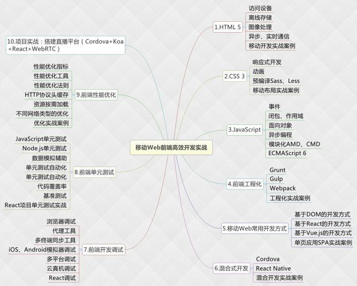
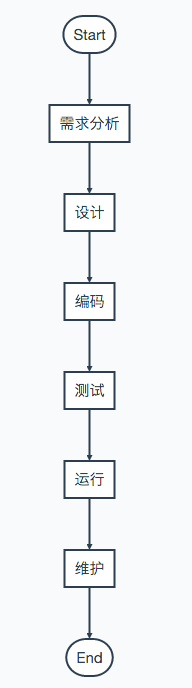
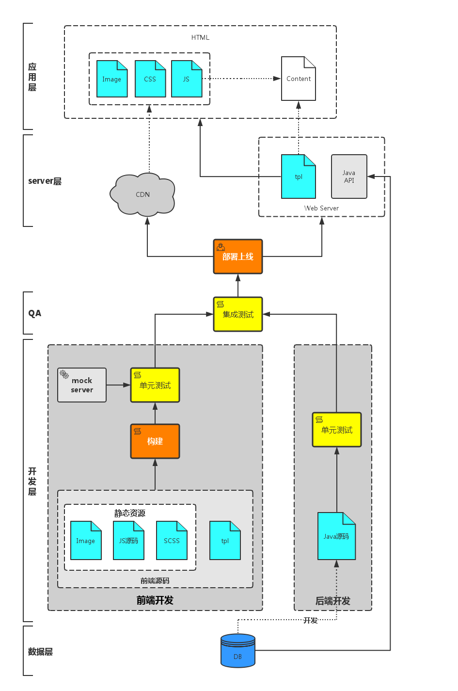
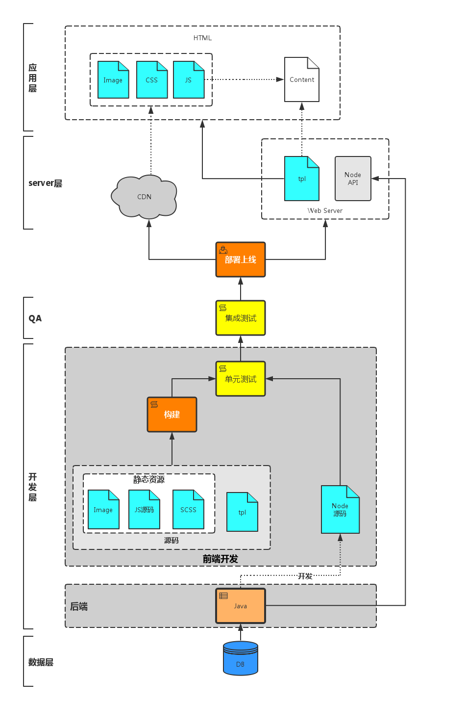
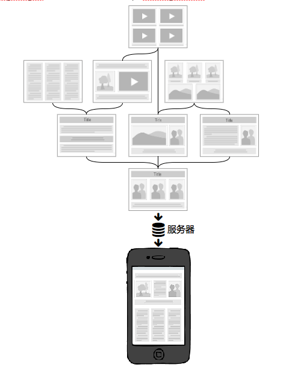
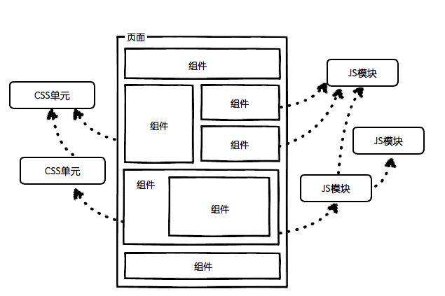

# 浅析前端工程化		 

 

 





### 1. 什么是前端工程化

自有前端工程师这个称谓以来，前端的发展可谓是日新月异。相比较已经非常成熟的其他领域，前端虽是后起之秀，但其野蛮生长是其他领域不能比的。虽然前端技术飞快发展，但是前端整体的工程生态并没有同步跟进。目前绝大多数的前端团队仍然使用非常原始的*“切图（FE）->套模板（RD）”*的开发模式，这种模式下的前端开发虽说不是刀耕火种的原始状态，但是效率非常低下。

前端的工程化问题与传统的软件工程虽然有所不同，但是面临的问题是一样的。我们首先回顾一下传统的软件开发流程模型：


> 上图中的运行和维护并不是串行关系，也并非绝对的并行关系。维护贯穿从编码到运行的整个流程。

如果说计算机科学要解决的是系统的某个具体问题，或者更通俗点说是*面向编码*的，那么工程化要解决的是如何提高整个系统生产效率。所以，与其说软件工程是一门科学，不如说它更偏向于管理学和方法论。

> 软件工程是个很宽泛的话题，每个人都有自己的理解。以上是笔者个人的理解，仅供参考。

具体到前端工程化，面临的问题是如何提高**编码->测试->维护**阶段的生产效率。

> 可能会有人认为应该包括需求分析和设计阶段，上图展示的软件开发模型中，这两个阶段具体到前端开发领域，更恰当的称谓应该是*功能需求分析*和*UI设计*，分别由产品经理和UI工程师完成。至于API需求分析和API设计，应该包括在编码阶段。

### 2. 前端工程化面临的问题

要解决前端工程化的问题，可以从两个角度入手：*开发*和*部署*。

从开发角度，要解决的问题包括：

1. 提高开发生产效率；
2. 降低维护难度。

这两个问题的解决方案有两点：

1. 制定开发规范，提高团队协作能力；
2. 分治。软件工程中有个很重要的概念叫做*模块化开发*其中心思想就是分治。

从部署角度，要解决的问题主要是*资源管理*，包括：

1. 代码审查；
2. 压缩打包；
3. 增量更新；
4. 单元测试；

要解决上述问题，需要引入*构建/编译*阶段。

#### 2.1 开发规范

开发规范的目的是统一团队成员的编码规范，便于团队协作和代码维护。开发规范没有统一的标准，每个团队可以建立自己的一套规范体系。

值得一提的是JavaScript的开发规范，尤其是在ES2015越来越普及的局面下，保持良好的编码风格是非常必要的。笔者推荐[Airbnb的eslint规范](https://github.com/airbnb/javascript)。

#### 2.2 模块/组件化开发

##### 2.2.1 模块还是组件？

很多人会混淆模块化开发和组件化开发。但是严格来讲，组件（component）和模块（module）应该是两个不同的概念。两者的区别主要在**颗粒度**方面。《Documenting Software Architectures》一书中对于component和module的解释如下：

> A module tends to refer first and foremost to a design-time entity. ... information hiding as the criterion for allocating responsibility to a module.
> A component tends to refer to a runtime entity. ... The emphasis is clearly on the finished product and not on the design considerations that went into it.

> In short, a module suggests encapsulation properties, with less emphasis on the delivery medium and what goest on at runtime. Not so with components. A delivered binary maintains its "separateness" throughout execution. A component suggests independently deployed units of software with no visibility into the development process.

简单讲，module侧重的是对属性的封装，重心是在设计和开发阶段，不关注runtime的逻辑。module是一个白盒；而component是一个可以独立部署的软件单元，面向的是runtime，侧重于产品的功能性。component是一个黑盒，内部的逻辑是不可见的。

用通俗的话讲，模块可以理解为零件，比如轮胎上的螺丝钉；而组件则是轮胎，是具备某项完整功能的一个整体。具体到前端领域，一个button是一个模块，一个包括多个button的nav是一个组件。

模块和组件的争论由来已久，甚至某些编程语言对两者的实现都模糊不清。前端领域也是如此，使用过bower的同行知道bower安装的第三方依赖目录是`bower_component`；而npm安装的目录是`node_modules`。也没必要为了这个争得头破血流，一个团队只要统一思想，保证开发效率就可以了。至于是命名为module还是component都无所谓。

> 笔者个人倾向组件黑盒、模块白盒这种思想。

##### 2.2.2 模块/组件化开发的必要性

随着web应用规模越来越大，模块/组件化开发的需求就显得越来越迫切。模块/组件化开发的核心思想是*分治*，主要针对的是开发和维护阶段。

关于组件化开发的讨论和实践，业界有很多同行做了非常详细的介绍，本文的重点并非关注组件化开发的详细方案，便不再赘述了。笔者收集了一些资料可供参考：

1. [Web应用的组件化开发](http://blog.jobbole.com/56161/)；
2. [前端组件化开发实践](http://web.jobbole.com/82689/);
3. [大规模的前端组件化与模块化](http://www.infoq.com/cn/news/2014/04/front-end-modular)。

### 3. 构建&编译

严谨地讲，*构建（build）*和*编译（compile）*是完全不一样的两个概念。两者的颗粒度不同，compile面对的是单文件的编译，build是建立在compile的基础上，对全部文件进行编译。在很多Java IDE中还有另外一个概念：*make*。make也是建立在compile的基础上，但是只会编译有改动的文件，以提高生产效率。本文不探讨build、compile、make的深层运行机制，下文所述的前段工程化中构建&编译阶段简称为*构建阶段*。

#### 3.1 构建在前端工程中的角色

在讨论具体如何组织构建任务之前，我们首先探讨一下在整个前端工程系统中，构建阶段扮演的是什么角色。

首先，我们看看目前这个时间点（2016年），一个典型的web前后端协作模式是什么样的。请看下图：


> 上图是一个比较成熟的前后端协作体系。当然，目前由于Node.js的流行开始普及*大前端*的概念，稍后会讲述。

自Node.js问世以来，前端圈子一直传播着一个词：颠覆。前端工程师要借助Node.js颠覆以往的web开发模式，简单说就是用Node.js取代php、ruby、python等语言搭建web server，在这个颠覆运动中，JavaScript是前端工程师的信心源泉。我们不讨论Node.js与php们的对比，只在可行性这个角度来讲，*大前端*这个方向吸引越来越多的前端工程师。

> 其实*大前端*也可以理解为*全栈工程师*，全栈的概念与编程语言没有相关性，核心的竞争力是对整个web产品从前到后的理解和掌握。

那么在大前端模式下，构建又是扮演什么角色呢？请看下图：


*大前端*体系下，前端开发人员掌握着Node.js搭建的web server层。与上文提到的常规前端开发体系下相比，省略了mock server的角色，但是构建在大前端体系下的作用并没有发生改变。也就是说，不论是大前端还是“小”前端，构建阶段在两种模式下的作用完全一致，构建的作用就是对静态资源以及模板进行处理，换句话说：**构建的核心是资源管理**。

##### 3.2 资源管理要做什么？

前端的资源可以分为*静态资源*和*模板*。模板对静态资源是引用关系，两者相辅相成，构建过程中需要对两种资源使用不同的构建策略。

> 目前仍然有大多数公司将模板交由后端开发人员控制，前端人员写好demo交给后端程序员“套模板”。这种协作模式效率是非常低的，模板层交由前端开发人员负责能够很大程度上提高工作效率。

##### 3.2.1 静态资源构建策略

静态资源包括js、css、图片等文件，目前随着一些新规范和css预编译器的普及，通常开发阶段的静态资源是：

1. es6/7规范的文件；
2. less/sass等文件（具体看团队技术选型）；
3. [可选]独立的小图标，在构建阶段使用工具处理成spirit图片。

构建阶段在处理这些静态文件时，基本的功能应包括：

1. es6/7转译，比如babel；
2. 将less/sass编译成css；
3. spirit图片生成；

以上提到的几个功能可以说是为了弥补浏览器自身功能的缺陷，也可以理解为**面向语言本身**的，我们可以将这些功能统称为*预编译*。

除了语言本身，静态资源的构建处理还需要考虑web应用的**性能因素**。比如开发阶段使用组件化开发模式，每个组件有独立的js/css/图片等文件，如果不做处理每个文件独立上线的话，无疑会增加http请求的数量，从而影响web应用的性能表现。针对诸如此类的问题，构建阶段需要包括以下功能：

1. 依赖打包。分析文件依赖关系，将同步依赖的的文件打包在一起，减少http请求数量；
2. 资源嵌入。比如小于10KB的图片编译为base64格式嵌入文档，减少一次http请求；
3. 文件压缩。减小文件体积；
4. hash指纹。通过给文件名加入hash指纹，以应对浏览器缓存引起的静态资源更新问题；
5. 代码审查。避免上线文件的低级错误；

以上几个功能除了压缩是完全自动化的，其他两个功能都需要人工的配置。比如为了提升首屏渲染性能，开发人员在开发阶段需要尽量减少同步依赖文件的数量。

> 以上提到的所有功能可以理解为*工具层面*的构建功能。

以上提到的构建功能只是构建工具的基本功能。如果停留在这个阶段，那么也算是个及格的构建工具了，但也仅仅停留在工具层面。对比目前较流行的一些构建产品，比如fis，它具备以上所得的编译功能，同时提供了一些机制以**提高开发阶段的生产效率**。包括：

1. 文件监听。配合动态构建、浏览器自动刷新等功能，提高开发效率；
2. mock server。并非所有前端团队都是大前端（事实上很少团队是大前端），即使在大前端体系下，mock server的存在也是很有必要的；

> 我们也可以将上面提到的功能理解为*平台层面*的构建功能。

##### 3.2.2 模板的构建策略

模板与静态资源是*容器-模块*关系。模板直接引用静态资源，经过构建后，静态资源的改动有以下几点：

1. url改变。开发环境与线上环境的url肯定是不同的，不同类型的资源甚至根据项目的CDN策略放在不同的服务器上；
2. 文件名改变。静态资源经过构建之后，文件名被加上hash指纹，内容的改动导致hash指纹的改变。

> 其实url包括文件名的改动，之所以将两者分开论述是为了让读者区分CDN与构建对资源的不同影响。

对于模板的构建宗旨是在**静态资源url和文件名改变后，同步更新模板中资源的引用地址**。

现在有种论调是脱离模板的依赖，html由客户端模板引擎渲染，简单说就是文档内容由JavaScript生成，服务端模板只提供一个空壳子和基础的静态资源引用。这种模式越来越普遍，一些较成熟的框架也驱动了这个模式的发展，比如React、Vue等。但目前大多数web产品为了提高首屏的性能表现，仍然无法脱离对服务端渲染的依赖。所以对模板的构建处理仍然很有必要性。

具体的构建策略根据每个团队的情况有所差异，比如有些团队中模板由后端工程师负责，这种模式下fis的*资源映射表*机制是非常好的解决方案。本文不讨论具体的构建策略，后续文章会详细讲述。

> 模板的构建是*工具层面*的功能。

##### 3.2.3 小结

构建可以分为*工具层面*和*平台层面*的功能：

- 工具层面

1. 预编译，包括es6/7语法转译、css预编译器处理、spirit图片生成；
2. 依赖打包；
3. 资源嵌入；
4. 文件压缩；
5. hash指纹；
6. 代码审查；
7. 模板构建。

- 平台层面

1. 文件监听，动态编译；
2. mock server。

### 4. 总结

一个完整的前端工程体系应该包括：

1. 统一的开发规范；
2. 组件化开发；
3. 构建流程。

开发规范和组件化开发面向的开发阶段，宗旨是提高团队协作能力，提高开发效率并降低维护成本。

构建工具和平台解决了web产品一系列的工程问题，旨在提高web产品的性能表现，提高开发效率。

随着Node.js的流行，对于*前端*的定义越来越宽泛，在整个web开发体系中。前端工程师的角色越来越重要。本文论述的前端工程体系没有涉及Node.js这一层面，当一个团队步入*大前端*时代，*前端*的定义已经不仅仅是“前端”了，我想*Web工程师*这个称号更合适一些。

> 之前跟一位前端架构师讨论构建中对于模块化的处理时，他提到一个很有意思的观点：所谓的压缩打包等为了性能做出的构建，其实是受限于客户端本身。试想，如果未来的浏览器支持大规模并发请求、网络延迟小到微不足道，我们还需要压缩打包吗？

> 诚然，任何架构也好，策略也好，都是对当前的一种解决方案，并不是一条条铁律。脱离了时代，任何技术讨论都没有意义。


前端工程本质上是软件工程的一种。软件工程化关注的是**性能、稳定性、可用性、可维护性等方面**，注重**基本的开发效率、运行效率的同时，思考维护效率**。一切以这些为目标的工作都是"前端工程化"。工程化是一种思想而不是某种技术。举例说明：

*要盖一栋大楼，假如我们不进行工程化的考量那就是一上来掂起瓦刀、砖块就开干，直到把大楼垒起来，这样做往往意味着中间会出现错误，要推倒重来或是盖好以后结构有问题但又不知道出现在哪谁的责任甚至会在某一天轰然倒塌，那我们如果用工程化的思想去做，就会先画图纸、确定结构、确定用料和预算以及工期，另外需要用到什么工种多少人等等，我们会先打地基再建框架再填充墙体这样最后建立起来的高楼才是稳固的合规的，什么地方出了问题我们也能找到源头和负责人。*


### 前端，是一种GUI软件

我们知道前端技术的主要应用场景并非只是高大上的基础库/框架，拽炫酷的宣传页面，或者屌炸天的小游戏等这些一两个文件的小项目，更具商业价值的则是**复杂的Web应用**，它们功能完善，界面繁多，为用户提供了*完整的产品体验*。（可能是新闻聚合网站，可能是在线购物平台，可能是社交网络，可能是金融信贷应用，可能是音乐互动社区，也可能是视频上传与分享平台……）

从本质上讲，所有Web应用，都是一种运行在网页浏览器中的软件，这些软件的图形用户界面（Graphical User Interface，简称GUI）即为前端。

如此复杂的Web应用，动辄几十上百人共同开发维护，其前端界面通常也颇具规模，工程量不亚于一般的传统GUI软件：




GUI软件

### 前端工程化需要考虑哪些因素？

#### 1. 模块化

简单来说，模块化就是将一个大文件拆分成相互依赖的小文件，再进行统一的拼装和加载。（方便了多人协作）。

分而治之是软件工程中的重要思想，是复杂系统开发和维护的基石，这点放在前端开发中同样适用。模块化是目前前端最流行的分治手段。

> 模块化开发的最大价值应该是分治！

不管你将来是否要复用某段代码，你都有充分的理由将其分治为一个模块。

- JS模块化方案

AMD/CommonJS/UMD/ES6 Module等等。

CommonJS的核心思想是把一个文件当做一个模块，要在哪里使用这个模块，就在哪里require这个模块，然后require方法开始加载这个模块并且执行其中的代码，最后会返回你指定的export对象。

```
module.export = function() {
    hello: function() {
        alert("你好");
    }
}

var a = require('./xxx/a.js');
a.hello(); // ==> 弹窗“你好”
```

CommonJS 加载模块是同步的，所以只有加载完成才能执行后面的操作，不能非阻塞的并行加载多个模块。

AMD（异步模块定义，Asynchronous Module Definition），特点是可以实现异步加载模块，等所有模块都加载并且解释执行完成后，才会执行接下来的代码。

```
// 通过AMD载入模块
// define(
//     module_id /*可选*/, 
//     [dependencies] 可选, 
//     definition function /*回调 用来初始化模块或对象的函数*/
// );
define(['myModule', 'myOtherModule'], function(myModule, myOtherModule) {
    console.log(myModule.hello());
    //会先并行加载所有的模块a b 并执行其中模块的代码后，在执行逐步执行下面的 console
    require("a");
    console.log("a required");

    require("b");
    console.log("b required");

    console.log("all modules have been required");
});
```

在一些同时需要AMD和CommonJS功能的项目中，你需要使用另一种规范：Universal Module Definition（通用模块定义规范）。UMD创造了一种同时使用两种规范的方法，并且也支持全局变量定义。所以UMD的模块可以同时在客户端和服务端使用。

幸运的是在JS的最新规范ECMAScript 6 (ES6)中，引入了模块功能。
 ES6 的模块功能汲取了CommonJS 和 AMD 的优点，拥有简洁的语法并支持异步加载，并且还有其他诸多更好的支持（例如导入是实时只读的。（CommonJS 只是相当于把导出的代码复制过来））。

```
// CommonJS代码
// lib/counter.js
var counter = 1;
function increment() {
  counter++;
}
function decrement() {
  counter--;
}
module.exports = {
  counter: counter,
  increment: increment,
  decrement: decrement
};
// src/main.js
var counter = require('../../lib/counter');
counter.increment();
console.log(counter.counter); // 1
// 使用 es6 modules 通过 import 语句导入
// lib/counter.js
export let counter = 1;
export function increment() {
  counter++;
}
export function decrement() {
  counter--;
}
// src/main.js
import * as counter from '../../counter';
console.log(counter.counter); // 1
counter.increment();
console.log(counter.counter); // 2
```

- CSS模块化方案

在less、sass、stylus等预处理器的import/mixin特性支持下实现、css modules。

虽然SASS、LESS、Stylus等预处理器实现了CSS的文件拆分，但没有解决CSS模块化的一个重要问题：选择器的全局污染问题;

CSS in JS是彻底抛弃CSS，使用JS或JSON来写样式。这种方法很激进，不能利用现有的CSS技术，而且处理伪类等问题比较困难；

CSS Modules 原理：使用JS 来管理样式模块，它能够最大化地结合CSS生态和JS模块化能力，通过在每个 class 名后带一个独一无二 hash 值，这样就不有存在全局命名冲突的问题了。

webpack 自带的 css-loader 组件，自带了 CSS Modules，通过简单的配置即可使用。

```
{
    test: /\.css$/,
    loader: "css?modules&localIdentName=[name]__[local]--[hash:base64:5]"
}
```

#### 2. 组件化

前端作为一种GUI软件，光有JS/CSS的模块化还不够，对于UI组件的分治也有着同样迫切的需求。分治的确是非常重要的工程优化手段。




前端组件化开发

> 页面上的每个 独立的 可视/可交互区域视为一个组件；
>  ==每个组件对应一个工程目录==，组件所需的各种资源都在这个目录下就近维护；
>  由于组件具有独立性，因此组件与组件之间可以 自由组合；
>  页面只不过是组件的容器，负责组合组件形成功能完整的界面；
>  当不需要某个组件，或者想要替换组件时，可以整个目录删除/替换。

由于系统功能被分治到独立的模块或组件中，粒度比较精细，组织形式松散，开发者之间不会产生开发时序的依赖，大幅提升并行的开发效率，理论上允许随时加入新成员认领组件开发或维护工作，也更容易支持多个团队共同维护一个大型站点的开发。

#### 3. “智能”加载静态资源（性能优化）

模块化/组件化开发之后，我们最终要解决的，就是模块/组件加载的技术问题。然而前端与客户端GUI软件有一个很大的不同：前端是一种远程部署，运行时增量下载的GUI软件。

如果用户第一次访问页面就强制其加载全站静态资源再展示，相信会有很多用户因为失去耐心而流失。根据“增量”的原则，我们应该精心规划每个页面的资源加载策略，使得用户无论访问哪个页面都能按需加载页面所需资源，没访问过的无需加载，访问过的可以缓存复用，最终带来流畅的应用体验。

这正是Web应用“免安装”的魅力所在。

由“增量”原则引申出的前端优化技巧几乎成为了性能优化的核心。

> 有加载相关的按需加载、延迟加载、预加载、请求合并等策略；
>  有缓存相关的浏览器缓存利用，缓存更新、缓存共享、非覆盖式发布等方案；

还有复杂的BigRender、BigPipe、Quickling、PageCache等技术。
 这些优化方案无不围绕着如何将增量原则做到极致而展开。

- 一种[静态网页资源管理和优化](http://velocity.oreilly.com.cn/2010/index.php?func=session&name=%E9%9D%99%E6%80%81%E7%BD%91%E9%A1%B5%E8%B5%84%E6%BA%90%E7%9A%84%E7%AE%A1%E7%90%86%E5%92%8C%E4%BC%98%E5%8C%96)技术。
   静态资源管理系统 = **资源表** + 资源加载框架

资源表是一份数据文件（比如JSON），是项目中所有静态资源（主要是JS和CSS）的构建信息记录，通过构建工具扫描项目源码生成，是一种k-v结构的数据，以每个资源的id为key，记录了资源的类别、部署路径、依赖关系、打包合并等内容。

```
{
    "res" : {
        "widget/a/a.css" : "/widget/a/a_1688c82.css",
        "widget/a/a.js"  : "/widget/a/a_ac3123s.js",
        "widget/b/b.css" : "/widget/b/b_52923ed.css",
        "widget/b/b.js"  : "/widget/b/b_a5cd123.js",
        "widget/c/c.css" : "/widget/c/c_03cab13.css",
        "widget/c/c.js"  : "/widget/c/c_bf0ae3f.js",
        "jquery.js"      : "/jquery_9151577.js",
        "bootstrap.css"  : "/bootstrap_f5ba12d.css",
        "bootstrap.js"   : "/bootstrap_a0b3ef9.js"
    },
    "pkg" : {
        "p0" : {
            "url" : "/pkg/lib_cef213d.js",
            "has" : [ "jquery.js", "bootstrap.js" ]
        },
        "p1" : {
            "url" : "/pkg/lib_afec33f.css",
            "has" : [ "bootstrap.css" ]
        },
        "p2" : {
            "url" : "/pkg/widgets_22feac1.js",
            "has" : [
                "widget/a/a.js",
                "widget/b/b.js",
                "widget/c/c.js"
            ]
        },
        "p3" : {
            "url" : "/pkg/widgets_af23ce5.css",
            "has" : [
                "widget/a/a.css",
                "widget/b/b.css",
                "widget/c/c.css"
            ]
        }
    }
}
```

在查表的时候，如果一个静态资源有pkg字段(用来记录web应用中一个页面加载过的静态资源，当下个页面用到这个资源就无需加载了，有效利用缓存)，那么就去加载pkg字段所指向的打包文件，否则加载资源本身。

#### 4. 规范化

规范化其实是工程化中很重要的一个部分，项目初期规范制定的好坏会直接影响到后期的开发质量。

- 目录结构的制定
- 编码规范
- 前后端接口规范
- 文档规范
- 组件管理
- Git分支管理
- Commit描述规范
- 定期CodeReview
- 视觉图标规范
   ...

#### 5. 自动化

任何简单机械的重复劳动都应该让机器去完成。

- 图标合并
- 持续集成
- 自动化构建
- 自动化部署
- 自动化测试

作者：黎贝卡beka

链接：https://www.jianshu.com/p/0d0f268ec73d

来源：简书

简书著作权归作者所有，任何形式的转载都请联系作者获得授权并注明出处。