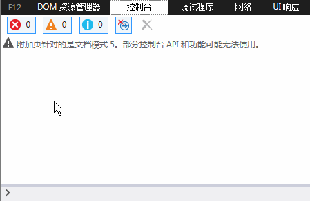
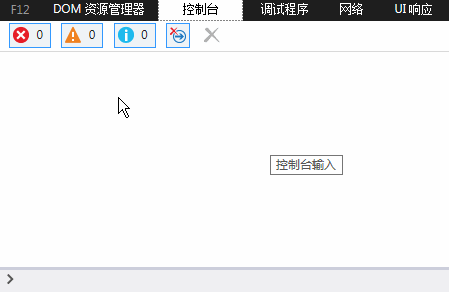
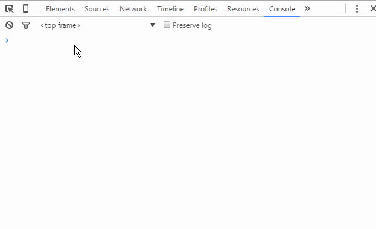
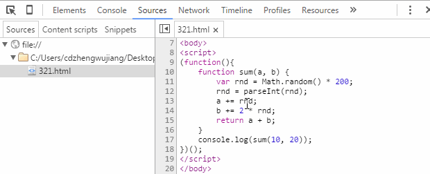
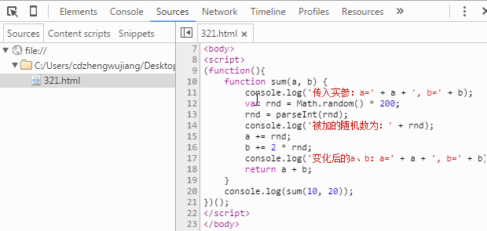
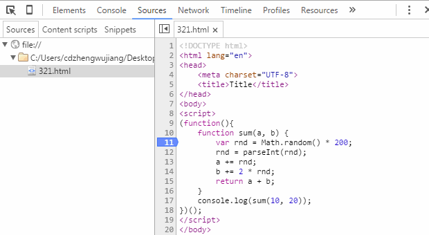

**一探前端开发中的JS调试技巧**

### **1、骨灰级调试大师Alert**

​	那还是互联网刚刚起步的时代，网页前端还主要以内容展示为主，浏览器脚本还只能为页面提供非常简单的辅助功能的时候。那个时候，网页主要运行在以IE6为主的浏览器中，JS的调试功能还非常弱，只能通过内置于Window对象中的alert方法来调试，那时候看起来应该是这个样子：

 

​	需要说明一点，这里看到的效果，并非当年的IE浏览器中看到的效果，而是在高版本IE中的效果。此外，当年貌似还没有这么高级的控制台，而alert的使用也是在真实的页面JS代码中。虽然，alert的调试方式很原始，但当时确实有它不可磨灭的价值，甚至到今天，已然有其用武之地。

 

### **2、新一代调试王者Console**

​	随着JS在Web前端中能做的事情越来越多，责任越来越大，而地位也越来越重要。传统的alert调试方式已经渐渐不能满足前端开发的种种场景。而且alert调试方式弹出的调试信息，那个窗口着实不太美观，而且会遮挡部分页面内容，着实有些不太友好。

​	另一方面，alert的调试信息，必须在程序逻辑中添加类似"alert(xxxxx)"这样的语句，才能正常工作，并且alert会阻碍页面的继续渲染。这就意味着开发人员调试完成后，必须手动清除这些调试代码，实在有些麻烦。

​	所以，新一代的浏览器Firefox、Chrome，包括IE，都相继推出了JS调试控制台，支持使用类似"console.log(xxxx)"的形式，在控制台打印调试信息，而不直接影响页面显示。以IE为例，它看起来像这样：

好吧，再见丑陋的alert弹出框。而以Chrome浏览器为首的后起之秀，为Console扩展了更丰富的功能：

 

好了，稍微多说了一点点题外话。总之，控制台以及浏览器内置Console对象的出现，给前端开发调试带来了极大的便利。

有人会问，这样的调试代码不一样需要在调试完成后进行清理吗？

关于这个问题，如果在使用console对象之前先进性存在性验证，其实不删除也不会对业务逻辑造成破坏。当然，为了代码整洁，在调试完成后，还是应尽可能删除这些与业务逻辑无关的调试代码。

### **3、JS断点调试**

> ​	断点，调试器的功能之一，可以让程序中断在需要的地方，从而方便其分析。也可以在一次调试中设置断点，下一次只需让程序自动运行到设置断点位置，便可在上次设置断点的位置中断下来，极大的方便了操作，同时节省了时间。——百度百科

​	JS断点调试，即是在浏览器开发者工具中为JS代码添加断点，让JS执行到某一特定位置停住，方便开发者对该处代码段的分析与逻辑处理。为了能够观察到断点调试的效果，我们预先随意准备一段JS代码：

#### **3.1、Sources断点**

 

​	首先，测试代码中我们通过上图console的输出结果可以看出代码应该是正常运行了，但是为什么是应该呢？因为函数中加了一个随机数，而最终结果是否真的是正确的呢？这是毫无意义的猜想，但是假设我现在就是要验证一下：函数传入的两个数、被加的随机数，以及最终的总和。那么该怎么操作呢？

方法一，前面讲过最普通的，无论使用alert还是console，我们可以这么来验证：

 

从上图发现，我们在代码中新增了三行console代码，用以打印我们关心的数据变量，而最终我们从控制台（Console面板）中的输出结果，可以很清楚的验证整个计算过程是否正常，进而达到我们题设的验证要求。

 

方法二，方法一的验证过程存在很明显的弊端就是，添加了很多冗余代码，接下来我们看一下使用断点进行验证，是否更加方便，先看一个如何加断点，以及断点后是什么效果：

 

​	如图，给一段代码添加断点的流程是"F12（Ctrl + Shift + I）打开开发工具"——"点击Sources菜单"——"左侧树中找到相应文件"——"点击行号列"即完成在当前行添加/删除断点操作。当断点添加完毕后，刷新页面JS执行到断点位置停住，在Sources界面会看到当前作用域中所有变量和值，只需对每个值进行验证即可完成我们题设验证要求。

 

​	那问题来了，仔细的朋友会发现当我的代码执行到断点的时候，显示的变量a和b的值是已经进行过加法运算后的，我们看不到调用sum函数时初始传入的10和20。那么该怎么办呢？这就要回过头来先学习一下断点调试的一些基础知识了。我们打开Sources面板后其实会在界面中看到如下内容，我们跟着鼠标轨迹逐一看看都是什么意思：

 

 

从左到右，各个图标表示的功能分别为：

 

- Pause/Resume script execution：暂停/恢复脚本执行（程序执行到下一断点停止）。
- Step over next function call：执行到下一步的函数调用（跳到下一行）。
- Step into next function call：进入当前函数。
- Step out of current function：跳出当前执行函数。
- Deactive/Active all breakpoints：关闭/开启所有断点（不会取消）。
- Pause on exceptions：异常情况自动断点设置。

 

​	到此，断点调试的功能键介绍得差不多了，接下来我们就可以一行一行去看我们的程序代码，查看每一行执行完毕之后，我们各个变量的变化情况了，如下图所示

如上，我们可以看到a、b变量从最初值，到中间加上随机值，再到最后计算总和并输出最终结果的整个过程，完成题设验证要求不在话下。

其余几个功能键，我们稍微改动一下我们的测试代码，用一张gif图来演示他们的使用方法：

 

 

 

这里需要注意一点，直接在代码区打印变量值的功能是在较新版本的Chrome浏览器中才新增的功能，如果你还在使用较老版本的Chrome浏览器，可能无法直接在断点的情况下查看变量信息，此时你可以将鼠标移动到变量名上短暂停顿则会出现变量值。也可以用鼠标选中变量名称，然后右键"Add to watch"在Watch面板查看，此方法同样适用于表达式。此外，你还可以在断点情况下，切换到Console面板，直接在控制台输入变量名称，回车查看变量信息。该部分比较简单，考虑篇幅问题，不在做图演示。

#### **3.2、Debugger断点**

所谓的Debugger断点，其实是我自己给它命名的，专业术语我也不知道怎么说。具体的说就是通过在代码中添加"debugger;"语句，当代码执行到该语句的时候就会自动断点。接下去的操作就跟在Sources面板添加断点调试几乎一模一样，唯一的区别在于调试完后需要删除该语句。

既然除了设置断点的方式不一样，功能和Sources面板添加断点效果一样，那么为什么还会存在这种方式呢？我想原因应该是这样的：我们在开发中偶尔会遇到异步加载html片段（包含内嵌JS代码）的情况，而这部分JS代码在Sources树种无法找到，因此无法直接在开发工具中直接添加断点，那么如果想给异步加载的脚本添加断点，此时"debugger;"就发挥作用了。我们直接通过gif图看看他的效果：

 

 

 

 

### **4、DOM断点调试**

 

 

DOM断点，顾名思义就是在DOM元素上添加断点，进而达到调试的目的。而在实际使用中断点的效果最终还是落地到JS逻辑之内。我们依次来看一下每一种DOM断点的具体效果。

 

 

#### **4.1、当节点内部子节点变化时断点（Break on subtree modifications）**

 

 

在前端开发越来越复杂的今天，前端JS代码越来越多，逻辑越来越复杂，一个看似简单的Web页面，通常伴随着大段大段的JS代码，涉及诸多DOM节点增、删、改的操作。难免遇到直接通过JS代码很难定位代码段的情况，而我们却可以通过开发者工具的Elements面板，快速定位到相关DOM节点，这时候通过DOM断点定位脚本就显得尤其重要了。具体我们还是通过gif演示来看一下吧：

 

 

 

 

上图演示了对ul子节点（li）的增加、删除以及交换顺序操作触发断点的效果。但需要注意的是，对子节点进行属性修改和内容修改并不会触发断点。

 

 

#### **4.2、当节点属性发生变化时断点（Break on attributes modifications）**

 

 

另一方面，由于前端处理的业务逻辑越来越复杂，对一些数据的存储依赖越来越强烈，而将临时数据存储于DOM节点的（自定义）属性中，是很多情况下开发者优先选择的方式。特别是在HTML5标准增强自定义属性支持（例：dataset、data-*之类）之后，属性设置应用越来越多，因此Chrome开发者工具也提供了属性变化断点支持，其效果大致如下：

 

 

 

 

此方式同样需要注意，对子节点的属性进行任何操作也不会触发节点本身的断点。

 

 

#### **4.3、当节点被移除时断点（Break on node removal）**

 

 

这个DOM断点设置很简单，触发方式很明确——当节点被删除时。所以通常情况应该是在执行"parentNode.removeChild(childNode)"语句的时候使用此方式。此方式使用不多。

 

 

前面介绍到的基本上是我们在日常开发中经常用到的调试手段，运用得当它们也几乎能应对我们日常开发中的几乎所有问题。但是，开发者工具还考虑到了更多的情况，提供更多的断点方式，如图：

 

 

 

 

### **5、XHR Breakpoints**

 

这几年前端开发发生了翻天覆地的变化，从当初的名不见经传到如今的盛极一时，Ajax驱动Web富应用，移动WebApp单页应用风生水起。这一切都离不开XMLHttpRequest对象，而"XHR Breakpoints"正是专为异步而生的断点调试功能。

 

 

我们可以通过"XHR Breakpoints"右侧的"+"号为异步断点添加断点条件，当异步请求触发时的URL满足此条件，JS逻辑则会自动产生断点。演示动画中并没有演示到断点位置，这是因为，演示使用的是jQuery封装好的ajax方法，代码已经过压缩，看不到什么效果，而事实上XHR断点的产生位置是"xhr.send()"语句。

 

 

XHR断点的强大之处是可以自定义断点规则，这就意味着我们可以针对某一批、某一个，乃至所有异步请求进行断点设置，非常强大。但是，似乎这个功能在日常开发中用得并不多，至少我用得不多。想想原因大概有两点：其一，这类型的断点调试需求在日常业务中本身涉及不多；其二，现阶段的前端开发大多基于JS框架进行，最基本的jQuery也已经对Ajax进行了良好封装，极少有人自己封装Ajax方法，而项目为了减少代码体积，通常选择压缩后的代码库，使得XHR断点跟踪相对不那么容易了。

 

 

### **6、Event Listener Breakpoints**

 

 

事件监听器断点，即根据事件名称进行断点设置。当事件被触发时，断点到事件绑定的位置。事件监听器断点，列出了所有页面及脚本事件，包括：鼠标、键盘、动画、定时器、XHR等等。极大的降低了事件方面业务逻辑的调试难度。

 

 

 

 

演示实例演示了当click事件被触发时和当setTimeout被设置时的断点效果。实例显示，当选中click事件断点之后，两个按钮的被点击时都触发了断点，而当setTimeout被设置时，"Set Timer"断点被触发。

 

 

调试，是在项目开发中非常重要的环节，不仅可以帮助我们快速定位问题，还能节省我们的开发时间。熟练掌握各种调试手段，定当为你的职业发展带来诸多利益，但是，在如此多的调试手段中，如何选择一个适合自己当前应用场景的，这需要经验，需要不断尝试积累。