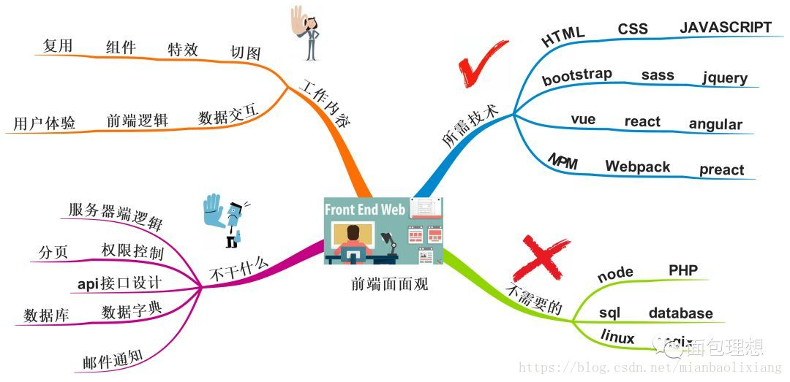
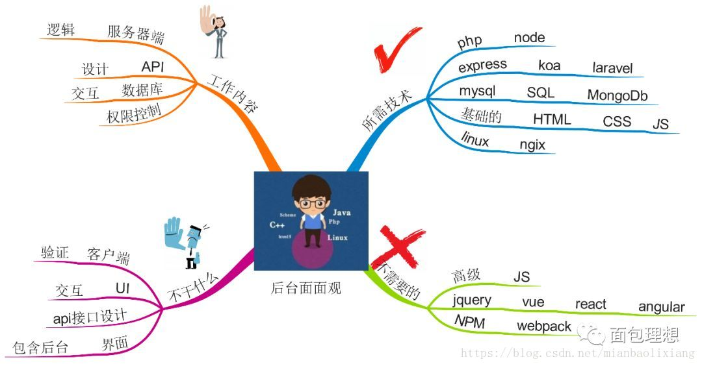
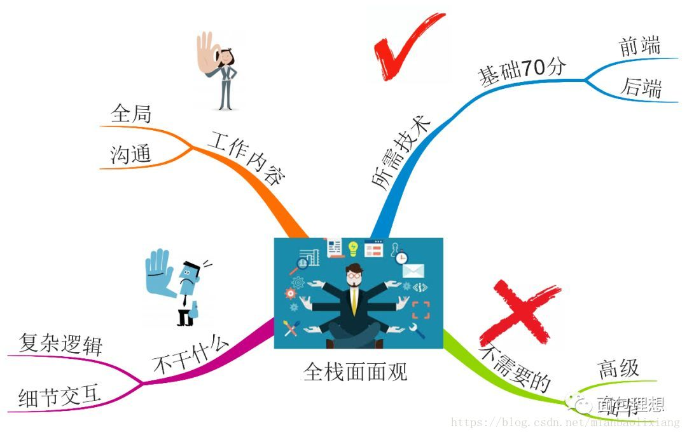
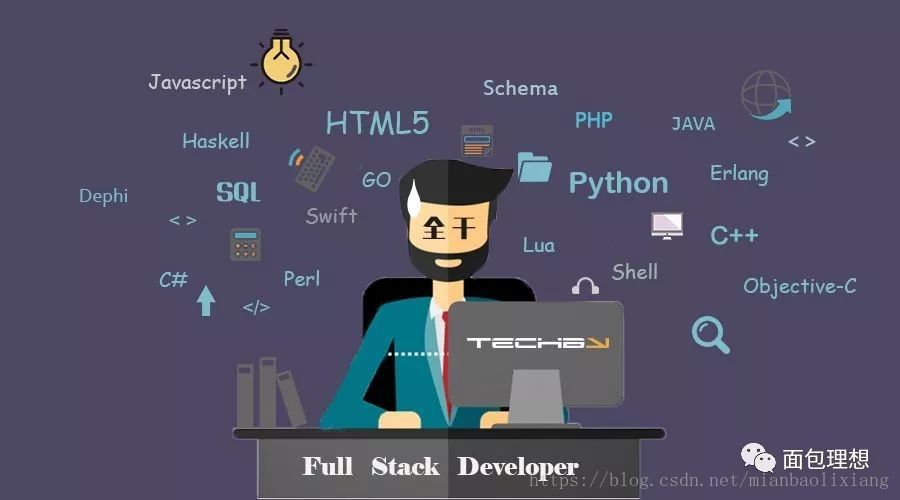

# 前端、后端和全栈到底不该学什么

1、前言

在职业规划咨询过程中经常会被问到这样的问题：

老师，我是该深入钻研专精一门，走技术大牛路线，还是所有都要精通，做一个全栈工程师？

类似问题的变种还有，老师我是不是该30岁最迟35岁就要转管理了，是不是技术年龄大了就没有优势，精力跟不上了？

这是一个从业者普遍存在的问题，反应了技术发展的两个方向，**一种是纵向一种是横向的**，横向的是瑞士军刀，纵向的是削铁如泥的干将莫邪。 到底选哪个呢？

要想弄明白这个问题我们要说清楚，全栈是什么？说道这个我想起我以前的职位还闹了一个笑话。

有人问我：你什么职位啊？

我说：前后端开发工程师。

然后他说：是前端开发工程师？

我说：不是。

他说是：后端开发工程师？

我说：不是。

他说：啥叫前后端开发工程师啊？

我说了那个我很不愿意说的词儿，尽可能让他明白，全栈工程师。

他说：就是啥都会干呗？

我说不是。

2、前端、后端、全栈是什么？

然后我岔开了话题，是的，前端后端全栈很多人都有着误解。

比如很多人按能力排名是这样的：

**前端>后端>全栈**，然后人们都喜欢最牛掰的，就像没人知道第二个登上月球的人一样，然后全栈就火了。我先把这三个工种该做什么不该做什么，大家就清楚怎么做了。

**前端：**

所有你能看到的东西都是前端做的，比如界面，比如交互，当然还有数据从后台读取展示和向后台发送数据。

（具体对比如图，一图抵万言。）

 

**后端：**

所有跟业务逻辑权限控制数据处理有关的都是后台做的，比如权限控制，订单管理，数据库交互。

 

**全栈：**

前端后端都有一定的了解和能力，能够前后端独立工作。

 

通过三者的综述，大家可以清晰的分出前端和后端的工作内容和所需技术，但是对全栈还是不是很了解，至少他不是简单的前端+后端技术的叠加。那么全栈到底工作内容是什么呢？他的价值又在哪呢？我们是否需要成为这样的人呢？

3、全栈工作内容是什么？

首先全栈是**掌握多种技能**，并能利用多种技能**独立完成产品**的人 。

他们掌握着独立完成产品常用的**20%技能**，另外的**80%**需要的时候有能力获得。而另外两个工种是掌握着**专业领域80%的技能**，甚至是**90%**，另外的**10%通过其他渠道获得**。

 

4、全栈价值是什么？

全栈工程师的**工作内容和价值**融在一起。

全栈工程师就算是各方面都是**80%**（确实有这样的人存在），但是精力有限，他一个人不能长期干**3-5个人**的活儿。所以他们工作的大部分内容在**全局性把握和沟通**，特别优秀的全栈能做到关**键性技术指导。**

**全局性把握**

现代项目的开发，很少说只用到一两种技术的，特别是移动互联网大潮下。随便一个互联网项目中用到的技术，就会需要用到后端开发、前端开发、界面设计、产品设计、数据库、各种移动客户端、三屏兼容、restFulAPI设计和OAuth等等，一些比较前卫的项目，可能会用到SinglePage Application、Web Socket、HTML5/CSS3这些技术，还有像第三方开发像微信公众号微博应用等等。

Web前端也远远不是从前的切个图用个jQuery上个AJAX兼容各种浏览器那么简单了。现代的Web前端，你需要用到模块化开发、多屏兼容、MVC，各种复杂的交互与优化，甚至你需要用到Node.js来协助前端的开发。

所以说一个现代化的项目，是一个非常复杂的构成，我们需要一个人来掌控全局，他不需要是各种技术的资深专家，但他需要熟悉到各种技术。对于一个团队特别是互联网企业来说，有一个全局性思维的人非常非常重要。

**在恰当的时机用恰当的技术开发实现恰当的产品常常要远比具体某个功能实现要复杂和重要的多，而这是全栈工程师需要考虑的。**

**沟通成本**

项目越大，沟通成本越高，做过项目管理的人都知道，项目中的人力是1+1<2的，人越多效率越低。因为沟通是需要成本的，不同技术的人各说各话，前端和后端是一定会掐架的。每个人都会为自己的利益而战，毫不为已的人是不存在的。

而全栈工程师的成本几乎为零，因为各种技术都懂，胸有成竹，一不小心自己就全做了。即使是在团队协作中，与不同技术人员的沟通也会容易得多，你让一个后端和一个前端去沟通，那完全是鸡同鸭讲，更不用说设计师与后端了。但如果有一个人懂产品懂设计懂前端懂后端，那沟通的结果显然不一样，因为他们讲的，彼此都能听得懂。

**全栈工程师的机会**

创业型公司和中小型公司的发展，尤其是万众创业的风潮，会促进全栈工程师的发展，也会更加凸显他们的价值，因为虽然单个全栈工程师的工资很高，但是远比专业性分工团队的成本要低得多，而且全栈工程师更能应对多变的创业公司需求，降低团队沟通成本。

5、**全栈面临的困境是什么？**

**但是，很多人为了成为全栈工程师或者已经是全栈工程师面对着巨大的困境。**

1.一个工作两年的切图都比一个全栈工程师切图好，一个8k的java都比3W的全栈写的代码快，他们经历着博而不精的煎熬。

2.成为全栈很多人需要花费大量的学习时间，到最后依然是无功而返。

最后造成了一个现象是，你确实什么都会，问题是我要的是一个8k的切图，而不是一个3万什么都会一点的全栈。

造成这两个现象的原因有**内因和外因**两个方面。

**内因看**个人定位不清晰，在该专精的时候选择了全栈。

不管是前端还是后台，全栈的意思是你能够独立工作，不是你前端会切个图，后端你会写个sql就行的，而一个领域没有三年是达不到上述情况的，而很多人工作三年切图或者js就想着全栈了。

全栈不是一不小心成为的，是你的工作经验堆出来的，不是学出来的。举个例子大家就明白了，大家都看过武侠小说，大家知道哪位顶尖的武林高手一出师门就励志学会武林各门各派武功的？相反提起东邪，大家想到的是他吹笛子能吹死人，说到西毒立马想到蛤蟆功，说到南帝一阳指，说到北丐打狗棒，那为啥到你就得工作三四年就全栈，前后端啥都会呢？

武侠里面有两个全栈工程师，一个是鸠摩智，号称会少林七十二绝技，结果呢，最后变成了“打残哥”，虚竹来了把他打残了，段誉来了把他打残了，最后乔峰来了又把他打残了，所以想通过学习变成全栈肯定会死的比鸠摩智还惨。

那怎么办？武侠最强全栈是扫地僧，这家伙是bug级存在，但是大家发现人家是靠年头熬出来的。所以这个是正路，**全栈是经验不是课本，是一种思维。**

 

为什么说国外全栈很多呢。因为很多人都是10年以上工作经验，一开始是后台工作，工作了几年跳槽了换了一家工作发现需要数据交互又做数据交互了，这个时候也会简单的切图了，然后工作又变动发现切图和套js太麻烦了。

用vue试试一不小心又会vue了，vue写多了，发现后端是不是也可以用js啊，有了node和koa，那数据库是不是可以呢，上MongoDB，最后发现这个语言不好用，我自己写个吧。所以很多全栈都是大胡子中年。

全栈应该是业务需求催出来的，而不是学出来的。可是现在很多提全栈的人都是什么人呢？大部分是工作3-5年想转管理的。

其实全栈和技术大牛是殊途同归的，就像**《人月神话》**里面技术专家和手术刀其实最后都融合了。你学吃饭的过程想过是只学用筷子还是勺子吗？

因为当专到一定程度的时候自然就**融会贯通**了，反过来当你博采众长的时候，自然就知道哪里自己薄弱需要加强了，全栈和专业并不冲突，他们的目的都是为了完成工作这件事。

从外因看，‍科技节奏的飞速发展，万众创业催生出了一系列小型公司，‍从成本催生了对全栈的热捧，另外知识行业的贩卖焦虑，培训行业的推波助澜，‍加剧了前端行业对全栈的急功近利的追求。

所以所有前端从业者应该明白，技术是为解决问题服务的，找准自己的位置，通过时间去不小心成为全栈，而不是成为书本里的全栈，做一个务实的技术从业者，那么他的明天一定是光明美好的。

最后一句，**技术是为解决问题服务的**。