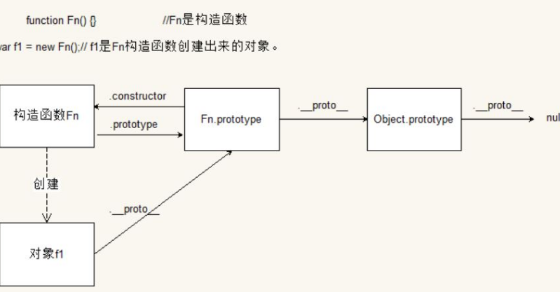
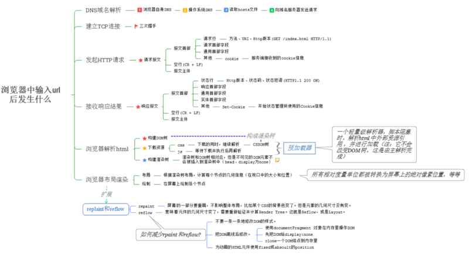

# js--进阶

## 1.原型链

许多OO语言支持两种继承方式：接口继承和实现继承。 
接口继承只继承方法签名，实现继承则继承实际的方法。 
由于函数无签名，在JavaScript中无法实现接口继承。所以只能实现方法继承。
实现继承主要依赖原型链。
**基本思想**：利用原型，让那个一个引用类型继承另一个引用类型的属性和方法。A.prototype= new B();让原型对象等于另一个类型的实例。 
所有函数的默认原型都是Object的实例
即A继承了B ；B 继承了Object;

**什么是原型对象**。我们知道每个构造函数一旦创建都有prototype指针指向它的原型对象（构造函数.prototype）。而原型对象（构造函数.prototype）会默认生成一个constructor指针又指向构造函数。在创建实例时，每个实例有一个__proto__指向该原型对象。原型对象内创建的所有方法会被所有实例共享。
例：

```
 Function.prototype = {    
        constructor : Function,
        __proto__ : parent prototype,
        some prototype properties: ...
    };
```

原型对象中的方法属性是被所有实例共享的。如果含有引用类型的属性，如数组，修改person1中的数组属性，也会导致person2中的该属性发生变化。

**什么是原型链？**
函数的原型对象constructor默认指向函数本身，原型对象除了有原型属性外，为了实现继承，还有一个原型链指针proto，该指针指向上一层的原型对象，而上一层的原型对象的结构依然类似，这样利用proto一直指向Object的原型对象上，而Object的原型对象用Object.prototype.proto = null表示原型链的最顶端，如此变形成了javascript的原型链继承，同时也解释了为什么所有的javascript对象都具有Object的基本方法。

原型链就是创建一个构造函数，它会默认生成一个prototype属性并指向原型对象。使用下一个构造函数的原型对象作为这个构造函数的实例。即 A.prototype = new B(); 在下下一个构造函数的原型对象 = new nextFuction。这样下去就会构成一条实例与原型之间的链条，这就是原型链。



## 2.继承

构造函数A()和实例a1 a2之间的关系；var a1 = new A(); var a2 = new A();
实例a1与实例a2是独立的
实例和原型的关系 a1.__proto__ = A.prototype
构造函数A()和其原型的关系 A.prototype.constructor=A

**6种继承方式**
**原型链继承本质:**
是子用类型B的原型等于超类型的实例, 
B.prototype= new A()

**构造函数继承本质:**
是子用类型的构造函数内部调用A(),
B(){A.call(this,**);}

**组合继承本质**
原型链和构造函数的组合，原型继承方法，构造函数继承属性

**原型式继承本质**:基于已有对象创建一个对象,
即对象A的浅拷贝,
var b= Object.create(A)

**寄生式继承本质:**
创建一个用于封装继承过程的函数,
function b(A){var clone = Object.create(A) ;clone.**=**;return clone;}

**寄生组合继承本质:**
寄生式继承超类型A的原型,并将结果赋值给子类型的原型;
或对对象A的原型浅拷贝，
function B(**){

```
A.call(this,**)
```

}
function c(A,B){var clone = Object.create(A.prototype); clone.constructor = B;B.prototype=clone;) ;}

```
 function Person(name) {
            this.name = ['123','456','789',name];
        }
        Person.prototype.go = function(){
            return console.log(this.name)
        }
        Person.prototype.sex = ['男','女'];
        var ren = new Person();
        console.log('构造函数和原型的关系:',Person.prototype.constructor ===Person)
        console.log('实例和原型的关系',ren.__proto__ ===Person.prototype)
        
        // 原型链继承 
        // 缺点1.不能向person中传递参数；
        // 缺点2.超类型的原型属性会被其他实例共享，一个实例改变，则其他实例也改变。
        // 下面2个原型的顺序不能换  
        function Shuagnfeng(love) {
            this.love = ['fd','fddfdf']; 
        }
        Shuagnfeng.prototype = new Person();
        console.log('会误会超类型Person:',Shuagnfeng.prototype.constructor ===Person) //true
        console.log('构成原型链,',Shuagnfeng.prototype.__proto__ ===Person.prototype) //true
        Shuagnfeng.prototype.constructor ===Shuagnfeng;
        Shuagnfeng.prototype.goWork = function(){
           return  console.log('原型链继承的方法');
        }
        var child = new Person();
Shuagnfeng.prototype.name.push(121);
console.log('超类型实例2 child',child.name);

        var xiaozhang = new Shuagnfeng('dff');
        var xiaozhang1 = new Shuagnfeng('zzz');
        xiaozhang.go();
        xiaozhang.goWork();   
        xiaozhang.name.push('只对xiaozhang增加属于超类型Person中array值',22);
        xiaozhang.love.push('只对xiaozhang增加属于构造函数中array值',22);
        xiaozhang.sex.push('只对xiaozhang增加属于超类型的原型中array值');

        console.log('xiaozhang.超类型Person中name',xiaozhang.name);
        console.log('xiaozhang1.超类型Person中name',xiaozhang1.name);
        console.log('xiaozhang.构造函数中中love',xiaozhang.love);
        console.log('xiaozhang1.构造函数中love',xiaozhang1.love);
        console.log('xiaozhang.超类型的原型中sex',xiaozhang.sex);
        console.log('xiaozhang1.超类型的原型中sex',xiaozhang1.sex);


// 构造函数的继承
// 优点，不会改变引用类型的属性，能传递参数
// 缺点无法复用方法；
        function Jianbo() {
            Person.call(this,'构造函数的继承')
        }
        var xiaonie = new Jianbo();
        console.log('构造函数的继承xiaonie.name可传参数',xiaonie.name);
       // xiaonie.go(); // 不存在


// 组合继承
// 原型链继承方法、构造函数继承属性
        function Nb(love) {
            Person.call(this,'nb')
            this.love = love
        }
        Nb.prototype = new Person('12');
        console.log('12',Nb.prototype.constructor ===Person) // true 
        console.log('13',Nb.prototype.constructor ===Nb)// false 因为重写原型，会使原型失去了constructor属性
        Nb.prototype.constructor =Nb
         console.log('14',Nb.prototype.constructor ===Person) // false
        Nb.prototype.say = function(){
            console.log('say','say')
        }
        var nb= new Nb();
        var nb1= new Nb('组合继承');
        nb.name.push('xiaoniubi');
        console.log('nb.name',nb.name);
        console.log('nb1.name',nb1.name);
        console.log('nb1.love',nb1.love);
        nb.go();
        nb.say();

// 原型式继承Object.create()  将基础对象传给object()函数 
// 本质是浅复制  副本的引用类型会被改变
// 缺点：引用类型的属性会被共享  和原型链继承差不多
// 使用场景： 让一个对象与另一个对象的保持类似
function object(o){
    function F(){}
    F.prototype= o;
    return new F();
}
var animal = {
    name:'原型式继承默认值',
    friends:[1,2,3,4]
}
var haha= object(animal);
var gaga = Object.create(animal);
var haha1= object(animal);
console.log('haha',haha.name);
console.log('gaga',gaga.name);
haha.name='原型式继承name值变了';
haha.friends.push('原型式继承array值变了');
console.log('haha',haha.name);
console.log('haha1',haha1.name);
console.log('haha',haha.friends);
console.log('haha1',haha1.friends);

// 寄生式继承
// 能继承方法，但方法不能复用
function createAnother(original){
 var clone =  object(original);
 clone.say = function(){
    console.log('寄生式继承方法')
 }
  return clone;
}

var hh = createAnother(animal);
hh.name='寄生式继承'
console.log('hh',hh.name);
hh.say()       

// 寄生组合式
// 所有方式中最有效的方式 只调用继承的构造函数一次


// 判断实例和原型的关系  使用instanceof 和 isPrototypeOf()
        console.log('实例和原型的关系',xiaozhang instanceof Shuagnfeng);
        console.log('实例和原型的关系',xiaozhang instanceof Person);
        console.log('实例和原型的关系',xiaozhang instanceof Object);
        console.log('实例和原型的关系',Object.prototype.isPrototypeOf(xiaozhang));
        console.log(xiaozhang.__proto__); 
```

## 3.事件委托

事件处理程序 获取事件对象 事件目标 
好处 减少DOM 操作 ，减少性能

```
<div id="list">
    
    
    
</div>

    <script type="text/javascript">
    var EventUtil = {
        addHandler: function(element,type,handler) {
            if(element.addEventListener) {
                element.addEventListener(type,handler,false)
            } else if(element.attachEvent){
                element.attachEvent("on" + type, handler);
            } else {
                element["on" + type] = handler;
            }
        },
        removeHandler:function(element,type,handler) {
            if(element.removeEventListener) {
                element.removeEventListener(type,handler,false)
            }
        },
        getEvent:function(event){
            return event ? event : window.event;
        },
        getTarget:function(event){
            return event.target || event.srcElement;
        },
    }
    var list = document.getElementById('list')
    EventUtil.addHandler(list,'click',function(ev){
        event= EventUtil.getEvent(ev);
        var target = EventUtil.getTarget(event);
        alert(target.id);
    })
    //    list.onclick = function(ev){
//         　var ev = ev || window.event;
// 　　　　var target = ev.target || ev.srcElement;
//         console.log(target.id);
//     }
    </script>
```

## 4.跨域

**造成跨域的原因**：
浏览器的同源策略，即XMLHttpRequest(XHR)对象只能访问同一域中的资源
这是种防止恶意行为的安全策略。
第二个：浏览器中不同域的框架之间是不能进行js的交互操作的。

**何谓同源**:URL由协议、域名、端口和路径组成，如果两个URL的协议、域名和端口相同，则表示它们同源。

在浏览器中，<script>、、<iframe>、<link>等标签属于DOM， 非XHR对象，是可以加载跨域资源

**跨域方法**(实践中后两种最常用，所以重点介绍):
(1) 通过jsonp跨域
ajax请求受同源策略影响，不允许进行跨域请求，而script标签src属性中的链接却可以访问跨域的js脚本，利用这个特性，服务端不再返回JSON格式的数据，而是返回一段调用某个函数的js代码，在src中进行了调用，这样实现了跨域。
(2) 通过修改document.domain来跨子域
(3) 使用window.name来进行跨域
(4) 使用HTML5中新引进的window.postMessage方法来跨域传送数据
(5) 使用**代理服务器**,使用代理方式跨域更加直接，因为同源限制是浏览器实现的。如果请求不是从浏览器发起的，就不存在跨域问题了。

```
使用本方法跨域步骤如下：
1. 把访问其它域的请求替换为本域的请求
2. 服务器端的动态脚本负责将本域的请求转发成实际的请求

为了通过Ajax从http://localhost:8080访问http://localhost:8081/api，可以将请求发往http://localhost:8080/api。
然后利用Apache Web服务器的Reverse Proxy功能做如下配置：ProxyPass /api http://localhost:8081/api
```

(6) **CORS全称是"跨域资源共享**"（Cross-origin resource sharing),CORS需要浏览器和服务器同时支持。目前，所有浏览器都支持该功能 发送请求时，附加一个额外的Origin头部
IE：XDR(XDomainRequest) 创建一个xdr实例，调用open() ,再send()方法；
其他的，原生的支持，使用绝对的URL即可。

附：ajax的扩展，comment/Web Sockets
(7) fetch api

## 5.输入url之后，到底发生了什么？



## 6 JS引擎

浏览器内核又可以分成两部分：
**渲染引擎(layout engineer或者RenderingEngine)和JS引擎。**
JS的引擎深入分析[链接描述](https://blog.csdn.net/xygg0801/article/details/51925149)
[10分钟理解JS引擎的执行机制](https://segmentfault.com/a/1190000012806637)
[http://www.ruanyifeng.com/blo...](http://www.ruanyifeng.com/blog/2014/10/event-loop.html)
**JS引擎负责对JavaScript进行解释、编译和执行，以使网页达到一些动态的效果。**

js的**几种引入方式**；
**js引擎是单线程 异步的**
--- 任务队列 事件 和回调函数 Event Loop 
是通过的事件循环(event loop),实现单线程和异步的。
**单线程**：同一时刻只能执行一个代码块
将要执行的代码放在任务队列中，但js引擎执行代码块结束，事件循环会执行任务队列中的下一个任务。
Event Loop 负责监控代码执行和管理任务队列。
异步的，即可通过事件 回调等方式，向任务队列中添加新任务。

**JS的执行机制是**

首先判断JS是同步还是异步,同步就进入主进程,异步就进入event table
异步任务在event table中注册函数,当满足触发条件后,被推入event queue
同步任务进入主线程后一直执行,直到主线程空闲时,才会去event queue中查看是否有可执行的异步任务,如果有就推入主进程中
以上三步循环执行,这就是event loop

准确的划分方式是:
macro-task(宏任务)：包括整体代码script，setTimeout，setInterval
micro-task(微任务)：Promise，process.nextTick
按照这种分类方式:JS的执行机制是

执行一个宏任务,过程中如果遇到微任务,就将其放到微任务的【事件队列】里
当前宏任务执行完成后,会查看微任务的【事件队列】,并将里面全部的微任务依次执行完
重复以上2步骤,结合event loop(1) event loop(2) ,就是更为准确的JS执行机制了。

7 错误监控 
**前端错误的分类**

1. 运行时错误（代码错误）
2. 资源加载错误
3. 接口错误

**错误的捕获方式**

**运行时错误的捕获方式：**

```
try...catch
window.onerror 含有详细的error信息  
    window.onerror = function(msg, url, lineNo, columnNo, error){}
window.addEventListener('error')
     window.addEventListener('error', event =>  
        { console.log('addEventListener error:' + event.target); 
        }, true); 
   
```

**资源加载错误：**

```
object.onerror（如img,script）
performance.getEntries()
Error事件捕获
```

**接口错误：**

```
    所有http请求都是基于xmlHttpRequest或者fetch封装的。
    所以要捕获全局的接口错误，方法就是封装xmlHttpRequest或者fetch
```

**结论**
1.使用window.onerror捕获JS运行时错误
2.使用window.addEventListener(‘unhandledrejection’)捕获未处理的promise reject错误
3.重写console.error捕获console.error错误
4.在跨域脚本上配置crossorigin="anonymous"捕获跨域脚本错误
window.addEventListener(‘error’)捕获资源加载错误。因为它也能捕获js运行时错误，为避免重复上报js运行时错误，此时只有event.srcElement inatanceof HTMLScriptElement或HTMLLinkElement或HTMLImageElement时才上报
5.重写window.XMLHttpRequest和window.fetch捕获请求错误

**延伸**：跨域的js运行错误可以捕获吗，错误提示什么，应该怎么处理？

```
可以。
Script error
1.在script标签增加crossorigin属性
2.设置js资源响应头Access-Control-Allow-Orgin:*
```

**上报错误的基本原理**


```
1. 采用Ajax通信方式上报
2. 利用Image对象上报
```


<https://segmentfault.com/a/1190000014728771#articleHeader19>