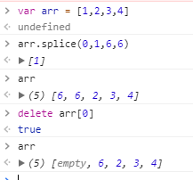

# JS基础

## 1.数据类型？

**6基本数据类型**： Undefined, Null, Boolean, Number, String ,Symbol
**引用类型：** Array Object Date Function

**区别：**
基本类型值保存在栈空间，我们通过按值来访问的。
引用类型，的值是对象，栈内存中存放地址指向堆内存中的对象。是按引用访问的。栈内存中存放的只是该对象的访问地址，在堆内存中为这个值分配空间。
1.基本数据类型不可以添加/删除属性和方法；
2.复制的方式不同；引用类型复制的时候，复制的是指针，2个变量实际指的是同一个对象。
3.函数的参数是按值传递的
**检测数据类型** typeof instanceof
**转型数据类型**

```
显式：Boolean()/Number()/pareseInt()/pareseFloat()/toString()/String()
隐私： +、 赋值
```

**区别**： undefined与null 的区别

**null：**

```
是Null类型的值.
是个空值，空对象指针.
typeof null，结果为Object;
null用来表示尚未存在的对象.
```

**undefined :**

```
是Undefined类型的值。
typeof undefined，结果为undefined;
一个声明了变量，但未初始化值，结果就是undefined
没有返回值的函数，返回的也是undefined,
没有实参的形参也是undefined;
```

**symbol**
表示独一无二的值
Symbol 值通过Symbol函数生成
对象的属性名现在可以有两种类型，一种是原来就有的字符串，另一种就是新增的 Symbol 类型
Symbol函数前不能使用new命令，否则会报错。这是因为生成的 Symbol 是一个原始类型的值，不是对象
由于 Symbol 值不是对象，所以不能添加属性。**基本上，它是一种类似于字符串的数据类型**
Symbol函数的参数只是表示对当前 Symbol 值的描述，因此相同参数的Symbol函数的返回值是不相等的。因为symbol的每个值不相等。
Symbol 值不能与其他类型的值进行运算，会报错
Symbol 值可以显式转为字符串。
Symbol 值也可以转为布尔值，但是不能转为数值
Symbol 值作为对象属性名时，不能用点运算符。

## 2.面向对象？

**何为面向对象**
 万物皆对象，
 对象又有如下特点：　
 抽象：抓住核心问题
 封装：只能通过对象来访问方法
 继承：从已有的对象下继承出新的对象
 多态：多对象的不同形态
**创建对象的5种方式**
 1.工厂方式创建对象：面向对象中的封装函数(内置对象)
 2.构造函数创建对象
 优点：创建自定义函数意味着将来可以将它的实例标识为一种特定的类型，这是构造函数胜过工厂模式的地方
 缺点：每个方法都要在每个实例上重新创建一遍
 3、对象字面量方式创建对象
 4、用原型方式　
 1、优点：可以让所有的对象实例共享它所包含的属性和方法
 2、缺点：原型中是所有属性都是共享的，但是实例一般都是要有自己的单独属性的。所以一般很少单独使用原型模式。
 5.混合模型：构造函数模式定义实例属性，而原型模式用于定义方法和共享的属性
总结：使用上述的混合法

## 3.Array

**数组的增加**

```
array.push()   向数组末尾添加元素，返回的是添加后新数组的长度，原有数组改变
array.unshift()  向数组开头添加元素，返回的是添加后新数组的长度，原有数组改变
array.splice(n,m)   从索引n开始删除m个元素，把删除的内容当做新数组返回，原有数组
array.concat()
// ES6的合并数组
[...arr1, ...arr2, ...arr3]
Array.prototype.push.apply(arr1,arr2);)----将arr2追加到arr1中，返回数组的长度
```

**数组的删除**

```
array.pop() 删除数组的最后一项，返回的是删除的那一项，原有数组改变
array.shift() 删除数组的的第一项，返回的是删除的那一项，原有数组改变
splice(n,m,x) 从索引n开始删除m个元素，然后插入元素x，把删除的内容当做新数组返回，原有数组改变。作删除使用，x不传入数据既可。
slice(n,m) 从索引n开始删除m个元素,返回删除项，原数组不变
length   减小数组的长度，实际是从数组尾部删除元素，改变原数组。
```

**改**

```
其实只有一种 splice(),但delete方法，我个人感觉算修改不属于删除，详情请见实例
```



**查**

```
indeOf() 
lastIndexOf()
find()
findIndex()
includes()
[1, 4, -5, 10].find((n) => n < 0)    // -5
[1, 4, -5, 10].findIndex((n) => n < 0)    // 2
[1, 2, 3].includes(2)     // true
```

**排序**
array.reverse() 把数组倒过来排序，原有数组改变
array.sort() 可以实现由大到小或者由小到大的排序 但是直接写sort只能排序十以内的数字

## 3.1类型转换

**数组 对象 字符串 的转换；**

**array -->string：**

```
join("+") 把数组的每一项拿出来用指定分隔符隔开 ；
tostring 把数组的每一项拿出来用逗号隔开，原有数组不变
```

**obj --> string**

```
JSON.parse(); //可以将json字符串转换成json对象
JSON.stringify(); //可以将json对象转换成json对符串    
```

**string-->array:**

```
split(“,”)
```

**obj --> array：**

```
For… in循环赋值法
Array.from()
```

**number --> array**

```
Array.of()
```

**string --> number** (4种)

```
Number() 
parseFloat()  //  如果parseInt()和parseFloat()不能够把指定的字符串转换为数字，它们就会返回NaN  parseInt(''eleven"); // Returns Nan 
parseInt()  // parseInt()是取整，即丢弃小数部分,保留整数部分 parseInt(2.7) ==>3 
+number // var c = +'2'  typeof c ---number
```

**string <-- number** (4种)
var c = String(number) 
var c = number + ''
var c = number.toString(8) // 将number 转换成8进制的数字 且c的类型是string
var c = number.toFixed(1); //数字转换为字符串，并且显示小数点后的指定的位数 例 number = 123.476,则c= 123.5"

**深浅拷贝**
对象和数组的拷贝有两种 
浅拷贝即 拷贝了指针指向，当一个对象的值改变会影响另一个对象的值。
深拷贝， 拷贝的是真正的值。2者相互独立，互不干扰。
浅拷贝的方法4种方法
slice() concat() 赋值法 遍历
注：concat 和 slice 对一维数组 能算是深拷贝;2维的 是浅拷贝

```
var  a= [1,2,3,4]
b= a.concat();
c=a.concat();
b[0] = 5;
c[0] = 6;
a // [1,2,3,4]
b // [5,2,3,4]
c // [6,2,3,4]
var  aa= [[1,1],[2,2],3,4]
bb= aa.concat();
cc=aa.concat();
bb[1][0] = 5;
cc[0] = 6;
aa // [[1,1],[5,2],3,4]
b // [[1,1],[5,2],3,4]
c // [6,[5,2],3,4]
var shallowCopy = function(obj) {

// 只拷贝对象
if (typeof obj !== 'object') return;
// 根据obj的类型判断是新建一个数组还是对象
var newObj = obj instanceof Array ? [] : {};
// 遍历obj，并且判断是obj的属性才拷贝
for (var key in obj) {
    if (obj.hasOwnProperty(key)) {
        newObj[key] = obj[key];
    }
}
return newObj;
}
```

深拷贝的方法5种方法：
一维数组和对象的concat slice法 JSON.parse(JSON.stringify(arr)) 和遍历法 解构赋值法
示例：（前3种毕竟简单，这里也不表述）
解构赋值法：const a1 = [1, 2]; const a2 = [...a1];或者const [...a2] = a1;

```
var deepCopy = function(obj) {

if (typeof obj !== 'object') return;
var newObj = obj instanceof Array ? [] : {};
for (var key in obj) {
    if (obj.hasOwnProperty(key)) {
        newObj[key] = typeof obj[key] === 'object' ? deepCopy(obj[key]) : obj[key];
    }
}
return newObj;
} 
```

还有一些常用方法如filter() forEach() map() every() some()

详情请见：[最全最细致的数组的方法整理 es5+es6](https://segmentfault.com/a/1190000014408723)

## 5.对象的属性

ES5的属性特性包括下面六个：
 configurable: 表示能否通过delete来删除属性从而重新定义属性，能够修改属性的特性,默认为true
 enumberable: 表示是否能通过for-in循环返回属性。默认为true
 writable: 是否可以修改属性, 默认为true
 value: 包含这个属性的数据值。读取属性值时3,从这个属性读，写入属性时，把新值保存到这个位置。默认值为undefine.
 getter: 在读取属性时，调用的函数
 setter: 在写入属性时调用的函数
 特别注意：一旦调用了Object.defineProperty方法之后，那些未定义的特性值除了configurable为false之外，其他都为undefined;

## 6.DOM

 DOM是针对HTML和XML文档的一个API(应用程序编程接口). DOM描绘了一个层次化的节点树, 允许开发人员添加, 移除和修改页面的某一部分.
 常用的DOM方法:
**1)查找**
a) getElementById(id) //通过元素Id，唯一性 
b) getElementsByTagName() //通过标签名称
c) getElementsByName() //通过元素的Name属性的值(IE容错能力较强，

```
  会得到一个数组，其中包括id等于name值的)
```

**2）添加、移除、替换、插入 复制**
c) appendChild(node) // 可添加 可移动位置;可添加元素 可添加文本
d) removeChild(node) 
e) replaceChild(取代别人的mode,已有节点) // 替换已有节点
f) insertBefore(插入节点,已有节点) //在已有的子节点前插入一个新的子节点
g) cloneNode(true/false) //深浅复制

**3)创建**

```
createDocumentFragment()    //创建一个DOM片段
 createElement()  //创建一个具体的元素 div  p  span
 createTextNode()   //创建一个文本节点
```

4)
i) getAttribute()
j) setAttribute()

**5 常用的DOM属性**
a) innerHTML 节点(元素)的文本值
b) parentNode 节点(元素)的父节点
c) childNodes 
d) attributes 节点(元素)的属性节点

**6.两个节点的关系**

## 7.JS获取盒模型宽高

为了方便书写，以下用dom来表示获取的HTML的节点。

1. dom.style.width/height

　　这种方式只能取到dom元素内联样式所设置的宽高，也就是说如果该节点的样式是在style标签中或外联的CSS文件中设置的话，通过这种方法是获取不到dom的宽高的。

1. dom.currentStyle.width/height

　 这种方式获取的是在页面渲染完成后的结果，就是说不管是哪种方式设置的样式，都能获取到。
　 但这种方式只有IE浏览器支持。

1. window.getComputedStyle(dom).width/height

　　这种方式的原理和2是一样的，这个可以兼容更多的浏览器，通用性好一些。

1. dom.getBoundingClientRect().width/height

　　这种方式是根据元素在视窗中的绝对位置来获取宽高的

1. dom.offsetWidth/offsetHeight
   这个就没什么好说的了，最常用的，也是兼容最好的。

## 8.通用的事件侦听器

主要考核 事件处理程序 和event对象及其属性和方法

```
var EventUtil = {
        addHandler: function(element,type,handler) {//添加事件处理程序
            if(element.addEventListener) {
                element.addEventListener(type,handler,false)
            } else if(element.attachEvent){
                element.attachEvent("on" + type, handler);
            } else {
                element["on" + type] = handler;
            }
        },
        removeHandler:function(element,type,handler) {//移除事件处理程序
            if(element.removeEventListener) {
                element.removeEventListener(type,handler,false)
            }
        },
        getEvent:function(event){// 获取事件对象
            return event ? event : window.event;
        },
        getTarget:function(event){// 获取事件的目标
            return event.target || event.srcElement;
        },
        preventDefault(){
            (event) =>{
                if(event.preventDefault){event.preventDefault()}
                else {event.returnValue= false}
            }
        },
        stopPropagation(){
             (event) =>{
                if(event.stopPropagation){event.stopPropagation()}
                else {event.cancelBubble= true;}
            }
        }
    }
    var list = document.getElementById('list')
    EventUtil.addHandler(list,'click',function(ev){
        event= EventUtil.getEvent(ev);
        var target = EventUtil.getTarget(event);
        alert(target.id);
    })
```

## 9.实现点击ul中li元素

方法有很多，闭包法、立即执行函数法、、事件委托法；
但本题主要考核 DOM事件流 利用事件委托，减少dom操作，提高性能

```
var list = document.getElementById('list')
 list.onclick = function(ev){
       var ev = ev || window.event; 　　　　
       var target = ev.target || ev.srcElement;
       console.log(target.id);
     }
```

## 10.Ajax

**原生的写法**

```
 var xhr = new XMLHttpRequest();
   xhr.onreadystatechange = function(){
       if(xhr.readyState == 4){
           console.log(xhr.status)
            if((xhr.status >= 200 && xhr.status < 300) || xhr.status ==304){
               var hh = xhr.responseText;
               var haha1 = document.getElementById('wokao');
               haha1.innerHTML = hh;
            }else{
                alert('failed11',xhr.status);
            } 
        }
    }
   xhr.open("get","http://10.10.65.109:8888/text.json",true);
   xhr.setRequestHeader("Accept", "application/json"); 
 //  xhr.responseType = "json";
   xhr.send(null);
   
```

**何为异步？** 异步与同步的概念
**实现异步的方法**：回调 事件 promise
**Ajax最大特性**：可以实现动态不刷新（局部刷新）. 
**优点：**

```
通过异步模式，提升了用户体验
优化了浏览器和服务器之间的传输，减少不必要的数据往返，减少了带宽占用
Ajax在客户端运行，承担了一部分本来由服务器承担的工作，减少了大用户量下的服务器负载。
```

**缺点**

```
1、ajax不支持浏览器back按钮。
2、安全问题 AJAX暴露了与服务器交互的细节。
3、对搜索引擎的支持比较弱。
4、破坏了程序的异常机制。
5、不容易调试。

**post 和get的区别：**
```

 GET请求会将参数跟在URL后进行传递，而POST请求则是作为HTTP消息的实体内容发送给WEB服务器。当然在Ajax请求中，这种区别对用户是不可见的。
 GET方式请求的数据会被浏览器缓存起来，因此其他人就可以从浏览器的历史记录中读取到这些数据，例如账号和密码等。在某种情况下，GET方式会带来严重的安全问题。而POST方式相对来说就可以避免这些问题。
 "GET方式提交的数据最多只能是1024字节"，post无
 get请求和post请求在服务器端的区别:在客户端使用get请求时,服务器端使用Request.QueryString来获取参数,而客户端使用post请求时,服务器端使用Request.Form来获取参数.

```
**适用场景：**
POST用于创建资源，资源的内容会被编入HTTP请示的内容中。例如，处理订货表单、在数据库中加入新数据行等。
```

当请求无副作用时（如进行搜索），便可使用GET方法；当请求有副作用时（如添加数据行），则用POST方法。

```
若符合下列任一情况，则用POST方法：
```

- 请求的结果有持续性的副作用，例如，数据库内添加新的数据行。
- 若使用GET方法，则表单上收集的数据可能让URL过长。
- 要传送的数据不是采用7位的ASCII编码。
  若符合下列任一情况，则用GET方法：
- 请求是为了查找资源，HTML表单数据仅用来帮助搜索。
- 请求结果无持续性的副作用。
- 收集的数据及HTML表单内的输入字段名称的总长不超过1024个字符。

1. 对cookie localStorage sessionStorage的理解

------

localStorage和sessionStorage都具有相同的操作方法，例如setItem、getItem和removeItem等

```
**cookie:**
```

 cookie是网站为了标示用户身份而储存在用户本地终端（Client Side）上的数据（通常经过加密）。
 cookie数据始终在同源的http请求中携带（即使不需要），记会在浏览器和服务器间来回传递。
 sessionStorage和localStorage不会自动把数据发给服务器，仅在本地保存。
 存储大小：
 cookie数据大小不能超过4k。
 sessionStorage和localStorage 虽然也有存储大小的限制，但比cookie大得多，可以达到5M或更大。
 有期时间：
 localStorage 存储持久数据，浏览器关闭后数据不丢失除非主动删除数据；
 sessionStorage 数据在当前浏览器窗口关闭后自动删除。
 cookie 设置的cookie过期时间之前一直有效，即使窗口或浏览器关闭
 作用域不同:
 sessionStorage不在不同的浏览器窗口中共享，即使是同一个页面；
 localStorage 在所有同源窗口中都是共享的；cookie也是在所有同源窗口中都是共享的。
 Web Storage 支持事件通知机制，可以将数据更新的通知发送给监听者。
 Web Storage 的 api 接口使用更方便。
sessionStorage用于本地存储一个会话（session）中的数据，这些数据只有在同一个会话中的页面才能访问并且当会话结束后数据也随之销毁。因此sessionStorage不是一种持久化的本地存储，仅仅是会话级别的存储。

而localStorage用于持久化的本地存储，除非主动删除数据，否则数据是永远不会过期的。
Web Storage的概念和cookie相似，区别是它是为了更大容量存储设计的。Cookie的大小是受限的，并且每次你请求一个新的页面的时候Cookie都会被发送过去，这样无形中浪费了带宽，另外cookie还需要指定作用域，不可以跨域调用。

除此之外，Web Storage拥有setItem,getItem,removeItem,clear等方法，不像cookie需要前端开发者自己封装setCookie，getCookie。
**总之：cookie的作用是与服务器进行交互，作为HTTP规范的一部分而存在 ，而Web Storage仅仅是为了在本地“存储”数据而生**
cookie优点：极高的扩展性和可用性 缺点： 数量和长度受限、安全问题
cookie 和session 的区别：
1、cookie数据存放在客户的浏览器上，session数据放在服务器上。
2、cookie不是很安全，别人可以分析存放在本地的COOKIE并进行COOKIE欺骗

```
考虑到安全应当使用session。
```

3、session会在一定时间内保存在服务器上。当访问增多，会比较占用你服务器的性能

```
考虑到减轻服务器性能方面，应当使用COOKIE。
```

4、单个cookie保存的数据不能超过4K，很多浏览器都限制一个站点最多保存20个cookie。
5、所以个人建议：

```
将登陆信息等重要信息存放为SESSION
其他信息如果需要保留，可以放在COOKIE中
```

## 12.IE的不同之处

IE支持currentStyle，FIrefox使用getComputStyle

IE 使用innerText，Firefox使用textContent

滤镜方面：IE:filter:alpha(opacity= num)；Firefox：-moz-opacity:num

事件方面：IE：attachEvent：火狐是addEventListener

鼠标位置：IE是event.clientX；火狐是event.pageX

IE使用event.srcElement；Firefox使用event.target

IE中消除list的原点仅需margin:0即可达到最终效果；FIrefox需要设置margin:0;padding:0以及list-style:none

CSS圆角：ie7以下不支持圆角

## 13.this工作原理

**原则，那就是this指的是调用函数的那个对象。**

javascript 的this主要是看如何调用这个函数，而不是这个函数所在的作用域。obj.fn() fn中的 this 就是 obj。 fn() this是undifine, 而在js进入函数之前，会有 if(!this) { this = window} 这样的操作。

**this 一共有六种不同的值：**

普通函数调用，this为全局对象或是undefined

作为对象的方法，this为那个对象

new 表达式，this为以该函数为原型的新创建的对象

使用 apply/call指定 this

用bind绑定固定的this

事件处理函数中的this是当前的触发事件的DOM元素(event.currentTarget)
IE attachEvent添加的事件处理函数中this为window

```
<!DOCTYPE html>
<html lang="en">
<head>
    <meta charset="UTF-8">
    <title>this</title>
</head>
<body>
在严格模式下，一般的函数调用中 this 的值是 undefined。
<button onclick="console.log(this)" >
    show this
</button>
<p id="hahah">测试DOM元素(event.currentTarget)</p>
<p id="ha">测试DOM元素IE</p>
<script type="text/javascript">
var obj={a:1};
var aa = function func(a,b){ 
    console.log('this',this); 
    console.log('this',a);
    return 1;
}
var bb = function funb(){ console.log('this',this); }
bb.prototype= new aa();//

obj.f = aa;
/*
作为对象的方法 
**
*/
obj.f(123);//输出 obj 123
aa(123); //输出 window  123

(obj.f)();// obj 没懂
(a=obj.f)(); // window
(0,obj.f)(); //  window

/*
call spply bind中this
*
*
*/
aa.call('call',1);// call 1
aa.apply('apply',[1]); // apply 1
var cc = aa.bind('bind',1); 
cc(22); //bind 1
var cc1 = new cc(33)// func 1
/*
*
*new 表达式，this为以 该函数为原型 的新创建的对象
*/
var dd = new aa(11,22); // func {}
var bb1 = new bb();
/*
*
**事件处理函数中的this
**当前的触发事件的DOM元素(event.currentTarget)
**IE attachEvent添加的事件处理函数中this为window
*/
function evtHandle(e)
{
    console.log('e.currentTarget.id',this.id); // 
    console.log('e.target.id',this.id);        // 
}
var elements = document.getElementById('hahah');
var elements1 = document.getElementById('ha');
elements.addEventListener('click',evtHandle,false);
// ie专属  chrome下报错
 // elements1.attachEvent('onclick',evtHandle);

obj = { go: function() { console.info('oo',this) } };
(0 || obj.go)() // window
</script>    
</body>
</html>
```

## 14.函数

1.**函数的调用方式**

1. 方法调用模型 var obj = { func : function(){};} obj.func()
2. 函数调用模式　　var aa = function(){} aa();
3. 构造器调用模式
4. apply/ call调用模式
5. 立即执行函数(function(){}())

区别：函数调用模式，有函数提升的；即aa() 无需必须在var aa = function(){} 后面

2.**return的含义**

注：return不一定非得用在function 中，也可以直接放在html中，如:onsubmit="return false";

语法：return 表达式;
含义：语句结束函数执行，返回调用函数，而且把表达式的值作为函数的结果
通常函数经过一系列的处理后需要给外部返回一个值,这个值一般用return返回出去,也可以是说return是向函数返回返回值,并终止函数的运行.

**return;**

```
含义：即 return null 无函数返回值；
能中断方法的执行，但无法阻止事件的默认行为。
把控制权返回给页面。
```

**return false**;

```
    含义：相当于终止符；
    1. 一般是用来取消默认动作的。比如，终止表单提交。比如你单击一个链接除了触发你的onclick事件外
    还会触发一个默认事件就是执行页面的跳转。
    所以如果你想取消对象的默认动作（event.preventDefault();）就可以return false。
    2. return false 只在当前函数有效，不会影响其他外部函数的执行
    
```

**retrun true；**

```
    含义：相当于执行符。执行终止默认的事件行为
     返回正确的处理结果。
```

## 15.闭包

 **闭包**是指有权访问另一个函数作用域中的变量的函数. 创建闭包常见方式,就是在一个函数内部创建另一个函数.
**作用:** 
1.匿名自执行函数 (function (){ ... })(); 创建了一个匿名的函数，并立即执行它，由于外部无法引用它内部的变量，因此在执行完后很快就会被释放，关键是这种机制不会污染全局对象。
2.缓存, 可保留函数内部的值
3.实现封装
4.实现模板
5.给了js函数生成函数的能力，增加了js代码的抽象能力
**缺点**
1.造成内存泄露；变量内存无法被标记，导致内存不会被垃圾回收机制回收。
**为什么要用**
局部变量无法共享和长久的保存，而全局变量可能造成变量污染，所以我们希望有一种机制既可以长久的保存变量又不会造成全局污染。
**如何使用**
1.定义外层函数，封装被保护的局部变量。
2.定义内层函数，执行对外部函数变量的操作。
3.外层函数返回内层函数的对象，并且外层函数被调用，结果保存在一个全局的变量中。

```
var getNum;
function getCounter() { 
    var n = 1; 
    var inner = function () { return n++; }
    return inner;
}

getNum = getCounter();
console.log(getNum()); //1   2 3 4
```

## 16.call aplly bind

apply 、 call 、bind 三者都是用来改变函数的this对象的指向的； 
apply 、 call 、bind 三者第一个参数都是this要指向的对象，也就是想指定的上下文； 
apply 、 call 、bind 三者都可以利用后续参数传参； 
bind是返回对应函数，便于稍后调用；
apply 、call 则是立即调用 。

```
function fn(a,b){
    console.log(this);
    console.log(a);
    console.log(b);
}
// bind(this,args...)
bf = fn.bind("Bind this",10); // 没有任何输出，也就是说没有执行这个函数
bf(); // "Bind this",10,undefined
bf(20);// “Bind this”,10,20
// 原函数不受影响
fn(1,2); //window， 1，2
bf2 = fn.bind("Bind this",1,2);
bf2(); // "Bind this",1,2

// call(this,args...)
fn.call("Call this",1) // "Call this",1,undefined
fn.call("Call this",1,2) // "Call this",1,2

// apply(this,[args])
fn.apply("Apply this",[1]) // "Apply this",1,undefined
fn.apply("Apply this",[1,2]) // "Apply this",1,2
```

## 17.js语言特性

**特性，即封装、继承、多态**
此处内容较多，便不详细叙述。注意一下继承的方式
继承6方式：
　　1、拷贝继承：通用型 有new无new都可以用
　　2、类式继承：new构造函数---利用构造函数（类）继承的方式
　　3、原型继承：无new的对象---借助原型来实现对象继承对象
　　4. 属性继承：调用父类的构造函数call
　　5. 方法继承：用for in的形式 拷贝继承（jq也用拷贝继承）

## 18."use strict"

严格模式”的目的，主要有以下几个：

- 消除Javascript语法的一些不合理、不严谨之处，减少一些怪异行为;

　　- 消除代码运行的一些不安全之处，保证代码运行的安全；
　　- 提高编译器效率，增加运行速度；
　　- 为未来新版本的Javascript做好铺垫。
“严格模式”体现了Javascript更合理、更安全、更严谨的发展方向

## 19.加载方式

**1.延迟加载**有些 js 代码并不是页面初始化的时候就立刻需要的，而稍后的某些情况才需要的。延迟加载就是一开始并不加载这些暂时不用的js，而是在需要的时候或稍后再通过js 的控制来异步加载。
JS延迟加载有助于提高页面加载速度。

js的进程由解析和执行构成。所有的延迟加载方式都只是延迟了执行过程。解析从未停止
js的执行顺序是自上而下。
延迟加载几种方式：

```
defer 属性 defer的作用是，告诉浏览器，等到DOM加载完成后，再执行指定脚本。
async 属性 async的作用是，使用另一个进程下载脚本，下载时不会阻塞渲染，下载好了 就执行。
动态创建DOM方式  document.createElement 
使用jQuery的getScript方法
使用setTimeout延迟方法
让JS最后加载（放在文档尾部）
```

**2.同步加载**，又称阻塞模式，会阻止浏览器的后续处理，停止了后续的解析，因此停止了后续的文件加载（如图像）、渲染、代码执行。

**3.异步加载**：也就是说第一个fun请求数据时，数据还未返回时便开始执行第二个fun了
代表：ajax 回调 事件 promise

**4.预加载**
一种浏览器机制，使用浏览器空闲时间来预先下载/加载用户接下来很可能会浏览的页面/资源，当用户访问某个预加载的链接时，如果从缓存命中,页面就得以快速呈现
**5.图片延迟加载的方式**


<https://segmentfault.com/a/1190000014728771#articleHeader19>