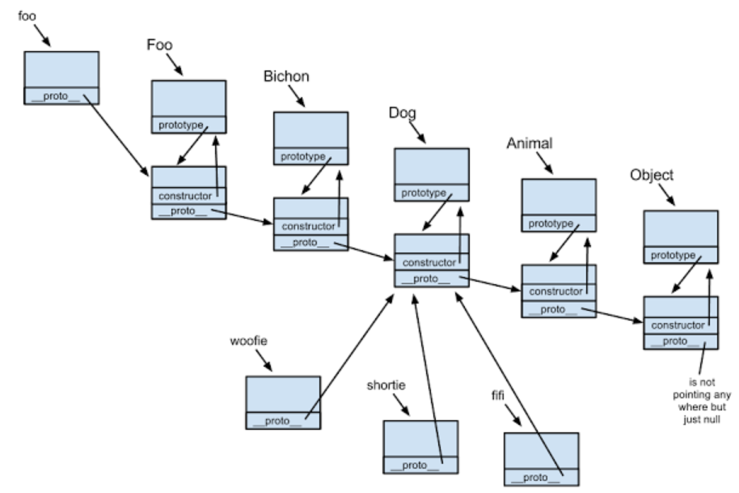
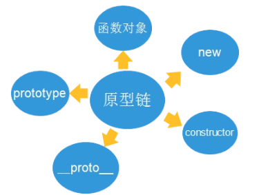
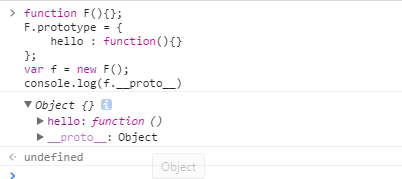
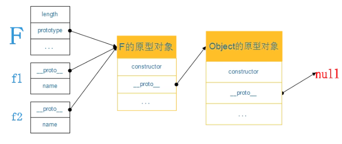
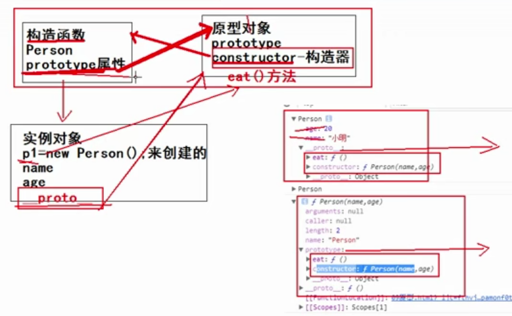

### 前言：

​	对于有基于类的语言经验 (如 Java 或 C++) 的开发人员来说，JavaScript 有点令人困惑，因为它是动态的，并且本身不提供一个 `class` 实现。（在 ES2015/ES6 中引入了 `class` 关键字，但只是语法糖，JavaScript 仍然是基于原型的）。

​	当谈到继承时，JavaScript 只有一种结构：对象。每个实例对象（ object ）都有一个私有属性（称之为 __proto__ ）指向它的原型对象（ **prototype** ）。该原型对象也有一个自己的原型对象( __proto__ ) ，层层向上直到一个对象的原型对象为 `null`。根据定义，`null` 没有原型，并作为这个**原型链**中的最后一个环节。

几乎所有 JavaScript 中的对象都是位于原型链顶端的 [`Object`](https://developer.mozilla.org/zh-CN/docs/Web/JavaScript/Reference/Global_Objects/Object) 的实例。

​	尽管这种原型继承通常被认为是 JavaScript 的弱点之一，但是原型继承模型本身实际上比经典模型更强大。例如，在原型模型的基础上构建经典模型相当简单。


### 

##### 原型：

原型的概念定义为：所谓原型就是指函数的prototype属性所引用的对象，这个对象就是原型。

作用1：实现对象之间的数据共享。2.在es6之前，没有class的情况下，模拟面向对象，构造函数中放私有属性，原型上放公有属性，一般为方法。

获取原型的方法：1.函数.prototype；2.对象._ *proto* *（如果当前浏览器不支持.proto* _，那么就通过对象的构造函数找：.constructor.prototype；原型本身是一个对象。





**原型（prototype）**：

- 每一个构造函数都拥有一个prototype属性，这个属性指向一个对象，也就是原型对象。当使用这个构造函数创建实例的时候，prototype属性指向的原型对象就成为实例的原型对象。
- 原型对象默认拥有一个constructor属性，指向指向它的那个构造函数（也就是说构造函数和原型对象是互相指向的关系）。
- 每个对象都拥有一个隐藏的属性[[prototype]]，指向它的原型对象，这个属性可以通过 `Object.getPrototypeOf(obj)` 或 `obj.__proto__` 来访问。
- 实际上，构造函数的prototype属性与它创建的实例对象的[[prototype]]属性指向的是同一个对象，即 `对象.__proto__ === 函数.prototype` 。
- 如上文所述，原型对象就是用来存放实例中共有的那部分属性。
- 在JavaScript中，所有的对象都是由它的原型对象继承而来，反之，所有的对象都可以作为原型对象存在。
- 访问对象的属性时，JavaScript会首先在对象自身的属性内查找，若没有找到，则会跳转到该对象的原型对象中查找。

作者：clancysong

链接：https://juejin.im/post/5a94c0de5188257a8929d837


##### 原型链：

概念：原型链是一种机制，指的是JavaScript每个对象`包括原型对象`都有一个内置的[[proto]]属性指向创建它的函数对象的原型对象，即prototype属性。

作用：原型链的存在，主要是为了实现对象的`继承`。



##### 继承：

###### 1、函数对象

在JavaScript中，函数即对象。

###### 2、原型对象

当定义一个函数对象的时候，会包含一个预定义的属性，叫`prototype`，这就属性称之为原型对象。

```
//函数对象
function F(){};
console.log(F.prototype)
```


```
//普通对象
var a = {};
console.log(a.prototype);//undefined
```


###### 3、\__prot__

JavaScript在创建对象的时候，都会有一个`[[proto]]`的内置属性，用于指向创建它的函数对象的`prototype`。原型对象也有`[[proto]]`属性。因此在不断的指向中，形成了原型链。

举个例子来说，我们将对象F的原型对象修改一下，就可以清楚看到上述的关系

```
//函数对象
function F(){};
F.prototype = {
    hello : function(){}
};
var f = new F();
console.log(f.__proto__)
```



###### 4、new

当使用`new`去调用构造函数时，相当于执行了

```
var o = {};
o.__proto__ = F.prototype;
F.call(o);
```

因此，在原型链的实现上，new起到了很关键的作用。

###### 5、constructor

原型对象prototype上都有个预定义的`constructor`属性，用来引用它的函数对象。这是一种循环引用。

```
function F(){};
F.prototype.constructor === F;
```


在实际运用中，经常会有下列的写法

```
function F(){};
F.prototype = {
    constructor : F,
    doSomething : function(){}
}
```

这里要加`constructor`是因为重写了原型对象，constructor属性就消失了，需要自己手动补上。

###### 6、原型链的内存结构


```
function F(){
    this.name = 'zhang';
};
var f1 = new F();
var f2 = new F();
```

*为了严谨起见，区分对象和变量*




简单回顾下构造函数,原型和实例的关系:

> 每个构造函数(constructor)都有一个原型对象(prototype),原型对象都包含一个指向构造函数的指针,而实例(instance)都包含一个指向原型对象的内部指针.

JS对象的圈子里有这么个游戏规则:

> 如果试图引用对象(实例instance)的某个属性,会首先在对象内部寻找该属性,直至找不到,然后才在该对象的原型(instance.prototype)里去找这个属性.

如果让原型对象指向另一个类型的实例…..有趣的事情便发生了.

即: constructor1.prototype = instance2

鉴于上述游戏规则生效,如果试图引用constructor1构造的实例instance1的某个属性p1:

1).首先会在instance1内部属性中找一遍;

2).接着会在instance1.__proto__(constructor1.prototype)中找一遍,而constructor1.prototype 实际上是instance2, 也就是说在instance2中寻找该属性p1;

3).如果instance2中还是没有,此时程序不会灰心,它会继续在instance2.__proto__(constructor2.prototype)中寻找…直至Object的原型对象

> 搜索轨迹: instance1–> instance2 –> constructor2.prototype…–>Object.prototype

这种搜索的轨迹,形似一条长链, 又因prototype在这个游戏规则中充当链接的作用,于是我们把这种实例与原型的链条称作 **原型链** . 下面有个例子

```
function Father(){
    this.property = true;
}
Father.prototype.getFatherValue = function(){
    return this.property;
}
function Son(){
    this.sonProperty = false;
}
//继承 Father
Son.prototype = new Father();//Son.prototype被重写,导致Son.prototype.constructor也一同被重写
Son.prototype.getSonVaule = function(){
    return this.sonProperty;
}
var instance = new Son();
alert(instance.getFatherValue());//true
12345678910111213141516
```

instance实例通过原型链找到了Father原型中的getFatherValue方法.

注意: 此时instance.constructor指向的是Father,这是因为Son.prototype中的constructor被重写的缘故.

### 确定原型和实例的关系

使用原型链后, 我们怎么去判断原型和实例的这种继承关系呢? 方法一般有两种.

> 第一种是使用 **instanceof** 操作符, 只要用这个操作符来测试实例(instance)与原型链中出现过的构造函数,结果就会返回true. 以下几行代码就说明了这点.

```
alert(instance instanceof Object);//true
alert(instance instanceof Father);//true
alert(instance instanceof Son);//true
123
```

由于原型链的关系, 我们可以说instance 是 Object, Father 或 Son中任何一个类型的实例. 因此, 这三个构造函数的结果都返回了true.

> 第二种是使用 **isPrototypeOf()** 方法, 同样只要是原型链中出现过的原型,isPrototypeOf() 方法就会返回true, 如下所示.

```
alert(Object.prototype.isPrototypeOf(instance));//true
alert(Father.prototype.isPrototypeOf(instance));//true
alert(Son.prototype.isPrototypeOf(instance));//true
123
```

原理同上.

### 原型链的问题

原型链并非十分完美, 它包含如下两个问题.

> 问题一: 当原型链中包含引用类型值的原型时,该引用类型值会被所有实例共享;
>
> 问题二: 在创建子类型(例如创建Son的实例)时,不能向超类型(例如Father)的构造函数中传递参数.

有鉴于此, 实践中很少会单独使用原型链.

为此,下面将有一些尝试以弥补原型链的不足.

### 借用构造函数

为解决原型链中上述两个问题, 我们开始使用一种叫做**借用构造函数**(constructor stealing)的技术(也叫经典继承).

> 基本思想:即在子类型构造函数的内部调用超类型构造函数.

```
function Father(){
    this.colors = ["red","blue","green"];
}
function Son(){
    Father.call(this);//继承了Father,且向父类型传递参数
}
var instance1 = new Son();
instance1.colors.push("black");
console.log(instance1.colors);//"red,blue,green,black"

var instance2 = new Son();
console.log(instance2.colors);//"red,blue,green" 可见引用类型值是独立的
123456789101112
```

很明显,借用构造函数一举解决了原型链的两大问题:

其一, 保证了原型链中引用类型值的独立,不再被所有实例共享;

其二, 子类型创建时也能够向父类型传递参数.

随之而来的是, 如果仅仅借用构造函数,那么将无法避免构造函数模式存在的问题–方法都在构造函数中定义, 因此函数复用也就不可用了.而且超类型(如Father)中定义的方法,对子类型而言也是不可见的. 考虑此,借用构造函数的技术也很少单独使用.

### 组合继承

组合继承, 有时候也叫做伪经典继承,指的是将原型链和借用构造函数的技术组合到一块,从而发挥两者之长的一种继承模式.

> 基本思路: 使用原型链实现对原型属性和方法的继承,通过借用构造函数来实现对实例属性的继承.

这样,既通过在原型上定义方法实现了函数复用,又能保证每个实例都有它自己的属性. 如下所示.

```
function Father(name){
    this.name = name;
    this.colors = ["red","blue","green"];
}
Father.prototype.sayName = function(){
    alert(this.name);
};
function Son(name,age){
    Father.call(this,name);//继承实例属性，第一次调用Father()
    this.age = age;
}
Son.prototype = new Father();//继承父类方法,第二次调用Father()
Son.prototype.sayAge = function(){
    alert(this.age);
}
var instance1 = new Son("louis",5);
instance1.colors.push("black");
console.log(instance1.colors);//"red,blue,green,black"
instance1.sayName();//louis
instance1.sayAge();//5

var instance1 = new Son("zhai",10);
console.log(instance1.colors);//"red,blue,green"
instance1.sayName();//zhai
instance1.sayAge();//10
12345678910111213141516171819202122232425
```

组合继承避免了原型链和借用构造函数的缺陷,融合了它们的优点,成为 JavaScript 中最常用的继承模式. 而且, instanceof 和 isPrototypeOf( )也能用于识别基于组合继承创建的对象.

同时我们还注意到组合继承其实调用了两次父类构造函数, 造成了不必要的消耗, 那么怎样才能避免这种不必要的消耗呢, 这个我们将在后面讲到.

### 原型继承

该方法最初由道格拉斯·克罗克福德于2006年在一篇题为 《Prototypal Inheritance in JavaScript》(JavaScript中的原型式继承) 的文章中提出. 他的想法是借助原型可以基于已有的对象创建新对象， 同时还不必因此创建自定义类型. 大意如下:

> 在object()函数内部, 先创建一个临时性的构造函数, 然后将传入的对象作为这个构造函数的原型,最后返回了这个临时类型的一个新实例.

```
function object(o){
    function F(){}
    F.prototype = o;
    return new F();
}
12345
```

从本质上讲, object() 对传入其中的对象执行了一次浅复制. 下面我们来看看为什么是浅复制.

```
var person = {
    friends : ["Van","Louis","Nick"]
};
var anotherPerson = object(person);
anotherPerson.friends.push("Rob");
var yetAnotherPerson = object(person);
yetAnotherPerson.friends.push("Style");
alert(person.friends);//"Van,Louis,Nick,Rob,Style"
12345678
```

在这个例子中,可以作为另一个对象基础的是person对象,于是我们把它传入到object()函数中,然后该函数就会返回一个新对象. 这个新对象将person作为原型,因此它的原型中就包含引用类型值属性. 这意味着person.friends不仅属于person所有,而且也会被anotherPerson以及yetAnotherPerson共享.

在 ECMAScript5 中,通过新增 **object.create()** 方法规范化了上面的原型式继承.

**object.create()** 接收两个参数:

- 一个用作新对象原型的对象
- (可选的)一个为新对象定义额外属性的对象

```
var person = {
    friends : ["Van","Louis","Nick"]
};
var anotherPerson = Object.create(person);
anotherPerson.friends.push("Rob");
var yetAnotherPerson = Object.create(person);
yetAnotherPerson.friends.push("Style");
alert(person.friends);//"Van,Louis,Nick,Rob,Style"
12345678
```

**object.create()** 只有一个参数时功能与上述object方法相同, 它的第二个参数与Object.defineProperties()方法的第二个参数格式相同: 每个属性都是通过自己的描述符定义的.以这种方式指定的任何属性都会覆盖原型对象上的同名属性.例如:

```
var person = {
    name : "Van"
};
var anotherPerson = Object.create(person, {
    name : {
        value : "Louis"
    }
});
alert(anotherPerson.name);//"Louis"
123456789
```

目前支持 **Object.create()** 的浏览器有 IE9+, Firefox 4+, Safari 5+, Opera 12+ 和 Chrome.

**提醒:** 原型式继承中, 包含引用类型值的属性始终都会共享相应的值, 就像使用原型模式一样.

### 寄生式继承

寄生式继承是与原型式继承紧密相关的一种思路， 同样是克罗克福德推而广之.

> 寄生式继承的思路与(寄生)构造函数和工厂模式类似, 即创建一个仅用于封装继承过程的函数,该函数在内部以某种方式来增强对象,最后再像真的是它做了所有工作一样返回对象. 如下.

```
function createAnother(original){
    var clone = object(original);//通过调用object函数创建一个新对象
    clone.sayHi = function(){//以某种方式来增强这个对象
        alert("hi");
    };
    return clone;//返回这个对象
}
1234567
```

这个例子中的代码基于person返回了一个新对象–anotherPerson. 新对象不仅具有 person 的所有属性和方法, 而且还被增强了, 拥有了sayH()方法.

**注意:** 使用寄生式继承来为对象添加函数, 会由于不能做到函数复用而降低效率;这一点与构造函数模式类似.

### 寄生组合式继承

前面讲过,组合继承是 JavaScript 最常用的继承模式; 不过, 它也有自己的不足. 组合继承最大的问题就是无论什么情况下,都会调用两次父类构造函数: 一次是在创建子类型原型的时候, 另一次是在子类型构造函数内部. **寄生组合式继承就是为了降低调用父类构造函数的开销而出现的** .

> 其背后的基本思路是: 不必为了指定子类型的原型而调用超类型的构造函数

```
function extend(subClass,superClass){
    var prototype = object(superClass.prototype);//创建对象
    prototype.constructor = subClass;//增强对象
    subClass.prototype = prototype;//指定对象
}
12345
```

extend的高效率体现在它没有调用superClass构造函数,因此避免了在subClass.prototype上面创建不必要,多余的属性. 于此同时,原型链还能保持不变; 因此还能正常使用 instanceof 和 isPrototypeOf() 方法.

以上,寄生组合式继承,集寄生式继承和组合继承的优点于一身,是实现基于类型继承的最有效方法.

------

下面我们来看下extend的另一种更为有效的扩展.

```
function extend(subClass, superClass) {
  var F = function() {};
  F.prototype = superClass.prototype;
  subClass.prototype = new F(); 
  subClass.prototype.constructor = subClass;

  subClass.superclass = superClass.prototype;
  if(superClass.prototype.constructor == Object.prototype.constructor) {
    superClass.prototype.constructor = superClass;
  }
}
1234567891011
```

我一直不太明白的是为什么要 “**new F()**“, 既然extend的目的是将子类型的 prototype 指向超类型的 prototype,为什么不直接做如下操作呢?

```
subClass.prototype = superClass.prototype;//直接指向超类型prototype
1
```

显然, 基于如上操作, 子类型原型将与超类型原型共用, 根本就没有继承关系.

### new 运算符

为了追本溯源, 我顺便研究了new运算符具体干了什么?发现其实很简单，就干了三件事情.

```
var obj  = {};
obj.__proto__ = F.prototype;
F.call(obj);
123
```

第一行，我们创建了一个空对象obj;

第二行，我们将这个空对象的**proto**成员指向了F函数对象prototype成员对象;

第三行，我们将F函数对象的this指针替换成obj，然后再调用F函数.

我们可以这么理解: 以 new 操作符调用构造函数的时候，函数内部实际上发生以下变化：

1、创建一个空对象，并且 this 变量引用该对象，同时还继承了该函数的原型。

2、属性和方法被加入到 this 引用的对象中。

3、新创建的对象由 this 所引用，并且最后隐式的返回 this.

### __proto__ 属性是指定原型的关键

以上, 通过设置 __proto__ 属性继承了父类, 如果去掉new 操作, 直接参考如下写法

```
subClass.prototype = superClass.prototype;//直接指向超类型prototype
1
```

那么, 使用 instanceof 方法判断对象是否是构造器的实例时, 将会出现紊乱.

假如参考如上写法, 那么extend代码应该为

```
function extend(subClass, superClass) {
  subClass.prototype = superClass.prototype;

  subClass.superclass = superClass.prototype;
  if(superClass.prototype.constructor == Object.prototype.constructor) {
    superClass.prototype.constructor = superClass;
  }
}
12345678
```

此时, 请看如下测试:

```
function a(){}
function b(){}
extend(b,a);
var c = new a(){};
console.log(c instanceof a);//true
console.log(c instanceof b);//true
123456
```

c被认为是a的实例可以理解, 也是对的; 但c却被认为也是b的实例, 这就不对了. 究其原因, instanceof 操作符比较的应该是 c.__proto__ 与 构造器.prototype(即 b.prototype 或 a.prototype) 这两者是否相等, 又extend(b,a); 则b.prototype === a.prototype, 故这才打印出上述不合理的输出.

------

那么最终,原型链继承可以这么实现,例如:

```
function Father(name){
    this.name = name;
    this.colors = ["red","blue","green"];
}
Father.prototype.sayName = function(){
    alert(this.name);
};
function Son(name,age){
    Father.call(this,name);//继承实例属性，第一次调用Father()
    this.age = age;
}
extend(Son,Father)//继承父类方法,此处并不会第二次调用Father()
Son.prototype.sayAge = function(){
    alert(this.age);
}
var instance1 = new Son("louis",5);
instance1.colors.push("black");
console.log(instance1.colors);//"red,blue,green,black"
instance1.sayName();//louis
instance1.sayAge();//5

var instance1 = new Son("zhai",10);
console.log(instance1.colors);//"red,blue,green"
instance1.sayName();//zhai
instance1.sayAge();//10
12345678910111213141516171819202122232425
```

------

### 扩展:

#### 属性查找

```
使用了原型链后, 当查找一个对象的属性时，JavaScript 会向上遍历原型链，直到找到给定名称的属性为止，到查找到达原型链的顶部 - 也就是 Object.prototype - 但是仍然没有找到指定的属性，就会返回 undefined. 此时若想避免原型链查找, 建议使用 **hasOwnProperty** 方法. 因为 **hasOwnProperty** 是 JavaScript 中唯一一个处理属性但是不查找原型链的函数. 如:
1
console.log(instance1.hasOwnProperty('age'));//true
1
```

对比: **isPrototypeOf** 则是用来判断该方法所属的对象是不是参数的原型对象，是则返回true，否则返回false。如:

```
console.log(Father.prototype.isPrototypeOf(instance1));//true
1
```

#### instanceof && typeof

上面提到几次提到 instanceof 运算符. 那么到底它是怎么玩的呢? 下面让我们来趴一趴它的使用场景.

**instanceof** 运算符是用来在运行时指出对象是否是构造器的一个实例, 例如漏写了new运算符去调用某个构造器, 此时构造器内部可以通过 instanceof 来判断.(java中功能类似)

```
function f(){
  if(this instanceof arguments.callee)
    console.log('此处作为构造函数被调用');
  else
    console.log('此处作为普通函数被调用');
}
f();//此处作为普通函数被调用
new f();//此处作为构造函数被调用
12345678
```

以上, this instanceof [`arguments`](http://louiszhai.github.io/2015/12/15/arguments/).callee 的值如果为 true 表示是作为构造函数被调用的,如果为 false 则表示是作为普通函数被调用的。

对比: **typeof** 则用以获取一个变量或者表达式的类型, 一般只能返回如下几个结果:

number,boolean,string,function（函数）,object（NULL,数组，对象）,undefined。

#### new运算符

此处引用 艾伦的 [JS 对象机制深剖——new 运算符](http://www.cnblogs.com/aaronjs/archive/2012/07/04/2575570.html)

接着上述对new运算符的研究, 我们来考察 ECMAScript 语言规范中 **new** 运算符的定义：

The new Operator

> The production *NewExpression : new NewExpression* is evaluated as follows:Evaluate NewExpression.Call GetValue(Result(1)).If Type(Result(2)) is not Object, throw a TypeError exception.If Result(2) does not implement the internal [[[Construc\]]](http://www.pushiming.com/blog/2009/10/the-new-operator/#appendix) method, throw a TypeError exception.Call the [[Construct]] method on Result(2), providing no arguments (that is, an empty list of arguments).Return Result(5).

其大意是，new 后必须跟一个对象并且此对象必须有一个名为 [[Construct]] 的内部方法（其实这种对象就是构造器），否则会抛出异常

根据这些内容，我们完全可以构造一个伪 [[Construct]] 方法来模拟此流程

```
function MyObject(age) {
    this.age = age;
}

MyObject.construct = function() {
    var o = {}, Constructor = MyObject;
    o.__proto__ = Constructor.prototype;
    // FF 支持用户引用内部属性 [[Prototype]]
    Constructor.apply(o, arguments);
    return o;
};

var obj1 = new MyObject(10);
var obj2 = MyObject.construct(10);
alert(obj2 instanceof MyObject);// true
123456789101112131415
```

------


解释：

