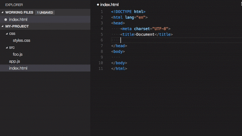
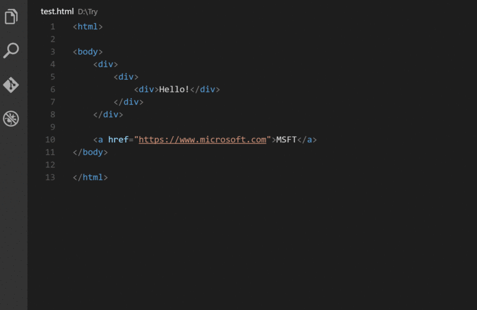
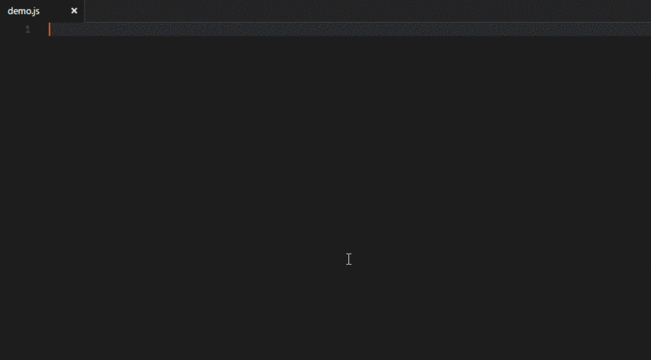
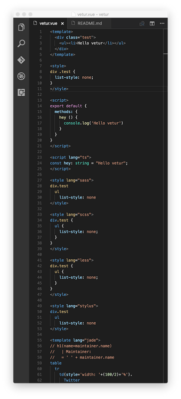

## 通用插件

### HTML Snippets

超级实用且初级的 H5代码片段以及提示

### HTML CSS Support

让 html 标签上写class 智能提示当前项目所支持的样式
新版已经支持scss文件检索

### Debugger for Chrome

让 vscode 映射 chrome 的 debug功能，静态页面都可以用 vscode 来打断点调试，
配置稍微复杂一些

### jQuery Code Snippets

jquery 重度患者必须品，废话不多说，上图

### vscode-icon

让 vscode 资源树目录加上图标，必备良品！

### Path Intellisense

自动路劲补全，

### Npm Intellisense

require 时的包提示（最新版的vscode已经集成此功能）

### Document this

js 的注释模板 （注意：新版的vscode已经原生支持,在function上输入/** tab）

### ESlint

ESlint 接管原生 js 提示，可以自定制提示规则。

### HTMLHint

html代码检测

### Project Manager

在多个项目之前快速切换的工具

### beautify

格式化代码的工具

### Bootstrap 3 Sinnpet

常用 bootstrap 的可以下

### Atuo Rename Tag

修改 html 标签，自动帮你完成尾部闭合标签的同步修改，不过有些bug。

### GitLens

丰富的git日志插件

### fileheader

顶部注释模板，可定义作者、时间等信息，并会自动更新最后修改时间

### filesize

在底部状态栏显示当前文件大小，点击后还可以看到详细创建、修改时间

### Bracket Pair Colorizer

让括号拥有独立的颜色，易于区分。可以配合任意主题使用。

## Vue插件

以下推荐vue框架所需的插件

### vetur

语法高亮、智能感知、Emmet等

### VueHelper

snippet代码片段

### Import Cost

引入包大小计算,对于项目打包后体积掌握很有帮助

