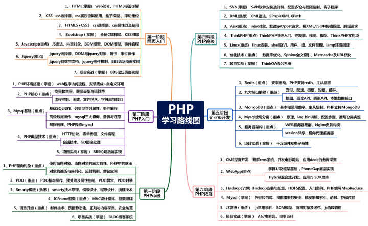

## 一、 网上某些错误的学习路线图**

网上有些错误的学习路线图，让学完HTML、CSS后立马去学Javascript和jQuery等，这种课程简直是对牛弹琴。你特么的怎么不去搞个前端工程师培训或者是吹牛逼的全栈工程师培训呀。

这种错误的路线图的问题在于将重心未放在PHP方向，而放在了前端方向。将面向对象，业务思想、SQL转化等PHP关注的重心没有放置在之前而放置在之后了。PHP的重心还是要放在业务处理上。

## **二、 前期加快入门**

前期的时候要加快入门的进度，学一些HTML和Css能基本写出网页后，就快速进入到PHP阶段。

因为大家是自学的PHP，学了半天还没搞到PHP的话，会放松对学习的热情，从而造成自学效果下降。

学完HTML和Css不要学Js，立马进入到环境的搭建上来。

## **三、 关于开发 环境**

很多人在这儿走弯路，喜欢找不到同教程看环境搭建。我们在公司里面开发的时候，真正的是使用的Linux环境进行开发和线上代码运行的。

在学习的过程中，我建议：快、快、快。少纠结、代码能跑就行。

此处，推荐使用XAMPP、AppServ、PHPStudy、WampServer等工具快速安装完成，开始自己的第一段

```text
<?php

phpinfo();
```

## **四、 基本语法**

环境搭建完，开始要学习的东西有以下一些东西了：变量、数据类型、注释、常量、if…else、swith…case、while、do..while、for、运算符、数组、函数、常用函数；

这些过程当中，很多小白容易纠结为啥啥都写不出来呢。

此外，全是些基本语法，一定要记住，多写多记多背。

在心理上觉得啥都写不出来是很正常的。

## **五、 面向过程使用阶段**

在这一阶段就能够写出东西来了，学完MySQL数据库后立马开始学习PHP连接数据库吧，学习完成后写个留言本、分页、再学个cookie和session实现用户登陆、注册。学个GD后开始实现个验证码吧。

最后在这个阶段你可以写一个论坛、贴吧或者商城出来。

## **六、 面向对象和MVC**

在这个阶段不要再看PHP5的视频了，最好看PHP7以后的视频，特别是新的一些标准，例如：composer、PSR、面向对象的设计模式等。你可以看一些千锋PHP最新的视频，这些技术点全都讲到了。

这一块学习顺序：

1. 面向对象基本语法；
2. 写几个常用类；
3. 组合MVC
4. 学习设计模式
5. 学习PSR

## **七、 深入学学前端**

PHP学好了，前端课程学起来跟玩似的了。因为你已经有了一门语言的基础了。所以，学习一些JS，再学一些jQuery，bootstrap够你用了。

## **八、 深入ThinkPHP5.0或者Laravel**

深入学习一个或者两个框架，然后结合前端的知识，写二个以上的项 目出来吧。

你可以写个多品类的商城、写一个OA系统等。

## **九、 学习Linux服务器**

学习Linux服务器的主要了解多服务器的部署，了解软件安装，特别是LAMP和LNMP的环境搭建。

将对应的代码搭建到自己部署的服务器上去。

最后买一个域名和阿里云服务器，真正的将代码部署到云服务器上去，走一次上线流程，用一下git管理一下代码会更棒。

## **十、 深入大并发架构的学习**

你非常有必要学习一下大并发架构，学一些NoSQL技术、Swoole技术、keepalived技术等多项不同的技术。

让自己全面了解服务器集群下代码如何运行的更加高效。

并且全面的了解一下PHP的socket、进程、线程、协程等技术，对你的代码的技术提升是很有帮助的。

建议这个时候使用Redis、RockMQ写一个大并发的、多服务器的秒杀出来。

这一块国内都有很多视频，视频不要再看PHP5的视频了，你可以多看看PHP7的视频。

现在学习PHP已经不再是单纯的学习PHP了，到后期更多的是学服务器集群，大并发处理，按照这个路线图一点一点往前走，有问题可以在评论下面咱们相互交流。


## **十一、 补充、手机接口、微信小程序和支付技术**

在中国市场上90%以上的手机联网后请求数据的接口是由PHP开发的；

95%的微信公众号和小程序都是由PHP开发的接口。

关于有私信问我这一块该什么时候学，我个人建议，需要包含以下几块的知识：

1. HTML、Css和Javascript；
2. 服务器架设、代码上线、ICP备案等；
3. PHP基本语法、面向对象和数据库（为了速度快可以了解框架）。

具备以上三方面才能学精：支付、手机接口、微信公众号相关的技术。


因为这是面试中会问到的一个问题，虽然它看起来很简单。

回答做网站的，也就是个简单建站的水平。

回答做网站后端开发的，对PHP有了一定的认识。

回答做后端处理的，有了更深层次的认识。


学习一样技能，你得先清楚这项技能是到底做什么的，说到这里，我想大家都会简单的说是做网站的，因为PHP在WEB领域应用最为广泛，大多数网站都是用PHP做的。准确的说PHP是做网站的后端开发的，其实我这样说还不算正确，PHP只是做后端开发的，但不只是网站而已。就像现在比较火的APP开发也可以用PHP做后端处理。


PHP相对于其他语言，比较简单，相对好上手，比较适合零基础的人学习，但是就像我上面说的那样，PHP只完成了一个网站或者系统的一部分。


一个运行的网站或者软件系统可以分为前端页面，后端程序，数据库，linux。而处理后端的PHP仅仅是只占了四分之一，PHP本身的东西其实并不多，真正多的东西都在PHP之外，所以单纯的掌握PHP并不足已做出什么产品，可能连工作都找不到。

