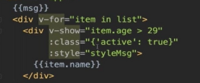
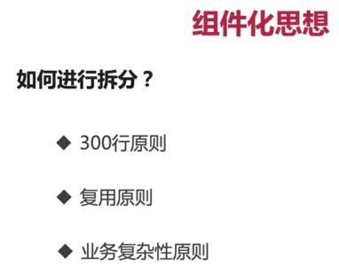
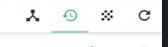
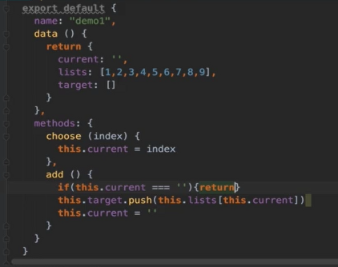
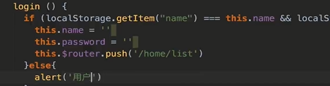

# 1

### 开发环境&工具：

nvm：切换node版本

nvm: nvm ls  ;num use


vue-cli

npm run serve

### 知识点解释：


# 2Vue框架常用知识点


### 第一个vue项目

优先绑定第一个{{msg}}

vueCDN使用： https://www.bootcdn.cn/


<script src="https://cdn.bootcss.com/vue/2.6.10/vue.min.js"></script>


### 模板语法：

vue文件结构：

插值语法

v-bind  ：

v-on @

v-html


### 计算属性和侦听器

computed：

模板内的表达式非常便利，但是设计它们的初衷是用于简单运算的。在模板中放入太多的逻辑会让模板过重且难以维护。例如：

```
<div id="example">
  {{ message.split('').reverse().join('') }}
</div>
```

在这个地方，模板不再是简单的声明式逻辑。你必须看一段时间才能意识到，这里是想要显示变量 `message` 的翻转字符串。当你想要在模板中多次引用此处的翻转字符串时，就会更加难以处理。

所以，对于任何复杂逻辑，你都应当使用**计算属性**。

watch:

​	虽然计算属性在大多数情况下更合适，但有时也需要一个自定义的侦听器。这就是为什么 Vue 通过 `watch` 选项提供了一个更通用的方法，来响应数据的变化。当需要在数据变化时执行异步或开销较大的操作时，这个方式是最有用的。

​	在这个示例中，使用 `watch` 选项允许我们执行异步操作 (访问一个 API)，限制我们执行该操作的频率，并在我们得到最终结果前，设置中间状态。这些都是计算属性无法做到的。


### 条件渲染，列表渲染，class与style绑定


条件渲染，v-if  v-else v-elseif  v-show


当count 执行 v-if的div，其他失效


两者区别：


列表渲染，v-for；


条件渲染和列表渲染同时使用：


class与style绑定


v-bind：


单横线，单引号，驼峰




# 3vue核心技术：


认识vue-cli


安装：npm install -g @vue/cli


#### vue create hello


默认

手动


npm run serve


#### vue ui


## 组件化思想：





## 风格指南


<https://cn.vuejs.org/v2/style-guide/>


## vue-router

#### 定义组件


#### 添加


#### app.vue


## 单项数据流


vuex介绍 


state：


mutations：


info：添加事件


info：引入store

  


store


 info


传递到about组件


## 如何进行调试：

1，console.log()/error（）

2，alert（）点击确定执行后面 阻塞的行为

3，添加关键词debugger


4





# 4集成vue


git --version

git clone http~~~

ls

git status


git branch -a

git branch

touch test.txt

git status


git add .

git commit -m "..."

git remote -v


git push origin master


git branch -a

git checkout -b dev 创建新的分支


ni test1.txt

git status

git add name

git commit -m "dev"

git push origin dev

  


git branch -a


git checkout master

git merge dev 合并分支


删除分支 git branch -D dev

删除远程dev分支 git push origin :dev

退回之前的版本 git reset --hard head^


 日志git log   git reflog

git reset --hard head^

git log

git reflog

git reset --hard HEAD@{1}

 


## 单页面demo1


创建demo.vue

vue serve demo.vue 


上列表； 

v-for     v-for="(item,index) in lists"   :key="index"

choose（）  @click="choose(index)"   

active 切换     :class="{active:index==current}"

按钮；add（）

   <button @click="add()"></button>

下列表；

v-for \<li v-for="(item,index) in targets" :key="index">{{item}}\</li>


bug:

1默认未选择，添加后，删除样式

push后 this.current=‘’ ‘’


2，连续点击添加空，


完整代码：





## 如何高仿别人的app？

观察结构

head 用了那些库

js用了哪些库

根据class，找到库

source:


移动端

头部尾部，看到加载了那些库

###### chrome 样式 格式化 format {}

总结：


## demo2


vue ui 

不保存预设


添加div


配置 router

app.js


### vuex


### add.js


add，传递数据到list，跨组件用vuex（引入，state，mutations）


引入store

改变store store.commit


list

 引入 store

### list


### login

v-if:


  


密码校验：


密码 text==》password


点击登录清空 回到登录

s


验证：





### 样式：

home


app.js


router


## 回顾：


npm run build

dist

创建vue.config.js


vue-cli的webpack

环境变量

https://cli.vuejs.org/zh/guide/webpack.html#简单的配置方式


