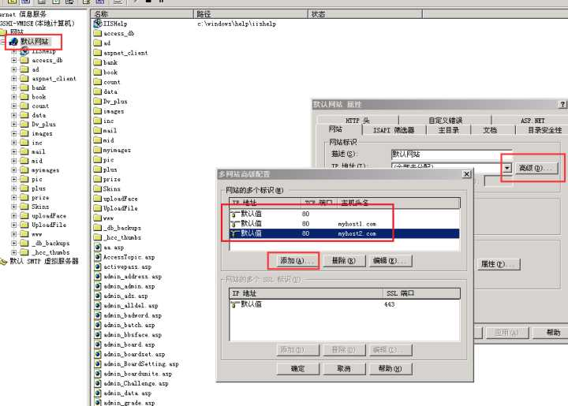
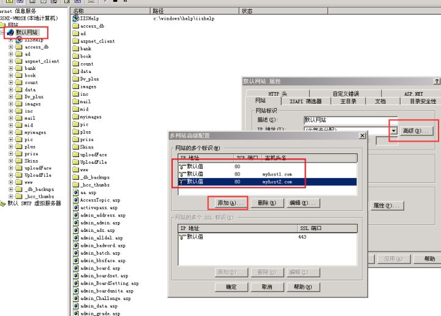

依靠HTTP请求中的Host字段。如果客户端给虚拟主机发送的Host不含域名，那么会收到403 Forbidden错误。取决于服务器的配置，也可以做其他非标准错误处理。


http有一个header，是host
nginx服务器会根据这个host 转发到不同的机器或端口


想必题主指的是web服务器吧，对于同一个WEB服务器下，区分不同的网站一般有三种形式：主机头、端口号、ip地址。
既然是同一个ip绑定多个域名的情况，那必然是通过主机头来进行区分。
这（举个例子：
有A，B两个网站，
A站的域名是[http://aaa.com](https://link.zhihu.com/?target=http%3A//aaa.com)，
B站的域名是[http://bbb.com](https://link.zhihu.com/?target=http%3A//bbb.com)，
两个域名同时解析到192.168.1.101的地址上。

那么在配置web服务器的时候，
新建第一个网站
主机头为webA，
ip为192.168.1.101，
绑定域名为[http://aaa.com](https://link.zhihu.com/?target=http%3A//aaa.com)

新建第二个网站
主机头为webB，
ip为192.168.1.101，
绑定域名为[http://bbb.com](https://link.zhihu.com/?target=http%3A//bbb.com)，

当用户访问[http://aaa.com](https://link.zhihu.com/?target=http%3A//aaa.com)时，
首先由dns解析出ip为192.168.1.101，
然后访问这台服务器http请求，
服务器根据你要访问的域名判断出是webA这个网站，就会响应对应的信息。

\---------------------------------------

如果直接用ip地址请求呢？

web服务器下有一个默认网站，默认网站里放的是哪个网站，用ip请求响应的就是哪个网站的默认页面。


首先，一个IP绑定多个域名是很常见的事情，租用的虚拟主机大多数都是多个主机共享同一个IP，区分具体访问的是哪个主机要从两个方面实现：

**1、客户端如何区别不同网站**

客户端在请求时，会在HTTP请求的时候包含要请求的具体主机名称，比如访问Google的请求通过抓包分析内容是这样的：

```text
GET / HTTP/1.1
Host: www.google.com
```

整个请求会被发送到服务器上，其中有Host字段标识你要请求的网站域名是什么，即使访问的是同一个IP地址，由于Host字段不同，所以服务器软件有办法区分具体访问的是哪个网站。

关于Host字段的具体定义，可以阅读RFC-2616的第14.23节：[http://www.rfc-editor.org/rfc/rfc2616.txt](https://link.zhihu.com/?target=http%3A//www.rfc-editor.org/rfc/rfc2616.txt)

以下是节选（注意加粗的部分）：

> 14.23 Host
>
>    The Host request-header field specifies the Internet host and port
>    number of the resource being requested, as obtained from the original
>    URI given by the user or referring resource (generally an HTTP URL,
>    as described in section 3.2.2). The Host field value MUST represent
>    the naming authority of the origin server or gateway given by the
>    original URL. This allows the origin server or gateway to
>    differentiate between internally-ambiguous URLs, such as the root "/"
>    URL of a server for **multiple host names on a single IP address**.

另外，RFC-2616并非HTTP协议的最新规范，具体的规范请参考RFC-2616的描述链接：[Information on RFC 2616](https://link.zhihu.com/?target=http%3A//www.rfc-editor.org/info/rfc2616)

**2、服务器端如何配置**

如果服务器使用Apache，那么在Apache的配置文件中加入VirtualHost即可新增虚拟主机：

> <VirtualHost 10.0.0.1>
>     ServerAdmin  admin@admin
>     **DocumentRoot "D:/website1"    ServerName http://myhost1.com**
>     DirectoryIndex  index.php
> </VirtualHost>
>
> <VirtualHost 10.0.0.1>
>     ServerAdmin  admin@admin
>     **DocumentRoot "D:/website2"    ServerName http://myhost2.com**
>     DirectoryIndex  index.php
> </VirtualHost>

以上就定义了两个域名[http://myhost1.com](https://link.zhihu.com/?target=http%3A//myhost1.com)和[http://myhost2.com](https://link.zhihu.com/?target=http%3A//myhost2.com)，分别在不同的根目录，通过这样的配置Apache如果收到[http://myhost1.com](https://link.zhihu.com/?target=http%3A//myhost1.com)的请求，那么就到d:/website1里寻找对应的页面，如果是[http://myhost2.com](https://link.zhihu.com/?target=http%3A//myhost2.com)的请求，那么就到d:/website2里寻找对应的页面。

通常Apache还有一个默认网站，这个网站是可以使用IP地址访问的，如果将这个网站设置为无效，那么这个主机就无法通过IP地址直接访问HTTP资源。

对于IIS来说，IIS能使用同一个IP绑定多个站点，具体可以参考下图：




在默认网站->属性->网站->高级中，添加不同的域名即可。因为我的IIS版本较低，本身无法支持绑定多个网站，高版本的IIS中，可以配置多个网站，每个网站绑定不同的域名，即可实现访问时的区分。


**如果服务器没设置默认网站，那么IP地址也无法直接访问主机。**所以，如果你直接通过IP地址访问网站，会遇到两种情况：
1、服务器设置了默认网站，或者使用IP作为主机名去匹配请求的Host字段，那么你通过IP访问的就是这个网站；
2、服务器没有设置默认网站，或者默认网站被禁止，那么你通过IP无法打开任何东，通常遇到的是404错误（找不到页面），在我使用过的几个虚拟主机服务商那，遇到的都是类似的错误。

另外，不管是IIS或者Apache或者其它类型的网站服务器软件，不仅仅支持多域名，也支持多IP，也就是一个服务器同时有多个域名和多个IP，互相之间是互不干扰的。


首先，一个IP绑定多个域名是很常见的事情，租用的虚拟主机大多数都是多个主机共享同一个IP，区分具体访问的是哪个主机要从两个方面实现：

**1、客户端如何区别不同网站**

客户端在请求时，会在HTTP请求的时候包含要请求的具体主机名称，比如访问Google的请求通过抓包分析内容是这样的：

```text
GET / HTTP/1.1
Host: www.google.com
```

整个请求会被发送到服务器上，其中有Host字段标识你要请求的网站域名是什么，即使访问的是同一个IP地址，由于Host字段不同，所以服务器软件有办法区分具体访问的是哪个网站。

关于Host字段的具体定义，可以阅读RFC-2616的第14.23节：[http://www.rfc-editor.org/rfc/rfc2616.txt](https://link.zhihu.com/?target=http%3A//www.rfc-editor.org/rfc/rfc2616.txt)

以下是节选（注意加粗的部分）：

> 14.23 Host
>
>    The Host request-header field specifies the Internet host and port
>    number of the resource being requested, as obtained from the original
>    URI given by the user or referring resource (generally an HTTP URL,
>    as described in section 3.2.2). The Host field value MUST represent
>    the naming authority of the origin server or gateway given by the
>    original URL. This allows the origin server or gateway to
>    differentiate between internally-ambiguous URLs, such as the root "/"
>    URL of a server for **multiple host names on a single IP address**.

另外，RFC-2616并非HTTP协议的最新规范，具体的规范请参考RFC-2616的描述链接：[Information on RFC 2616](https://link.zhihu.com/?target=http%3A//www.rfc-editor.org/info/rfc2616)

**2、服务器端如何配置**

如果服务器使用Apache，那么在Apache的配置文件中加入VirtualHost即可新增虚拟主机：

> <VirtualHost 10.0.0.1>
>     ServerAdmin  admin@admin
>     **DocumentRoot "D:/website1"    ServerName http://myhost1.com**
>     DirectoryIndex  index.php
> </VirtualHost>
>
> <VirtualHost 10.0.0.1>
>     ServerAdmin  admin@admin
>     **DocumentRoot "D:/website2"    ServerName http://myhost2.com**
>     DirectoryIndex  index.php
> </VirtualHost>

以上就定义了两个域名[http://myhost1.com](https://link.zhihu.com/?target=http%3A//myhost1.com)和[http://myhost2.com](https://link.zhihu.com/?target=http%3A//myhost2.com)，分别在不同的根目录，通过这样的配置Apache如果收到[http://myhost1.com](https://link.zhihu.com/?target=http%3A//myhost1.com)的请求，那么就到d:/website1里寻找对应的页面，如果是[http://myhost2.com](https://link.zhihu.com/?target=http%3A//myhost2.com)的请求，那么就到d:/website2里寻找对应的页面。

通常Apache还有一个默认网站，这个网站是可以使用IP地址访问的，如果将这个网站设置为无效，那么这个主机就无法通过IP地址直接访问HTTP资源。

对于IIS来说，IIS能使用同一个IP绑定多个站点，具体可以参考下图：


在默认网站->属性->网站->高级中，添加不同的域名即可。因为我的IIS版本较低，本身无法支持绑定多个网站，高版本的IIS中，可以配置多个网站，每个网站绑定不同的域名，即可实现访问时的区分。


**如果服务器没设置默认网站，那么IP地址也无法直接访问主机。**所以，如果你直接通过IP地址访问网站，会遇到两种情况：
1、服务器设置了默认网站，或者使用IP作为主机名去匹配请求的Host字段，那么你通过IP访问的就是这个网站；
2、服务器没有设置默认网站，或者默认网站被禁止，那么你通过IP无法打开任何东，通常遇到的是404错误（找不到页面），在我使用过的几个虚拟主机服务商那，遇到的都是类似的错误。

另外，不管是IIS或者Apache或者其它类型的网站服务器软件，不仅仅支持多域名，也支持多IP，也就是一个服务器同时有多个域名和多个IP，互相之间是互不干扰的。


首先，一个IP绑定多个域名是很常见的事情，租用的虚拟主机大多数都是多个主机共享同一个IP，区分具体访问的是哪个主机要从两个方面实现：

**1、客户端如何区别不同网站**

客户端在请求时，会在HTTP请求的时候包含要请求的具体主机名称，比如访问Google的请求通过抓包分析内容是这样的：

```text
GET / HTTP/1.1
Host: www.google.com
```

整个请求会被发送到服务器上，其中有Host字段标识你要请求的网站域名是什么，即使访问的是同一个IP地址，由于Host字段不同，所以服务器软件有办法区分具体访问的是哪个网站。

关于Host字段的具体定义，可以阅读RFC-2616的第14.23节：[http://www.rfc-editor.org/rfc/rfc2616.txt](https://link.zhihu.com/?target=http%3A//www.rfc-editor.org/rfc/rfc2616.txt)

以下是节选（注意加粗的部分）：

> 14.23 Host
>
>    The Host request-header field specifies the Internet host and port
>    number of the resource being requested, as obtained from the original
>    URI given by the user or referring resource (generally an HTTP URL,
>    as described in section 3.2.2). The Host field value MUST represent
>    the naming authority of the origin server or gateway given by the
>    original URL. This allows the origin server or gateway to
>    differentiate between internally-ambiguous URLs, such as the root "/"
>    URL of a server for **multiple host names on a single IP address**.

另外，RFC-2616并非HTTP协议的最新规范，具体的规范请参考RFC-2616的描述链接：[Information on RFC 2616](https://link.zhihu.com/?target=http%3A//www.rfc-editor.org/info/rfc2616)

**2、服务器端如何配置**

如果服务器使用Apache，那么在Apache的配置文件中加入VirtualHost即可新增虚拟主机：

> <VirtualHost 10.0.0.1>
>     ServerAdmin  admin@admin
>     **DocumentRoot "D:/website1"    ServerName http://myhost1.com**
>     DirectoryIndex  index.php
> </VirtualHost>
>
> <VirtualHost 10.0.0.1>
>     ServerAdmin  admin@admin
>     **DocumentRoot "D:/website2"    ServerName http://myhost2.com**
>     DirectoryIndex  index.php
> </VirtualHost>

以上就定义了两个域名[http://myhost1.com](https://link.zhihu.com/?target=http%3A//myhost1.com)和[http://myhost2.com](https://link.zhihu.com/?target=http%3A//myhost2.com)，分别在不同的根目录，通过这样的配置Apache如果收到[http://myhost1.com](https://link.zhihu.com/?target=http%3A//myhost1.com)的请求，那么就到d:/website1里寻找对应的页面，如果是[http://myhost2.com](https://link.zhihu.com/?target=http%3A//myhost2.com)的请求，那么就到d:/website2里寻找对应的页面。

通常Apache还有一个默认网站，这个网站是可以使用IP地址访问的，如果将这个网站设置为无效，那么这个主机就无法通过IP地址直接访问HTTP资源。

对于IIS来说，IIS能使用同一个IP绑定多个站点，具体可以参考下图：




在默认网站->属性->网站->高级中，添加不同的域名即可。因为我的IIS版本较低，本身无法支持绑定多个网站，高版本的IIS中，可以配置多个网站，每个网站绑定不同的域名，即可实现访问时的区分。


**如果服务器没设置默认网站，那么IP地址也无法直接访问主机。**所以，如果你直接通过IP地址访问网站，会遇到两种情况：
1、服务器设置了默认网站，或者使用IP作为主机名去匹配请求的Host字段，那么你通过IP访问的就是这个网站；
2、服务器没有设置默认网站，或者默认网站被禁止，那么你通过IP无法打开任何东，通常遇到的是404错误（找不到页面），在我使用过的几个虚拟主机服务商那，遇到的都是类似的错误。

另外，不管是IIS或者Apache或者其它类型的网站服务器软件，不仅仅支持多域名，也支持多IP，也就是一个服务器同时有多个域名和多个IP，互相之间是互不干扰的。