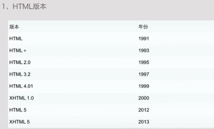

## 学习准备：

### vscode快捷键：

#### 主命令框

`F1` 或 `Ctrl+Shift+P`: 打开命令面板。在打开的输入框内，可以输入任何命令，例如：

- 按一下 `Backspace` 会进入到 `Ctrl+P` 模式
- 在 `Ctrl+P` 下输入 `>` 可以进入 `Ctrl+Shift+P` 模式

在 `Ctrl+P` 窗口下还可以:

- 直接输入文件名，跳转到文件
- `?` 列出当前可执行的动作
- `!` 显示 `Errors`或 `Warnings`，也可以 `Ctrl+Shift+M`
- `:` 跳转到行数，也可以 `Ctrl+G` 直接进入
- `@` 跳转到 `symbol`（搜索变量或者函数），也可以 `Ctrl+Shift+O` 直接进入
- `@` 根据分类跳转 `symbol`，查找属性或函数，也可以 `Ctrl+Shift+O` 后输入:进入
- `#` 根据名字查找 `symbol`，也可以 `Ctrl+T`

#### 常用快捷键

##### 编辑器与窗口管理

1. 打开一个新窗口： `Ctrl+Shift+N`
2. 关闭窗口： `Ctrl+Shift+W`
3. 同时打开多个编辑器（查看多个文件）
4. 新建文件 `Ctrl+N`
5. 文件之间切换 `Ctrl+Tab`
6. 切出一个新的编辑器（最多 `3` 个） `Ctrl+\`，也可以按住 `Ctrl` 鼠标点击 `Explorer` 里的文件名
7. 左中右 `3` 个编辑器的快捷键 `Ctrl+1` `Ctrl+2` `Ctrl+3`
8. `3` 个编辑器之间循环切换 `Ctrl+`
9. 编辑器换位置， `Ctrl+k`然后按 `Left`或 `Right`

##### 格式调整

1. 代码行缩进 `Ctrl+[` 、 `Ctrl+]`
2. `Ctrl+C` 、 `Ctrl+V` 复制或剪切当前行/当前选中内容
3. 代码格式化： `Shift+Alt+F`，或 `Ctrl+Shift+P` 后输入 `format code`
4. 上下移动一行： `Alt+Up` 或 `Alt+Down`
5. 向上向下复制一行： `Shift+Alt+Up` 或 `Shift+Alt+Down`
6. 在当前行下边插入一行 `Ctrl+Enter`
7. 在当前行上方插入一行 `Ctrl+Shift+Enter`

##### 光标相关

1. 移动到行首： `Home`
2. 移动到行尾： `End`
3. 移动到文件结尾： `Ctrl+End`
4. 移动到文件开头： `Ctrl+Home`
5. 移动到定义处： `F12`
6. 定义处缩略图：只看一眼而不跳转过去 `Alt+F12`
7. 移动到后半个括号： `Ctrl+Shift+]`
8. 选择从光标到行尾： `Shift+End`
9. 选择从行首到光标处： `Shift+Home`
10. 删除光标右侧的所有字： `Ctrl+Delete`
11. 扩展/缩小选取范围： `Shift+Alt+Left` 和 `Shift+Alt+Right`
12. 多行编辑(列编辑)：`Alt+Shift+鼠标左键`，`Ctrl+Alt+Down/Up`
13. 同时选中所有匹配： `Ctrl+Shift+L`
14. `Ctrl+D` 下一个匹配的也被选中 (在 sublime 中是删除当前行，后面自定义快键键中，设置与 `Ctrl+Shift+K` 互换了)
15. 回退上一个光标操作： `Ctrl+U`

##### 重构代码

1. 找到所有的引用： `Shift+F12`
2. 同时修改本文件中所有匹配的： `Ctrl+F12`
3. 重命名：比如要修改一个方法名，可以选中后按 `F2`，输入新的名字，回车，会发现所有的文件都修改了
4. 跳转到下一个 `Error` 或 `Warning`：当有多个错误时可以按 `F8` 逐个跳转
5. 查看 `diff`： 在 `explorer` 里选择文件右键 `Set file to compare`，然后需要对比的文件上右键选择 `Compare with file_name_you_chose`

##### 查找替换

1. 查找 `Ctrl+F`
2. 查找替换 `Ctrl+H`
3. 整个文件夹中查找 `Ctrl+Shift+F`

##### 显示相关

1. 全屏：`F11`
2. zoomIn/zoomOut：`Ctrl +/-`
3. 侧边栏显/隐：`Ctrl+B`
4. 显示资源管理器 `Ctrl+Shift+E`
5. 显示搜索 `Ctrl+Shift+F`
6. 显示 Git `Ctrl+Shift+G`
7. 显示 Debug `Ctrl+Shift+D`
8. 显示 Output `Ctrl+Shift+U`

##### 其他

- 自动保存：`File -> AutoSave` ，或者 `Ctrl+Shift+P`，输入 `auto`

### 修改默认快捷键

打开默认键盘快捷方式设置：
`File -> Preferences -> Keyboard Shortcuts`，或者：`Alt+F -> p -> k`

修改 `keybindings.json`：

```
// Place your key bindings in this file to overwrite the defaults
[
    // ctrl+space 被切换输入法快捷键占用
    {
        "key": "ctrl+alt+space",
        "command": "editor.action.triggerSuggest",
        "when": "editorTextFocus"
    },
    // ctrl+d 删除一行
    {
        "key": "ctrl+d",
        "command": "editor.action.deleteLines",
        "when": "editorTextFocus"
    },
    // 与删除一行的快捷键互换
    {
        "key": "ctrl+shift+k",
        "command": "editor.action.addSelectionToNextFindMatch",
        "when": "editorFocus"
    },
    // ctrl+shift+/多行注释
    {
        "key":"ctrl+shift+/",
        "command": "editor.action.blockComment",
        "when": "editorTextFocus"
    },
    // 定制与 sublime 相同的大小写转换快捷键，需安装 TextTransform 插件
    {
        "key": "ctrl+k ctrl+u",
        "command": "uppercase",
        "when": "editorTextFocus"
    },
    {
        "key": "ctrl+k ctrl+l",
        "command": "lowercase",
        "when": "editorTextFocus"
    }
]
```

### 前端开发必备插件

- PostCSS Sorting
- stylelint
- stylefmt
- ESLint
- javascript standard format
- beautify
- Babel ES6/ES7
- Debugger for Chrome
- Add jsdoc comments
- javascript(ES6) code snippets
- vue
- weex
- Reactjs code snippets
- React Native Tools
- Npm Intellisense
- Instant Markdown
- Markdown Shortcuts
- TextTransform

### 自定义设置参考

vscode 自定义配置参考：

```
{
    "editor.fontSize": 18,
    "files.associations": {
        "*.es": "javascript",
        "*.es6": "javascript"
    },
    // 控制编辑器是否应呈现空白字符
    "editor.renderWhitespace": true,
    // 启用后，将在保存文件时剪裁尾随空格。
    "files.trimTrailingWhitespace": true,
    // File extensions that can be beautified as javascript or JSON.
    "beautify.JSfiles": [
        "",
        "es",
        "es6",
        "js",
        "json",
        "jsbeautifyrc",
        "jshintrc"
    ]
}
```


## html5

### 简介

html

#### 什么是html？

HTML 是用来描述网页的一种语言。 

HTML 指的是超文本标记语言: HyperText Markup Language

HTML 不是一种编程语言，而是一种标记语言


#### 版本：




#### html5新特性

1. 语义化标签：header、footer、section、nav、aside、article
2. 增强型表单：input 的多个 type
3. 新增表单元素：datalist、keygen、output
4. 新增表单属性：placehoder、required、min 和 max
5. 音频视频：audio、video
6. canvas
7. 地理定位
8. 拖拽
9. 本地存储：localStorage - 没有时间限制的数据存储；sessionStorage - 针对一个 session 的数据存储，当用户关闭浏览器窗口后，数据会被删除
10. 新事件：onresize、ondrag、onscroll、onmousewheel、onerror、onplay、onpause
11. WebSocket：单个 TCP 连接上进行全双工通讯的协议
12. 浏览器支持 ，safari chrome firefox opera ie9


### 基础

#### 声明：

作用：<!DOCTYPE>声明有助于浏览器中正确显示网页。

#### 标签

```html
<html> 元素是 HTML 页面的根元素
<head> 元素包含了文档的元（meta）数据，如 <meta charset="utf-8"> 定义网页编码格式为 utf-8。
<title> 元素描述了文档的标题
<body> 元素包含了可见的页面内容
<h1>~<h6>元素定义一个大  标题
<p> 元素定义一个  段落
<a> 链接 
 图像
<br /> 换行
```

#### html元素

1，元素之标签开始到结束的所有代码

2 ，空元素在开始标签中进行关闭（以开始标签的结束而结束)

#### html属性

1，属性是 HTML 元素提供的附加信息。

2，属性以键/值对的形式出现  name="value"。

3，通用属性： class id style title

#### 格式化

```
<b>	定义粗体文本
<big> 大号字
<em>	定义着重文字
<i>	定义斜体字
<small>	定义小号字
<strong>	定义加重语气
<sub>	定义下标字
<sup>	定义上标字
<ins>	定义插入字
<del>	定义删除字
```

#### html样式，链接，表格

1，标签：style：样式定义 link： 资源引用

2， 属性，rel=“stylesheet”  外部样式表 type=“text/css” 引入文档类型

3 ，样式三种插入方式：

外部样式表：\<link  rel=“stylesheet” type=“text/css” href="" >

内部样式表：\<stlye type=“text/css”>\<style>

内联样式表：\<p style="color:red">

4，链接：

​	1，链接数据：文本/图片链接

​	2，属性：href：指向另一个文档；name：创建文档内的链接，target：

​	3，img标签属性：alt：替换文本属性 width宽

```
<a name="tips">hello</a>
<a href="#tips">跳转到hello</a>
html5 不支持？
```

5，表格：

```
<table>	定义表格
<th>	定义表格的表头
<tr>	定义表格的行
<td>	定义表格单元
<caption>	定义表格标题
<colgroup>	定义表格列的组
<col>	定义用于表格列的属性
<thead>	定义表格的页眉
<tbody>	定义表格的主体
<tfoot>	定义表格的页脚
```


#### html列表

```
<ol>	定义有序列表
<ul>	定义无序列表
<li>	定义列表项
<dl>	定义列表
<dt>	自定义列表项目
<dd>	定义自定列表项的描述
```


#### 块元素标签

1块元素： 

address , blockquote , center , dir , div , dl , fieldset , form , h1 , h2 , h3 , h4 , h5 , h6 , hr , isindex , menu , noframes , noscript , ol , p , pre , table , ul , li

2内联元素/行内：

a , abbr , acronym , b , bdo , big , br , cite , code , dfn , em , font , i , img , input , kbd , label , q , s , samp , select , small , span , strike , strong , sub , sup ,textarea , tt , u , var

3可变元素：applet ,button ,del ,iframe , ins ,map ,object , script


#### 布局：div/table


#### 表单与php交互：

```
<form>	定义供用户输入的表单
<input>	定义输入域
<textarea>	定义文本域 (一个多行的输入控件)
<label>	定义了 <input> 元素的标签，一般为输入标题
<fieldset>	定义了一组相关的表单元素，并使用外框包含起来
<legend>	定义了 <fieldset> 元素的标题
<select>	定义了下拉选项列表
<optgroup>	定义选项组
<option>	定义下拉列表中的选项
<button>	定义一个点击按钮
<datalist>New	指定一个预先定义的输入控件选项列表
<keygen>New	定义了表单的密钥对生成器字段
<output>New	定义一个计算结果
```

