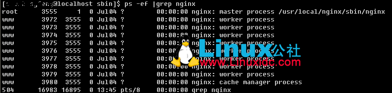
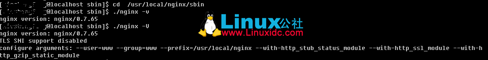

# Linux下查看Nginx安装目录、版本号信息? 		 		

/www/server/nginx/sbin/nginx  -v

cd /www/server/nginx/sbin

启动：./nginx

停止：./nginx -s stop（直接杀死进程，直接退出）

退出：./nginx -s quit（等待nginx进程完成再退出）

重启：./nginx -s reload


Linux环境下，怎么确定Nginx是以那个config文件启动的？

输入命令行： ps  -ef | grep nginx

摁回车，将出现如下图片：



master process 后面的就是 nginx的目录。

怎么查看服务器上安装的nginx版本号，主要是通过ngix的-v或-V选项，查看方法如下图所示：



-v 显示 nginx 的版本。

-V 显示 nginx 的版本，编译器版本和配置参数。


# nginx 的配置以及常见小问题 如下:

nginx: [emerg] bind() to 0.0.0.0:80 failed (98: Address already in use) 错误解决 

nginx: [emerg] bind() to 0.0.0.0:80 failed (98: Address already in use)
nginx: [emerg] bind() to 0.0.0.0:80 failed (98: Address already in use)
nginx: [emerg] bind() to 0.0.0.0:80 failed (98: Address already in use)
nginx: [emerg] bind() to 0.0.0.0:80 failed (98: Address already in use)
nginx: [emerg] still could not bind()

问题描述：地址已被使用。可能nginx服务卡死了，导致端口占用，出现此错误。

解决方法：首先用lsof:80看下80端口被什么程序占用。lsof返回结果如下：


# lsof -i -n -P | grep :80 查看那个程序占用了特定端口


lsof -i -n -P | grep :80 查看那个程序占用了特定端口

1). 
lsof(list open files)是一个列出当前系统打开文件的工具。在linux环境下,任何事物都以文件的形式存在,通过文件不仅仅可以访问常规数据,还可以访问网络连接和硬件;

2). 
lsof -i //显示所有打开的端口
lsof -i:80 //显示所有打开80端口的进程
lsof -n 不将IP转换为hostname，缺省是不加上-n参数
-P port numbers to port names;


# linux下如何查找nginx配置文件的位置 		

 		

 		

linux下如何查找nginx配置文件的位置，方法如下：

先找出nginx可执行文件的路径

```
`ps -ef | grep nginx`
```