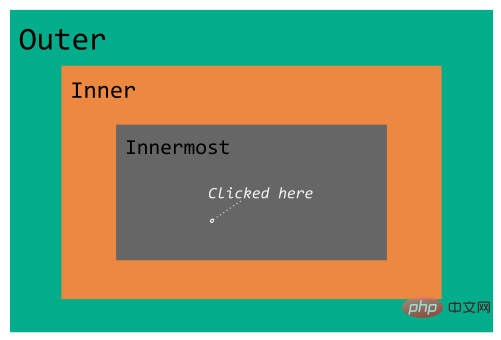

一、html+css部分、

（1）css盒模型，可能会要求手写一个布局，这个布局基本上用到的css是margin的负值，boxing-sizing：border-box，布局尽量往这方面想。浏览器布局的基本元素是盒，在w3c的标准模式下，width=width，但是在怪异模式下，width=border*2+padding*2+width;其中后代元素的width：100%；参照的是右边的那个width，

（2）html5的新特性

1、标签语义化，比如header，footer，nav，aside，article，section等，新增了很多表单元素，入email，url等，除去了center等样式标签，还有除去了有性能问题的frame，frameset等标签

2、音视频元素，video，audio的增加使得我们不需要在依赖外部的插件就可以往网页中加入音视频元素。

3、新增很多api，比如获取用户地理位置的window.navigator.geoloaction，

4、websocket

websocket是一种协议，可以让我们建立客户端到服务器端的全双工通信，这就意味着服务器端可以主动推送数据到客户端，

5、webstorage，webstorage是本地存储，存储在客户端，包括localeStorage和sessionStorage，localeStorage是持久化存储在客户端，只要用户不主动删除，就不会消失，sessionStorage也是存储在客户端，但是他的存在时间是一个回话，一旦浏览器的关于该回话的页面关闭了，sessionStorage就消失了，

6、缓存

html5允许我们自己控制哪些文件需要缓存，哪些不需要，具体的做法如下：

```js
1、首先给html添加manifest属性，并赋值为cache.manifest
2、cache.manifest的内容为: 
         CACHE MANIFEST
         #v1.2
         CACHE :           //表示需要缓存的文件
           a.js
           b.js
       NETWORK:    //表示只在用户在线的时候才需要的文件，不会缓存
         c.js
       FALLBACK
       /        /index.html     //表示如果找不到第一个资源就用第二个资源代替
```

7、web worker，web worker是运行在浏览器后台的js程序，他不影响主程序的运行，是另开的一个js线程，可以用这个线程执行复杂的数据操作，然后把操作结果通过postMessage传递给主线程，这样在进行复杂且耗时的操作时就不会阻塞主线程了。

（3）对html5的语义话的理解

html5的语义化指的是用正确的标签包含正确的内容，比如nav标签，里面就应该包含导航条的内容，而不是用做其他的用途，标签语义化的好处就是结构良好，便于阅读，方便威化，也有利于爬虫的查找，提高搜索率。

（4）cookie，sessionStorage，localeStorage的区别

cookie是存储在浏览器端，并且随浏览器的请求一起发送到服务器端的，它有一定的过期时间，到了过期时间自动会消失。sessionStorage和localeStorage也是存储在客户端的，同属于web Storage，比cookie的存储大小要大有8m，cookie只有4kb，localeStorage是持久化的存储在客户端，如果用户不手动清除的话，不会自动消失，会一直存在，sessionStorage也是存储在客户端，但是它的存活时间是在一个回话期间，只要浏览器的回话关闭了就会自动消失。

（5）多个页面之间如何进行通信

使用cookie，使用web worker，使用localeStorage和sessionStorage

（6）浏览器的渲染过程

1、首先获取html，然后构建dom树

2、其次根据css构建render树，render树中不包含定位和几何信息

3、最后构建布局数，布局是含有元素的定位和几何信息

（7）重构、回流

浏览器的重构指的是改变每个元素外观时所触发的浏览器行为，比如颜色，背景等样式发生了改变而进行的重新构造新外观的过程。重构不会引发页面的重新布局，不一定伴随着回流，

回流指的是浏览器为了重新渲染页面的需要而进行的重新计算元素的几何大小和位置的，他的开销是非常大的，回流可以理解为渲染树需要重新进行计算，一般最好触发元素的重构，避免元素的回流；比如通过通过添加类来添加css样式，而不是直接在DOM上设置，当需要操作某一块元素时候，最好使其脱离文档流，这样就不会引起回流了，比如设置position：absolute或者fixed，或者display：none，等操作结束后在显示。


**前端基础和理论问题**

**1.HTML 中 Doctype 的用途是什么？**

具体谈谈，以下每种情况下会发生什么：

1. Doctype 不存在。
2. 使用了 HTML4 Doctype，但 HTML 页面使用了 HTML5 的标签，如 `<audio>` 或 `<video>` 。它会导致任何错误吗？
3. 使用了无效的 Doctype。

**2. DOM 和 BOM 的区别是什么？**

提示：BOM，DOM，ECMAScript 和 JavaScript 都是不同的东西。

**3.JavaScript 中的事件处理如何运行？**

如下图所示，我们有三个 div 元素。每个 div 都有一个与之关联的点击处理程序。处理程序执行以下任务：

- Outer div click 处理程序将 `hello outer` 打印到控制台。
- Inner div click 处理程序将 `hello inner` 打印到控制台。
- Innermost div click 处理程序将 hello innermost 打印到控制台。

编写一段代码来分配这些任务，以便在单击 innermost div 时始终打印以下序列？

```
hello inner` → `hello innermost` → `hello outer
```



提示：事件捕获和事件冒泡

**4.使用单页应用将文件上传到服务器的有哪些方法？**

提示：XMLHttpRequest2（streaming），fetch（non-streaming），File API

**5.CSS 重排和重绘之间有什么区别？**

哪些 CSS 属性会导致重排及重绘？

**6. 什么是 CSS 选择器权重以及它如何工作？**

说说计算 CSS 选择器权重的算法。

**7.CSS 中的 pixel 与硬件/物理中的 pixel 有何不同？**

提示：像素不是像素不是像素 – ppk。

**8.什么是 sectioning 算法？**

提示：它也被称为 HTML5 大纲算法。特别是在构建具有语义结构的网站时非常重要。

**9.如果你用过 CSS Flex / CSS Grid（网格）布局，请说明你为什么要使用它？它为你解决了什么问题？**

- 使用 CSS Grid，百分比％和 fr 单位有何不同？
- 使用 CSS flexbox，有时 flex-items/children 会不考虑 flex 容器设置的宽度/高度？为什么会这样？
- 可以使用 CSS Grid 创建 Masonry layout（瀑布流布局）吗？如果可以，怎么做？
- 解释 CSS Grid 和 CSS flexbox 术语？
- 浮动元素（`float: left | right;`）如何在 CSS Grid 和 flexbox 中渲染？

提示：等高的列，垂直居中，复杂网格等。

**10.什么时候应该使用 CSS animations 而不是 CSS transitions ？你做出这个决定标准是什么？**

**11.如果你正在 Review CSS 代码，那么你在代码中经常遇到的问题是什么？**

示例：使用魔性数字，如 `width: 67px;` 或使用 `em` 代替 `rem` 单位，在通用代码之前编写 media queries（媒体查询），滥用 ID 和类等。

**12.如何在 JavaScript 中检测触摸事件？**

1. 你是否不看好检测设备对触摸事件的支持？如果是，为什么？
2. 比较触摸事件和点击事件。
3. 当设备同时支持触摸和鼠标事件时，你认为这些事件的正确事件顺序是什么或应该是什么？

**13.为 script 标签定义的 async 和 defer 属性有什么用？**

现在我们有 HTTP/2 和 ES 模块，它们真的很有用吗？

列出的清单只是我们在面试中可能讨论的无限点的一瞥。Web Components，CORS，安全性，Cookies，CSS transform，Web Assembly，Service Workers，PWA，CSS架构等，还有许多我们没有考虑到的东西。我们也没有涉及框架或库的具体问题。


