# 1课程介绍：

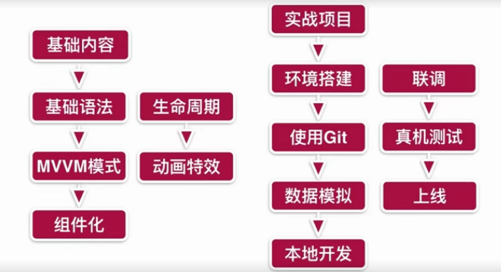


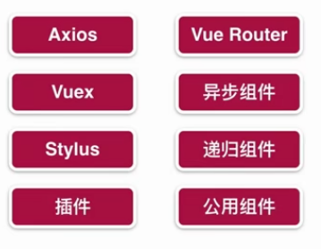


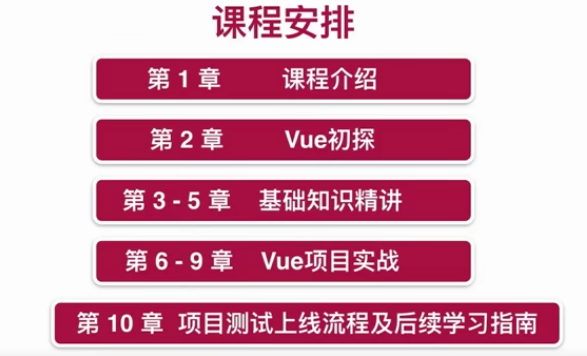


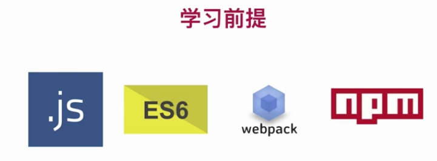


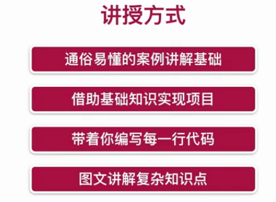


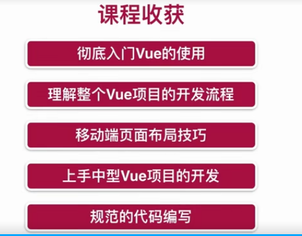


# 2Vue起步：

1，看官方文档

2，hello world


## vue小demo


```js
    <script src="https://cdn.jsdelivr.net/npm/vue"></script>
</head>

<body>
    <div id="app">
        <input type="text" v-model="txt">
        <button class="btn" v-on:click="submit">提交</button>

        <ul>
            <li v-for="(item,index) in list" :key="index">{{item}}</li>
        </ul>
    </div>

</body>

<script>
    var vm = new Vue({
        el: '#app',
        data: {
            txt: '',
            list: [],
        },
        methods: {
            submit: function () {
                // console.log(this.txt)
                if(this.txt !== ""){
                this.list.push(this.txt)
                this.txt = ''
                }
            }
        }
    })
</script>
```


## mvp

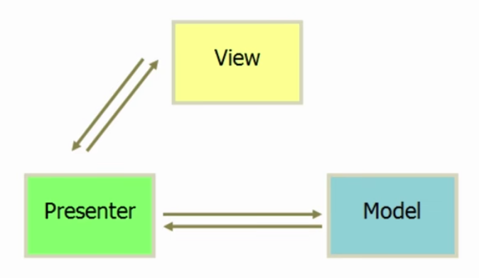


## jquery

 m 模型层 v 视图p 控制器


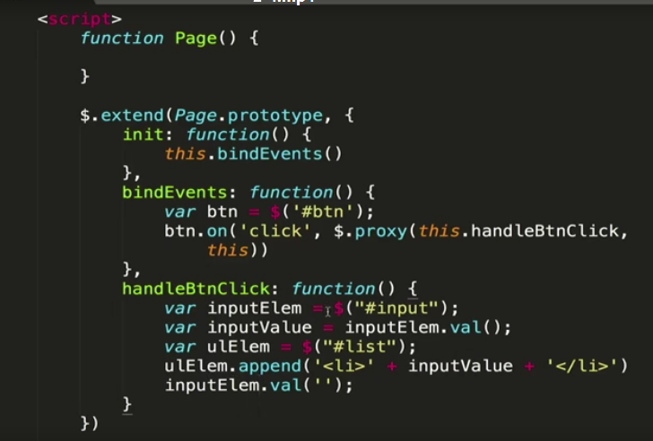


## mvvm

m：data v：div上面  vm：

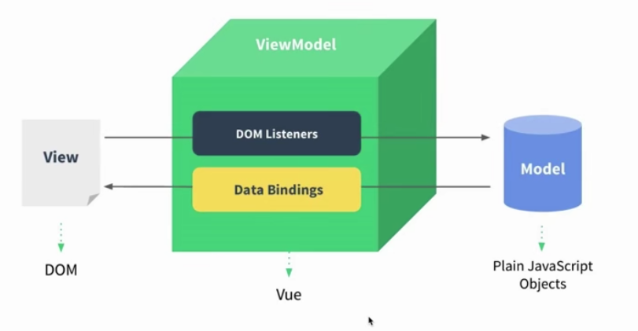


前端组件化：

组件化思想修改小demo


## 全局组件/局部组件：

```

<body>
    <div id="app">
        <input type="text" v-model="txt">
        <button class="btn" v-on:click="submit">提交</button>

        <ul>
            <!-- <li v-for="(item,index) in list" :key="index">{{item}}</li> -->
            <list-to v-bind:content="item" v-for="(item,index) in list" :key="index"></list-to>
        </ul>
    </div>

</body>


<script>
    //全局组件===================================
    // Vue.component("listTo", {
    //     props: ['content'],  //组件间传值
    //     template: "<li>{{content}}</li>"
    // })
    //局部组件==================================
    var listTo = {
        props: ['content'],
        template: "<li>{{content}}</li>"

    }

    var vm = new Vue({
        el: '#app',
        data: {
            txt: '',
            list: [],
        },

        components: {
            listTo: listTo//=== 挂载
        },

        methods: {
            submit: function () {
                // console.log(this.txt)
                if (this.txt !== "") {
                    this.list.push(this.txt)
                    this.txt = ''
                }
            }
        }
    })
</script>

```


## 父子传值：

```js
<body>
    <div id="app">
        <input type="text" v-model="txt">
        <button class="btn" v-on:click="submit">提交</button>

        <ul>
            <!-- <li v-for="(item,index) in list" :key="index">{{item}}</li> -->
            <list-to v-bind:content="item" v-for="(item,index) in list" :key="index" @delete="listToClick"></list-to>//================
        </ul>
    </div>

</body>

<script>
    //全局组件
    // Vue.component("listTo", {
    //     props: ['content'],
    //     template: "<li>{{content}}</li>"
    // })
    var listTo = {
        props: ['content'],
        template: "<li v-on:click='listToClick'>{{content}}</li>",//===
       methods: {
        listToClick:function(){
            this.$emit("delete",this.index);//========
        }
       },

    }

    var vm = new Vue({
        el: '#app',
        data: {
            txt: '',
            list: [],
        },

        components: {
            listTo: listTo
        },

        methods: {
            submit: function () {
                // console.log(this.txt)
                if (this.txt !== "") {
                    this.list.push(this.txt)
                    this.txt = ''
                }
            },
            listToClick:function(index){//========
               this.list.splice(index,1)
            }
        }
    })
</script>
```


# 3基础精讲

vm.$data

vm.$el

vm.$destory()


## 声明周期钩子：


beforeCreate:

**beforeCreate（新对象诞生）**

Vue对象用新方法实例化。它创建一个Vue类的对象来处理DOM元素。对象的这个生命阶段可以通过beforeCreated 挂钩来访问   。我们可以在这个钩子中插入我们的代码，在对象初始化之前执行。


created

**创建（具有默认特性的对象）**

在这个生命阶段，对象及其事件完全初始化。 created 是访问这个阶段并编写代码的钩子。


beforeMount

**beforeMounted（对象在DOM中适合形状）**

这个钩子被调用  beforeMounted。在这个阶段，它检查是否有任何模板可用于要在DOM中呈现的对象。如果没有找到模板，那么它将所定义元素的外部HTML视为模板。


mounted

**已安装（DOM已准备就绪并放置在页面内）**

一旦模板准备就绪。它将数据放入模板并创建可呈现元素。用这个新的数据填充元素替换DOM元素。这一切都发生在mounted钩子上。


beforeUpdate

**beforeUpdate（更改已完成，但尚未准备好更新DOM）**

在外部事件/用户输入beforeUpdate发生更改时，此钩子即  在反映原始DOM元素的更改之前被触发。

为了解决这个问题  beforeUpdated，我添加了下面的代码。它通过更新DOM来更改运行时中的hello_message。


updated

**更新（在DOM中呈现的更改）**

然后，通过实际更新DOM对象并触发updated，屏幕上的变化得到呈现  。


beforeDestory

**beforeDestroy（对象准备死掉）**

就在Vue对象被破坏并从内存中释放之前，  deforeDestroy 钩子被触发，并允许我们在其中处理我们的自定义代码。

为了激发这个钩子，我添加了下面的代码来销毁Vue对象。


destroyed

**销毁（对象停止并从内存中删除）**

该  destroyed 钩子被成功运行销毁对象上调用。


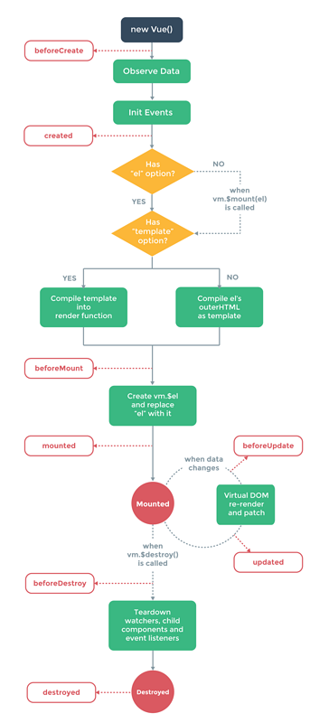

 

```js
<!DOCTYPE html>
<html>
<head>
    <title></title>
    <script type="text/javascript" src="https://cdn.jsdelivr.net/vue/2.1.3/vue.js"></script>
</head>
<body>

<div id="app">
     <p>{{ message }}</p>
</div>

<script type="text/javascript">
    
  var app = new Vue({
      el: '#app',
      data: {
          message : "xuxiao is boy" 
      },
       beforeCreate: function () {
                console.group('beforeCreate 创建前状态===============》');
               console.log("%c%s", "color:red" , "el     : " + this.$el); //undefined
               console.log("%c%s", "color:red","data   : " + this.$data); //undefined 
               console.log("%c%s", "color:red","message: " + this.message)  
        },
        created: function () {
            console.group('created 创建完毕状态===============》');
            console.log("%c%s", "color:red","el     : " + this.$el); //undefined
               console.log("%c%s", "color:red","data   : " + this.$data); //已被初始化 
               console.log("%c%s", "color:red","message: " + this.message); //已被初始化
        },
        beforeMount: function () {
            console.group('beforeMount 挂载前状态===============》');
            console.log("%c%s", "color:red","el     : " + (this.$el)); //已被初始化
            console.log(this.$el);
               console.log("%c%s", "color:red","data   : " + this.$data); //已被初始化  
               console.log("%c%s", "color:red","message: " + this.message); //已被初始化  
        },
        mounted: function () {
            console.group('mounted 挂载结束状态===============》');
            console.log("%c%s", "color:red","el     : " + this.$el); //已被初始化
            console.log(this.$el);    
               console.log("%c%s", "color:red","data   : " + this.$data); //已被初始化
               console.log("%c%s", "color:red","message: " + this.message); //已被初始化 
        },
        beforeUpdate: function () {
            console.group('beforeUpdate 更新前状态===============》');
            console.log("%c%s", "color:red","el     : " + this.$el);
            console.log(this.$el);   
               console.log("%c%s", "color:red","data   : " + this.$data); 
               console.log("%c%s", "color:red","message: " + this.message); 
        },
        updated: function () {
            console.group('updated 更新完成状态===============》');
            console.log("%c%s", "color:red","el     : " + this.$el);
            console.log(this.$el); 
               console.log("%c%s", "color:red","data   : " + this.$data); 
               console.log("%c%s", "color:red","message: " + this.message); 
        },
        beforeDestroy: function () {
            console.group('beforeDestroy 销毁前状态===============》');
            console.log("%c%s", "color:red","el     : " + this.$el);
            console.log(this.$el);    
               console.log("%c%s", "color:red","data   : " + this.$data); 
               console.log("%c%s", "color:red","message: " + this.message); 
        },
        destroyed: function () {
            console.group('destroyed 销毁完成状态===============》');
            console.log("%c%s", "color:red","el     : " + this.$el);
            console.log(this.$el);  
               console.log("%c%s", "color:red","data   : " + this.$data); 
               console.log("%c%s", "color:red","message: " + this.message)
        }
    })
</script>
</body>
</html>
```

## vue模板语法：

插值表达式 {{msg}}

v-text

v-html


## 计算属性，方法和侦听器

### 计算属性：computed:{

}

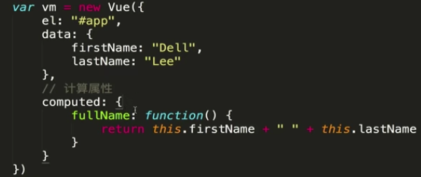

计算缓存


### 计算方法：

没有缓存

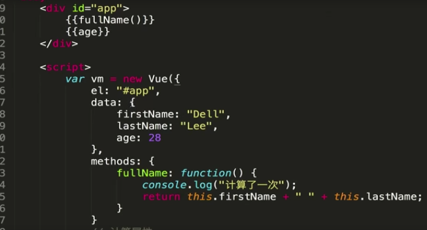

### 侦听器：watch：{

}

会有缓存


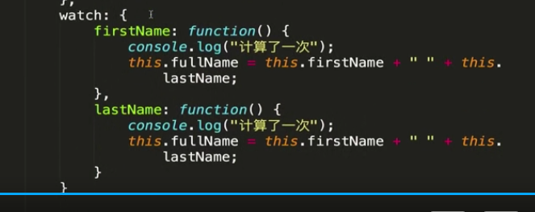


## 计算属性的setter个getter


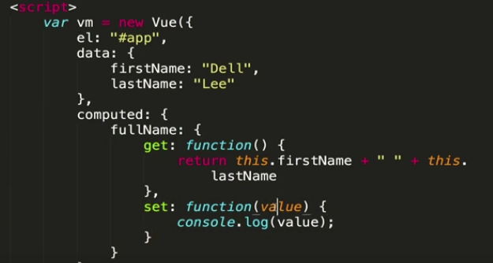


## vue的样式绑定

isActivated

：class=“{activated：isActivated}”

data:{

isActivated:true/false

}


class:

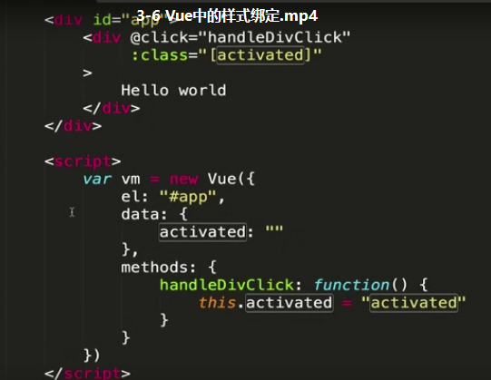

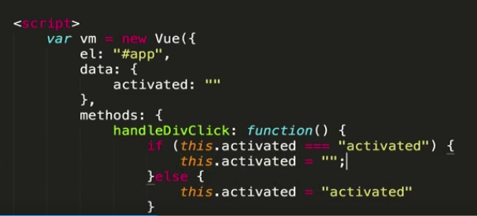


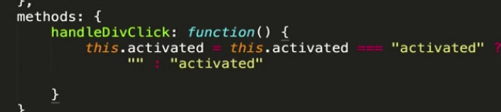


style:对象/数组


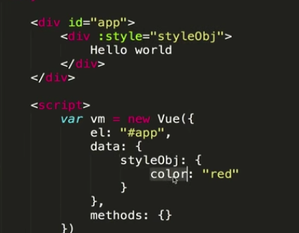 


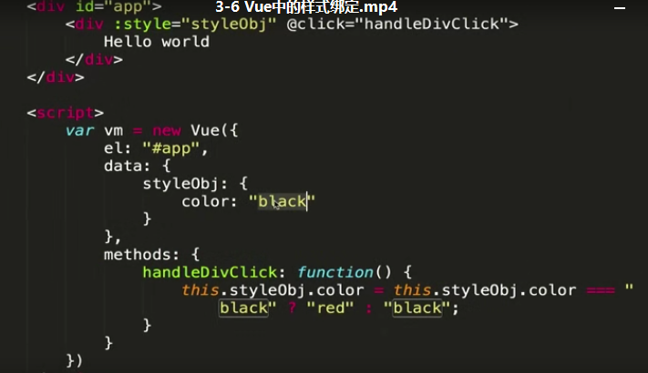


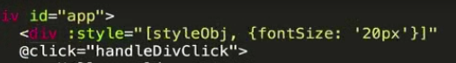


## vue中条件渲染

v-if：

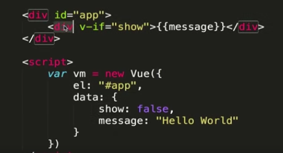

v-else：

v-else-if：

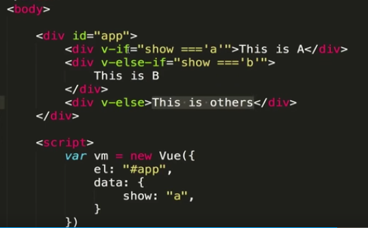


v-show：存在

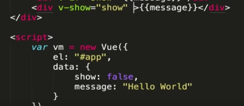


key值的使用：

防止复用


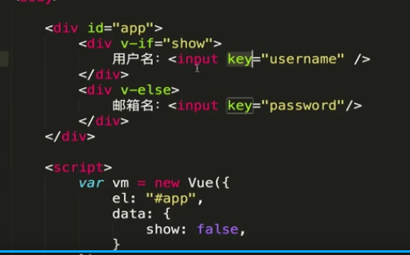


## 列表渲染：

数组循环


key值：不推荐用index

性能最优

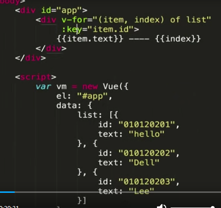


修改数组不能通过修改下标的方式：


1只能通过vue提供的  push pop shift unshift  splice sort reverse

 

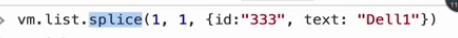


2改变数组的引用地址：


template 占位符，不会渲染到页面

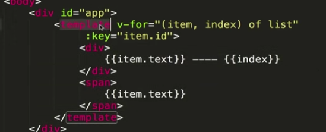


对象的循环


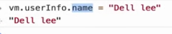

通过修改引用添加数据：

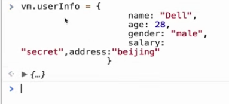


## vue中的set方法

对象：

**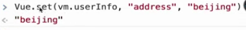**


实例方法：

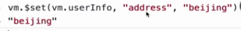


数组：

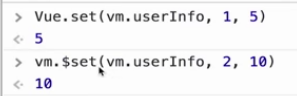


总结：

改变数组数据，页面跟着变：1，改变引用，2使用变异方法，3set

改变对象数据，页面跟着变：1，改变引用，2set


# 4深入了解组件

## 组件使用细节

1is解决bug

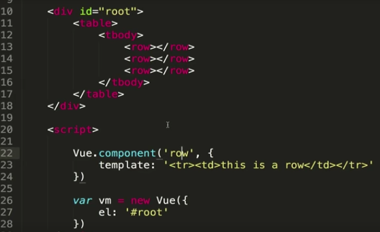

解决bug


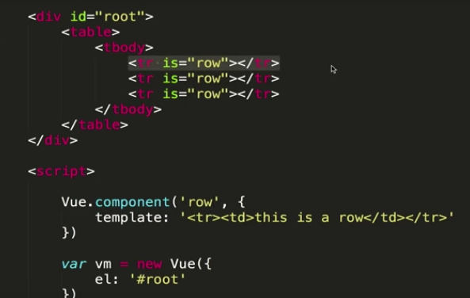


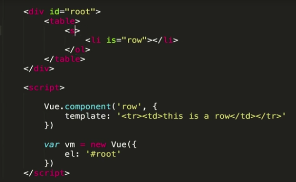


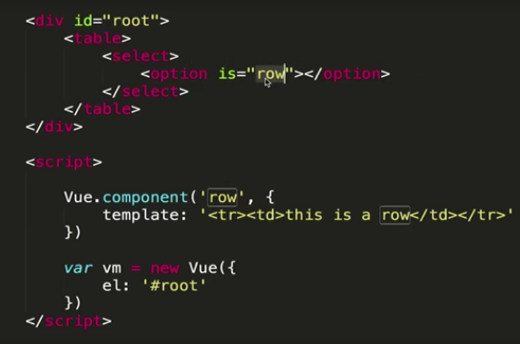


2子组件的data是一个函数 返回对象

防止各组件数据冲突

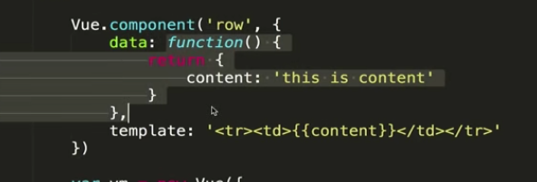


3 ref获取dom节点

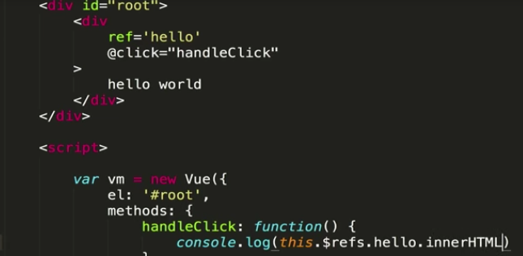


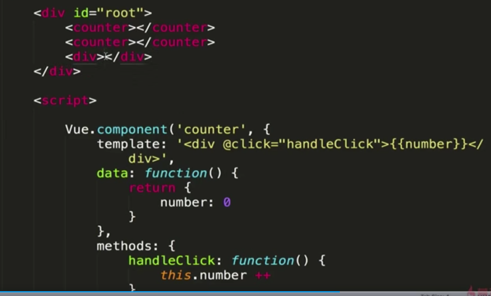


触发change事件  父组件监听change事件，执行change方法

  


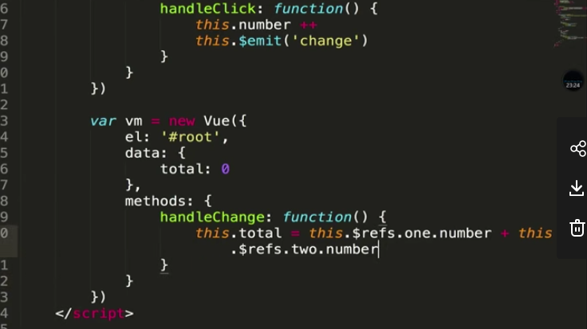


div标签上时 获取的是标签的dom元素

组件上写ref  通过t$refs     获取的内容实际上是 counter子组件的一个引用


## 父子组件的数据传递：

1 **父组件通过属性传值**

子组件使用父组件的数据：父组件向字组件传递参数

子组件不能反过来改变父组件的参数

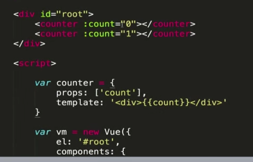


要改变，自己创建一个数据来保存

 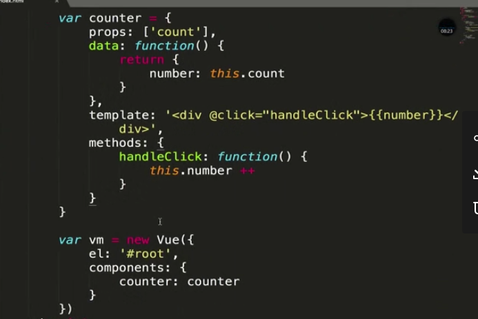


2**子组件通过事件触发的形式传值**


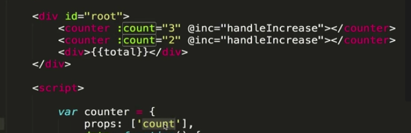


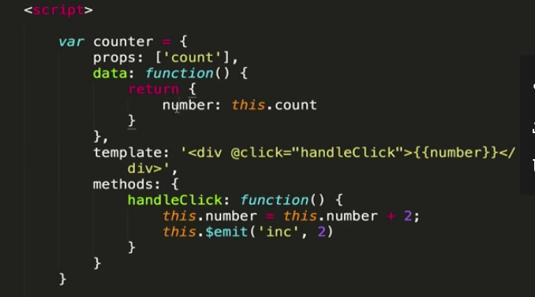


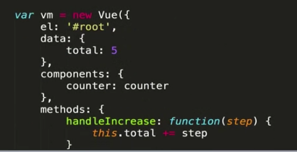


## 组件参数校验与非props特性


组件参数校验：

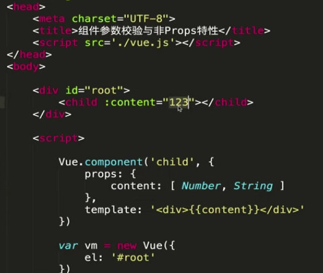


自定义校验器：

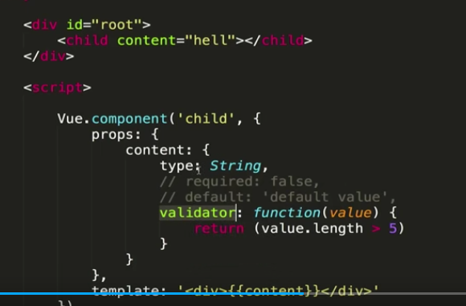


非props特性：

1，父传子不接，无法使用父组件的内容

2，属性会展示到子组件最外层的html标签的属性里

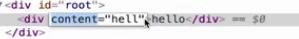


## 组件绑定原生事件


1，在templateli的div加事件

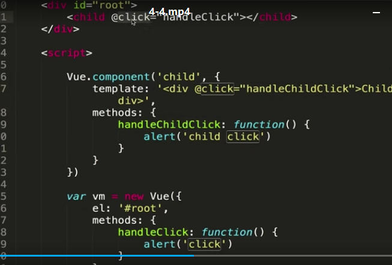


2在child加事件

父组件的事件无法触发：

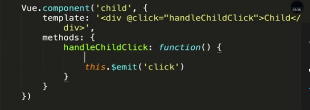


3 监听child的原生点击事件 .native


## 非父子组件间的传值（Bus/总线/发布订阅模式/观察者模式）

   

​    


 

​     


```js
<body>
    <div id="app">
        <first-child content="111"> </first-child>
        <first-child content="222"> </first-child>
        
        
    </div>
    
    
</body>
<script>
    Vue.prototype.bus = new Vue()

    Vue.component('firstChild',{
        data:function(){
            return {
                childContent:this.content

            }
        },
        props:{
            content:String
        },
        template:'<div @click="func">{{childContent}}</div>',
        methods:{
            func(){
                console.log(this.childContent)
                this.bus.$emit('change',this.childContent)
            }
        },
        mounted() {
            var that=this
            this.bus.$on('change',function(msg){
                that.childContent = msg

            })
            
        },
    })

    var vm =new Vue({
        el:'#app',
        data:{
            
        },
        methods: {
            
        },
        
    })

</script>
```


## vue使用插槽


这种情况会 多一个div template不好用


solt


具名插槽：


## vue作用域插槽


v-slot="props"

父组件调用子组件的时候给子组件传了一个作用域插槽，这个插槽必须是template开头

应用场景：

当子组件循环或者某一部分他的  应该有外界传递进来


```
<body>

    <div id="app">
        <child>
            //<template slot-scope="props">
            <template v-slot="props">
                <li>{{props.item}}===={{props.index}}</li>
            </template>
        </child>

    </div>


</body>
<script>

    Vue.component('child', {
        data: function () {
            return {
                list: [1, 2, 3, 4]
            }
        },
        template:
         `
         <div>
        <ul>
            <slot v-for='(item,index) in list' :key='index' :item=item :index=index></slot>
        </ul>
        </div>
        `
    })
    var vm = new Vue({
        el: '#app'
    })

</script>
```


## 动态组件和v-once指令：


动态组件：


v-once指令：性能更高


# 5vue的动画特效

## vue中的动画及原理：


Vue 提供了 `transition` 的封装组件，在下列情形中，可以给任何元素和组件添加进入/离开过渡

- 条件渲染 (使用 `v-if`)
- 条件展示 (使用 `v-show`)
- 动态组件
- 组件根节点


```vue
<div id="demo">
  <button v-on:click="show = !show">
    Toggle
  </button>
  <transition name="fade">//去掉name则class:v-enter
    <p v-if="show">hello</p>
  </transition>
</div>
new Vue({
  el: '#demo',
  data: {
    show: true
  }
})
.fade-enter-active, .fade-leave-active {
  transition: opacity .5s;
}
.fade-enter, .fade-leave-to /* .fade-leave-active below version 2.1.8 */ {
  opacity: 0;
}
```


## vue中animate.css库

自定义 transition的class：


使用 animate.css

 animated必须要加


## 在vue同时使用过度和动画：

第一次显示时，即网页刷新启动动画；


同时：

两种动画的时长，设定：type：transition


：duration

1


2


## vue中的js动画与velocity.js的结合：

注意 动画结束done（）enter leave  有回调


```js
js钩子
<transition
  v-on:before-enter="beforeEnter"
  v-on:enter="enter"
  v-on:after-enter="afterEnter"

  v-on:enter-cancelled="enterCancelled"

  v-on:before-leave="beforeLeave"
  v-on:leave="leave"
  v-on:after-leave="afterLeave"

  v-on:leave-cancelled="leaveCancelled"
>
  <!-- ... -->
</transition>


// ...
methods: {
  // --------
  // 进入中
  // --------

  beforeEnter: function (el) {
    // ...
  },
  // 当与 CSS 结合使用时
  // 回调函数 done 是可选的
  enter: function (el, done) {
    // ...
    done()
  },
  afterEnter: function (el) {
    // ...
  },
  enterCancelled: function (el) {
    // ...
  },

  // --------
  // 离开时
  // --------

  beforeLeave: function (el) {
    // ...
  },
  // 当与 CSS 结合使用时
  // 回调函数 done 是可选的
  leave: function (el, done) {
    // ...
    done()
  },
  afterLeave: function (el) {
    // ...
  },
  // leaveCancelled 只用于 v-show 中
  leaveCancelled: function (el) {
    // ...
  }
}
```


## vue中多个元素或组件的过渡

多个元素：


没有动画，dom复用

当有**相同标签名**的元素切换时，需要通过 `key` 特性设置唯一的值来标记以让 Vue 区分它们，否则 Vue 为了效率只会替换相同标签内部的内容。即使在技术上没有必要，**给在 \<transition> 组件中的多个元素设置 key 是一个更好的实践。**


有动画了，但有问题


同时生效的进入和离开的过渡不能满足所有要求，所以 Vue 提供了 **过渡模式**

- `in-out`：新元素先进行过渡，完成之后当前元素过渡离开。
- `out-in`：当前元素先进行过渡，完成之后新元素过渡进入。

用 `out-in` 重写之前的开关按钮过渡：


多个组件的过度：

```
<transition name="component-fade" mode="out-in">
  <component v-bind:is="view"></component>=====
</transition>

new Vue({
  el: '#transition-components-demo',
  data: {
    view: 'v-a'
  },
  components: {
    'v-a': {
      template: '<div>Component A</div>'
    },
    'v-b': {
      template: '<div>Component B</div>'
    }
  }
})
.component-fade-enter-active, .component-fade-leave-active {
  transition: opacity .3s ease;
}
.component-fade-enter, .component-fade-leave-to
/* .component-fade-leave-active for below version 2.1.8 */ {
  opacity: 0;
}
```


## vue的列表过渡：

目前为止，关于过渡我们已经讲到：

- 单个节点
- 同一时间渲染多个节点中的一个

那么怎么同时渲染整个列表，比如使用 `v-for` ？在这种场景中，使用 `<transition-group>` 组件。在我们深入例子之前，先了解关于这个组件的几个特点：

- 不同于 `<transition>`，它会以一个真实元素呈现：默认为一个 `<span>`。你也可以通过 `tag` 特性更换为其他元素。
- [过渡模式](https://cn.vuejs.org/v2/guide/transitions.html#过渡模式)不可用，因为我们不再相互切换特有的元素。
- 内部元素 **总是需要** 提供唯一的 `key` 属性值。

```js
<div id="list-demo" class="demo">
  <button v-on:click="add">Add</button>
  <button v-on:click="remove">Remove</button>
  <transition-group name="list" tag="p">
    <span v-for="item in items" v-bind:key="item" class="list-item">
      {{ item }}
    </span>
  </transition-group>
</div>
new Vue({
  el: '#list-demo',
  data: {
    items: [1,2,3,4,5,6,7,8,9],
    nextNum: 10
  },
  methods: {
    randomIndex: function () {
      return Math.floor(Math.random() * this.items.length)
    },
    add: function () {
      this.items.splice(this.randomIndex(), 0, this.nextNum++)
    },
    remove: function () {
      this.items.splice(this.randomIndex(), 1)
    },
  }
})
.list-item {
  display: inline-block;
  margin-right: 10px;
}
.list-enter-active, .list-leave-active {
  transition: all 1s;
}
.list-enter, .list-leave-to
/* .list-leave-active for below version 2.1.8 */ {
  opacity: 0;
  transform: translateY(30px);
}
```


列表的排序过度：v-move

`<transition-group>` 组件还有一个特殊之处。不仅可以进入和离开动画，还可以改变定位。要使用这个新功能只需了解新增的  **v-move  特性**，它会在元素的改变定位的过程中应用。像之前的类名一样，可以通过 `name` 属性来自定义前缀，也可以通过 `move-class` 属性手动设置。

`v-move` 对于设置过渡的切换时机和过渡曲线非常有用，你会看到如下的例子：

```js
<script src="https://cdnjs.cloudflare.com/ajax/libs/lodash.js/4.14.1/lodash.min.js"></script>

<div id="flip-list-demo" class="demo">
  <button v-on:click="shuffle">Shuffle</button>
  <transition-group name="flip-list" tag="ul">
    <li v-for="item in items" v-bind:key="item">
      {{ item }}
    </li>
  </transition-group>
</div>
new Vue({
  el: '#flip-list-demo',
  data: {
    items: [1,2,3,4,5,6,7,8,9]
  },
  methods: {
    shuffle: function () {
      this.items = _.shuffle(this.items)
    }
  }
})
.flip-list-move {
  transition: transform 1s;
}
```


## vue的动画封装

过渡可以通过 Vue 的组件系统实现复用。要创建一个可复用过渡组件，你需要做的就是将 `<transition>` 或者 `<transition-group>` 作为根组件，然后将任何子组件放置在其中就可以了。

使用 template 的简单例子：

```js
ue.component('my-special-transition', {
  template: '\
    <transition\
      name="very-special-transition"\
      mode="out-in"\
      v-on:before-enter="beforeEnter"\
      v-on:after-enter="afterEnter"\
    >\
      <slot></slot>\
    </transition>\
  ',
  methods: {
    beforeEnter: function (el) {
      // ...
    el.style.color=.....
    },
        
    afterEnter: function (el) {
      // ...
    }
  }
})
```


# 项目预热

1.nodejs

2,gitee

下载项目到本地 git clone 地址

3,git

4，vue-cli


git status  

add .

git commit -m


package.json 第三方模块依赖  -lock 锁文件

license：开源协议的说明

index.html  项目默认的模板文件

.postcss  对postcss的配置项

.gitignore git上传默认忽视

.eslintrc 代码规范

.eslintig 某些文件不会eslink检测

.editorconfig 配置了编辑器的语法

.babelrc  引入babel语法解析器

static 静态资源

src 整个项目源代码


mian.js 入口文件

app.vue  项目原始的根组件

asset 资源


node 依赖包

config  项目的配置文件 index.js基础   dev.env.js 开发环境  prod.env.js线上环境

build  项目打包的webpack配置内容


## 单文件组件和vue中的路由

html

```html
<script src="https://unpkg.com/vue/dist/vue.js"></script>
<script src="https://unpkg.com/vue-router/dist/vue-router.js"></script>

<div id="app">
  <h1>Hello App!</h1>
  <p>
    <!-- 使用 router-link 组件来导航. -->
    <!-- 通过传入 `to` 属性指定链接. -->
    <!-- <router-link> 默认会被渲染成一个 `<a>` 标签 -->
    <router-link to="/foo">Go to Foo</router-link>
    <router-link to="/bar">Go to Bar</router-link>
  </p>
  <!-- 路由出口 -->
  <!-- 路由匹配到的组件将渲染在这里 -->
  <router-view></router-view>
</div>
```


js

```vue
// 0. 如果使用模块化机制编程，导入Vue和VueRouter，要调用 Vue.use(VueRouter)

// 1. 定义 (路由) 组件。
// 可以从其他文件 import 进来
const Foo = { template: '<div>foo</div>' }
const Bar = { template: '<div>bar</div>' }
// 2. 定义路由
// 每个路由应该映射一个组件。 其中"component" 可以是
// 通过 Vue.extend() 创建的组件构造器，
// 或者，只是一个组件配置对象。
// 我们晚点再讨论嵌套路由。
const routes = [
{ path: '/foo', component: Foo },
{ path: '/bar', component: Bar }
]
// 3. 创建 router 实例，然后传 `routes` 配置
// 你还可以传别的配置参数, 不过先这么简单着吧。
const router = new VueRouter({
routes // (缩写) 相当于 routes: routes
})
// 4. 创建和挂载根实例。
// 记得要通过 router 配置参数注入路由，
// 从而让整个应用都有路由功能
const app = new Vue({
router
}).$mount('#app')
// 现在，应用已经启动了！
```

通过注入路由器，我们可以在任何组件内通过 `this.$router` 访问路由器，也可以通过 `this.$route` 访问当前路由：

```vue
// Home.vue
export default {
  computed: {
    username () {
      // 我们很快就会看到 `params` 是什么
      return this.$route.params.username
    }
  },
  methods: {
    goBack () {
      window.history.length > 1
        ? this.$router.go(-1)
        : this.$router.push('/')
    }
  }
}
```


多页应用和单页应用


跳转


## 项目代码初始化 


1meta 手机端，禁止放大，1：1

2引入css


3引入 多倍屏的css，1px,物理像素边

4，click延迟300ms   npm install fastclick --save

5，iconfont

https://www.iconfont.cn/manage/index?spm=a313x.7781069.1998910419.11&manage_type=myprojects&projectId=1177433&keyword=


# 首页开发

## 首页header区域的开发

install stylus --save

install stylus-loader --save    

以上可用可不用


```js
<template>
    <div class="header">
        <div class="header-left">返回</div>
        <div class="header-input">内容</div>
        <div class="header-right">城市</div>
    </div>
</template>
<script>
export default {
  name: 'HomeHeader',
};
</script>
<style scoped lang="scss">
.header{
    display: flex;
    height: .86rem;
    background-color: #00bcd4;
    color: #fff;
    .header-left {
        width: .64rem;
        float: left;

        height: .86rem;
        line-height: .86rem;

    }
    .header-input {
        flex:1;
        height: .64rem;
        line-height: .64rem;
        margin-top: .12rem;
        margin-left: .2rem;
        background-color: #fff;
        border-radius: .1rem;
        color: #ccc;
    }
    .header-right {
        width: 1.24rem;
        float: right;
        text-align: center;

         height: .86rem;
        line-height: .86rem;

    }
}

</style>

```


## iconfont的使用和代码优化

**iconfont**

icon 选好图标，购物车=》下载  ，放置 

引入文件：

main.js


引用：


**代码优化**

1css的通用参数，变量化 的定义变量

新建文件 加入变量


引用：


2  @/文件名     ~@/文件名   的使用

使代码简化


重启服务器


## 首页轮播图

新建分支：github创建分支

git pull 分支拉到本地

切换 分支到 index-swiper


vue-awesome


cnpm install vue-awesome-swiper@2.6.7 --save

https://github.com/surmon-china/vue-awesome-swiper


新建swiper文件

 


插入图片


图片宽高调整：


问题：

test文字抖动：

swiper外加div 


​				background：#fff

首页引入：

 


swiper.vue


问题没法修饰上：被scoped限制了


修改后

   


添加点：传递class的名字


往前拖白色，做循环


自己的问题

1


id的值重复

2


未处理


git add .

git commit -m ""

git push

git checkout master

git merge origin/index-swiper


git push


## 图标区域的页面布局


创建新分支：index-icons

git pull

git checkout index-icons

 

```php+HTML
<template>
  <div class="icons">
    <div class="icon">
      <div class="icon-img">
        
      </div>
      <p class="icon-desc">热门景点</p>
    </div>
  </div>
</template>
<script>
export default {
  name: "HomeIcons"
};
</script>
<style scoped lang="scss">
@import '../assets/styles/varibles.scss';
.icons {
  overflow: hidden;
  height: 0;
  padding-bottom: 50%;
//   background: green;

  .icon {
    float: left;
    width: 25%;
    overflow: hidden;
    padding-bottom: 25%;
    // background: red;
    position: relative;
    // aaa
    height: 0;
    .icon-img {
      position: absolute;
      top: 0;
      left: 0;
      right: 0;
      bottom: 0.44rem;
    //   background-color: blue;

      box-sizing: border-box;
    //   background: blue;
      padding: 0.1rem;
      .icon-img-content {
        height: 100%;
        display: block;
        margin: 0 auto;
        height: 100%;
      }
      
    }
    .icon-desc {
        position: absolute;
        
        left: 0;
        right: 0;
        bottom: 0;
        height: .44rem;
        line-height: .44rem;
        color: $darkTextColor;
        text-align: center;
      }
  }
}
</style>

```


## 图标区域逻辑实现：


```
<template>
  <div class="icons">
    <swiper>
      <swiper-slide v-for="(page,index) in pages" :key="index">
        <div class="icon" v-for="item in page" :key="item.id">
          <div class="icon-img">
            
          </div>

          <p class="icon-desc">{{item.desc}}</p>
        </div>
      </swiper-slide>
    </swiper>
  </div>
</template>


<script>
export default {
  name: "HomeIcons",
  data() {
    return {
      imgLists: [
        {
          id: "1",
          desc: "景点门票",
          imgSrc:
            "http://img1.qunarzz.com/piao/fusion/1611/54/ace00878a52d9702.png"
        },
        {
          id: "2",
          desc: "景点门票",
          imgSrc:
            "http://img1.qunarzz.com/piao/fusion/1611/54/ace00878a52d9702.png"
        },
        {
          id: "3",
          desc: "景点门票",
          imgSrc:
            "http://img1.qunarzz.com/piao/fusion/1611/54/ace00878a52d9702.png"
        },
        {
          id: "4",
          desc: "景点门票",
          imgSrc:
            "http://img1.qunarzz.com/piao/fusion/1611/54/ace00878a52d9702.png"
        },

        {
          id: "5",
          desc: "景点门票",
          imgSrc:
            "http://img1.qunarzz.com/piao/fusion/1611/54/ace00878a52d9702.png"
        },
        {
          id: "6",
          desc: "景点门票",
          imgSrc:
            "http://img1.qunarzz.com/piao/fusion/1611/54/ace00878a52d9702.png"
        },
        {
          id: "7",
          desc: "景点门票",
          imgSrc:
            "http://img1.qunarzz.com/piao/fusion/1611/54/ace00878a52d9702.png"
        },
        {
          id: "8",
          desc: "景点门票",
          imgSrc:
            "http://img1.qunarzz.com/piao/fusion/1611/54/ace00878a52d9702.png"
        },
        {
          id: "9",
          desc: "景点门票",
          imgSrc:
            "http://img1.qunarzz.com/piao/fusion/1611/54/ace00878a52d9702.png"
        }
      ]
    };
  },
  //===========================
  computed: {
    pages() {
      const pages = [];
      this.imgLists.forEach((item, index) => {
        const page = Math.floor(index / 8);
        if (!pages[page]) {
          pages[page] = [];
        }
        pages[page].push(item);
      });
      return pages;
    }
  }
};
</script>
<style scoped lang="scss">
@import "../assets/styles/varibles.scss";
.icons >>> .swiper-container {
  //   overflow: hidden;
  height: 0;
  padding-bottom: 50%;
  //   background: green;
}

.icon {
  float: left;
  width: 25%;
  overflow: hidden;
  padding-bottom: 25%;
  // background: red;
  position: relative;
  // aaa
  height: 0;
  .icon-img {
    position: absolute;
    top: 0;
    left: 0;
    right: 0;
    bottom: 0.44rem;
    //   background-color: blue;

    box-sizing: border-box;
    //   background: blue;
    padding: 0.1rem;
    .icon-img-content {
      height: 100%;
      display: block;
      margin: 0 auto;
      height: 100%;
    }
  }
  .icon-desc {
    position: absolute;

    left: 0;
    right: 0;
    bottom: 0;
    height: 0.44rem;
    line-height: 0.44rem;
    color: $darkTextColor;
    text-align: center;

    //文字多省略============================
    overflow: hidden;
    white-space: nowrap;
    text-overflow: ellipsis;
  }
}
</style>

```


git add .

git commit -m ""

git push

git checkout master

git merge origin/index-swiper


git push


## 推荐组件开发：

