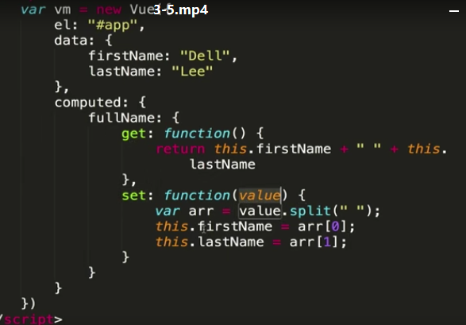
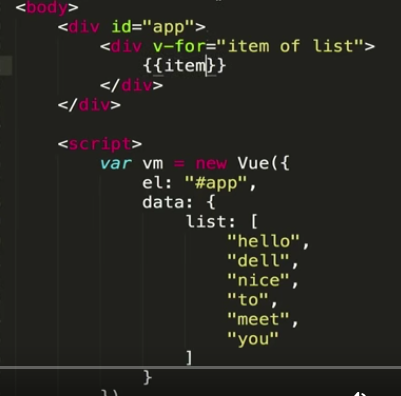
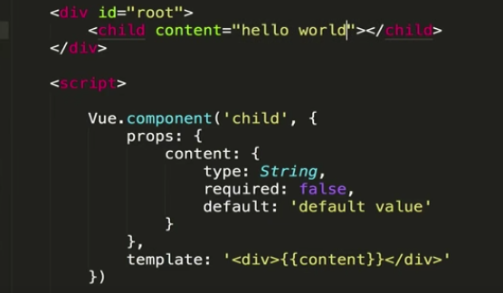

# 课程介绍：


# Vue起步：

1，看官方文档

2，hello world


## vue小demo


```js
    <script src="https://cdn.jsdelivr.net/npm/vue"></script>
</head>

<body>
    <div id="app">
        <input type="text" v-model="txt">
        <button class="btn" v-on:click="submit">提交</button>

        <ul>
            <li v-for="(item,index) in list" :key="index">{{item}}</li>
        </ul>
    </div>

</body>

<script>
    var vm = new Vue({
        el: '#app',
        data: {
            txt: '',
            list: [],
        },
        methods: {
            submit: function () {
                // console.log(this.txt)
                if(this.txt !== ""){
                this.list.push(this.txt)
                this.txt = ''
                }
            }
        }
    })
</script>
```


## mvp


## jquery

 m 模型层 v 视图p 控制器


## mvvm

m：data v：div上面  vm：


前端组件化：

组件化思想修改小demo


## 全局组件/局部组件：

```

<body>
    <div id="app">
        <input type="text" v-model="txt">
        <button class="btn" v-on:click="submit">提交</button>

        <ul>
            <!-- <li v-for="(item,index) in list" :key="index">{{item}}</li> -->
            <list-to v-bind:content="item" v-for="(item,index) in list" :key="index"></list-to>
        </ul>
    </div>

</body>


<script>
    //全局组件===================================
    // Vue.component("listTo", {
    //     props: ['content'],  //组件间传值
    //     template: "<li>{{content}}</li>"
    // })
    //局部组件==================================
    var listTo = {
        props: ['content'],
        template: "<li>{{content}}</li>"

    }

    var vm = new Vue({
        el: '#app',
        data: {
            txt: '',
            list: [],
        },

        components: {
            listTo: listTo//=== 挂载
        },

        methods: {
            submit: function () {
                // console.log(this.txt)
                if (this.txt !== "") {
                    this.list.push(this.txt)
                    this.txt = ''
                }
            }
        }
    })
</script>

```


## 父子传值：

```js
<body>
    <div id="app">
        <input type="text" v-model="txt">
        <button class="btn" v-on:click="submit">提交</button>

        <ul>
            <!-- <li v-for="(item,index) in list" :key="index">{{item}}</li> -->
            <list-to v-bind:content="item" v-for="(item,index) in list" :key="index" @delete="listToClick"></list-to>//================
        </ul>
    </div>

</body>

<script>
    //全局组件
    // Vue.component("listTo", {
    //     props: ['content'],
    //     template: "<li>{{content}}</li>"
    // })
    var listTo = {
        props: ['content'],
        template: "<li v-on:click='listToClick'>{{content}}</li>",//===
       methods: {
        listToClick:function(){
            this.$emit("delete",this.index);//========
        }
       },

    }

    var vm = new Vue({
        el: '#app',
        data: {
            txt: '',
            list: [],
        },

        components: {
            listTo: listTo
        },

        methods: {
            submit: function () {
                // console.log(this.txt)
                if (this.txt !== "") {
                    this.list.push(this.txt)
                    this.txt = ''
                }
            },
            listToClick:function(index){//========
               this.list.splice(index,1)
            }
        }
    })
</script>
```


# 基础精讲

vm.$data

vm.$el

vm.$destory()


## 声明周期钩子：


beforeCreate:

**beforeCreate（新对象诞生）**

Vue对象用新方法实例化。它创建一个Vue类的对象来处理DOM元素。对象的这个生命阶段可以通过beforeCreated 挂钩来访问   。我们可以在这个钩子中插入我们的代码，在对象初始化之前执行。


created

**创建（具有默认特性的对象）**

在这个生命阶段，对象及其事件完全初始化。 created 是访问这个阶段并编写代码的钩子。


beforeMount

**beforeMounted（对象在DOM中适合形状）**

这个钩子被调用  beforeMounted。在这个阶段，它检查是否有任何模板可用于要在DOM中呈现的对象。如果没有找到模板，那么它将所定义元素的外部HTML视为模板。


mounted

**已安装（DOM已准备就绪并放置在页面内）**

一旦模板准备就绪。它将数据放入模板并创建可呈现元素。用这个新的数据填充元素替换DOM元素。这一切都发生在mounted钩子上。


beforeUpdate

**beforeUpdate（更改已完成，但尚未准备好更新DOM）**

在外部事件/用户输入beforeUpdate发生更改时，此钩子即  在反映原始DOM元素的更改之前被触发。

为了解决这个问题  beforeUpdated，我添加了下面的代码。它通过更新DOM来更改运行时中的hello_message。


updated

**更新（在DOM中呈现的更改）**

然后，通过实际更新DOM对象并触发updated，屏幕上的变化得到呈现  。


beforeDestory

**beforeDestroy（对象准备死掉）**

就在Vue对象被破坏并从内存中释放之前，  deforeDestroy 钩子被触发，并允许我们在其中处理我们的自定义代码。

为了激发这个钩子，我添加了下面的代码来销毁Vue对象。


destroyed

**销毁（对象停止并从内存中删除）**

该  destroyed 钩子被成功运行销毁对象上调用。


 

```js
<!DOCTYPE html>
<html>
<head>
    <title></title>
    <script type="text/javascript" src="https://cdn.jsdelivr.net/vue/2.1.3/vue.js"></script>
</head>
<body>

<div id="app">
     <p>{{ message }}</p>
</div>

<script type="text/javascript">
    
  var app = new Vue({
      el: '#app',
      data: {
          message : "xuxiao is boy" 
      },
       beforeCreate: function () {
                console.group('beforeCreate 创建前状态===============》');
               console.log("%c%s", "color:red" , "el     : " + this.$el); //undefined
               console.log("%c%s", "color:red","data   : " + this.$data); //undefined 
               console.log("%c%s", "color:red","message: " + this.message)  
        },
        created: function () {
            console.group('created 创建完毕状态===============》');
            console.log("%c%s", "color:red","el     : " + this.$el); //undefined
               console.log("%c%s", "color:red","data   : " + this.$data); //已被初始化 
               console.log("%c%s", "color:red","message: " + this.message); //已被初始化
        },
        beforeMount: function () {
            console.group('beforeMount 挂载前状态===============》');
            console.log("%c%s", "color:red","el     : " + (this.$el)); //已被初始化
            console.log(this.$el);
               console.log("%c%s", "color:red","data   : " + this.$data); //已被初始化  
               console.log("%c%s", "color:red","message: " + this.message); //已被初始化  
        },
        mounted: function () {
            console.group('mounted 挂载结束状态===============》');
            console.log("%c%s", "color:red","el     : " + this.$el); //已被初始化
            console.log(this.$el);    
               console.log("%c%s", "color:red","data   : " + this.$data); //已被初始化
               console.log("%c%s", "color:red","message: " + this.message); //已被初始化 
        },
        beforeUpdate: function () {
            console.group('beforeUpdate 更新前状态===============》');
            console.log("%c%s", "color:red","el     : " + this.$el);
            console.log(this.$el);   
               console.log("%c%s", "color:red","data   : " + this.$data); 
               console.log("%c%s", "color:red","message: " + this.message); 
        },
        updated: function () {
            console.group('updated 更新完成状态===============》');
            console.log("%c%s", "color:red","el     : " + this.$el);
            console.log(this.$el); 
               console.log("%c%s", "color:red","data   : " + this.$data); 
               console.log("%c%s", "color:red","message: " + this.message); 
        },
        beforeDestroy: function () {
            console.group('beforeDestroy 销毁前状态===============》');
            console.log("%c%s", "color:red","el     : " + this.$el);
            console.log(this.$el);    
               console.log("%c%s", "color:red","data   : " + this.$data); 
               console.log("%c%s", "color:red","message: " + this.message); 
        },
        destroyed: function () {
            console.group('destroyed 销毁完成状态===============》');
            console.log("%c%s", "color:red","el     : " + this.$el);
            console.log(this.$el);  
               console.log("%c%s", "color:red","data   : " + this.$data); 
               console.log("%c%s", "color:red","message: " + this.message)
        }
    })
</script>
</body>
</html>
```

## vue模板语法：

插值表达式 {{msg}}

v-text

v-html


## 计算属性，方法和侦听器

### 计算属性：computed:{

}


计算缓存


### 计算方法：

没有缓存


### 侦听器：watch：{

}

会有缓存


## 计算属性的setter个getter





## vue的样式绑定

isActivated

：class=“{activated：isActivated}”

data:{

isActivated:true/false

}


class:


style:对象/数组


 


## vue中条件渲染

v-if：


v-else：

v-else-if：


v-show：存在


key值的使用：

防止复用


## 列表渲染：

数组循环




key值：不推荐用index

性能最优


修改数组不能通过修改下标的方式：


1只能通过vue提供的  push pop shift unshift  splice sort reverse

 


2改变数组的引用地址：


template 占位符，不会渲染到页面


对象的循环


通过修改引用添加数据：


## vue中的set方法

对象：

****


实例方法：


数组：


总结：

改变数组数据，页面跟着变：1，改变引用，2使用变异方法，3set

改变对象数据，页面跟着变：1，改变引用，2set


# 深入了解组件

## 组件使用细节

1is解决bug


解决bug


2子组件的data是一个函数 返回对象

防止各组件数据冲突


3 ref获取dom节点


触发change事件  父组件监听change事件，执行change方法

  


div标签上时 获取的是标签的dom元素

组件上写ref  通过t$refs     获取的内容实际上是 counter子组件的一个引用


## 父子组件的数据传递：

1 **父组件通过属性传值**

子组件使用父组件的数据：父组件向字组件传递参数

子组件不能反过来改变父组件的参数


要改变，自己创建一个数据来保存

 


2**子组件通过事件触发的形式传值**


## 组件参数校验与非props特性


组件参数校验：





自定义校验器：


非props特性：

1，父传子不接，无法使用父组件的内容

2，属性会展示到子组件最外层的html标签的属性里


## 组件绑定原生事件


1，在templateli的div加事件


2在child加事件

父组件的事件无法触发：


3 监听child的原生点击事件 .native


## 非父子组件间的传值（Bus/总线/发布订阅模式/观察者模式）

   

​    

​     