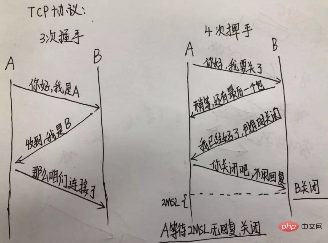

**1.写 React/Vue 项目时为什么要在组件中写 key，其作用是什么？**

key 的作用是为了在 diff 算法执行时更快的找到对应的节点，提高 diff 速度。

vue 和 react 都是采用 diff 算法来对比新旧虚拟节点，从而更新节点。在 vue 的 diff 函数中。可以先了解一下 diff 算法。

在交叉对比的时候，当新节点跟旧节点头尾交叉对比没有结果的时候，会根据新节点的 key 去对比旧节点数组中的 key，从而找到相应旧节点（这里对应的是一个 key => index 的 map 映射）。如果没找到就认为是一个新增节点。而如果没有 key，那么就会采用一种遍历查找的方式去找到对应的旧节点。一种一个 map 映射，另一种是遍历查找。相比而言。map 映射的速度更快。

**vue 部分源码如下：**

```
`// vue 项目  src/core/vdom/patch.js  -488 行``// oldCh 是一个旧虚拟节点数组， ``if` `(isUndef(oldKeyToIdx)) oldKeyToIdx = createKeyToOldIdx(oldCh, oldStartIdx, oldEndIdx)``       ``idxInOld = isDef(newStartVnode.key)``         ``? oldKeyToIdx[newStartVnode.key]``         ``: findIdxInOld(newStartVnode, oldCh, oldStartIdx, oldEndIdx)`
```

**创建 map 函数：**

```
`function` `createKeyToOldIdx (children, beginIdx, endIdx) {`` ``let i, key`` ``const` `map = {}`` ``for` `(i = beginIdx; i <= endIdx; ++i) {``   ``key = children[i].key``   ``if` `(isDef(key)) map[key] = i`` ``}`` ``return` `map``}`
```

**遍历寻找：**

```
`// sameVnode 是对比新旧节点是否相同的函数``function` `findIdxInOld (node, oldCh, start, ``end``) {``   ``for` `(let i = start; i < ``end``; i++) {``     ``const` `c = oldCh[i]` `     ``if` `(isDef(c) && sameVnode(node, c)) ``return` `i``   ``}`` ``}`
```

**2. 解析 ['1', '2', '3'].map(parseInt)**

第一眼看到这个题目的时候，脑海跳出的答案是 [1, 2, 3]，但是 真正的答案是 [1, NaN, NaN]。

首先让我们回顾一下，map 函数的第一个参数 callback：

```
`var` `new_array = arr.map(``function` `callback(currentValue[, index[, ``array``]]) { ``// Return element for new_array }[, thisArg])`
```

这个 callback 一共可以接收三个参数，其中第一个参数代表当前被处理的元素，而第二个参数代表该元素的索引。

而 parseInt 则是用来解析字符串的，使字符串成为指定基数的整数。

parseInt(string, radix)接收两个参数，第一个表示被处理的值（字符串），第二个表示为解析时的基数。

了解这两个函数后，我们可以模拟一下运行情况；

parseInt('1', 0) //radix 为 0 时，且 string 参数不以“0x”和“0”开头时，按照 10 为基数处理。这个时候返回 1；

parseInt('2', 1) // 基数为 1（1 进制）表示的数中，最大值小于 2，所以无法解析，返回 NaN；

parseInt('3', 2) // 基数为 2（2 进制）表示的数中，最大值小于 3，所以无法解析，返回 NaN。

map 函数返回的是一个数组，所以最后结果为 [1, NaN, NaN]。

**3. 什么是防抖和节流？有什么区别？如何实现？**

**1)防抖**

触发高频事件后 n 秒内函数只会执行一次，如果 n 秒内高频事件再次被触发，则重新计算时间；

思路：

每次触发事件时都取消之前的延时调用方法：

```
`function` `debounce(fn) {``     ``let timeout = null; ``// 创建一个标记用来存放定时器的返回值``     ``return` `function` `() {``       ``clearTimeout(timeout); ``// 每当用户输入的时候把前一个 setTimeout clear 掉``       ``timeout = setTimeout(() => { ``// 然后又创建一个新的 setTimeout, 这样就能保证输入字符后的 interval 间隔内如果还有字符输入的话，就不会执行 fn 函数``         ``fn.apply(this, arguments);``       ``}, 500);``     ``};``   ``}``   ``function` `sayHi() {``     ``console.log(``'防抖成功'``);``   ``}` `   ``var` `inp = document.getElementById(``'inp'``);``   ``inp.addEventListener(``'input'``, debounce(sayHi)); ``// 防抖`
```

**2)节流**

高频事件触发，但在 n 秒内只会执行一次，所以节流会稀释函数的执行频率。

思路：

每次触发事件时都判断当前是否有等待执行的延时函数。

```
`function` `throttle(fn) {``     ``let canRun = true; ``// 通过闭包保存一个标记``     ``return` `function` `() {``       ``if` `(!canRun) ``return``; ``// 在函数开头判断标记是否为 true，不为 true 则 return``       ``canRun = false; ``// 立即设置为 false``       ``setTimeout(() => { ``// 将外部传入的函数的执行放在 setTimeout 中``         ``fn.apply(this, arguments);``         ``// 最后在 setTimeout 执行完毕后再把标记设置为 true(关键) 表示可以执行下一次循环了。当定时器没有执行的时候标记永远是 false，在开头被 return 掉``         ``canRun = true;``       ``}, 500);``     ``};``   ``}``   ``function` `sayHi(e) {``     ``console.log(e.target.innerWidth, e.target.innerHeight);``   ``}``   ``window.addEventListener(``'resize'``, throttle(sayHi));`
```

**4. 介绍下 Set、Map、WeakSet 和 WeakMap 的区别？**

**1)Set**

成员唯一、无序且不重复；

[value, value]，键值与键名是一致的（或者说只有键值，没有键名）；

可以遍历，方法有：add、delete、has。

**2)WeakSet**

成员都是对象；

成员都是弱引用，可以被垃圾回收机制回收，可以用来保存 DOM 节点，不容易造成内存泄漏；

不能遍历，方法有 add、delete、has。

**3)Map**

本质上是键值对的集合，类似集合；

可以遍历，方法很多，可以跟各种数据格式转换。

**4)WeakMap**

只接受对象最为键名（null 除外），不接受其他类型的值作为键名；

键名是弱引用，键值可以是任意的，键名所指向的对象可以被垃圾回收，此时键名是无效的；

不能遍历，方法有 get、set、has、delete。

**5. 介绍下深度优先遍历和广度优先遍历，如何实现？**

**深度优先遍历（DFS）**

深度优先遍历（Depth-First-Search），是搜索算法的一种，它沿着树的深度遍历树的节点，尽可能深地搜索树的分支。当节点 v 的所有边都已被探寻过，将回溯到发现节点 v 的那条边的起始节点。这一过程一直进行到已探寻源节点到其他所有节点为止，如果还有未被发现的节点，则选择其中一个未被发现的节点为源节点并重复以上操作，直到所有节点都被探寻完成。

简单的说，DFS 就是从图中的一个节点开始追溯，直到最后一个节点，然后回溯，继续追溯下一条路径，直到到达所有的节点，如此往复，直到没有路径为止。

DFS 可以产生相应图的拓扑排序表，利用拓扑排序表可以解决很多问题，例如最大路径问题。一般用堆数据结构来辅助实现 DFS 算法。

**注意：深度 DFS 属于盲目搜索，无法保证搜索到的路径为最短路径，也不是在搜索特定的路径，而是通过搜索来查看图中有哪些路径可以选择。**

**步骤：**

访问顶点 v；

依次从 v 的未被访问的邻接点出发，对图进行深度优先遍历；直至图中和 v 有路径相通的顶点都被访问；

若此时途中尚有顶点未被访问，则从一个未被访问的顶点出发，重新进行深度优先遍历，直到所有顶点均被访问过为止。

**实现：**

```
`Graph.prototype.dfs = ``function``() {``   ``var` `marked = []``   ``for` `(``var` `i=0; i<this.vertices.length; i++) {``       ``if` `(!marked[this.vertices[i]]) {``           ``dfsVisit(this.vertices[i])``       ``}``   ``}` `   ``function` `dfsVisit(u) {``       ``let edges = this.edges``       ``marked[u] = true``       ``console.log(u)``       ``var` `neighbors = edges.get(u)``       ``for` `(``var` `i=0; i<neighbors.length; i++) {``           ``var` `w = neighbors[i]``           ``if` `(!marked[w]) {``               ``dfsVisit(w)``           ``}``       ``}``   ``}``}`
```

测试：

```
`graph.dfs()``// 1``// 4``// 3``// 2``// 5`
```

测试成功。

**广度优先遍历（BFS）**

广度优先遍历（Breadth-First-Search）是从根节点开始，沿着图的宽度遍历节点，如果所有节点均被访问过，则算法终止，BFS 同样属于盲目搜索，一般用队列数据结构来辅助实现 BFS。

**BFS 从一个节点开始，尝试访问尽可能靠近它的目标节点。本质上这种遍历在图上是逐层移动的，首先检查最靠近第一个节点的层，再逐渐向下移动到离起始节点最远的层。**

**步骤：**

创建一个队列，并将开始节点放入队列中；

若队列非空，则从队列中取出第一个节点，并检测它是否为目标节点；

若是目标节点，则结束搜寻，并返回结果；

若不是，则将它所有没有被检测过的字节点都加入队列中；

若队列为空，表示图中并没有目标节点，则结束遍历。

实现：

```
`Graph.prototype.bfs = ``function``(v) {``   ``var` `queue = [], marked = []``   ``marked[v] = true``   ``queue.push(v) ``// 添加到队尾``   ``while``(queue.length > 0) {``       ``var` `s = queue.shift() ``// 从队首移除``       ``if` `(this.edges.has(s)) {``           ``console.log(``'visited vertex: '``, s)``       ``}``       ``let neighbors = this.edges.get(s)``       ``for``(let i=0;i<neighbors.length;i++) {``           ``var` `w = neighbors[i]``           ``if` `(!marked[w]) {``               ``marked[w] = true``               ``queue.push(w)``           ``}``       ``}``   ``}``}`
```

测试：

```
`graph.bfs(1)``// visited vertex:  1``// visited vertex:  4``// visited vertex:  3``// visited vertex:  2``// visited vertex:  5`
```

测试成功。

**6. 异步笔试题**

请写出下面代码的运行结果：

```
`// 今日头条面试题``async ``function` `async1() {``   ``console.log(``'async1 start'``)``   ``await async2()``   ``console.log(``'async1 end'``)``}``async ``function` `async2() {``   ``console.log(``'async2'``)``}``console.log(``'script start'``)``setTimeout(``function` `() {``   ``console.log(``'settimeout'``)``})``async1()``new` `Promise(``function` `(resolve) {``   ``console.log(``'promise1'``)``   ``resolve()``}).then(``function` `() {``   ``console.log(``'promise2'``)``})``console.log(``'script end'``)`
```

题目的本质，就是考察setTimeout、promise、async await的实现及执行顺序，以及 JS 的事件循环的相关问题。

答案：

```
`script start``async1 start``async2``promise1``script ``end``async1 ``end``promise2``settimeout`
```

**7. 将数组扁平化并去除其中重复数据，最终得到一个升序且不重复的数组**

```
`Array.from(``new` `Set(arr.flat(Infinity))).sort((a,b)=>{ ``return` `a-b})`
```

**8.JS 异步解决方案的发展历程以及优缺点。**

**1)回调函数（callback）**

```
`setTimeout(() => {``   ``// callback 函数体``}, 1000)`
```

**缺点**：回调地狱，不能用 try catch 捕获错误，不能 return

回调地狱的根本问题在于：

缺乏顺序性： 回调地狱导致的调试困难，和大脑的思维方式不符；

嵌套函数存在耦合性，一旦有所改动，就会牵一发而动全身，即（控制反转）；

嵌套函数过多的多话，很难处理错误。

```
`ajax(``'XXX1'``, () => {``   ``// callback 函数体``   ``ajax(``'XXX2'``, () => {``       ``// callback 函数体``       ``ajax(``'XXX3'``, () => {``           ``// callback 函数体``       ``})``   ``})``})`
```

**优点**：解决了同步的问题（只要有一个任务耗时很长，后面的任务都必须排队等着，会拖延整个程序的执行）。

**2)Promise**

Promise 就是为了解决 callback 的问题而产生的。

Promise 实现了链式调用，也就是说每次 then 后返回的都是一个全新 Promise，如果我们在 then 中 return ，return 的结果会被 Promise.resolve() 包装。

**优点**：解决了回调地狱的问题。

```
`ajax(``'XXX1'``)`` ``.then(res => {``     ``// 操作逻辑``     ``return` `ajax(``'XXX2'``)`` ``}).then(res => {``     ``// 操作逻辑``     ``return` `ajax(``'XXX3'``)`` ``}).then(res => {``     ``// 操作逻辑`` ``})`
```

**缺点**：无法取消 Promise ，错误需要通过回调函数来捕获。

**3)Generator**

特点：可以控制函数的执行，可以配合 co 函数库使用。

```
`function` `*fetch() {``   ``yield ajax(``'XXX1'``, () => {})``   ``yield ajax(``'XXX2'``, () => {})``   ``yield ajax(``'XXX3'``, () => {})``}``let it = fetch()``let result1 = it.next()``let result2 = it.next()``let result3 = it.next()`
```

**4)Async/await**

async、await 是异步的终极解决方案。

**优点是**：代码清晰，不用像 Promise 写一大堆 then 链，处理了回调地狱的问题；

**缺点**：await 将异步代码改造成同步代码，如果多个异步操作没有依赖性而使用 await 会导致性能上的降低。

```
`async ``function` `test() {`` ``// 以下代码没有依赖性的话，完全可以使用 Promise.all 的方式`` ``// 如果有依赖性的话，其实就是解决回调地狱的例子了`` ``await fetch(``'XXX1'``)`` ``await fetch(``'XXX2'``)`` ``await fetch(``'XXX3'``)``}`
```

下面来看一个使用 await 的例子：

```
`let a = 0``let b = async () => {`` ``a = a + await 10`` ``console.log(``'2'``, a) ``// -> '2' 10``}``b()``a++``console.log(``'1'``, a) ``// -> '1' 1`
```

对于以上代码你可能会有疑惑，让我来解释下原因：

首先函数 b 先执行，在执行到 await 10 之前变量 a 还是 0，因为 await 内部实现了 generator ，generator 会保留堆栈中东西，所以这时候 a = 0 被保存了下来；

因为 await 是异步操作，后来的表达式不返回 Promise 的话，就会包装成 Promise.reslove(返回值)，然后会去执行函数外的同步代码；

同步代码执行完毕后开始执行异步代码，将保存下来的值拿出来使用，这时候 a = 0 + 10。

上述解释中提到了 await 内部实现了 generator，其实 await 就是 generator 加上 Promise的语法糖，且内部实现了自动执行 generator。如果你熟悉 co 的话，其实自己就可以实现这样的语法糖。

**9. 谈谈你对 TCP 三次握手和四次挥手的理解**

