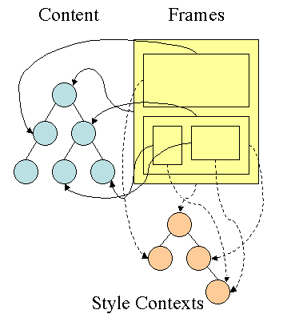

# 浏览器的渲染原理简介

看到这个标题大家一定会想到这篇神文《[How Browsers Work](http://taligarsiel.com/Projects/howbrowserswork1.htm)》，这篇文章把浏览器的很多细节讲得很细，而且也被[翻译成了中文](http://ux.sohu.com/topics/50972d9ae7de3e752e0081ff)。为什么我还想写一篇呢？因为两个原因，

 

1）这篇文章太长了，阅读成本太大，不能一口气读完。

 

2）花了大力气读了这篇文章后可以了解很多，但似乎对工作没什么帮助。

 

所以，我准备写下这篇文章来解决上述两个问题。希望你能在上班途中，或是坐马桶时就能读完，并能从中学会一些能用在工作上的东西。

#### 浏览器工作大流程

 

废话少说，先来看个图：

 


 

从上面这个图中，我们可以看到那么几个事:

1）浏览器会解析三个东西：

 

- 一个是HTML/SVG/XHTML，事实上，Webkit有三个C++的类对应这三类文档。解析这三种文件会产生一个DOM Tree。

 

- CSS，解析CSS会产生CSS规则树。

 

- Javascript，脚本，主要是通过DOM API和CSSOM API来操作DOM Tree和CSS Rule Tree.

 

2）解析完成后，浏览器引擎会通过DOM Tree 和 CSS Rule Tree 来构造 Rendering Tree。注意：

 

- Rendering Tree 渲染树并不等同于DOM树，因为一些像Header或display:none的东西就没必要放在渲染树中了。

 

- CSS 的 Rule Tree主要是为了完成匹配并把CSS Rule附加上Rendering Tree上的每个Element。也就是DOM结点。也就是所谓的Frame。

 

- 然后，计算每个Frame（也就是每个Element）的位置，这又叫layout和reflow过程。

 

3）最后通过调用操作系统Native GUI的API绘制。

#### DOM解析

 

HTML的DOM Tree解析如下：

```js
<html>
<html>
<head>
    <title>Web page parsing</title>
</head>
<body>
    <div>
        <h1>Web page parsing</h1>
        <p>This is an example Web page.</p>
    </div>
</body>
</html>
```


 这段HTML会解析成这样：

 


 

下面是另一个有SVG标签的情况。


 

#### CSS解析

 

CSS的解析大概是下面这个样子（下面主要说的是Gecko也就是Firefox的玩法），假设我们有下面的HTML文档：

 

```js
`<``doc``>``<``title``>A few quotes</``title``>``<``para``>``  ``Franklin said that <``quote``>"A penny saved is a penny earned."</``quote``>``</``para``>``<``para``>``  ``FDR said <``quote``>"We have nothing to fear but <``span``>fear itself.</``span``>"</``quote``>``</``para``>``</``doc``>`
```

 

于是DOM Tree是这个样子：

 


 

然后我们的CSS文档是这样的：

 

```js
` ``/* rule 1 */ doc { display: block; text-indent: 1em; }``/* rule 2 */ title { display: block; font-size: 3em; }``/* rule 3 */ para { display: block; }``/* rule 4 */ [class="emph"] { font-style: italic; }`
```

 

于是我们的CSS Rule Tree会是这个样子：

 


 

注意，图中的第4条规则出现了两次，一次是独立的，一次是在规则3的子结点。所以，我们可以知道，建立CSS Rule Tree是需要比照着DOM Tree来的。CSS匹配DOM Tree主要是从右到左解析CSS的Selector，好多人以为这个事会比较快，其实并不一定。关键还看我们的CSS的Selector怎么写了。

 

**注意：CSS匹配HTML元素是一个相当复杂和有性能问题的事情。所以，你就会在N多地方看到很多人都告诉你，DOM树要小，CSS尽量用id和class，千万不要过渡层叠下去，……**

 

通过这两个树，我们可以得到一个叫Style Context Tree，也就是下面这样（把CSS Rule结点Attach到DOM Tree上）：

 


 

所以，Firefox基本上来说是通过CSS 解析 生成 CSS Rule Tree，然后，通过比对DOM生成Style Context Tree，然后Firefox通过把Style Context Tree和其Render Tree（Frame Tree）关联上，就完成了。注意：Render Tree会把一些不可见的结点去除掉。而**Firefox中所谓的Frame就是一个DOM结点，不要被其名字所迷惑了**。

 



 

注：Webkit不像Firefox要用两个树来干这个，Webkit也有Style对象，它直接把这个Style对象存在了相应的DOM结点上了。

 

#### 渲染

 

渲染的流程基本上如下（黄色的四个步骤）：

 

1. 计算CSS样式
2. 构建Render Tree
3. Layout – 定位坐标和大小，是否换行，各种position, overflow, z-index属性 ……
4. 正式开画

 


 

注意：上图流程中有很多连接线，这表示了Javascript动态修改了DOM属性或是CSS属会导致重新Layout，有些改变不会，就是那些指到天上的箭头，比如，修改后的CSS rule没有被匹配到，等。

 

这里重要要说两个概念，一个是Reflow，另一个是Repaint。这两个不是一回事。

 

- Repaint——屏幕的一部分要重画，比如某个CSS的背景色变了。但是元素的几何尺寸没有变。

 

- Reflow——意味着元件的几何尺寸变了，我们需要重新验证并计算Render Tree。是Render Tree的一部分或全部发生了变化。这就是Reflow，或是Layout。（**HTML使用的是flow based layout，也就是流式布局，所以，如果某元件的几何尺寸发生了变化，需要重新布局，也就叫reflow**）reflow 会从<html>这个root frame开始递归往下，依次计算所有的结点几何尺寸和位置，在reflow过程中，可能会增加一些frame，比如一个文本字符串必需被包装起来。

 

下面是一个打开Wikipedia时的Layout/reflow的视频（注：HTML在初始化的时候也会做一次reflow，叫 intial reflow），你可以感受一下：

Reflow的成本比Repaint的成本高得多的多。DOM Tree里的每个结点都会有reflow方法，一个结点的reflow很有可能导致子结点，甚至父点以及同级结点的reflow。

在一些高性能的电脑上也许还没什么，但是如果reflow发生在手机上，那么这个过程是非常痛苦和耗电的

。


 

所以，下面这些动作有很大可能会是成本比较高的。

 

- 当你增加、删除、修改DOM结点时，会导致Reflow或Repaint
- 当你移动DOM的位置，或是搞个动画的时候。
- 当你修改CSS样式的时候。
- 当你Resize窗口的时候（移动端没有这个问题），或是滚动的时候。
- 当你修改网页的默认字体时。

 

注：display:none会触发reflow，而visibility:hidden只会触发repaint，因为没有发现位置变化。

 

多说两句关于滚屏的事，通常来说，如果在滚屏的时候，我们的页面上的所有的像素都会跟着滚动，那么性能上没什么问题，因为我们的显卡对于这种把全屏像素往上往下移的算法是很快。但是如果你有一个fixed的背景图，或是有些Element不跟着滚动，有些Elment是动画，那么这个滚动的动作对于浏览器来说会是相当相当痛苦的一个过程。你可以看到很多这样的网页在滚动的时候性能有多差。因为滚屏也有可能会造成reflow。

 

基本上来说，reflow有如下的几个原因：

 

- Initial。网页初始化的时候。
- Incremental。一些Javascript在操作DOM Tree时。
- Resize。其些元件的尺寸变了。
- StyleChange。如果CSS的属性发生变化了。
- Dirty。几个Incremental的reflow发生在同一个frame的子树上。

 

好了，我们来看一个示例吧：

```js
var bstyle = document.body.style; // cache
 
bstyle.padding = "20px"; // reflow, repaint
bstyle.border = "10px solid red"; //  再一次的 reflow 和 repaint
 
bstyle.color = "blue"; // repaint
bstyle.backgroundColor = "#fad"; // repaint
 
bstyle.fontSize = "2em"; // reflow, repaint
 
// new DOM element - reflow, repaint
document.body.appendChild(document.createTextNode('dude!'));
```


 

当然，我们的浏览器是聪明的，它不会像上面那样，你每改一次样式，它就reflow或repaint一次。**一般来说，浏览器会把这样的操作积攒一批，然后做一次reflow，这又叫异步reflow或增量异步reflow**。但是有些情况浏览器是不会这么做的，比如：resize窗口，改变了页面默认的字体，等。对于这些操作，浏览器会马上进行reflow。

 

但是有些时候，我们的脚本会阻止浏览器这么干，比如：如果我们请求下面的一些DOM值：

 

1. offsetTop, offsetLeft, offsetWidth, offsetHeight
2. scrollTop/Left/Width/Height
3. clientTop/Left/Width/Height
4. IE中的 getComputedStyle(), 或 currentStyle

 

因为，如果我们的程序需要这些值，那么浏览器需要返回最新的值，而这样一样会flush出去一些样式的改变，从而造成频繁的reflow/repaint。

#### 减少reflow/repaint

 

下面是一些Best Practices：

 

**1）不要一条一条地修改DOM的样式。与其这样，还不如预先定义好css的class，然后修改DOM的className。**

```js
// bad
var left = 10,
top = 10;
el.style.left = left + "px";
el.style.top  = top  + "px";
 
// Good
el.className += " theclassname";
 
// Good
el.style.cssText += "; left: " + left + "px; top: " + top + "px;";
```


**2）把DOM离线后修改。如：**

 

- 使用documentFragment 对象在内存里操作DOM
- 先把DOM给display:none(有一次reflow)，然后你想怎么改就怎么改。比如修改100次，然后再把他显示出来。
- clone一个DOM结点到内存里，然后想怎么改就怎么改，改完后，和在线的那个的交换一下。

 

3）**不要把DOM结点的属性值放在一个循环里当成循环里的变量。**不然这会导致大量地读写这个结点的属性。

 

4）**尽可能的修改层级比较低的DOM**。当然，改变层级比较底的DOM有可能会造成大面积的reflow，但是也可能影响范围很小。

 

5）**为动画的HTML元件使用fixed或absoult的position**，那么修改他们的CSS是不会reflow的。

 

6）**千万不要使用table布局**。因为可能很小的一个小改动会造成整个table的重新布局。

#### 几个工具和几篇文章

 

有时候，你会也许会发现在IE下，你不知道你修改了什么东西，结果CPU一下子就上去了到100%，然后过了好几秒钟repaint/reflow才完成，这种事情以IE的年代时经常发生。所以，我们需要一些工具帮我们看看我们的代码里有没有什么不合适的东西。

 

- Chrome下，Google的[SpeedTracer](http://code.google.com/webtoolkit/speedtracer/)是个非常强悍的工作让你看看你的浏览渲染的成本有多大。其实Safari和Chrome都可以使用开发者工具里的一个Timeline的东东。

 

- Firefox下这个基于Firebug的叫[Firebug Paint Events](https://addons.mozilla.org/en-US/firefox/addon/firebug-paint-events/)的插件也不错。

 

- IE下你可以用一个叫[dynaTrace](http://ajax.dynatrace.com/pages/)的IE扩展。

 

最后，别忘了下面这几篇提高浏览器性能的文章：

 

- [Google – Web Performance Best Practices](http://code.google.com/speed/page-speed/docs/rules_intro.html)
- [Yahoo – Best Practices for Speeding Up Your Web Site](http://developer.yahoo.com/performance/rules.html)
- [Steve Souders – 14 Rules for Faster-Loading Web Sites](http://stevesouders.com/hpws/rules.php)
- 

# **从浏览器渲染原理谈页面优化**

​	以前学习浏览器的渲染机制时，对浏览器的渲染概念就是html解析成DOM，css形成样式规则。两者共同构建渲染树。浏览器根据渲染树的样式进行布局和渲染。后来再次回过头去看这些概念时发现很多知识点都是非常深的。 比如浏览器如何解析CSS形成样式树，那么浏览器究竟如何解析？了解这些并非没有意义，比如当了解css解析是自右向左后，就知道在写css样式时应该避免嵌套。了解解析顺序就知道如何缩短首屏时间提高用户体验。所以决定将这段时间的所学整理出来形成知识体系。有些的不足和不到位的地方还请大家不吝指正或提出建议 

#### 一、关于浏览器渲染的容易误解点总结 

​	关于浏览器渲染机制已经是老生常谈，如果你想了解请点https://blog.csdn.net/riddle1981/article/details/76380177，而且网上现有资料中有非常多的优秀资料对此进行阐述。遗憾的是网上的资料良莠不齐，经常在不同的文档中对同一件事的描述出现了极大的差异。怀着严谨求学的态度经过大量资料的查阅和请教，将会在后文总结出一个完整的流程。在这里将会就一些我自己理解存疑的地方写出来 

##### 1、DOM树的构建是文档加载完成开始的？ 

​	DOM树的构建是从接受到文档开始的 一边会进行将字节转化为字符 字符转化为标记 标记构建dom树 这个过程被分为标记化和树构建 
​	而这是一个渐进的过程。为达到更好的用户体验，呈现引擎会力求尽快将内容显示在屏幕上。它不必等到整个 HTML 文档解析完毕之后，就会开始构建呈现树和设置布局。在不断接收和处理来自网络的其余内容的同时，呈现引擎会将部分内容解析并显示出来。 
参考文档：http://taligarsiel.com/Projects/howbrowserswork1.htm 

##### 2、渲染树是在DOM树和CSS样式树构建完毕才开始构建的吗？ 

​	这三个过程在实际进行的时候又不是完全独立，而是会有交叉。会造成一边加载，一边解析，一边渲染的工作现象。 
参考文档：http://www.jianshu.com/p/2d522fc2a8f8 

##### 3、css的标签嵌套越多，越容易定位到元素 

​	**css的解析是自右至左逆向解析的**，嵌套越多越增加浏览器的工作量，而不会越快。 
​	因为如果正向解析，例如「div div p em」，我们首先就要检查当前元素到 html 的整条路径，找到最上层的 div，再往下找，如果遇到不匹配就必须回到最上层那个 div，往下再去匹配选择器中的第一个 div，回溯若干次才能确定匹配与否，效率很低。 
​	逆向匹配则不同，如果当前的 DOM 元素是 div，而不是 selector 最后的 em，那只要一步就能排除。只有在匹配时，才会不断向上找父节点进行验证。 
打个比如 p span.showing 
你认为从一个p元素下面找到所有的span元素并判断是否有class showing快，还是找到所有的span元素判断是否有class showing并且包括一个p父元素快 


#### 二、页面渲染的完整流程 

​	当浏览器拿到HTTP报文时呈现引擎将开始解析 HTML 文档，并将各标记逐个转化成“内容树”上的 DOM 节点。同时也会解析外部 CSS 文件以及样式元素中的样式数据。HTML 中这些带有视觉指令的样式信息将用于创建另一个树结构：呈现树。浏览器将根据呈现树进行布局绘制。 

　　以上就是页面渲染的大致流程。那么浏览器从用户输入网址之后到底做了什么呢？以下将会进行一个完整的梳理。鉴于本文是前端向的所以梳理内容会有所偏重。而从输入到呈现可以分为两个部分：网络通信和页面渲染 

我们首先来看网络通信部分：

​	1、用户输入url并敲击回车。 
​	2、进行DNS解析。如果用户输入的是ip地址则直接进入第三条。但去记录毫无规律且冗长的ip地址显然不是易事，所以通常都是输入的域名，此时就会进行dns解析。所谓DNS（Domain Name System）指域名系统。因特网上作为域名和IP地址相互映射的一个分布式数据库，能够使用户更方便的访问互联网，而不用去记住能够被机器直接读取的IP数串。通过主机名，最终得到该主机名对应的IP地址的过程叫做域名解析（或主机名解析）。这个过程如下所示：

​	浏览器会首先搜索浏览器自身的DNS缓存（缓存时间比较短，大概只有2分钟左右，且只能容纳1000条缓存）。

​	--如果浏览器自身缓存找不到则会查看系统的DNS缓存,如果找到且没有过期则停止搜索解析到此结束.
​	--而如果本机没有找到DNS缓存，则浏览器会发起一个DNS的系统调用，就会向本地配置的首选DNS服务器发起域名解析请求（通过的是UDP协议向DNS的53端口发起请求，这个请求是递归的请求，也就是运营商的DNS服务器必须得提供给我们该域名的IP地址），运营商的DNS服务器首先查找自身的缓存，找到对应的条目，且没有过期，则解析成功。
​	--如果没有找到对应的条目，则有运营商的DNS代我们的浏览器发起迭代DNS解析请求，它首先是会找根域的DNS的IP地址（这个DNS服务器都内置13台根域的DNS的IP地址），找打根域的DNS地址，就会向其发起请求（请问www.xxxx.com这个域名的IP地址是多少啊？）
​	--根域发现这是一个顶级域com域的一个域名，于是就告诉运营商的DNS我不知道这个域名的IP地址，但是我知道com域的IP地址，你去找它去，于是运营商的DNS就得到了com域的IP地址，又向com域的IP地址发起了请求（请问www.xxxx.com这个域名的IP地址是多少?）,com域这台服务器告诉运营商的DNS我不知道www.xxxx.com这个域名的IP地址，但是我知道xxxx.com这个域的DNS地址，你去找它去，于是运营商的DNS又向linux178.com这个域名的DNS地址（这个一般就是由域名注册商提供的，像万网，新网等）发起请求（请问www.xxxx.com这个域名的IP地址是多少？），这个时候xxxx.com域的DNS服务器一查，诶，果真在我这里，于是就把找到的结果发送给运营商的DNS服务器，这个时候运营商的DNS服务器就拿到了www.xxxx.com这个域名对应的IP地址，并返回给Windows系统内核，内核又把结果返回给浏览器，终于浏览器拿到了www.xxxx.com对应的IP地址,这次dns解析圆满成功。

3、发起TCP的3次握手 
	拿到域名对应的IP地址之后，User-Agent（一般是指浏览器）会以一个随机端口（1024< 端口 < 65535）向服务器的WEB程序（常用的有httpd,nginx等）80端口发起TCP的连接请求。这个连接请求（原始的http请求经过TCP/IP4层模型的层层封包）到达服务器端后（这中间通过各种路由设备，局域网内除外），进入到网卡，然后是进入到内核的TCP/IP协议栈（用于识别该连接请求，解封包，一层一层的剥开），还有可能要经过Netfilter防火墙（属于内核的模块）的过滤，最终到达WEB程序，最终建立了TCP/IP的连接。

4、建立TCP连接后发起http请求

5、服务器端响应http请求，浏览器得到html代码。以下为响应报文格式： 


​	以上是网络通信部分，接下来将会对页面渲染部分进行叙述。当浏览器拿到html后是如何进行页面渲染的

​	当浏览器拿到HTML文档时首先会进行HTML文档解析，构建DOM树。
​	遇到css样式如link标签或者style标签时开始解析css，构建样式树。HTML解析构建和CSS的解析是相互独立的并不会造成冲突，因此我们通常将css样式放在head中，让浏览器尽早解析css。
​	当html的解析遇到script标签会怎样呢？答案是停止DOM树的解析开始下载js。因为js是会阻塞html解析的，是阻塞资源。其原因在于js可能会改变html现有结构。例如有的节点是用js动态构建的，在这种情况下就会停止dom树的构建开始下载解析js。脚本在文档的何处插入，就在何处执行。当 HTML 解析器遇到一个 script 标记时，它会暂停构建 DOM，将控制权移交给 JavaScript 引擎；等 JavaScript 引擎运行完毕，浏览器会从中断的地方恢复 DOM 构建。而因此就会推迟页面首绘的时间。可以在首绘不需要js的情况下用async和defer实现异步加载。这样js就不会阻塞html的解析了。当HTML解析完成后，浏览器会将文档标注为交互状态，并开始解析那些处于“deferred”模式的脚本，也就是那些应在文档解析完成后才执行的脚本。然后，文档状态将设置为“完成”，一个“加载”事件将随之触发。注意，异步执行是指下载。执行js时仍然会阻塞。

​	在得到DOM树和样式树后就可以进行渲染树的构建了。应注意的是渲染树和 DOM 元素相对应的，但并非一一对应。比如非可视化的 DOM 元素不会插入呈现树中，例如“head”元素。如果元素的 display 属性值为“none”，那么也不会显示在呈现树中（但是 visibility 属性值为“hidden”的元素仍会显示） 


​	渲染树构建完毕后将会进行布局。布局使用流模型的Layout算法。所谓流模型，即是指Layout的过程只需进行一遍即可完成，后出现在流中的元素不会影响前出现在流中的元素，Layout过程只需从左至右从上至下一遍完成即可。但实际实现中，流模型会有例外。Layout是一个递归的过程，每个节点都负责自己及其子节点的Layout。Layout结果是相对父节点的坐标和尺寸。其过程可以简述为：

1父节点确定自己的宽度
2父节点完成子节点放置，确定其相对坐标
3节点确定自己的宽度和高度
4父节点根据所有的子节点高度计算自己的高度

​	此时renderTree已经构建完毕，不过浏览器渲染树引擎并不直接使用渲染树进行绘制，为了方便处理定位（裁剪），溢出滚动（页内滚动），CSS转换/不透明/动画/滤镜，蒙版或反射，Z （Z排序）等，浏览器需要生成另外一棵树 - 层树。因此绘制过程如下： 
获取 DOM 并将其分割为多个层(RenderLayer) 
将每个层栅格化，并独立的绘制进位图中 
将这些位图作为纹理上传至 GPU 

复合多个层来生成最终的屏幕图像(终极layer)。

#### 三、HTML及CSS样式的解析 

HTML解析是一个将字节转化为字符，字符解析为标记，标记生成节点，节点构建树的过程。。CSS样式的解析则由于复杂的样式层叠而变得复杂。对此不同的渲染引擎在处理上有所差异，后文将会就这点进行详细讲解

###### 1、HTML的解析分为标记化和树构建两个阶段 

标记化算法： 
是词法分析过程，将输入内容解析成多个标记。HTML标记包括起始标记、结束标记、属性名称和属性值。标记生成器识别标记，传递给树构造器，然后接受下一个字符以识别下一个标记；如此反复直到输入的结束。 
该算法的输出结果是 HTML 标记。该算法使用状态机来表示。每一个状态接收来自输入信息流的一个或多个字符，并根据这些字符更新下一个状态。当前的标记化状态和树结构状态会影响进入下一状态的决定。这意味着，即使接收的字符相同，对于下一个正确的状态也会产生不同的结果，具体取决于当前的状态。 
树构建算法 
在树构建阶段，以 Document 为根节点的 DOM 树也会不断进行修改，向其中添加各种元素。 
标记生成器发送的每个节点都会由树构建器进行处理。规范中定义了每个标记所对应的 DOM 元素，这些元素会在接收到相应的标记时创建。这些元素不仅会添加到 DOM 树中，还会添加到开放元素的堆栈中。此堆栈用于纠正嵌套错误和处理未关闭的标记。其算法也可以用状态机来描述。这些状态称为“插入模式”。

以下将会举一个例子来分析这两个阶段：

```js
<html>
  <body>
    Hello world
  </body>
</html>
```


​	标记化：初始状态是数据状态。遇到字符 < 时，状态更改为“标记打开状态”。接收一个 a-z字符会创建“起始标记”，状态更改为“标记名称状态”。这个状态会一直保持到接收> 字符。在此期间接收的每个字符都会附加到新的标记名称上。

​	在本例中，我们创建的标记是 html 标记。 遇到 > 标记时，会发送当前的标记，状态改回“数据状态”。 标记也会进行同样的处理。目前 html 和 body 标记均已发出。现在我们回到“数据状态”。接收到 Hello world 中的 H 字符时，将创建并发送字符标记，直到接收  中的<。我们将为 Hello world 中的每个字符都发送一个字符标记。 
　　现在我们回到“标记打开状态”。接收下一个输入字符 / 时，会创建 end tag token 并改为“标记名称状态”。我们会再次保持这个状态，直到接收 >。然后将发送新的标记，并回到“数据状态”。 输入也会进行同样的处理。

还是以上的例子，我们来看看树构建 
	树构建：树构建阶段的输入是一个来自标记化阶段的标记序列。第一个模式是“initial mode”。接收 HTML 标记后转为“before html”模式，并在这个模式下重新处理此标记。这样会创建一个 HTMLHtmlElement 元素，并将其附加到 Document 根对象上。 
　　然后状态将改为“before head”。此时我们接收“body”标记。即使我们的示例中没有“head”标记，系统也会隐式创建一个 HTMLHeadElement，并将其添加到树中。 
　　现在我们进入了“in head”模式，然后转入“after head”模式。系统对 body 标记进行重新处理，创建并插入 HTMLBodyElement，同时模式转变为“body”。 
　　现在，接收由“Hello world”字符串生成的一系列字符标记。接收第一个字符时会创建并插入“Text”节点，而其他字符也将附加到该节点。 
　　接收 body 结束标记会触发“after body”模式。现在我们将接收 HTML 结束标记，然后进入“after after body”模式。接收到文件结束标记后，解析过程就此结束。 
解析结束后的操作

​	在此阶段，浏览器会将文档标注为交互状态，并开始解析那些处于“deferred”模式的脚本，也就是那些应在文档解析完成后才执行的脚本。然后，文档状态将设置为“完成”，一个“加载”事件将随之触发。

完整解析过程如下图： 


###### 2、CSS的解析与层叠规则 

　每一个呈现器都代表了一个矩形的区域，通常对应于相关节点的 CSS 框，这一点在 CSS2 规范中有所描述。它包含诸如宽度、高度和位置等几何信息。就是我们 CSS 里常提到的盒子模型。构建呈现树时，需要计算每一个呈现对象的可视化属性。这是通过计算每个元素的样式属性来完成的。由于应用规则涉及到相当复杂的层叠规则，所以给样式树的构建造成了巨大的困难。为什么说它复杂？因为同一个元素可能涉及多条样式，就需要判断最终到底哪条样式生效。首先我们来了解一下css的样式层叠规则

①层叠规则： 
	根据不同的样式来源优先级排列从小到大： 
1>、用户端声明：来自浏览器的样式，被称作 UA style，是浏览器默认的样式。 比如，对于 DIV 元素，浏览器默认其 ‘display’ 的特性值是 “block”，而 SPAN 是 “inline”。 
2>、一般用户声明：这个样式表是使用浏览器的用户，根据自己的偏好设置的样式表。比如，用户希望所有 P 元素中的字体都默认显示成蓝色，可以先定义一个样式表，存成 css 文件。 
3>、一般作者声明:即开发者在开发网页时，所定义的样式表。 
4>、加了’!important’ 的作者声明 
5>、加了’!important’ 的用户声明 
!important 规则1:根据 CSS2.1 规范中的描述，’!important’ 可以提高样式的优先级，它对样式优先级的影响是巨大的。 关于important在css2.1中的定义请点击这里 
	注意，’!important’ 规则在 IE7 以前的版本中是被支持不完善。因此，经常被用作 CSS hack2。

​	如果来源和重要性相同则根据CSS specificity来进行判定。

​	特殊性的值可以看作是一个由四个数组成的一个组合，用 a，b，c，d 来表示它的四个位置。 依次比较 a，b，c，d 这个四个数比较其特殊性的大小。比如，a 值相同，那么 b 值大的组合特殊性会较大，以此类推。 注意，W3C 中并不是把它作为一个 4 位数来看待的。 
a，b，c，d 值的确定规则：

​	如果 HTML 标签的 ‘style’ 属性中该样式存在，则记 a 为 1；
​	数一下选择器中 ID 选择器的个数作为 b 的值。比如，样式中包含 ‘#c1’ 和 ‘#c2’ 的选择器；
​	其他属性以及伪类（pseudo-classes）的总数量是 c 的值。比如’.con’，’:hover’ 等；
​	元素名和伪元素的数量是 d 的值


​	在这里我们来看一个W3C给出的例子：

```js
*             {}  /* a=0 b=0 c=0 d=0 -> specificity = 0,0,0,0 */
li            {}  /* a=0 b=0 c=0 d=1 -> specificity = 0,0,0,1 */
li:first-line {}  /* a=0 b=0 c=0 d=2 -> specificity = 0,0,0,2 */
ul li         {}  /* a=0 b=0 c=0 d=2 -> specificity = 0,0,0,2 */
ul ol+li      {}  /* a=0 b=0 c=0 d=3 -> specificity = 0,0,0,3 */
h1 + *[rel=up]{}  /* a=0 b=0 c=1 d=1 -> specificity = 0,0,1,1 */
ul ol li.red  {}  /* a=0 b=0 c=1 d=3 -> specificity = 0,0,1,3 */
li.red.level  {}  /* a=0 b=0 c=2 d=1 -> specificity = 0,0,2,1 */
#x34y         {}  /* a=0 b=1 c=0 d=0 -> specificity = 0,1,0,0 */
style=""          /* a=1 b=0 c=0 d=0 -> specificity = 1,0,0,0 */
--------------------- 

```

​	那么在如下例子中字体的显示应当为绿色：

```js
<HEAD>
<STYLE type="text/css">
 #x97z { color: red }
</STYLE>
</HEAD>
<BODY>
<P ID=x97z style="color: green">
</BODY>
```

​	总结为表格的话计算规则如下： 


②CSS解析 
为了简化样式计算，Firefox 还采用了另外两种树：规则树和样式上下文树。Webkit 也有样式对象，但它们不是保存在类似样式上下文树这样的树结构中，只是由 DOM 节点指向此类对象的相关样式。

1>、Firefox的规则树和样式上下文树： 
样式上下文包含端值。要计算出这些值，应按照正确顺序应用所有的匹配规则，并将其从逻辑值转化为具体的值。例如，如果逻辑值是屏幕大小的百分比，则需要换算成绝对的单位。规则树的点子真的很巧妙，它使得节点之间可以共享这些值，以避免重复计算，还可以节约空间。 
所有匹配的规则都存储在树中。路径中的底层节点拥有较高的优先级。规则树包含了所有已知规则匹配的路径。规则的存储是延迟进行的。规则树不会在开始的时候就为所有的节点进行计算，而是只有当某个节点样式需要进行计算时，才会向规则树添加计算的路径。 

这个想法相当于将规则树路径视为词典中的单词。如果我们已经计算出如下的规则树： 


假设我们需要为内容树中的另一个元素匹配规则，并且找到匹配路径是 B - E - I（按照此顺序）。由于我们在树中已经计算出了路径 A - B - E - I - L，因此就已经有了此路径，这就减少了现在所需的工作量。

那么Firefox是如何解决样式计算难题的呢？接下来看一个样例，假设我们有如下HTML代码

```js
<html>
  <body>
     <div class="err" id="div1">
        <p>
        this is a <span class="big"> big error </span>
        this is also a
        <span class="big"> very  big  error</span> error
        </p>
     </div>
     <div class="err" id="div2">another error</div>
  </body>
</html>

```

并且我们有如下规则：

```js
div {margin:5px;color:black}
.err {color:red}
.big {margin-top:3px}
div span {margin-bottom:4px}
#div1 {color:blue}
#div2 {color:green}
```

为了简便起见，我们只需要填充两个结构：color 结构和 margin 结构。color 结构只包含一个成员（即“color”），而 margin 结构包含四条边。 
形成的规则树如下图所示（节点的标记方式为“节点名 : 指向的规则序号”）：

  


上下文树如下图所示（节点名 : 指向的规则节点）：

  


​	假设我们解析 HTML 时遇到了第二个 <div> 标记，我们需要为此节点创建样式上下文，并填充其样式结构。 
​	经过规则匹配，我们发现该 <div> 的匹配规则是第 1、2 和 6 条。这意味着规则树中已有一条路径可供我们的元素使用，我们只需要再为其添加一个节点以匹配第 6 条规则（规则树中的 F 节点）。 
​	我们将创建样式上下文并将其放入上下文树中。新的样式上下文将指向规则树中的 F 节点。 
​	现在我们需要填充样式结构。首先要填充的是 margin 结构。由于最后的规则节点 (F) 并没有添加到 margin 结构，我们需要上溯规则树，直至找到在先前节点插入中计算过的缓存结构，然后使用该结构。我们会在指定 margin 规则的最上层节点（即 B 节点）上找到该结构。 
我们已经有了 color 结构的定义，因此不能使用缓存的结构。由于 color 有一个属性，我们无需上溯规则树以填充其他属性。我们将计算端值（将字符串转化为 RGB 等）并在此节点上缓存经过计算的结构。 
​	第二个  元素处理起来更加简单。我们将匹配规则，最终发现它和之前的 span 一样指向规则 G。由于我们找到了指向同一节点的同级，就可以共享整个样式上下文了，只需指向之前 span 的上下文即可。 
​	对于包含了继承自父代的规则的结构，缓存是在上下文树中进行的（事实上 color 属性是继承的，但是 Firefox 将其视为 reset 属性，并缓存到规则树上）。

例如，如果我们在某个段落中添加 font 规则：

 ```js
p {font-family:Verdana;font size:10px;font-weight:bold}
 ```

那么，该段落元素作为上下文树中的 div 的子代，就会共享与其父代相同的 font 结构（前提是该段落没有指定 font 规则）。

2>、Webkit的样式解析 

​	在 Webkit 中没有规则树，因此会对匹配的声明遍历 4 次。首先应用非重要高优先级的属性（由于作为其他属性的依据而应首先应用的属性，例如 display），接着是高优先级重要规则，然后是普通优先级非重要规则，最后是普通优先级重要规则。这意味着多次出现的属性会根据正确的层叠顺序进行解析。最后出现的最终生效.

#### 四、渲染树的构建 

​	样式树和DOM树连接在一起形成一个渲染树，渲染树用来计算可见元素的布局并且作为将像素渲染到屏幕上的过程的输入。值得一提的是，Gecko 将视觉格式化元素组成的树称为“框架树”。每个元素都是一个框架。Webkit 使用的术语是“渲染树”，它由“呈现对象”组成。 Webkit 和 Gecko 使用的术语略有不同，但整体流程是基本相同的。

​	接下来将来看一下两种渲染引擎的工作流程： 

Webkit 主流程： 


 

Mozilla 的 Gecko 呈现引擎主流程 :


​	虽然 Webkit 和 Gecko 使用的术语略有不同，但整体流程是基本相同的。

​	Gecko 将视觉格式化元素组成的树称为“框架树”。每个元素都是一个框架。 
​	Webkit 使用的术语是“呈现树”，它由“呈现对象”组成。 
​	对于元素的放置，Webkit 使用的术语是“布局”，而 Gecko 称之为“重排”。 
​	对于连接 DOM 节点和可视化信息从而创建呈现树的过程，Webkit 使用的术语是“附加”。有一个细微的非语义差别，就是 Gecko 在 HTML 与 DOM 树之间还有一个称为“内容槽”的层，用于生成 DOM 元素。我们会逐一论述流程中的每一部分。


#### 五、关于浏览器渲染过程中需要了解的概念 

​	Repaint（重绘）——屏幕的一部分要重画，比如某个CSS的背景色变了。但是元素的几何尺寸没有变。 
​	Reflow（重排）——意味着元件的几何尺寸变了，我们需要重新验证并计算Render Tree。是Render Tree的一部分或全部发生了变化。这就是Reflow，或是Layout。reflow 会从这个root frame开始递归往下，依次计算所有的结点几何尺寸和位置，在reflow过程中，可能会增加一些frame，比如一个文本字符串必需被包装起来。 
​	onload事件——当 onload 事件触发时，页面上所有的DOM，样式表，脚本，图片，flash都已经加载完成了。 
​	DOMContentLoaded 事件——当 DOMContentLoaded 事件触发时，仅当DOM加载完成，不包括样式表，图片，flash。 
​	首屏时间——当浏览器显示第一屏页面所消耗的时间，在国内的网络条件下，通常一个网站，如果“首屏时间”在2秒以内是比较优秀的，5秒以内用户可以接受，10秒以上就不可容忍了。 
​	白屏时间 
​	白屏时间——指浏览器开始显示内容的时间。但是在传统的采集方式里，是在HTML的头部标签结尾里记录时间戳，来计算白屏时间。在这个时刻，浏览器开始解析身体标签内的内容。而现代浏览器不会等待CSS树（所有CSS文件下载和解析完成）和DOM树（整个身体标签解析完成）构建完成才开始绘制，而是马上开始显示中间结果。所以经常在低网速的环境中，观察到页面由上至下缓慢显示完，或者先显示文本内容后再重绘成带有格式的页面内容。


#### 六、页面优化方案 

​	本文的主题在于从浏览器的渲染过程谈页面优化。了解浏览器如何进行解析，我们可以在构建DOM结构，组织css选择器时，选择最优的写法，提高浏览器的解析速率。理解浏览器如何进行渲染，明白渲染的过程，我们在设置元素属性，编写js文件时，可以减少”重绘“”重新布局“的消耗。接下来将总结根据以上只是提出的页面优化方案

1、减少资源请求的次数和压缩数据内容。因为资源的请求是一个复杂的过程。网速相同的条件下，下载一个100KB的图片比下载两个50KB的图片要快。所以，请减少HTTP请求。 
①进行资源打包，将需要多次请求的资源进行打包减少资源请求次数，如webpack等。 
②使用雪碧图，可以避免因不同图片引起的多次资源下载

2、高效合理的css选择符可以减轻浏览器的解析负担。因为css是逆向解析的所以应当避免多层嵌套。 
    .   避免使用通配规则。如 *{} 计算次数惊人！只对需要用到的元素进行选择 
    .   尽量少的去对标签进行选择，而是用class。如：#nav li{},可以为li加上nav_item的类名，如下选择.nav_item{} 
    .   不要去用标签限定ID或者类选择符。如：ul#nav,应该简化为#nav 
    .   尽量少的去使用后代选择器，降低选择器的权重值。后代选择器的开销是最高的，尽量将选择器的深度降到最低，最高不要超过三层，更多的使用类来关联每一个标签元素。 
    .   考虑继承。了解哪些属性是可以通过继承而来的，然后避免对这些属性重复指定规则

3、从js层面谈页面优化 
 ①解决渲染阻塞  
	如果在解析HTML标记时，浏览器遇到了JavaScript，解析会停止。只有在该脚本执行完毕后，HTML渲染才会继续进行。所以这阻塞了页面的渲染。  
解决方法：在标签中使用 async或defer特性  
②减少对DOM的操作  
	对DOM操作的代价是高昂的，这在网页应用中的通常是一个性能瓶颈。  
解决办法：修改和访问DOM元素会造成页面的Repaint和Reflow，循环对DOM操作更是罪恶的行为。所以请合理的使用JavaScript变量储存内容，考虑大量DOM元素中循环的性能开销，在循环结束时一次性写入。  
	减少对DOM元素的查询和修改，查询时可将其赋值给局部变量。  
③使用JSON格式来进行数据交换  
	JSON是一种轻量级的数据交换格式，采用完全独立于语言的文本格式，是理想的数据交换格式。同时，JSON是 JavaScript原生格式，这意味着在 JavaScript 中处理 JSON数据不需要任何特殊的 API 或工具包。  
④让需要经常改动的节点脱离文档流 
	因为重绘有时确实不可避免，所以只能尽可能限制重绘的影响范围。 

4、.使用CDN加速（内容分发网络）  
	其基本思路是尽可能避开互联网上有可能影响数据传输速度和稳定性的瓶颈和环节，使内容传输的更快、更稳定。通过在网络各处放置节点服务器所构成的在现有的互联网基础之上的一层智能虚拟网络，CDN系统能够实时地根据网络流量和各节点的连接、负载状况以及到用户的距离和响应时间等综合信息将用户的请求重新导向离用户最近的服务节点上。 

5、 精简CSS和JS文件  
	如使用 YUI Compressor，它的特点是：移除注释；移除额外的空格；细微优化；标识符替换。 

　　相信以上优化方案之所以行之有效的原因大都可以在本文中找出原因。理论是用来指导实践的，即不能闭门造车式的埋头苦干，也不能毫不实践的夸夸其谈。这样才会形成完整的知识体系，让知识体系树更加庞大。第一次进行一个完整的梳理，觉得对自己的理解提升也是很高的，希望自己以后可以将所掌握的知识运用在体系当中，写出更加精简高效的代码


# 浏览器加载和渲染HTML的顺序以及Gzip的问题

这个小节里，我们谈谈[浏览器](http://www.nowamagic.net/academy/tag/浏览器)加载和渲染HTML的一些相关问题，比如顺序，比如gzip等。

  

#### 浏览器打开网页的过程

  

1. 用户第一次访问网址，浏览器向服务器发出请求，服务器返回html文件；
2. 浏览器开始载入html代码，发现 head 标签内有一个 link 标签引用外部CSS或JS文件；
3. 浏览器又发出CSS及JS文件的请求，服务器返回这个CSS，JS文件；
4. 浏览器继续载入html中 body 部分的代码，并且CSS，JS文件已经拿到手了，可以开始渲染页面了；
5. 浏览器在代码中发现一个 img 标签引用了一张图片，向服务器发出请求。此时浏览器不会等到图片下载完，而是继续渲染后面的代码；
6. 服务器返回图片文件，由于图片占用了一定面积，影响了页面布局，因此浏览器需要回过头来重新渲染这部分代码；
7. 浏览器发现了一个包含一行Javascript代码的 script 标签，赶快执行它；
8. Javascript脚本执行了这条语句，它命令浏览器隐藏掉代码中的某个 div （style.display=”none”）。杯具啊，突然就少了这么一个元素，浏览器不得不重新渲染这部分代码；
9. 终于等到了 html 的到来，浏览器泪流满面……

  

#### 浏览器加载和渲染html的顺序

  

1. IE浏览器下载的顺序是从上到下，渲染的顺序也是从上到下，下载和渲染是同时进行的。
2. 在渲染到页面的某一部分时，其上面的所有部分都已经下载完成（并不是说所有相关联的元素都已经下载完）
3. 如果遇到语义解释性的标签嵌入文件（JS脚本，CSS样式），那么此时IE的下载过程会启用单独连接进行下载。
4. 并且在下载后进行解析，解析过程中，停止页面所有往下元素的下载，阻塞加载。
5. 样式表在下载完成后，将和以前下载的所有样式表一起进行解析，解析完成后，将对此前所有元素（含以前已经渲染的）重新进行渲染。
6. JS、CSS中如有重定义，后定义函数将覆盖前定义函数。

  

#### JS的加载

  

- 不能并行下载和解析（阻塞下载）
- 当引用了JS的时候，浏览器发送一个js request就会一直等待该request的返回。因为浏览器需要一个稳定的DOM树结构，而JS中很有可能有代码直接改变了DOM树结构，比如使用 document.write 或 appendChild，甚至是直接使用的location.href进行跳转，浏览器为了防止出现JS修改DOM树，需要重新构建DOM树的情况，所以 就会阻塞其他的下载和呈现。

  

#### Html解析与Gzip

  

[Gzip](http://www.nowamagic.net/academy/tag/Gzip)是流式的压缩格式，可以做到边下载边解压。有个概念的问题，不是说html是gzip压缩后的格式，而是HTTP协议可以使用gzip压缩的方式来传输html文件。另外从显示效果上看是边下载边解析的，如果不是的话，停止下载的时候要么显示全部要么一点不显示。

  

浏览器先下载html，然后在内存中把html代码转化成Dom Tree，然后浏览器根据Dom Tree上的Node分析css（sandbox modle ）和Images【所以css和images是并行下载】，当文档下载遇到js时，js独立下载（因为在js中很可能存在有影响Dom Tree结构的代码，如document.write,所以浏览器设计js为独立进程，另：行间js将阻塞所有html代码的下载），最后浏览器完成页面渲染，形成最终的“呈现树”（Render Tree或Frame Tree）。


# 从FE的角度上再看输入url后都发生了什么

前面看了大神 [@nwind](http://div.io/user/24)  一篇《从输入url到页面加载完成都发生了什么事情》。这篇文章让我在近期追查一个页面请求blocking的问题的过程中深有受益。   顺便写一下从FE的角度上看，从输入url到页面加载完成都发生了什么事情。   通过 chrome://net-internals/#events，我们以随便打开的一个页面作为样例，可以看到浏览器都做了以下事情：

  

1、拉取浏览器cache，判断是否需要更新，如果不需要更新则从缓存获取内容直接渲染。判断是否更新的主要依据有：Expires时间、cache设置，浏览器的设置。浏览器拉取缓存的这部分工作主要体现在如下event上：

  

```js
t=698049 [st=  3]      URL_REQUEST_DELEGATE  [dt=0]
t=698049 [st=  3]      HTTP_CACHE_GET_BACKEND  [dt=0]
t=698049 [st=  3]      HTTP_CACHE_OPEN_ENTRY  [dt=0]
t=698049 [st=  3]      HTTP_CACHE_ADD_TO_ENTRY  [dt=0]
t=698049 [st=  3]      HTTP_CACHE_READ_INFO  [dt=1]
```

  

2、发送页面header请求

  

```js
t=698050 [st=  4]     +HTTP_STREAM_REQUEST  [dt=282]
t=698332 [st=286]        HTTP_STREAM_REQUEST_BOUND_TO_JOB
 --> source_dependency = 207138 (HTTP_STREAM_JOB)
```

  

这里我们看到发送header请求花费了282毫秒的时间，那么这个期间都发生了什么事情？我们打开events ID为207138的记录详细查看内容：

  

```js
t=698050 [st=  0] +HTTP_STREAM_JOB  [dt=282]
               --> original_url = "http://stackoverflow.com/"
               --> priority = "HIGHEST"
               --> url = "http://stackoverflow.com/"
t=698050 [st=  0]   +PROXY_SERVICE  [dt=0]
t=698050 [st=  0]      PROXY_SERVICE_RESOLVED_PROXY_LIST
                   --> pac_string = "DIRECT"
t=698050 [st=  0]   -PROXY_SERVICE
t=698050 [st=  0]    HOST_RESOLVER_IMPL  [dt=1]
                 --> source_dependency = 207139 (HOST_RESOLVER_IMPL_REQUEST)
t=698051 [st=  1]    TCP_CLIENT_SOCKET_POOL_REQUESTED_SOCKET
                 --> host_and_port = "stackoverflow.com:80"
t=698051 [st=  1]   +SOCKET_POOL  [dt=280]
t=698331 [st=281]      SOCKET_POOL_BOUND_TO_CONNECT_JOB
                   --> source_dependency = 207142 (CONNECT_JOB)
t=698331 [st=281]      SOCKET_POOL_BOUND_TO_SOCKET
                   --> source_dependency = 207146 (SOCKET)
t=698331 [st=281]   -SOCKET_POOL
t=698332 [st=282]    HTTP_STREAM_JOB_BOUND_TO_REQUEST
                 --> source_dependency = 207135 (URL_REQUEST)
t=698332 [st=282] -HTTP_STREAM_JOB
```

  

从上面的内容上看，这个期间主要发生了以下几个事情：
 （1）、浏览器向os询问server的ip地址
 （2）、OS发送DNS寻址，并且返回ip以及端口
 （3）、建立tcp连接（这一步我们可以查看207146的event ID）其有内容如下，可以发现这个期间消耗时间：280毫秒

  

```js
t=698051 [st=    0] +SOCKET_ALIVE  [dt=20570]
                 --> source_dependency = 207142 (CONNECT_JOB)
t=698051 [st=    0]   +TCP_CONNECT  [dt=280]
                   --> address_list = ["198.252.206.16:80"]
t=698051 [st=    0]      TCP_CONNECT_ATTEMPT  [dt=280]
                     --> address = "198.252.206.16:80"
t=698331 [st=  280]   -TCP_CONNECT
                   --> source_address = "172.22.75.118:18555"
```

  

（4）、页面通过tcp连接发送http头请求     （备注：目前有的电脑chrome的http请求是建立在QUIC连接上，     可惜我查了下我的chrome的QUIC不可用：chrome://net-internals/#quic）

  

```
QUIC Enabled: false
HTTPS Over QUIC Enabled: false
Origin To Force QUIC On: :0
Packet Pacing Enabled: false
Persist Server Config Information Enabled: false
Consistent Port Selection Enabled: true
QUIC sessions
None
```

  

发送header的请求如下：

  

```js
                     --> byte_count = 746
                     --> hex_encoded_bytes =
47 45 54 20 2F 71 75 65 73 74 69 6F 6E 73 2F 32 34 37 39 38   GET /questions/24798
                       30 31 36 2F 68 74 74 70 2D 72 65 71 75 65 73 74 2D 6E 65 74   016/http-request-net
                       2D 65 72 72 6F 72 2D 31 30 31 2D 65 72 72 2D 63 6F 6E 6E 65   -error-101-err-conne
                       63 74 69 6F 6E 2D 72 65 73 65 74 20 48 54 54 50 2F 31 2E 31   ction-reset HTTP/1.1
                       0D 0A 48 6F 73 74 3A 20 73 74 61 63 6B 6F 76 65 72 66 6C 6F   ..Host: stackoverflo
                       77 2E 63 6F 6D 0D 0A 43 6F 6E 6E 65 63 74 69 6F 6E 3A 20 6B   w.com..Connection: k
                       65 65 70 2D 61 6C 69 76 65 0D 0A 41 63 63 65 70 74 3A 20 74   eep-alive..Accept: t
                       65 78 74 2F 68 74 6D 6C 2C 61 70 70 6C 69 63 61 74 69 6F 6E   ext/html,application
                       2F 78 68 74 6D 6C 2B 78 6D 6C 2C 61 70 70 6C 69 63 61 74 69   /xhtml+xml,applicati
                       6F 6E 2F 78 6D 6C 3B 71 3D 30 2E 39 2C 69 6D 61 67 65 2F 77   on/xml;q=0.9,image/w
                       65 62 70 2C 2A 2F 2A 3B 71 3D 30 2E 38 0D 0A 55 73 65 72 2D   ebp,*/*;q=0.8..User-
                       41 67 65 6E 74 3A 20 4D 6F 7A 69 6C 6C 61 2F 35 2E 30 20 28   Agent: Mozilla/5.0 (
                       57 69 6E 64 6F 77 73 20 4E 54 20 36 2E 31 3B 20 57 4F 57 36   Windows NT 6.1; WOW6
                       34 29 20 41 70 70 6C 65 57 65 62 4B 69 74 2F 35 33 37 2E 33   4) AppleWebKit/537.3
                       36 20 28 4B 48 54 4D 4C 2C 20 6C 69 6B 65 20 47 65 63 6B 6F   6 (KHTML, like Gecko
                       29 20 43 68 72 6F 6D 65 2F 33 35 2E 30 2E 31 39 31 36 2E 31   ) Chrome/35.0.1916.1
                       35 33 20 53 61 66 61 72 69 2F 35 33 37 2E 33 36 0D 0A 52 65   53 Safari/537.36..Re
                       66 65 72 65 72 3A 20 68 74 74 70 3A 2F 2F 73 74 61 63 6B 6F   ferer: http://stacko
                       76 65 72 66 6C 6F 77 2E 63 6F 6D 2F 75 73 65 72 73 2F 33 35   verflow.com/users/35
                       35 39 30 33 31 2F 6D 61 72 6B 61 74 65 3F 74 61 62 3D 73 75   59031/markate?tab=su
                       6D 6D 61 72 79 0D 0A 41 63 63 65 70 74 2D 45 6E 63 6F 64 69   mmary..Accept-Encodi
                       6E 67 3A 20 67 7A 69 70 2C 64 65 66 6C 61 74 65 2C 73 64 63   ng: gzip,deflate,sdc
                       68 0D 0A 41 63 63 65 70 74 2D 4C 61 6E 67 75 61 67 65 3A 20   h..Accept-Language: 
                       7A 68 2D 43 4E 2C 7A 68 3B 71 3D 30 2E 38 0D 0A 43 6F 6F 6B   zh-CN,zh;q=0.8..Cook
                       69 65 3A 20 5F 5F 71 63 61 3D 50 30 2D 38 34 35 37 30 39 34   ie: __qca=P0-8457094
                       36 30 2D 31 33 38 37 33 36 39 30 39 35 37 32 35 3B 20 5F 5F   60-1387369095725; __
                       75 74 6D 61 3D 31 34 30 30 32 39 35 35 33 2E 35 37 33 34 35   utma=140029553.57345
                       30 34 34 37 2E 31 33 38 37 33 36 39 30 39 36 2E 31 33 38 39   0447.1387369096.1389
                       31 36 31 35 32 35 2E 31 33 38 39 33 34 37 35 33 33 2E 31 31   161525.1389347533.11
                       3B 20 73 67 74 3D 69 64 3D 63 33 39 39 62 65 63 36 2D 63 38   ; sgt=id=c399bec6-c8
                       62 63 2D 34 61 36 31 2D 61 35 39 37 2D 31 36 30 64 38 62 63   bc-4a61-a597-160d8bc
                       35 66 62 32 36 3B 20 75 73 72 3D 74 3D 32 45 59 58 47 78 72   5fb26; usr=t=2EYXGxr
                       55 43 73 67 37 26 73 3D 79 5A 33 30 6B 57 71 42 70 45 53 66   UCsg7&s=yZ30kWqBpESf
                       3B 20 5F 67 61 3D 47 41 31 2E 32 2E 35 37 33 34 35 30 34 34   ; _ga=GA1.2.57345044
                       37 2E 31 33 38 37 33 36 39 30 39 36 0D 0A 49 66 2D 4D 6F 64   7.1387369096..If-Mod
                       69 66 69 65 64 2D 53 69 6E 63 65 3A 20 54 68 75 2C 20 31 37   ified-Since: Thu, 17
                       20 4A 75 6C 20 32 30 31 34 20 30 38 3A 32 35 3A 33 34 20 47    Jul 2014 08:25:34 G
                       4D 54 0D 0A 0D 0A                                             MT....
```

  

（5）在522毫秒以后接收完成了服务器返回的header

  

```js
t=698332 [st=286]        HTTP_STREAM_PARSER_READ_HEADERS  [dt=522]
t=698854 [st=808]        HTTP_TRANSACTION_READ_RESPONSE_HEADERS
```

  

（6）、接收完header后，浏览器得到了返回的请求类型（200、304......）、服务器资源是否有更新（如果没有更新直接从cache获取缓存渲染）等信息

  

3、在138毫秒后浏览器**分段(如果页面小不一定分段)**接收完了页面内容，如果页面需要进行缓存则将页面缓存起来，同时对页面进行解码（包括gzip解压等）。

  

```js
HTTP_TRANSACTION_READ_BODY  [dt=24]
.........此处省略多个HTTP_TRANSACTION_READ_BODY和 HTTP_CACHE_WRITE_DATA.......
t=698854 [st=946]      HTTP_CACHE_WRITE_INFO  [dt=0]
t=698854 [st=946]      HTTP_CACHE_WRITE_DATA  [dt=0]
t=698855 [st=946]      HTTP_CACHE_WRITE_INFO  [dt=0]
t=698855 [st=946]      URL_REQUEST_DELEGATE  [dt=0]
```

  

4、根据返回的数据类型（html类型、图片类型、声音…）进行页面渲染

  

**通过对单个请求的分析，可以从另一个方面知道页面的性能瓶颈在哪里**

  

如：对div.io的网站的单页请求响应如下：

  

```js
11978: URL_REQUEST
http://div.io/topic/457
Start Time: 2014-07-17 22:17:15.106

t=  29 [st=   0] +REQUEST_ALIVE  [dt=3836]
t=  29 [st=   0]    URL_REQUEST_DELEGATE  [dt=0]
t=  29 [st=   0]    URL_REQUEST_START_JOB  [dt=7]
                --> load_flags = 144834817 (ENABLE_LOAD_TIMING | MAIN_FRAME |      MAYBE_USER_GESTURE | REPORT_RAW_HEADERS | VALIDATE_CACHE | VERIFY_EV_CERT)
                --> method = "GET"
                --> priority = "HIGHEST"
                --> url = "http://div.io/topic/457"
t=  36 [st=   7]   +URL_REQUEST_START_JOB  [dt=395]
                --> load_flags = 144834817 (ENABLE_LOAD_TIMING | MAIN_FRAME | MAYBE_USER_GESTURE | REPORT_RAW_HEADERS | VALIDATE_CACHE | VERIFY_EV_CERT)
                --> method = "GET"
                --> priority = "HIGHEST"
                --> url = "http://div.io/topic/457"
t=  37 [st=   8]      URL_REQUEST_DELEGATE  [dt=1]
t=  38 [st=   9]      HTTP_CACHE_GET_BACKEND  [dt=0]
t=  38 [st=   9]      HTTP_CACHE_DOOM_ENTRY  [dt=1]
t=  39 [st=  10]      HTTP_CACHE_CREATE_ENTRY  [dt=0]
t=  39 [st=  10]      HTTP_CACHE_ADD_TO_ENTRY  [dt=0]
t=  39 [st=  10]      URL_REQUEST_DELEGATE  [dt=0]
t=  39 [st=  10]     +HTTP_STREAM_REQUEST  [dt=3]
t=  42 [st=  13]        HTTP_STREAM_REQUEST_BOUND_TO_JOB
                    --> source_dependency = 11988 (HTTP_STREAM_JOB)
t=  42 [st=  13]     -HTTP_STREAM_REQUEST
t=  42 [st=  13]     +HTTP_TRANSACTION_SEND_REQUEST  [dt=1]
t=  42 [st=  13]        HTTP_TRANSACTION_SEND_REQUEST_HEADERS
                    --> GET /topic/457 HTTP/1.1
                        Host: div.io
                        Connection: keep-alive
                        Cache-Control: no-cache
                        Pragma: no-cache
                        Accept: text/html,application/xhtml+xml,application/xml;q=0.9,image/webp,*/*;q=0.8
                        User-Agent: Mozilla/5.0 (compatible; MSIE 10.0; Windows NT 6.2; Trident/6.0)
                        Referer: http://div.io/user/24
                        Accept-Encoding: gzip,deflate,sdch
                        Accept-Language: zh-CN,zh;q=0.8
                        Cookie: [636 bytes were stripped]
t=  43 [st=  14]     -HTTP_TRANSACTION_SEND_REQUEST
t=  43 [st=  14]     +HTTP_TRANSACTION_READ_HEADERS  [dt=387]
t=  43 [st=  14]        HTTP_STREAM_PARSER_READ_HEADERS  [dt=387]
t= 430 [st= 401]        HTTP_TRANSACTION_READ_RESPONSE_HEADERS
                    --> HTTP/1.1 200 OK
                        Server: nginx/1.6.0
                        Content-Type: text/html; charset=UTF-8
                        Transfer-Encoding: chunked
                        Connection: keep-alive
                        X-Powered-By: PHP/5.5.14-2+deb.sury.org~precise+1
                        Cache-Control: no-cache
                        Date: Thu, 17 Jul 2014 14:17:14 GMT
                        X-Frame-Options: SAMEORIGIN
                        Set-Cookie: [393 bytes were stripped]
t= 430 [st= 401]     -HTTP_TRANSACTION_READ_HEADERS
t= 430 [st= 401]      HTTP_CACHE_WRITE_INFO  [dt=0]
t= 430 [st= 401]      HTTP_CACHE_WRITE_DATA  [dt=0]
t= 430 [st= 401]      HTTP_CACHE_WRITE_INFO  [dt=0]
t= 430 [st= 401]      URL_REQUEST_DELEGATE  [dt=0]
t= 431 [st= 402]   -URL_REQUEST_START_JOB
t= 431 [st= 402]    URL_REQUEST_DELEGATE  [dt=0]
t= 431 [st= 402]    HTTP_TRANSACTION_READ_BODY  [dt=0]
t= 431 [st= 402]    HTTP_CACHE_WRITE_DATA  [dt=0]
t= 431 [st= 402]    HTTP_TRANSACTION_READ_BODY  [dt=6]
t= 437 [st= 408]    HTTP_CACHE_WRITE_DATA  [dt=0]
t= 437 [st= 408]    HTTP_TRANSACTION_READ_BODY  [dt=10]
t= 447 [st= 418]    HTTP_CACHE_WRITE_DATA  [dt=0]
t= 447 [st= 418]    HTTP_TRANSACTION_READ_BODY  [dt=9]
t= 456 [st= 427]    HTTP_CACHE_WRITE_DATA  [dt=1]
t= 457 [st= 428]    HTTP_TRANSACTION_READ_BODY  [dt=13]
t= 470 [st= 441]    HTTP_CACHE_WRITE_DATA  [dt=3]
t= 473 [st= 444]    HTTP_TRANSACTION_READ_BODY  [dt=29]
t= 502 [st= 473]    HTTP_CACHE_WRITE_DATA  [dt=0]
t= 502 [st= 473]    HTTP_TRANSACTION_READ_BODY  [dt=8]
t= 510 [st= 481]    HTTP_CACHE_WRITE_DATA  [dt=0]
t= 510 [st= 481]    HTTP_TRANSACTION_READ_BODY  [dt=8]
t= 518 [st= 489]    HTTP_CACHE_WRITE_DATA  [dt=0]
t= 518 [st= 489]    HTTP_TRANSACTION_READ_BODY  [dt=9]
t= 527 [st= 498]    HTTP_CACHE_WRITE_DATA  [dt=0]
t= 527 [st= 498]    HTTP_TRANSACTION_READ_BODY  [dt=72] 
t= 599 [st= 570]    HTTP_CACHE_WRITE_DATA  [dt=1]
t= 600 [st= 571]    HTTP_TRANSACTION_READ_BODY  [dt=8]
t= 608 [st= 579]    HTTP_CACHE_WRITE_DATA  [dt=0]
t= 608 [st= 579]    HTTP_TRANSACTION_READ_BODY  [dt=8]
t= 616 [st= 587]    HTTP_CACHE_WRITE_DATA  [dt=0]
t= 616 [st= 587]    HTTP_TRANSACTION_READ_BODY  [dt=12]
t= 628 [st= 599]    HTTP_CACHE_WRITE_DATA  [dt=1]
t= 629 [st= 600]    HTTP_TRANSACTION_READ_BODY  [dt=3]
t= 632 [st= 603]    HTTP_CACHE_WRITE_DATA  [dt=0]
t= 632 [st= 603]    HTTP_TRANSACTION_READ_BODY  [dt=9]
t= 641 [st= 612]    HTTP_CACHE_WRITE_DATA  [dt=0]
t= 641 [st= 612]    HTTP_TRANSACTION_READ_BODY  [dt=366]
t=1007 [st= 978]    HTTP_CACHE_WRITE_DATA  [dt=0]
t=1007 [st= 978]    HTTP_TRANSACTION_READ_BODY  [dt=1]
t=1008 [st= 979]    HTTP_CACHE_WRITE_DATA  [dt=0]
t=1008 [st= 979]    HTTP_TRANSACTION_READ_BODY  [dt=0]
t=1008 [st= 979]    HTTP_CACHE_WRITE_DATA  [dt=0]
t=1009 [st= 980]    HTTP_TRANSACTION_READ_BODY  [dt=124]
t=1133 [st=1104]    HTTP_CACHE_WRITE_DATA  [dt=2]
t=1135 [st=1106]    HTTP_TRANSACTION_READ_BODY  [dt=41]
t=1176 [st=1147]    HTTP_CACHE_WRITE_DATA  [dt=0]
t=1176 [st=1147]    HTTP_TRANSACTION_READ_BODY  [dt=10]
t=1186 [st=1157]    HTTP_CACHE_WRITE_DATA  [dt=0]
t=1186 [st=1157]    HTTP_TRANSACTION_READ_BODY  [dt=6]
t=1192 [st=1163]    HTTP_CACHE_WRITE_DATA  [dt=1]
t=1193 [st=1164]    HTTP_TRANSACTION_READ_BODY  [dt=8]
t=1201 [st=1172]    HTTP_CACHE_WRITE_DATA  [dt=0]
t=1201 [st=1172]    HTTP_TRANSACTION_READ_BODY  [dt=8]
t=1209 [st=1180]    HTTP_CACHE_WRITE_DATA  [dt=0]
t=1209 [st=1180]    HTTP_TRANSACTION_READ_BODY  [dt=9]
t=1218 [st=1189]    HTTP_CACHE_WRITE_DATA  [dt=0]
t=1218 [st=1189]    HTTP_TRANSACTION_READ_BODY  [dt=389]
t=1607 [st=1578]    HTTP_CACHE_WRITE_DATA  [dt=1]
t=1608 [st=1579]    HTTP_TRANSACTION_READ_BODY  [dt=0]
t=1608 [st=1579]    HTTP_CACHE_WRITE_DATA  [dt=1]
t=1609 [st=1580]    HTTP_TRANSACTION_READ_BODY  [dt=0]
t=1609 [st=1580]    HTTP_CACHE_WRITE_DATA  [dt=0]
t=1609 [st=1580]    HTTP_TRANSACTION_READ_BODY  [dt=546]
t=2155 [st=2126]    HTTP_CACHE_WRITE_DATA  [dt=0]
t=2155 [st=2126]    HTTP_TRANSACTION_READ_BODY  [dt=10]
t=2165 [st=2136]    HTTP_CACHE_WRITE_DATA  [dt=0]
t=2165 [st=2136]    HTTP_TRANSACTION_READ_BODY  [dt=1698]
t=3863 [st=3834]    HTTP_CACHE_WRITE_DATA  [dt=1]
t=3864 [st=3835]    HTTP_TRANSACTION_READ_BODY  [dt=1]
t=3865 [st=3836]    HTTP_CACHE_WRITE_DATA  [dt=0]
t=3865 [st=3836] -REQUEST_ALIVE
```

  

div.io页面（不计算外链），最耗时间的：

  

接收body部分 花了 3433 毫秒,这与应用层响应时间、网速、服务器出口带宽有关

  

Tcp连接建立花了387毫秒（这与dns解析，网速有关）

  

备注：本篇文章仅写了单请求在chrome上的解析流程。