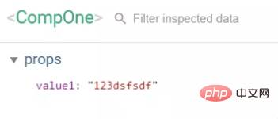

# 目录

1. 谈谈你对MVVM开发模式的理解
2. Vue 有哪些指令？

3. v-if 和 v-show 有什么区别？

4. 简述Vue的响应式原理

5. Vue中如何在组件内部实现一个双向数据绑定？

6. Vue中如何监控某个属性值的变化？

7. Vue中给data中的对象属性添加一个新的属性时会发生什么，如何解决？

8. delete和Vue.delete删除数组的区别

9.如何优化SPA应用的首屏加载速度慢的问题？

10. 前端如何优化网站性能？

11. 网页从输入网址到渲染完成经历了哪些过程？
12.  vue 父子组件嵌套时，组件内部的各个生命周期钩子触发先后顺序


## ================================


  1. 说一下Vue的双向绑定数据的原理

  2. 解释单向数据流和双向数据绑定

  3. Vue如何去除url中的 #

  4. 对 MVC、MVVM的理解

  5. 介绍虚拟DOM

  6. vue生命周期的理解

  7. 组件通信

  8. 路由实现

  9. v-if 和 v-show 区别

  10. $route和$router的区别

  11. NextTick 是做什么的

  12. Vue 组件 data 为什么必须是函数

  13. 计算属性computed 和事件 methods 有什么区别

  14. 对比 jQuery ，Vue 有什么优缺点

  15. Vue 中怎么自定义指令

  16. Vue 中怎么自定义过滤器

  17. 对 keep-alive 的了解

  18. Vue 中 key 的作用

  19. 你觉得 Vue 的核心是什么

  20. vue 等单页面应用的优缺点

  21. vue-router 使用params与query传参有什么区别


# 内容

**1. 谈谈你对MVVM开发模式的理解**

MVVM分为Model、View、ViewModel三者。

**Model**：代表数据模型，数据和业务逻辑都在Model层中定义；

**View**：代表UI视图，负责数据的展示；

**ViewModel**：负责监听Model中数据的改变并且控制视图的更新，处理用户交互操作；

Model和View并无直接关联，而是通过ViewModel来进行联系的，Model和ViewModel之间有着双向数据绑定的联系。因此当Model中的数据改变时会触发View层的刷新，View中由于用户交互操作而改变的数据也会在Model中同步。

这种模式实现了Model和View的数据自动同步，因此开发者只需要专注对数据的维护操作即可，而不需要自己操作dom。

**2. Vue 有哪些指令？**

v-html、v-show、v-if、v-for等等。

**3. v-if 和 v-show 有什么区别？**

v-show 仅仅控制元素的显示方式，将 display 属性在 block 和 none 来回切换；而v-if会控制这个 DOM 节点的存在与否。当我们需要经常切换某个元素的显示/隐藏时，使用v-show会更加节省性能上的开销；当只需要一次显示或隐藏时，使用v-if更加合理。

**4. 简述Vue的响应式原理**

当一个Vue实例创建时，vue会遍历data选项的属性，用 Object.defineProperty 将它们转为getter/setter并且在内部追踪相关依赖，在属性被访问和修改时通知变化。

每个组件实例都有相应的watcher程序实例，它会在组件渲染的过程中把属性记录为依赖，之后当依赖项的setter被调用时，会通知watcher重新计算，从而致使它关联的组件得以更新。


**5. Vue中如何在组件内部实现一个双向数据绑定？**

假设有一个输入框组件，用户输入时，同步父组件页面中的数据。

具体思路：父组件通过props传值给子组件，子组件通过 $emit 来通知父组件修改相应的props值，具体实现如下：

```
`import Vue from ``'vue'` `const` `component = {``  ``props: [``'value'``],``  ``template: ```    ``<div>``      ``<input type=``"text"` `@input=``"handleInput"` `:value=``"value"``>``    ``</div>``  ```,``  ``data () {``    ``return` `{``    ``}``  ``},``  ``methods: {``    ``handleInput (e) {``      ``this.``$emit``(``'input'``, e.target.value)``    ``}``  ``}``}` `new` `Vue({``  ``components: {``    ``CompOne: component``  ``},``  ``el: ``'#root'``,``  ``template: ```    ``<div>``      ``<comp-one :value1=``"value"` `@input=``"value = arguments[0]"``></comp-one>``    ``</div>``  ```,``  ``data () {``    ``return` `{``      ``value: ``'123'``    ``}``  ``}``})`
```

可以看到，当输入数据时，父子组件中的数据是同步改变的：




我们在父组件中做了两件事，一是给子组件传入props，二是监听input事件并同步自己的value属性。那么这两步操作能否再精简一下呢？答案是可以的，你只需要修改父组件：

```
template: `

    <div>

      <!--<comp-one :value1="value" @input="value = arguments[0]"></comp-one>-->

      <comp-one v-model="value"></comp-one>

    </div>

  `
```


v-model 实际上会帮我们完成上面的两步操作。

**6. Vue中如何监控某个属性值的变化？**

比如现在需要监控data中， obj.a 的变化。Vue中监控对象属性的变化你可以这样：

```
`watch: {``      ``obj: {``      ``handler (newValue, oldValue) {``        ``console.log(``'obj changed'``)``      ``},``      ``deep: true``    ``}``  ``}`
```

deep属性表示深层遍历，但是这么写会监控obj的所有属性变化，并不是我们想要的效果，所以做点修改：

```
`watch: {``   ``'obj.a'``: {``      ``handler (newName, oldName) {``        ``console.log(``'obj.a changed'``)``      ``}``   ``}``  ``}`
```

还有一种方法，可以通过computed 来实现，只需要：

```
`computed: {``    ``a1 () {``      ``return` `this.obj.a``    ``}``}`
```

利用计算属性的特性来实现，当依赖改变时，便会重新计算一个新值。

**7. Vue中给data中的对象属性添加一个新的属性时会发生什么，如何解决？**

示例：

```
`<template>``  ``<div>``    ``<ul>``      ``<li v-``for``=``"value in obj"` `:key=``"value"``>``        ``{{value}}``      ``</li>``    ``</ul>``    ``<button @click=``"addObjB"``>添加obj.b</button>``  ``</div>``</template>``<script>``export ``default` `{``  ``data () {``    ``return` `{``      ``obj: {``        ``a: ``'obj.a'``      ``}``    ``}``  ``},``  ``methods: {``    ``addObjB () {``      ``this.obj.b = ``'obj.b'``      ``console.log(this.obj)``    ``}``  ``}``}``</script>``<style></style>`
```

点击button会发现， obj.b 已经成功添加，但是视图并未刷新：


原因在于在Vue实例创建时， obj.b 并未声明，因此就没有被Vue转换为响应式的属性，自然就不会触发视图的更新，这时就需要使用Vue的全局api—— $set()：

```
`addObjB () {``      ``// this.obj.b = 'obj.b'``      ``this.``$set``(this.obj, ``'b'``, ``'obj.b'``)``      ``console.log(this.obj)``    ``}`
```

$set() 方法相当于手动的去把 obj.b 处理成一个响应式的属性，此时视图也会跟着改变了：


**8. delete和Vue.delete删除数组的区别**

delete只是被删除的元素变成了 empty/undefined 其他的元素的键值还是不变。

Vue.delete 直接删除了数组 改变了数组的键值。

```
`var` `a=[1,2,3,4]``    ``var` `b=[1,2,3,4]``    ``delete` `a[1]``    ``console.log(a)``    ``this.``$delete``(b,1)``    ``console.log(b)`
```


**9.如何优化SPA应用的首屏加载速度慢的问题？**

将公用的JS库通过script标签外部引入，减小 app.bundel 的大小，让浏览器并行下载资源文件，提高下载速度；

在配置 路由时，页面和组件使用懒加载的方式引入，进一步缩小 app.bundel 的体积，在调用某个组件时再加载对应的js文件；

加一个首屏loading图，提升用户体验；

**10. 前端如何优化网站性能？**

1、减少 HTTP 请求数量

在浏览器与服务器进行通信时，主要是通过 HTTP 进行通信。浏览器与服务器需要经过三次握手，每次握手需要花费大量时间。而且不同浏览器对资源文件并发请求数量有限（不同浏览器允许并发数），一旦 HTTP 请求数量达到一定数量，资源请求就存在等待状态，这是很致命的，因此减少 HTTP 的请求数量可以很大程度上对网站性能进行优化。

CSS Sprites

国内俗称CSS精灵，这是将多张图片合并成一张图片达到减少HTTP请求的一种解决方案，可以通过CSS的background属性来访问图片内容。这种方案同时还可以减少图片总字节数。

合并 CSS 和 JS 文件

现在前端有很多工程化打包工具，如：grunt、gulp、webpack等。为了减少 HTTP 请求数量，可以通过这些工具再发布前将多个CSS或者多个JS合并成一个文件。

采用 lazyLoad

俗称懒加载，可以控制网页上的内容在一开始无需加载，不需要发请求，等到用户操作真正需要的时候立即加载出内容。这样就控制了网页资源一次性请求数量。

2、控制资源文件加载优先级

浏览器在加载HTML内容时，是将HTML内容从上至下依次解析，解析到link或者script标签就会加载href或者src对应链接内容，为了第一时间展示页面给用户，就需要将CSS提前加载，不要受 JS 加载影响。

一般情况下都是CSS在头部，JS在底部。

3、利用浏览器缓存

浏览器缓存是将网络资源存储在本地，等待下次请求该资源时，如果资源已经存在就不需要到服务器重新请求该资源，直接在本地读取该资源。

4、减少重排（Reflow）

基本原理：重排是DOM的变化影响到了元素的几何属性（宽和高），浏览器会重新计算元素的几何属性，会使渲染树中受到影响的部分失效，浏览器会验证 DOM 树上的所有其它结点的visibility属性，这也是Reflow低效的原因。如果Reflow的过于频繁，CPU使用率就会急剧上升。

减少Reflow，如果需要在DOM操作时添加样式，尽量使用 增加class属性，而不是通过style操作样式。

5、减少 DOM 操作

6、图标使用 IconFont 替换

**11. 网页从输入网址到渲染完成经历了哪些过程？**

大致可以分为如下7步：

输入网址；

发送到DNS服务器，并获取域名对应的web服务器对应的ip地址；

与web服务器建立TCP连接；

浏览器向web服务器发送http请求；

web服务器响应请求，并返回指定url的数据（或错误信息，或重定向的新的url地址）；

浏览器下载web服务器返回的数据及解析html源文件；

生成DOM树，解析css和js，渲染页面，直至显示完成；


##### 12 、 vue 父子组件嵌套时，组件内部的各个生命周期钩子触发先后顺序

首先 我们可以把 子组件当做function函数来看待，当父组件 import 子组件的时候， 就当是声明了 并加载了这个函数，在调用的时候才会去执行这个函数（子组件）。那么父子组件中的各个声明周期钩子触发的先后顺序是怎样的呢？如下图：


##### 


## ==========================================


##### 1. 说一下Vue的双向绑定数据的原理

> `vue` 实现数据双向绑定主要是：采用数据劫持结合发布者-订阅者模式的方式，通过 `Object.defineProperty()` 来劫持各个属性的 `setter`，`getter`，在数据变动时发布消息给订阅者，触发相应监听回调

##### 2. 解释单向数据流和双向数据绑定

> 单向数据流： 顾名思义，数据流是单向的。数据流动方向可以跟踪，流动单一，追查问题的时候可以更快捷。缺点就是写起来不太方便。要使UI发生变更就必须创建各种 `action` 来维护对应的 `state`

> 双向数据绑定：数据之间是相通的，将数据变更的操作隐藏在框架内部。优点是在表单交互较多的场景下，会简化大量业务无关的代码。缺点就是无法追踪局部状态的变化，增加了出错时 `debug` 的难度

##### 3. Vue 如何去除url中的 #

```
vue-router` 默认使用 `hash` 模式，所以在路由加载的时候，项目中的 `url` 会自带 `#`。如果不想使用 `#`， 可以使用 `vue-router` 的另一种模式 `history
new Router({
  mode: 'history',
  routes: [ ]
})
```

> 需要注意的是，当我们启用 `history` 模式的时候，由于我们的项目是一个单页面应用，所以在路由跳转的时候，就会出现访问不到静态资源而出现 `404` 的情况，这时候就需要服务端增加一个覆盖所有情况的候选资源：如果 `URL` 匹配不到任何静态资源，则应该返回同一个 `index.html` 页面

##### 4. 对 MVC、MVVM的理解

> MVC

[](https://raw.githubusercontent.com/Roamen/web-document/master/images/mvc.png)

特点：

1. `View` 传送指令到 `Controller`
2. `Controller` 完成业务逻辑后，要求 `Model` 改变状态
3. `Model` 将新的数据发送到 `View`，用户得到反馈

**所有通信都是单向的**

> MVVM

[](https://raw.githubusercontent.com/Roamen/web-document/master/images/mvvm.png)

特点：

1. 各部分之间的通信，都是双向的
2. 采用双向绑定：`View` 的变动，自动反映在 `ViewModel`，反之亦然

具体请移步 [这里](http://www.ruanyifeng.com/blog/2015/02/mvcmvp_mvvm.html)

##### 5. 介绍虚拟DOM

[参考这里](https://www.jianshu.com/p/616999666920)

##### 6. vue生命周期的理解

> vue实例有一个完整的生命周期，生命周期也就是指一个实例从开始创建到销毁的这个过程

- `beforeCreate()` 在实例创建之间执行，数据未加载状态
- `created()` 在实例创建、数据加载后，能初始化数据，`dom`渲染之前执行
- `beforeMount()` 虚拟`dom`已创建完成，在数据渲染前最后一次更改数据
- `mounted()` 页面、数据渲染完成，真实`dom`挂载完成
- `beforeUpadate()` 重新渲染之前触发
- `updated()` 数据已经更改完成，`dom` 也重新 `render` 完成,更改数据会陷入死循环
- `beforeDestory()` 和 `destoryed()` 前者是销毁前执行（实例仍然完全可用），后者则是销毁后执行

##### 7. 组件通信

> 父组件向子组件通信

子组件通过 props 属性，绑定父组件数据，实现双方通信

> 子组件向父组件通信

将父组件的事件在子组件中通过 `$emit` 触发

> 非父子组件、兄弟组件之间的数据传递

```
/*新建一个Vue实例作为中央事件总嫌*/
let event = new Vue();

/*监听事件*/
event.$on('eventName', (val) => {
    //......do something
});

/*触发事件*/
event.$emit('eventName', 'this is a message.')
```

> Vuex 数据管理

##### 8. vue-router 路由实现

> 路由就是用来跟后端服务器进行交互的一种方式，通过不同的路径，来请求不同的资源，请求不同的页面是路由的其中一种功能

参考 [这里](https://zhuanlan.zhihu.com/p/37730038)

##### 9. v-if 和 v-show 区别

> 使用了 `v-if` 的时候，如果值为 `false` ，那么页面将不会有这个 `html` 标签生成。

> `v-show` 则是不管值为 `true` 还是 `false` ，`html` 元素都会存在，只是 `CSS` 中的 `display` 显示或隐藏

##### 10. $route和$router的区别

> `$router` 为 `VueRouter` 实例，想要导航到不同 `URL`，则使用 `$router.push` 方法

> `$route` 为当前 `router` 跳转对象里面可以获取 `name` 、 `path` 、 `query` 、 `params` 等

##### 11. NextTick 是做什么的

> ```
> $nextTick` 是在下次 `DOM` 更新循环结束之后执行延迟回调，在修改数据之后使用 `$nextTick`，则可以在回调中获取更新后的 `DOM
> ```

具体可参考官方文档 [深入响应式原理](https://cn.vuejs.org/v2/guide/reactivity.html)

##### 12. Vue 组件 data 为什么必须是函数

> 因为js本身的特性带来的，如果 `data` 是一个对象，那么由于对象本身属于引用类型，当我们修改其中的一个属性时，会影响到所有Vue实例的数据。如果将 `data` 作为一个函数返回一个对象，那么每一个实例的 `data` 属性都是独立的，不会相互影响了

##### 13. 计算属性computed 和事件 methods 有什么区别

我们可以将同一函数定义为一个 `method` 或者一个计算属性。对于最终的结果，两种方式是相同的

不同点：

> computed: 计算属性是基于它们的依赖进行缓存的,只有在它的相关依赖发生改变时才会重新求值

> 对于 `method` ，只要发生重新渲染，`method` 调用总会执行该函数

##### 14. 对比 jQuery ，Vue 有什么不同

> jQuery 专注视图层，通过操作 DOM 去实现页面的一些逻辑渲染； Vue 专注于数据层，通过数据的双向绑定，最终表现在 DOM 层面，减少了 DOM 操作

> Vue 使用了组件化思想，使得项目子集职责清晰，提高了开发效率，方便重复利用，便于协同开发

##### 15. Vue 中怎么自定义指令

> 全局注册

```
// 注册一个全局自定义指令 `v-focus`
Vue.directive('focus', {
  // 当被绑定的元素插入到 DOM 中时……
  inserted: function (el) {
    // 聚焦元素
    el.focus()
  }
})
```

> 局部注册

```
directives: {
  focus: {
    // 指令的定义
    inserted: function (el) {
      el.focus()
    }
  }
}
```

参考 [官方文档-自定义指令](https://cn.vuejs.org/v2/guide/custom-directive.html)

##### 16. Vue 中怎么自定义过滤器

> 可以用全局方法 `Vue.filter()` 注册一个自定义过滤器，它接收两个参数：过滤器 `ID` 和过滤器函数。过滤器函数以值为参数，返回转换后的值

```
Vue.filter('reverse', function (value) {
  return value.split('').reverse().join('')
})
<!-- 'abc' => 'cba' -->
<span v-text="message | reverse"></span>
```

过滤器也同样接受全局注册和局部注册

##### 17. 对 keep-alive 的了解

> `keep-alive` 是 `Vue` 内置的一个组件，可以使被包含的组件保留状态，或避免重新渲染

```
<keep-alive>
  <component>
    <!-- 该组件将被缓存！ -->
  </component>
</keep-alive>
```

> 可以使用API提供的props，实现组件的动态缓存

具体参考 [官方API](https://cn.vuejs.org/v2/api/#keep-alive)

##### 18. Vue 中 key 的作用

> `key` 的特殊属性主要用在 `Vue` 的虚拟 `DOM` 算法，在新旧 `nodes` 对比时辨识 `VNodes`。如果不使用 `key`，`Vue` 会使用一种最大限度减少动态元素并且尽可能的尝试修复/再利用相同类型元素的算法。使用 `key`，它会基于 `key` 的变化重新排列元素顺序，并且会移除 `key` 不存在的元素。

> 有相同父元素的子元素必须有独特的 `key`。重复的 `key` 会造成渲染错误

具体参考 [官方API](https://cn.vuejs.org/v2/api/#key)

##### 19. Vue 的核心是什么

> 数据驱动 组件系统

##### 20. vue 等单页面应用的优缺点

> 优点：

- 良好的交互体验
- 良好的前后端工作分离模式
- 减轻服务器压力

> 缺点：

- SEO难度较高
- 前进、后退管理
- 初次加载耗时多

##### 21. vue-router 使用params与query传参有什么区别

`vue-router` 可以通过 `params` 与 `query` 进行传参

```
// 传递
this.$router.push({path: './xxx', params: {xx:xxx}})
this.$router.push({path: './xxx', query: {xx:xxx}})

// 接收
this.$route.params

this.$route.query
```

- `params` 是路由的一部分,必须要有。`query` 是拼接在 `url` 后面的参数，没有也没关系
- `params` 不设置的时候，刷新页面或者返回参数会丢，`query` 则不会有这个问题