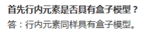
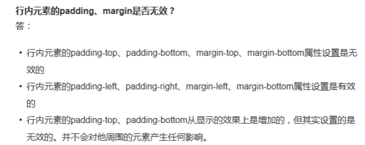

# html

##### `<keygen>` 是正确的HTML5标签吗？

A: 是。

`<keygen>` 标签规定用于表单的密钥对生成器字段。当提交表单时，私钥存储在本地，公钥发送到服务器。是HTML5 标签。


##### `<bdo>` 标签是否可以改变文本方向？

 

A: 可以。

 

`<bdo>`标签覆盖默认的文本方向。

 

```
<bdo dir="rtl">Here is some text</bdo>
```

#####  下列HTML代码是否正确？figure

```
<figure>
    
    <figcaption>
        <p>This is my self portrait.</p>
    </figcaption>
</figure>
```

A: 正确

\<figure> 标签规定独立的流内容（图像、图表、照片、代码等等）。figure 元素的内容应该与主内容相关，但如果被删除，则不应对文档流产生影响。使用<figcaption>元素为figure添加标题（caption）。

##### 哪种情况下应该使用`small`标签？当你想在`h1` 标题后创建副标题？还是当在`footer`里面增加版权信息？

 

A: `small`标签一般使用场景是在版权信息和法律文本里使用，也可以在标题里使用标注附加信息（bootstrap中可见），但不可以用来创建副标题。

 

> The HTML Small Element (`<small>`) makes the text font size one size smaller (for example, from large to medium, or from small to x-small) down to the browser's minimum font size.  In HTML5, this element is repurposed to represent side-comments and small print, including copyright and legal text, independent of its styled presentation.


##### 在一个结构良好的web网页里，多个`h1`标签会不利于SEO吗？

 

A: 不影响。


##### Q: 如果你有一个搜索结果页面，你想高亮搜索的关键词。什么HTML 标签可以使用?

A:`<mark>` 标签表现高亮文本。


#####  下列代码中`scope` 属性是做什么的？

 

```
<article>
    <h1>Hello World</h1>
    <style scoped>
        p {
            color: #FF0;
        }
    </style>
    <p>This is my text</p>
</article>

<article>
    <h1>This is awesome</h1>
    <p>I am some other text</p>
</article>
```

 

A: `scoped` 属性是一个布尔属性。如果使用该属性，则样式仅仅应用到 style 元素的父元素及其子元素。只支持firefox


##### HTML5 支持块级超链接吗？例如：

 

```
<article>
    <a href="#">
        <h1>Hello</h1>
        <p>I am some text</p>
    </a>
</article>
```

 

A: 支持。

 

HTML5中`<a>` 元素表现为一个超链接，支持任何行内元素和块级元素。


#####  当下列的HTML代码加载时会触发新的HTTP请求吗？

 

```

```

 

A: 会哇


##### 当下列的HTML代码加载时会触发新的HTTP请求吗？

```
<div style="display: none;">
    
</div>
```

A: 会！

##### `main1.css`一定会在`alert('Hello world')`被加载和编译吗?

```
<head>
    <link href="main1.css" rel="stylesheet">
    <script>
        alert('Hello World');
    </script>
</head>
```

 

A: 是！


##### 在`main2.css`获取前`main1`一定必须被下载解析吗？

```
<head>
    <link href="main1.css" rel="stylesheet">
    <link href="main2.css" rel="stylesheet">
</head>
```

 

A: no!


在`main2.css`获取前`main1`一定必须被下载解析吗？

 

```
<head>
    <link href="main1.css" rel="stylesheet">
    <link href="main2.css" rel="stylesheet">
</head>
```

 

A: no!


#####  在`Paragraph 1`加载后`main2.css`才会被加载编译吗？

```
<head>
    <link href="main1.css" rel="stylesheet">
</head>
<body>
    <p>Paragraph 1</p>
    <p>Paragraph 2</p>
    <link href="main2.css" rel="stylesheet">
</body>
```

A: yes!


# css

##### Q: CSS 属性是否区分大小写？

```js

 ul {
     MaRGin: 10px;
 }
 
```

A: 不区分。 HTML，CSS都对大小写不敏感，但为了更好的可读性和团队协作一般都小写，而在XHTML 中元素名称和属性是必须小写的。

##### ？？Q: 行内(inline)元素 设置`margin-top`和`margin-bottom` 是否起作用？

A: 不起作用。(答案是起作用，个人觉得不对。)

html 里的元素分为替换元素（replaced element）和非替换元素（non-replaced element）。

- 替换元素是指用作为其他内容占位符的一个元素。最典型的就是`img`，它只是指向一个图像文件。以及大多数表单元素也是替换，例如`input`等。
- 非替换元素是指内容包含在文档中的元素。例如，如果一个段落的文本内容都放在该元素本身之内，则这个段落就是一个非替换元素。
- 



讨论`margin-top`和`margin-bottom`对行内元素是否起作用，则要对行内替换元素和行内非替换元素分别讨论。

​	首先我们应该明确外边距可以应用到行内元素，规范中是允许的，不过由于在向一个行内非替换元素应用外边距，对行高(line-height)没有任何影响。由于外边距实际上是透明的。所以对声明`margin-top`和`margin-bottom`没有任何视觉效果。其原因就在于行内非替换元素的外边距不会改变一个元素的行高。而对于行内非替换元素的左右边距则不是这样，是有影响的。

而为替换元素设置的外边距会影响行高，可能会使行高增加或减少，这取决于上下外边距的值。行内替换元素的左右边距与非替换元素的左右边距的作用一样。来看看demo:

<http://codepen.io/paddingme/pen/JwCDF>

##### ？？Q: 对内联元素设置`padding-top`和`padding-bottom`是否会增加它的高度？

（原题是Does setting padding-top and padding-bottom on an inline element add to its dimensions?）

A: 答案是不会。同上题比较纠结，不太明白这里的 dimensions指的是到底是什么意思？放置一边，咱们来分析下。对于行内元素，设置左右内边距，左右内边距将是可见的。而设置上下内边距，设置背景颜色后可以看见内边距区域有增加，对于行内非替换元素，不会影响其行高，不会撑开父元素。而对于替换元素，则撑开了父元素。看下demo，更好的理解下：

<http://codepen.io/paddingme/pen/CnFpa>


##### Q: 设置`p`的`font-size:10rem`，当用户重置或拖曳浏览器窗口时，文本大小是否会也随着变化？

A: 不会。

`rem`是以`html`根元素中`font-size`的大小为基准的相对度量单位，文本的大小不会随着窗口的大小改变而改变。

##### Q: 伪类选择器`:checked`将作用与`input`类型为`radio`或者`checkbox`,不会作用于`option`。

A: 不对。

伪类选择器`checked`的定义很明显:

> The :checked CSS pseudo-class selector represents any radio (`<input type="radio">`), checkbox (`<input type="checkbox">`) or option (`<option>`in a `<select>`) element that is checked or toggled to an on state. The user can change this state by clicking on the element, or selecting a different value, in which case the :checked pseudo-class no longer applies to this element, but will to the relevant one.

##### Q: 在HTML文本中，伪类`:root`总是指向`html`元素？

A: 不是（答案中给出了是 ==||）。以下摘自知乎[:root 与 html 在 CSS3 中指的是同一个元素吗？](http://www.zhihu.com/question/20312140)的答案：

> 单指创建的根。这个根可能不是 html ，如果是片段html，没有创建根，则为片段的根。把这下面 URL 打到支持 data URL 的瀏覽器看看（Firefox, Chrome, Safari, Opera），可见一斑：

```
data:application/xhtml+xml,<div xmlns="http://www.w3.org/1999/xhtml"><style>:root { background: green; } html { background: red !important; }</style></div>
```

##### Q:`translate()`方法能移动一个元素在z轴上的位置？

A: 不能。`translate()`方法只能改变x轴，y轴上的位移。translate3d()可以z；

##### Q: 如下代码中文本“Sausage”的颜色是?

```js
<ul class="shopping-list" id="awesome">
    <li><span>Milk</span></li>
    <li class="favorite" id="must-buy"><span class="highlight">Sausage</span></li>
</ul>
```

```
ul {color:red;}
li {color:blue;}
```

A: blue。

##### Q: 如下代码中文本“Sausage”的颜色是?

```js
<ul class="shopping-list" id="awesome">
    <li><span>Milk</span></li>
    <li class="favorite" id="must-buy"><span class="highlight">Sausage</span></li>
</ul>
```

```
ul {color:red;}
#must-buy {color:blue;}
```

A: blue。

##### Q: 如下代码中文本“Sausage”的颜色是?

```js
<ul class="shopping-list" id="awesome">
    <li><span>Milk</span></li>
    <li class="favorite" id="must-buy"><span class="highlight">Sausage</span></li>
</ul>
```

```
.shopping-list .favorite {
    color: red;
}
#must-buy {
    color: blue;
}
```

A: blue。

##### Q: 如下代码中文本“Sausage”的颜色是?

```js
<ul class="shopping-list" id="awesome">
    <li><span>Milk</span></li>
    <li class="favorite" id="must-buy"><span class="highlight">Sausage</span></li>
</ul>
```

```
ul#awesome {
    color: red;
}
ul.shopping-list li.favorite span {
    color: blue;
}
```

A: blue。

##### Q: 如下代码中文本“Sausage”的颜色是?

```js
<ul class="shopping-list" id="awesome">
    <li><span>Milk</span></li>
    <li class="favorite" id="must-buy"><span class="highlight">Sausage</span></li>
</ul>
```

```
ul#awesome #must-buy {
    color: red;
}
.favorite span {
    color: blue!important;
}
```

A: blue。

##### Q: 如下代码中文本“Sausage”的颜色是?

```
<ul class="shopping-list" id="awesome">
    <li><span>Milk</span></li>
    <li class="favorite" id="must-buy"><span class="highlight">Sausage</span></li>
</ul>
```

```
ul.shopping-list li .highlight {
    color: red;
}
ul.shopping-list li .highlight:nth-of-type(odd) {
    color: blue;
}
```

A: blue。

##### Q: 如下代码中文本“Sausage”的颜色是?

```
<ul class="shopping-list" id="awesome">
    <li><span>Milk</span></li>
    <li class="favorite" id="must-buy"><span class="highlight">Sausage</span></li>
</ul>
```

```
#awesome .favorite:not(#awesome) .highlight {
    color: red;
}
#awesome .highlight:nth-of-type(1):nth-last-of-type(1) {
    color: blue;
}
```

A: blue。

##### ？？Q:`#example`位置如何变化：

```
<p id="example">Hello</p>
```

```
#example {margin-bottom: -5px;}
#example {margin-top: -5px;}
```

A: 向上移动5px。

##### Q: `#example`位置如何变化：

```
<p id="example">Hello</p>
```

```
#example {margin-left: -5px;}
```

A: 向左移动5px。

##### #i-am-useless` 会被浏览器加载吗？

```
<div id="test1">
    <span id="test2"></span>
</div>
```

```
#i-am-useless {background-image: url('mypic.jpg');}
```

A: 不会

##### mypic.jpg` 会被浏览器加载吗？

```
<div id="test1">
    <span id="test2"></span>
</div>
```

```
#test2 {
    background-image: url('mypic.jpg');
    display: none;
}
```

A: 会被下载。

##### mypic.jpg` 会被浏览器加载吗？

```
<div id="test1">
    <span id="test2"></span>
</div>
```

```
#test1 {
    display: none;
}
#test2 {
    background-image: url('mypic.jpg');
    visibility: hidden;
}
```

A: 不会被下载。

##### Q: media`only` 选择器的作用是？

```
@media only screen and (max-width: 1024px) {argin: 0;}
```

A：停止旧版本浏览器解析选择器的其余部分。

only 用来定某种特定的媒体类型，可以用来排除不支持媒体查询的浏览器。其实only很多时候是用来对那些不支持Media Query 但却支持Media Type 的设备隐藏样式表的。其主要有：支持媒体特性（Media Queries）的设备，正常调用样式，此时就当only 不存在；对于不支持媒体特性(Media Queries)但又支持媒体类型(Media Type)的设备，这样就会不读了样式，因为其先读only 而不是screen；另外不支持Media Qqueries 的浏览器，不论是否支持only，样式都不会被采用。

##### Q:`overflow:hidden` 是否形成新的块级格式化上下文？

```
<div>
    <p>I am floated</p>
    <p>So am I</p>
</div>
```

```
div {overflow: hidden;}
p {float: left;}
```

A：会形成。

##### 会触发BFC的条件有：

- float的值不为none。
- overflow的值不为visible。
- display的值为table-cell, table-caption, inline-block 中的任何一个。
- position的值不为relative 和static。

##### Q: `screen`关键词是指设备物理屏幕的大小还是指浏览器的视窗？

```
@media only screen and (max-width: 1024px) {margin: 0;}
```

A: 浏览器视窗


