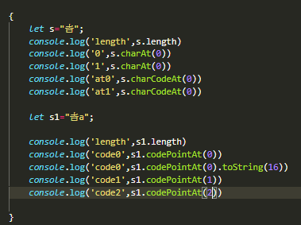
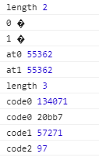
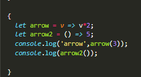
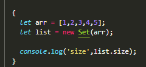
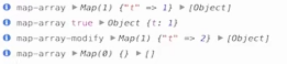
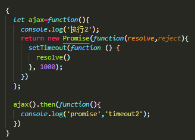
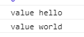
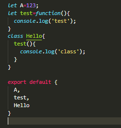

# let，const：

作用域的概念：

新增块作用域： { }

es6强制使用严格模式，变量未声明无法引用：

let不能重复定义；快作用域

const不允许修改参数，块作用域，指针不可以变，但是对象本身可以变

# 解构赋值：

a=1;b=2;

1,2,[3,4,5,6]

1,2

1 2 3

1,2,undefined

场景：

变量交换：

2，1

1，2

1，4

1，[2,3,4,5]

数组；

对象：

42,true

两边都是对象；

abc,text;

# 正则扩展：

true true

i

后面覆盖前面；

/g  /y  都是全局匹配   

/u 大于两个i字符   .  不能匹配小于两个un字节，以及换行符。。。四个字符

true，false

false，true

false ，true

false，true

# 字符串扩展：

处理兼容的库：

引入兼容库；

un编码大于2个字符；

新的api：

### codePointAt(2)    

*String*.fromCharCode("0x20bb7"));   不能处理

大于俩个字节的un字符

### String.fromCodePoint

String.fromCodePoint("0x20bb7"); 

能处理

### 字符串的遍历器接口：

### str.includes("c")   str.startsWith('str')    str.endsWith('ng')

### 字符串的复制：str.repeat(2)

### 模板字符串：

### es7:补白；日期？

### 标签模板：

常见场景：

过滤字符串，防止xss攻击；

模板多语言；

### *String*.raw`Hi\n${1+2}`  转义；

# 数值扩展：

### 二进制：0

#### 八进制0o

,*Number*.isFinite；是否无穷

*Number*.isNaN

### ,*Number*.isInteger；

必须是数字；

### *数字的上下限；

Number*.MAX_SAFE_INTEGER,*Number*.MIN_SAFE_INTEGER

*Number*.isSafeInteger(）

### 返回整数部分：Math.trunc（）

### 判断：正数负数0；Math.sign(5)

### 立方根：Math.cbrt(-1)

# 数组扩展：

### *Array*.of(）

### *Array*.from:     1,  循环遍历内容 2, 第二个参数function

### .fill

1，替换的内容，2替换的长度

### keys，values（不支持，需要转），entries

### copywithin:

1,要替换的位置2，替换的数字位置3这个位置之前；

### find/findIndex:

find:只找第一个；

findindex：下标；

### includes:返回true/false

# 函数扩展：

### 参数的默认值：

注意：默认值后面必须有默认值的变量；

#### 注意作用域：========

test（）==》undefinded undefinded

kill  test;

### rest参数：

前边不能有其他的参数，否则报错

### 箭头函数:

函数名+函数参数+函数返回值

没有函数参数可用（）代替

#### 注意this绑定========

### 函数的尾调用:========

提升性能；

# 对象扩展：

#### 简介表示法：

#### 属性表达式：

#### 新增api

##### Object.is()

##### Object.assign():浅复制，不会拷贝继承

##### Object.entries():

#### 扩展运算符：babel兼容不好；

# Symbol:

es6新增数据类型

独一无二：

作用：

取属性值：

##### *Object*.getOwnPropertySymbols(obj) ：只拿Symbols的值

##### *Reflect*.ownKeys(obj)：两者皆可

# set-map数据结构

#### set

**Set** 对象允许你存储任何类型的唯一值，无论是[原始值](https://developer.mozilla.org/en-US/docs/Glossary/Primitive)或者是对象引用。

注意：set集合里的元素不可重复

去重:

注意，不会做数据类型的转换

.has  .delete  .clear

读取：

#### weakSet:

必须对象，弱引用

#### map

**Map** 对象保存键值对。任何值(对象或者[原始值](https://developer.mozilla.org/en-US/docs/Glossary/Primitive)) 都可以作为一个键或一个值。

.set。添加   .get:获取  与set不一样

.sizee   .delete()  .clear()  与set一样

#### weakmap：

# map-set与数组和对象的比较：

## 和array的对比

## 和object的对比

尽量使用map，强调数据唯一性，set，

# 

# Proxy和Reflect

代理和反射

### Proxy

### Reflect:

Person得到的是经过代理的；

报错：

# 类和对象：

### 基本定义和生成实例：

### 继承：extends

### 继承传递参数：super()

子类super一定放在第一行；

### getter  setter

### 静态方法：static 

直接通过类名调用，不需要new

### 静态属性：Parent.type

# Promise

a执行完执行b有两种方式：1，2事件触发方式；

### 普通案例：

### promise：

### 所有图片都加载完再添加到页面：

#### promise.all:

三个状态都改变：才会显示

### 先到先显示：

promise.race()  先加载完的显示，其他不管

# Iterator:

给object实现这个接口：

自定义iterator数据接口，使他可以使用for of

# Genertor:

 

###  genertaor基本定义

### 部署iterator接口：

### 状态机;

a-b-c-a

需要加babel插件：

### 点击按钮，抽奖次数少一

### ***常轮询：

当code改变：

# Decorators:

1是一个函数，2，修改行为 ， 3修改类的行为

加包：npm install babel-plugin-transform-decorators-legacy --save-dev

### 把time变成只读；

修饰类的属性

myname是类的静态属性；

第三方库：core-decorators ;npm install core-decorators

### 例子：

# 模块化：

17.js

index.js

导入所有

