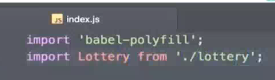

流行的项目：电商，彩票，旅游，金融

功能分析：

网站预览：

# 部署代码结构：

最后一个用于整合

入口文件，整个 es  彩种

 

cs部分，服务端接口部分：

# 创建倒计时模块：

timer.js

​								export default Timer

传入几个参数，判断当前时间比。。晚，则倒计时结束。如果不是，字符串模板编译结果；最后完成更新

重新调用倒计时

涉及知识点：类（class），const let，字符串模板

# 创建数据计算模块：

interface.js

开奖功能：

知识点：import，promise，箭头函数，this指向问题：let selt=this

# 创建接口模块：

# 创建彩票基础模块：

# 创建彩票业务模块：

# 创建服务接口和模拟数据：

# 前后端联调：

