# 介绍

基础架构，任务自动化（gulp），编译工具（ba'bel）（webpack），代码实现


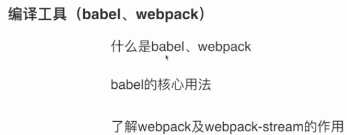


# 项目目录创建：

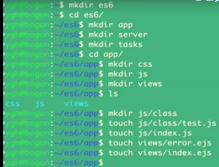

安装node：


安装$ npm install -g express-generator

脚手架：


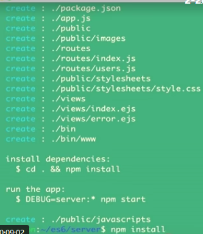

安装好了：


babel配置文件：

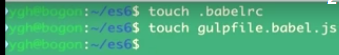


# 命令行处理，创建js编译任务：

task/util/args.js


task/script

​	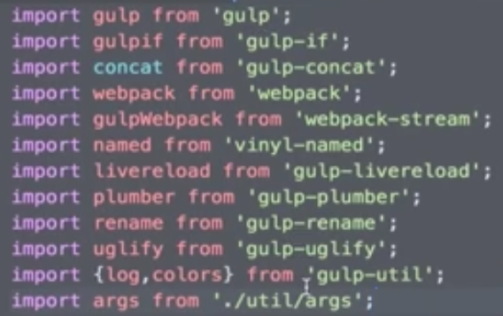


npm install gulp gulp-if gulp-concat webpack webpack-stream vinyl-named gulp-livereload gulp-plumber gulp-rename gulp-uglify gulp-util yargs --save-dev


错误抛出异常：


# 创建模板，服务任务脚本：


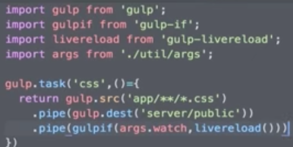

最后的

可有可无


# 文件自动监听，项目构建测试：


装包：

cnpm install gulp-live-server del gulp-util --s


把所有任务串起来:


执行gulp：报错！！

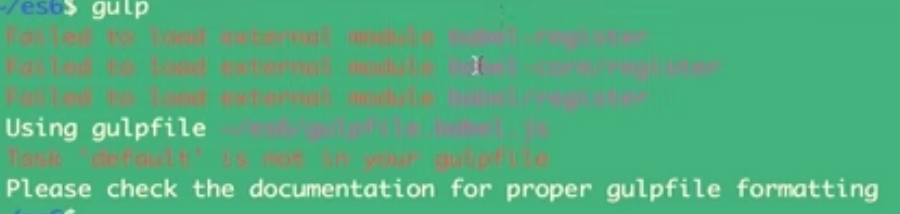

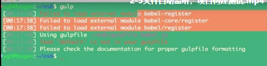


npm babel-loader babel-core babel-preset-env webpack -s


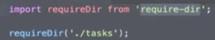


npm install require-dir 


gulp：报错

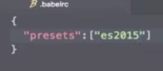


 gulp：报错：


gulp：拼写错误：css==>箭头函数：


gulp --watch；不加，只执行一次

localhost：3000：

问题不刷新：


加一句话：24行


 


热更新 一定放在23之后：


index.js：


views/index.ejs


问题：注意版本问题 ；

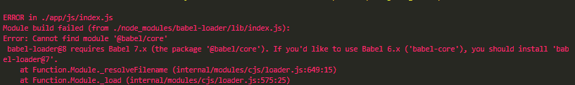


```
module.loaders` is now `module.rules
```


npm install -D babel-loader@7


> webpack 4.x | babel-loader 8.x | babel 7.x

 

```
npm install -D babel-loader @babel/core @babel/preset-env webpack
```

 

> webpack 4.x | babel-loader 7.x | babel 6.x

 

```
npm install -D babel-loader@7 babel-core babel-preset-env webpack
```

配置改变：

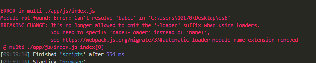

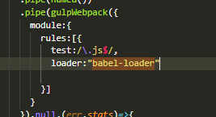